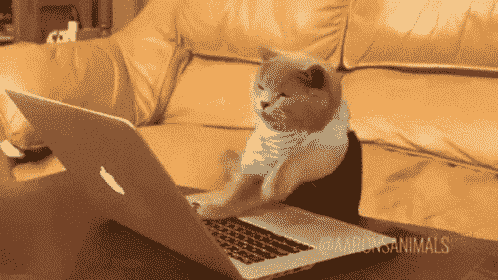
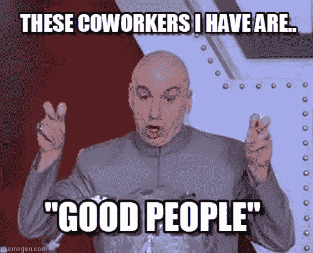

# 为什么我写代码比你快

> 原文：<https://levelup.gitconnected.com/why-im-writing-code-faster-than-you-6c4cb720a9c3>

## 我会教你怎么做，但你必须听

演员表:[克劳斯·尼尔森](https://www.pexels.com/sk-sk/photo/rukavica-zamestnanie-povolanie-pozicia-6303759/)

一个工资比我少很多的同事问我，*“Bernard，你写代码怎么可能这么快？”*

我不知道他在说什么，但这迫使我观察我的同事。我试图捕捉他们的工作本质，并观察他们的表现。我写代码真的比他们快吗？

不得不说，我完全惊呆了！

的确，我比他们跑得快。这让我想起了《疯狂动物城》中的一个场景，一群树懒试图帮助霍普斯警官。

演职员表:[疯狂动物城](https://www.imdb.com/title/tt2948356/)

不用说，我的同事(工资比我少得多)是对的。

我必须弄清真相。我需要知道为什么我写代码比任何人都快。我花了几分钟思考这个问题，我发现了一些事情。

首先，我注意到我比任何人都思考得快。

但是最后，我注意到我做的三件事让我比其他人写代码更快。在这里，我展示它们。

# 我每天练习快速打字 2 小时

在我的编程生涯之初，我看到了一个 GIF，它改变了我的生活。

[改变我人生的 GIF](https://c.tenor.com/bCfpwMjfAi0AAAAC/cat-typing.gif)

看到这张 GIF 的那一刻，我就知道我想成为那样的人。打字那么快的想法是我需要实现的。我知道为了实现这个目标，我会不惜一切代价。

从那时起，我读了每一本关于键盘快速打字的书，看了每一个 Youtube 视频，甚至花了 299 美元购买了在线课程。

我仍然羞于承认这一切，但至少你可以想象我是多么疯狂地想要打字。

每天睡觉前，我拿出键盘，设置好计时器，敲两个小时。一个词接一个词，一句接一句，直到我的时间到了。之后，我终于可以睡觉了，让我的手指休息一下。

这是艰难的时期，但它们让我成为了这个世界上有史以来最有效率的键盘作家。他们允许我主宰我的办公室。

# 我不和别人交往

同事都很棒，很浪费时间！

我知道如果我想把事情做完，我必须加快工作速度。为了更快地工作，我必须排除一切干扰。

我的同事都是很棒的人。但他们在办公室是为了分散我的注意力，让我慢下来。

[原始来源](https://medium.com/@bernardbad/why-im-writing-code-faster-than-you-6c4cb720a9c3)

如果我想真正释放我内心的野兽，我必须让他们走，停止与他们互动，把我的屁股粘在椅子上，尽可能快地打字。

毕竟那是我一生都在准备的。我没有每晚花 2 个小时，所以我现在可以在厨房慢慢啜饮咖啡，谈论周五的宿醉。

这终于是我可以展示自己技能的时候了。我想确保它花得值，确保我集中精力，尽可能地专注。

实际上，焦点是我的最后一条建议。统治他们的一条建议。

# 谢谢你，帕布罗

在 20 世纪 80 年代，隐藏在哥伦比亚山脉深处，这个世界上有史以来最暴力的商人诞生了。他负责了有史以来最大的*《白金》*的制作。

但他并不是只聚集了这两项成就。他还创造了一种产品，推动了整个华尔街，当然，也包括我。

他和他的产品使我成为打字高手。他的产品让我写代码比任何人都快。

*如果你还是不确定我在说谁，请去看第二季* [*毒枭*](https://www.imdb.com/title/tt2707408/) *。不过，请你讲完我的故事后再做吧。*

# 在你通知当局之前

***免责声明:*** *本文幽默，虚构，仅供娱乐。请不要当真。此外，它不应该是任何类型的建议。*

*如果想多读，* ***通过使用*** [***这个链接***](https://bernardbad.medium.com/membership) ***成为中等会员。*** *想获取我的优质内容，请* [***加入我的快讯***](https://upbeatcode.substack.com/) *。*