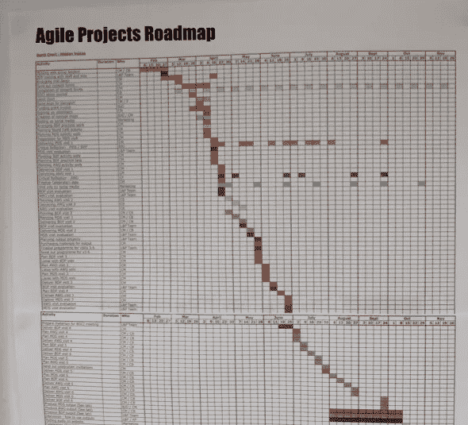
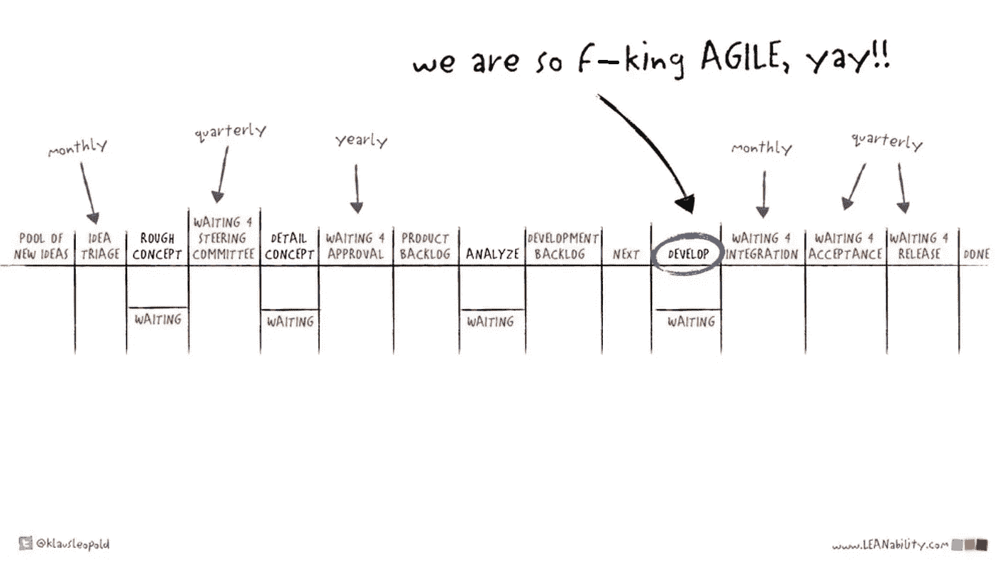
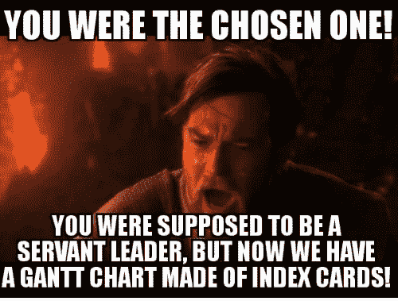
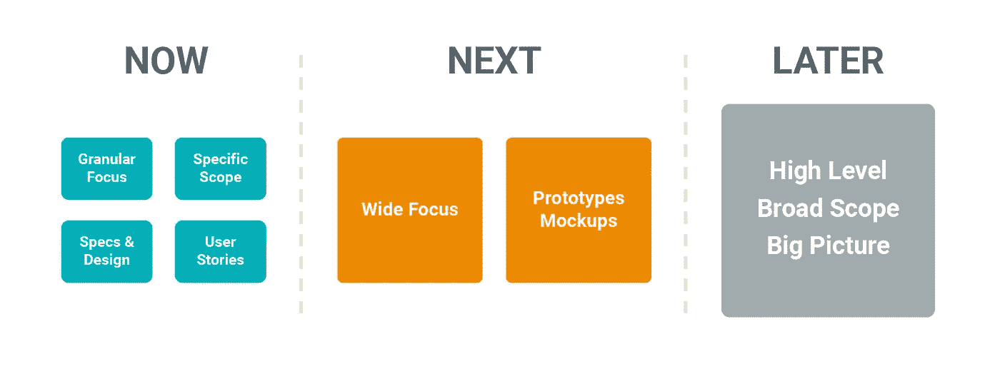

# 为什么敏捷路线图被如此误解？

> 原文：<https://levelup.gitconnected.com/why-is-agile-planning-so-misunderstood-9d75e078af73>

## 尽管声称自己是敏捷的，许多组织仍然以瀑布的方式被卷入规划特性中。这是为什么呢？我们能做些什么呢？

敏捷规划看起来是不是不自然的困难？路易斯·维拉斯米尔在 [Unsplash](https://unsplash.com?utm_source=medium&utm_medium=referral) 上的照片

原则上，应用敏捷软件开发应该很简单:

1.  建立一个增量。
2.  测试增量。
3.  了解需要改变什么。
4.  将这些知识反馈到第一步，然后重复。

这个过程有两个方面从根本上区分了敏捷和瀑布:

(A)尽早和经常地交付小批量工作产品。

(B)根据从(A)获得的新信息，经常调整你的产品。

那么为什么这在实践中很难做到呢，尤其是 B 方面？为什么我们最终会陷入像 Water-scrum-fall 和敏捷那样的根深蒂固的功能障碍？

如图 1 所示的项目计划很常见，如[与](https://medium.com/serious-scrum/the-unmistakable-signs-you-are-participating-in-fake-agile-theater-a7d1bd6a5dbc)[约德·尼兰德](https://medium.com/u/f60973888071?source=post_page-----9d75e078af73--------------------------------)共享。长达一年的甘特图中堆积了所有的功能，并预先分配给团队。团队被告知只需在一系列冲刺中一个接一个地实现所有特性。没有机会基于迄今为止已经完成的内容进行旋转和调整，也没有机会学习；他们必须立即移动到队列中的下一个特征。交付一个又一个功能的压力是无情的。

图一。这个甘特图怎么可能是敏捷的？！[来源](https://medium.com/serious-scrum/the-unmistakable-signs-you-are-participating-in-fake-agile-theater-a7d1bd6a5dbc)

 [## 明确无误的迹象表明，你正在参与伪敏捷剧场！

### 救命，我被困在敏捷的胡言乱语的沼泽里了…

medium.com](https://medium.com/serious-scrum/the-unmistakable-signs-you-are-participating-in-fake-agile-theater-a7d1bd6a5dbc) 

如果前一两个特征被证明是错误的呢？(至少有一半的时间会发生[)。我们就这样生活下去吗？我想是的。从字面上看，在甘特图中没有任何地方我们可以调整这个问题。](https://svpg.com/the-inconvenient-truth-about-product/)

我们是如何结束这种情况的，我们可以构建一个长达一年或更长的甘特图，上面堆叠了一个又一个的特性(每个特性都有截止日期)，并且仍然声称自己是敏捷的？敏捷方法故意只关注下一次迭代的及时计划，然而我们现在有一个完整的计划，一直延伸到地平线。毫无意义！

# 前瞻性规划:敏捷中缺失的部分

敏捷中缺失的部分是它没有前瞻性的计划(除了我们在当前迭代中构建的)。*目的是你不应该计划得太远——计划应该是“及时的”*。你应该看看什么可行，什么不可行，并根据这些数据决定下一步该做什么。

线索就在名字里:“敏捷”。意思是“能够快速轻松地移动”([来源](https://www.merriam-webster.com/dictionary/agile))。第一个同义词是“敏捷”。敏捷的目的是，你应该增量地交付价值，然后根据市场告诉你的快速转向。*这是一个快速反馈循环，建立在对近乎实时的刺激的观察和反应上*，而不是预先的大计划。一个敏捷项目应该被持续地指导，而不是预先的死计算，但是长达一年的甘特图肯定是后者。

但是组织通常不喜欢没有计划的工作——尤其是大型或传统的组织。组织需要一个计划，否则他们会遭受“计划缺失焦虑”…或者更准确地说，他们的领导者会。他们的问题是合理的:“如果我们没有一个经过批准的功能计划来组织人们，使他们都能以预定的有序方式工作，我们怎么可能大规模地运营呢？那就乱了！”

因此，为了确保所有员工都有组织、有效率，领导者制定了一个计划。他们会说“首先构建特性 A，然后构建特性 B，然后构建特性 C，等等。不同的客户需要不同的功能，因此我们需要将它们作为重中之重。我们可以在以后检查和调整……当我们推出所有这些功能时。但是现在，尽快让他们离开是非常重要的！哦，顺便说一下，高级管理层在工作开始前批准任何新功能或变化也很重要。这通常需要一两个季度的时间让我们考虑和批准，所以我们需要提前看到它们(也就是说，你不能一接到通知就改变方向)。对，所以每个人都有足够的工作，让他们在接下来的一年左右都有事可做——我要去打高尔夫了！”😉

*应该发生的是，敏捷社区应该正面解决计划缺失的焦虑。但他们没有，所以领导人恢复了他们所知道的。路线图和甘特图以前也有用，所以让我们继续使用它们吧！这就是我们如何结束水-scrum-fall。这张由[克劳斯·利奥波德](https://medium.com/u/3d0448b90c0c?source=post_page-----9d75e078af73--------------------------------)绘制的图片完美地捕捉到了这一点:*

图二。Sprints 中的敏捷编码只是整个瀑布式 SDLC 的一小部分。[来源](https://speakerdeck.com/dodzh/rethinking-agile-klaus-leopold?slide=36)

不幸的是敏捷失去了意义；重点是根据新的信息频繁地改变和调整。这样做需要自由和灵活性来改变你的计划。但是不知何故，敏捷，正如许多组织所实践的那样，并不十分“敏捷”。相反，以前的任务瀑布已经演变成了“用户故事”的瀑布。多么令人失望。

[来源](https://me.me/i/you-were-the-chosen-one-you-were-supposed-to-be-c998233563ca4999900b83e84e3ef965)

# 流程和适配器

除了当前的冲刺或迭代之外，没有任何具体的计划建议，敏捷向其他人敞开了介入的大门，而扩展框架填补了这一空白。我不知道有哪位权威人士真正喜欢 SAFe，但它确实有一个可取之处:它很容易被理解为从大型瀑布式前期规划到团队敏捷执行的适配器。

使用 SAFe(或另一个扩展框架),外部产品管理团队可以提出功能并将其提交给领导层批准。然后，外部设计团队可以绘制一些 UI 模型，并类似地将它们发送给领导层批准。当工程师开始写代码的时候，管理层已经安全地知道他们已经充分地计划了工作，一百或一千个编码员会尽职尽责地执行。这个过程看起来与上面的图 2 完全一样。

理论上，每个人都得到了他们想要的:经理们得到了所有计划功能的完美视图，就像从桥上引导一艘大船一样，开发人员可以快速编写代码。

这就是敏捷扩展框架受欢迎的原因:它们将领导者熟悉的传统大型前期规划改编为团队执行的时髦敏捷冲刺。在一些高级经理看来，这才是最重要的。事实上，工程团队被简化为功能工厂，或者他们几乎丧失了所有学习和快速转移的能力，这仅仅是一个实现细节。高级管理人员真诚地相信他们已经将组织“转变”为敏捷的，因为这是他们所接受的。如果你指出敏捷是一种错觉，他们会感到困惑。

# 敏捷性需要机动空间

让我们回到我之前提到的敏捷的两个定义特征:

(A)尽早和经常地交付小批量工作产品。

(B)根据从(A)获得的新信息，经常调整你的产品。

大部分人理解方面 A；所有的文献都聚焦于此。但是很少有人能正确理解 B 方面。如果您没有从您部署的早期批次中学习，并且没有将这种洞察力融入到后续批次的改进中，那么您就没有做对敏捷——您实际上是在做“增量瀑布”。

如果做得好，敏捷要求你[多次发布和重新发布](https://medium.com/catum/i-iterate-therefore-i-am-cae07f77630c)相同的特性或功能，每次你都从早期的草案中吸取教训，使特性更容易使用，更健壮，更有性能，或在某种程度上更好。这与通过几个草稿编写文档的过程是一样的，但是您的客户是每个闪亮新功能的审阅者和编辑者。显然，这需要的时间无法完全估计和预先承诺。你不知道你还不知道什么，这是不可能准确描述和分配时间的。

 [## 我迭代，所以我…

### 在敏捷中，增量交付是唯一重要的事情吗？

medium.com](https://medium.com/catum/i-iterate-therefore-i-am-cae07f77630c) 

因此，旋转和改进在计划中需要三样东西才能成功:

1.  **道路必须是可塑的。**你可以——也应该— [定义一个愿景或最终目标](https://uxdesign.cc/a-four-layer-model-of-product-focus-dcb09bf1ff42),但是具体的功能和这些功能的内容必须允许随着你的进展而变化。你不能预先准确预测一个特性在野外的表现如何；你需要测试一下。这意味着你需要考虑到每一个特性都要被修改、润色或扩展几次，直到你把它做好为止。堆积了一个又一个特性的甘特图是“尝试一下，看看我们需要改进什么”的对立面。没有任何改变的余地。
2.  这个计划需要空出空间来安装枢轴和改进装置。我们不能凭空变出时间来实施我们的改进。为了腾出时间，还需要付出一些别的东西。如果你的计划已经被完全分配，那么你将需要踢出一些东西(祝你好运！)正确的策略是首先不要填满所有的空间——*让它敞开着*。你所学到的和需要改进的会自然地填补这个空白。您可以在其他地方为新的计划排队，直到实际有时间时才进行分配(参见本文后面的“现在、下一个、以后”)。
3.  **领导的支持。**这通常是三点中最难完成的…

# 领导力是敏捷的关键

> 最有影响力的成功因素是组织展示和激励的领导范式。
> — [敏捷 2](https://agile2.net/agile-2/the-values-and-principles-of-agile-2/)

许多领导者认为敏捷是团队内部做的事情。我相信这个假设是错误的；我相信领导者也需要敏捷地行动。这意味着，如果要在项目过程中给团队任何回旋的余地，领导者需要接受及时计划。

上面的前两点——可延展的路径和容纳枢轴的空间——证明了这一点。对一个经理来说，对他们的团队说“我们不会让你们所有人都承担这一增量的全部工作，相反，我们会让你们跟随数据，看看你们发明了什么”，这需要很大的教育和勇气。但是我相信如果领导者想要真正拥抱敏捷，这是他们需要做出的根本改变。它遵循[精益创业精神](https://medium.com/catum/i-iterate-therefore-i-am-cae07f77630c):构建一个产品，测试它，从数据中学习，并将经验教训直接整合到你下一个要构建的产品中。

这也需要勇气去接受团队不会有完全由外部团队预先指定的工作，一次完成，然后继续下一个功能。这个团队需要更有实验性、创造性和跨职能性。修订将会发生。*领导需要支持和协助这种工作方式*。

这意味着领导人在批准变革时需要更加零敲碎打和积极响应。图 2 所示的集中年度委员会是行不通的。领导需要想出一种方法，他们可以更灵活地工作，给予团队及时的批准。这肯定会包括打破官僚主义的链条，让领导的小“团队”能够更快、更独立地监督和批准自己团队的工作。换句话说，*领导者也需要敏捷*。

# 现在，下一个，以后

最后，我们来看敏捷路线图，更普遍的说法是“现在、下一步、以后”。甘特图中常见的级联特征被三个简单的时段所取代:

*   **现在。**我们正在积极努力的事情。
*   **下一个。**在“现在”中的所有事情完成后，我们接下来将开始工作的事情。
*   **后来。**其他所有未分配和未提交的内容。

一个典型的例子如图 3 所示。因为这是一种桶方法，将新的见解添加到桶中比试图在拥挤的甘特图上的任务之间挤压要容易得多。我们可以很容易地在每个桶中留下缺口，以便通过迭代、学习和改进当前正在进行的功能来吸收我们预期的容量。

图 3。典型的“现在、下一步、以后”路线图。[来源](https://www.nimbleams.com/blog/now-next-later-product-roadmaps/)

您可以看到，“现在”中的项目比“下一个”中的项目定义得更详细，粒度更细，而“以后”是定义得最少的特性。每个阶段的时间跨度由你决定，但是需要一个允许多次学习和改进周期的更长时间。好的候选是每桶 6 周或每季度。

正确使用的话，“现在、下一个、以后”模式允许我们适应短期的变化(通过为后续工作和错误留下空隙)，以及长期的变化(通过改变我们对于从一个桶到另一个桶中提取哪些特性的想法)。它不会自动消除涉众尽快交付每个特性的压力，这就是为什么我说如果团队要成功，领导者自己需要拥抱敏捷。*领导者需要通过自己的行动来支持敏捷的工作方式，并以同样的标准来约束自己。*

# 结论

我们都见过自称敏捷的组织，但这只是一种伪装。他们计划出一个大规模的功能序列——通常提前一年——并告诉团队以小增量交付它们。抱歉，但这不是“敏捷”；这是增量瀑布。

在这篇文章中，我研究了敏捷软件开发的基本动机:以小批量的方式交付工作产品，并使用从早期版本中获得的洞察力在后续版本中提炼和改进那些相同的特性。这种方法的要点是，我们不能完全确定地知道什么会起作用，什么不会；我们需要根据数据进行调整。*为了创造一个优秀的产品，我们需要边走边发现并写下计划*。这与长达一年的甘特图根本不相容。

“现在、下一个、以后”只有在你将它与团队发现对计划的调整并实时执行的自主权结合起来时才有意义。这的确是一个大胆的计划！但是，如果你想敏捷地工作，你必须接受计划的三个方面:高度灵活的路线图，大量的空白空间来响应和转向新信息，以及领导的积极支持。如果你驾驭了这三者，那么你就可以持续地指导你的项目，而不是预先把它固定下来，这就是真正敏捷的含义。

[来源](https://tenor.com/view/wallace-and-gromit-train-tracks-work-swift-fast-gif-3793283)