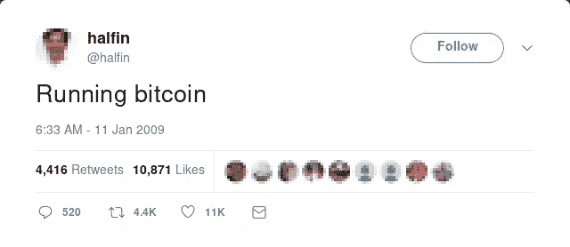
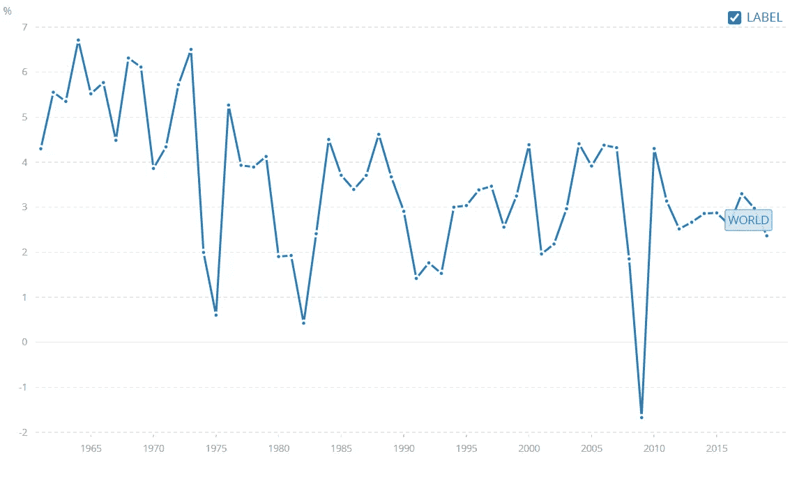

# 为什么比特币是价格最高的加密货币

> 原文：<https://levelup.gitconnected.com/why-is-bitcoin-the-most-highly-priced-cryptocurrency-854fa6b47951>

## 和比特币是第一个加密无关。还有更多。

第一条关于比特币的推特

几乎没有一天我的手机里没有比特币通知，这让我感到恶心。

“比特币只不过是又一个“快速致富方案”。如果不是因为它目前的货币价值，人们可能会完全忘记它。”这是我几年前从比特币混乱中得出的结论。

但是，我错了！

比特币不仅仅是另一台赚钱机器。这是一个新时代的黎明。

# 变革的信号

2009 年 1 月，比特币和“数字货币”的概念出现在 T2。然而，这个日期提出了问题，因为比特币是在 2008 年崩溃和经济动荡时出现的。2009 年对世界来说是可怕的一年。GDPs 暴跌。

根据[世界银行](https://data.worldbank.org/indicator/NY.GDP.MKTP.KD.ZG?start=1961&end=2019&view=chart)的数据，国内生产总值增长率(年%)

这是一个改变的信号。但谁在乎呢。

“比特币是一张黄金门票。幸运的是它的早期采用者。我会把我所有的积蓄都押在比特币上，因为它有望突破 50 万，为什么不突破 100 万呢？这就是比特币在普通人头脑中的运作方式。

许多人没有抓住要点。

众所周知，没有人能准确预测市场。然而，市场倾向于那些相信数字而不是运气的人。统计学、概率、拍卖理论，所有这些技能都会增加你中大奖的机会。遗憾的是，它们并不是每个人都喜欢的。

比特币处于历史高点。在写这篇文章的时候，1 BTC≈60，178.96 美元。这个数字让大多数华尔街大师重申了他们的金融专业知识。

这种加密技术迅速侵占了市场，价值超过了 1 万亿美元。根据 [coinbase](https://www.coinbase.com/price) 比特币是王者其次是以太坊。因此，有两个问题值得思考:

*   为什么比特币是加密之王？
*   为什么比特币天价，而其他密码还在奋力腾飞？

为了回答这两个问题，让我们深入研究比特币突破背后的逻辑和技术。

# 比特币的诞生

20 年前的倒叙会提醒我们，互联网的出现带来了彻底的变化。比特币也不例外。

所谓的“中本聪”，因引入比特币而闻名。但事实是，他设想了比愚蠢的货币更大的东西。他渴望重新发明这个系统。

简而言之，聪建立了一个新的平台——区块链。比特币只不过是区块链科技的一个品牌。

区块链是下一件大事，也是将人类从当前体系中拯救出来的最后希望。错过区块链火车的人会后悔的。

没有区块链，你的隐私就被剥夺了。银行、电信运营商等数据守门人会确保你遵守规定。否则，给自己找个山洞。

有了区块链，你不需要提供任何细节。没有名字，性别，地址或电话号码。你只需要一个代码就可以在区块链数字账本中拥有一个身份。区块链为匿名和假名背书。

区块链把“富人越来越富”的本质敲到了墙上。在区块链社会的眼中，受人尊敬的人是那些保持清白交易记录的人。而不是那些拥有丰厚银行账户或超级富豪父亲的人。

因为区块链是一个不变的账本，每一笔交易都有助于建立你的声誉。没什么好隐瞒的。因此，没有必要让第三方来担保你彻底消灭中间人和中介。

# 比特币的力量之源

供求的微观经济法则适用于比特币。但证明这种不平衡的理由简单明了得可笑。

比特币区块链依赖于一种名为*工作证明* (PoW)的分布式共识。共识是根据参与者的努力工作来奖励他们。矿工耗尽他们的硬件，电力来定位区块。然后比特币区块链社区会奖励他们一些比特币。

> “截至 2015 年，执行了 3.5 万亿次挖掘尝试。这是一项了不起的工作”——[coin desk](https://www.coindesk.com/bitcoin-venture-capital)

起初，社区会奖励矿工 50 BTC。这一数量每 4 年减少一半。目前，我们每开采一个区块就要花费 6.25 BTC。

比特币区块链是一个类似游戏的竞技场。你玩得越多，就越难赢。

虽然凭空印刷钞票会导致通货膨胀，但 Satoshi 巧妙地避开了这一诅咒，将比特币的价格限制在[2100 万 BTC](https://www.buybitcoinworldwide.com/how-many-bitcoins-are-there/#:~:text=How%20Many%20Bitcoins%20Are%20There%20Now%20in%20Circulation%3F,adds%206.25%20bitcoins%20into%20circulation.) 。鉴于 [6 个区块](https://www.coindesk.com/bitcoin-miners-usually-create-6-blocks-per-hour-they-just-banged-out-16)通常在 1 小时内开采完毕(尽管曾经有一个小组在 63 分钟内奇特地破解了 16 个区块)，预计全面供应日期为 2140 年。

比特币区块链的耐人寻味之处在于它依赖于公平、平等和包容。它对所有人开放，旨在让所有人受益。无论你在哪里，你都可以进入站台。无论是美国还是索马里。

比特币游戏引起了大多数人的共鸣。这就是它垄断市场的原因。因此，令人愤慨的价值观。

# 为什么以太坊、Ripple 等都不是比特币的对手

所以很多人认为比特币是最有价值的加密货币，因为它是第一个涉足加密领域的货币。但事实并非如此。

其他数字货币在比特币后面跌跌撞撞，因为它们的模型没有那么强大。

一开始，以太坊也在使用 PoW 共识机制。后来，这被替换为*利益证明*(位置)。PoS 解决了 PoW 的缺点，比如大量的计算能力。

虽然 PoS 仍处于初级阶段，但它不像 PoW 那样有说服力，因为它排除了“努力就会有回报”的信念。

此外，与比特币不同，以太坊的供应没有上限，而是每年都在增加(T3)。拥护这种货币实际上意味着将我们的命运托付给官僚通胀。

Ripple 和 Stellar 将社交媒体作为共识。这种方法很有偏见，不支持新用户，因为他们需要声誉来成为网络的一部分。

也就是说，比特币正在蓬勃发展。市场是由人驱动的，比特币的运作方式只是符合人们的满意度和逻辑。因此，它不太可能会崩溃。

比特币是人类历史的反映。

# 外卖食品

Satoshi 简单地扔了一枚手榴弹，静静地退出观看爆炸的规模。是好是坏，由我们自己决定。

他的遗产是开源的、去中心化的、安全的、由公众驱动的。如果明智地结合，它应该使世界理想化。

无论比特币达到 100 万美元还是暴跌，这都不是重点。真正重要的是后端技术——区块链。

*   区块链是通往自由的大门
*   比特币是区块链的商业广告，也是我们声音和呐喊的放大器
*   区块链就是速度
*   区块链是将互联网从纸质转移到数字的媒介

花旗银行前首席执行官维克拉姆·潘迪特说:

> 技术的出现尤其带来了基于纸张的过程，并把它们变成了半自动化、半电子化的过程，但逻辑仍然是基于纸张的