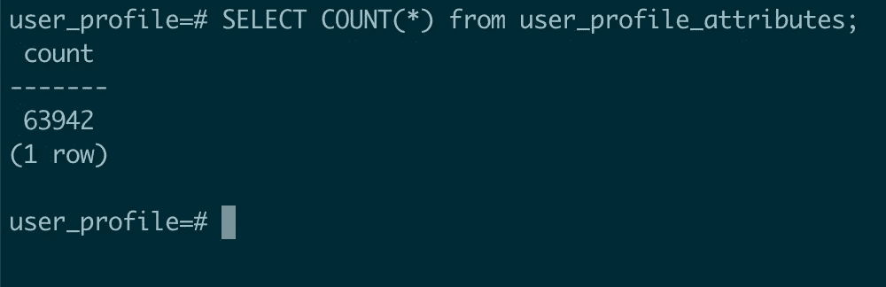
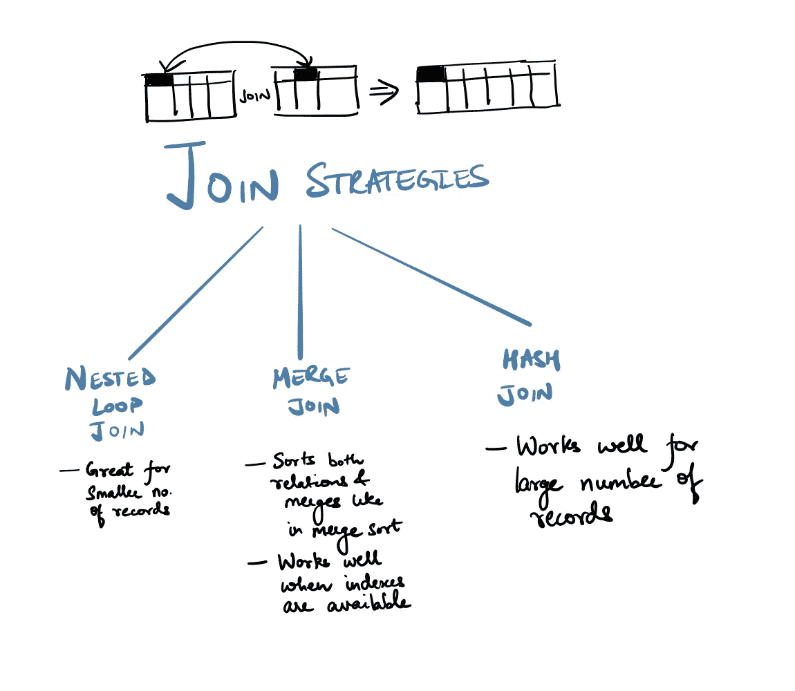
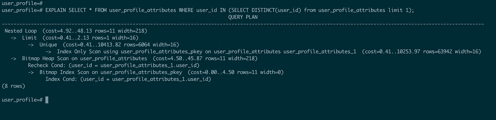
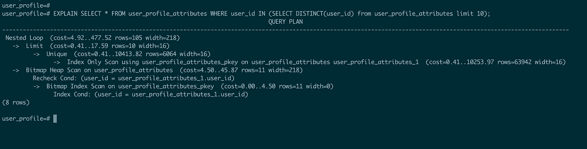
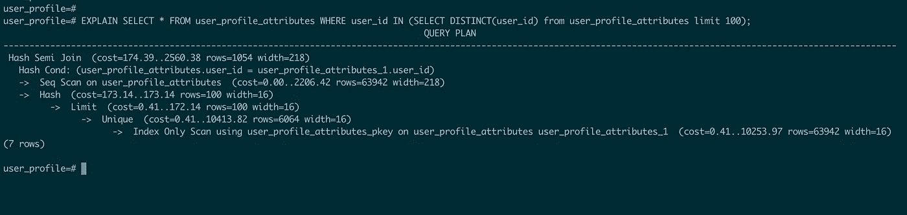
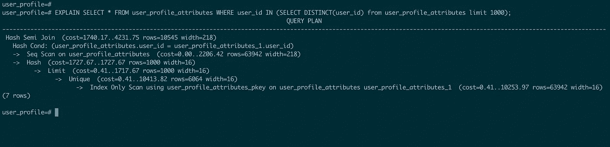
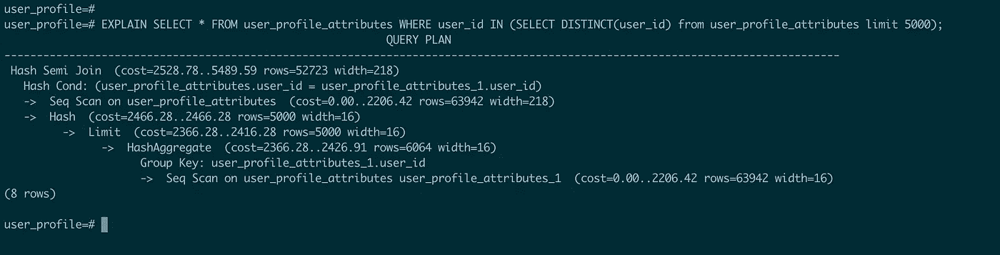
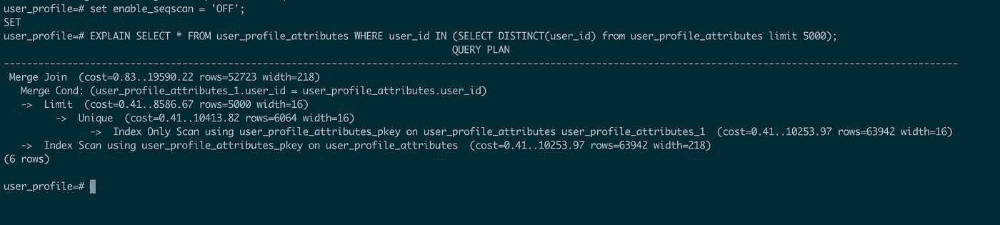

# PostgreSQL 中索引列上的“IN”查询为什么很慢？

> 原文：<https://levelup.gitconnected.com/why-is-in-query-slow-on-indexed-column-in-postgresql-b716d9b563e2>

一个星期五的下午，我收到一个传呼警报，说生产中的一个查询需要 60 多秒才能执行。它看起来是这样的:

```
SELECT * 
FROM **user_profile_attributes** 
WHERE **user_id** IN (...);
```

为什么这个查询很慢，尽管`**user_id**`被索引了？这个问题使我困惑。我浏览了 PostgreSQL 文档，一些堆栈溢出的帖子，终于明白了为什么。

本文将解释为什么尽管有索引列,“in”条件运行缓慢。您将了解查询规划器如何处理查询中的一个或多个关系。接近尾声时，它还会提到一些你可以避免它的方法。

## 先决条件

要想很好地理解这篇文章，你必须知道:

*   基本 SQL
*   主键在表中总是被索引为*。*
*   *表中的顺序扫描意味着按顺序对每个记录进行验证*
*   *B 树上搜索和顺序扫描的算法时间复杂度*
*   *复合索引基于前缀进行索引。*
*   *为什么搜索复杂性很重要，并能理解复杂性分析*

*安全了。让我们通过一个例子来理解查询规划器的工作原理。*

# *例子*

*我有一个包含以下模式的表`user_profile_attributes`*

```
*Column    | Type                   | Modifiers
user_id   | integer                | not null
key       | character varying(255) | not null
value     | text                   | Indexes:
    "user_profile_attributes_pkey" PRIMARY_KEY, btree (user_id)*
```

*`user_id`是主键。*

*这个表包含大约 64k 行。*

**

## *问题*

*如果我查询大量的用户 id(大约 5000 个)，那么查询运行非常慢，没有利用索引。*

*下面是一个示例查询的样子:*

```
*SELECT * 
FROM user_profile_attributes 
WHERE user_id IN ('abc', 'xyz');*
```

# *了解查询规划器📖*

*PostgreSQL 使用查询规划器来决定如何运行查询。为了理解什么是查询的搜索复杂度，我们需要知道 PostgreSQL 计划如何运行查询。*

## *查询规划器*

*计划者创建一个最佳的执行计划。给定的 SQL 查询(以及查询树)实际上可以以多种不同的方式执行，每种方式都会产生相同的结果集。它将检查每一个可能的执行计划，最终选择预计运行最快的执行计划。*

## *计划*

1.  *默认情况下，会生成顺序扫描计划。*
2.  *如果该列有可用的索引，则使用 B 树索引创建另一个计划来扫描关系。*

*每个计划都有一个成本试探法，计划者选择成本最低的计划。启发法不一定每次都适用，计划者可以选择一个次优的计划。例如，*规划者可能会选择顺序扫描而不是索引扫描*(您将在下文提到的示例中看到)*

## *2 个或更多关系的计划*

*如果查询需要连接两个或多个关系，那么在为扫描单个关系找到所有可行的计划之后，考虑连接关系的计划。*

**

*加入策略*

*三种可用的连接策略是:*

*   ****嵌套循环连接*** :对于左关系中找到的每一行，右关系扫描一次。这种策略很容易实现，但是非常耗时。然而，如果可以用索引扫描来扫描正确的关系，那么这可能是一个好策略。可以使用左关系当前行的值作为右关系索引扫描的键。*
*   ****合并连接*** :在连接开始之前，每个关系按照连接属性进行排序。然后并行扫描这两个关系，并将匹配的行组合起来形成连接行。这种连接更有吸引力，因为每个关系只需扫描一次。所需的排序可以通过显式排序步骤来实现，也可以通过使用连接键上的索引以正确的顺序扫描关系来实现。*
*   ****Hash join*** :首先扫描右关系，并将其加载到哈希表中，使用其 join 属性作为哈希键。接下来，扫描左边的关系，并将找到的每一行的适当值用作散列键来定位表中的匹配行。*

## *查看这些计划的实施情况🔬*

*在本帖中，我们将使用`EXPLAIN`来了解查询是否使用了任何索引或进行顺序扫描。我们将使用以下查询:*

```
*SELECT * 
FROM user_profile_attributes 
WHERE user_id IN (
    SELECT DISTINCT(user_id) 
    FROM user_profile_attributes 
    LIMIT n
);*
```

*该查询将获取用户 id 的所有记录。
该语句有两个查询，一个嵌套在另一个中。我们将它们称为嵌套查询和父查询。*

*让我们尝试为不同数量的用户运行查询，并分析行为。*

***搜索 1 个用户 id***

**

*搜索 1 个用户 id*

*如您所见，这里有两个查询(关系)。规划者选择对`Nested Query`和`Parent Query`运行*索引扫描*，然后对二者执行*嵌套循环连接*。*

***搜索 10 个用户 id***

**

*搜索 10 个用户 id*

*计划者选择了一个类似的计划，就像它为 1 个用户 id 所做的那样。*

***搜索 100 和 1000 个用户 id***

**

*搜索 100 个用户 id*

**

*搜索 1000 个用户 id*

*随着记录数量的增加，计划程序在`Nested Query`上运行顺序扫描，在`Parent Query`上运行索引扫描。使用*散列连接*技术连接这两个关系。* 

***搜索 5000 个用户 id***

**

*搜索 5000 个用户 id*

*只要将用户 id 计数增加到 5000，规划者就为`Nested Query`和`Parent Query`选择*顺序扫描*。使用*散列连接* **将它们连接起来。注意:**对于仅有的 5000 条记录，规划器选择了*顺序扫描，*因此不使用索引。*

## *推理*

*如果计划程序在“in”查询中发现大量记录，它将采用顺序扫描。这增加了查询时间，因为根本没有使用索引。*

# *替代ℹ️*

*有几种方法可以避免这种缓慢。*

***1。避免连续扫描** 规划器允许用户通过显示`enable_seqscan`标志来配置规划器行为。您不能禁用*顺序扫描*，但是关闭此标志，规划器将选择其他选项(如果可用)而不是*顺序扫描*。
您可以通过运行以下命令来实现:*

```
*SET enable_seqscan = 'OFF';*
```

*关闭标志后，计划看起来是这样的*

**

*搜索 5000 个用户 id*

*计划者为`Nested Query`和`Parent Query`选择了索引扫描。由于这两个关系需要被索引，所以使用*合并连接*来连接它们。点击阅读更多关于查询规划器配置[的信息。](https://www.postgresql.org/docs/9.5/runtime-config-query.html)*

*注意:但是如果你不得不改变计划者的策略，你可能会后退一步，做些别的事情🤔。*

*2 **。你需要这么多数据的原因🤷🏻‍♀️**
也许你一开始并不需要这么多数据，或者你可能只是在以后对这些数据进行汇总。在这些情况下，可能需要更少的数据和操作。例如，在我的例子中，我意识到我只需要用户的数量，而不是他们的详细信息，所以我最终放弃了这个查询😅。*

# *进一步阅读*

*   *详细阅读查询设计器—[https://www.postgresql.org/docs/9.5/planner-optimizer.html](https://www.postgresql.org/docs/9.5/planner-optimizer.html)*
*   *了解基因查询优化—[https://www.postgresql.org/docs/9.5/geqo-pg-intro.html](https://www.postgresql.org/docs/9.5/geqo-pg-intro.html)*