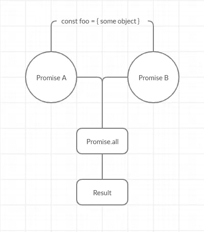
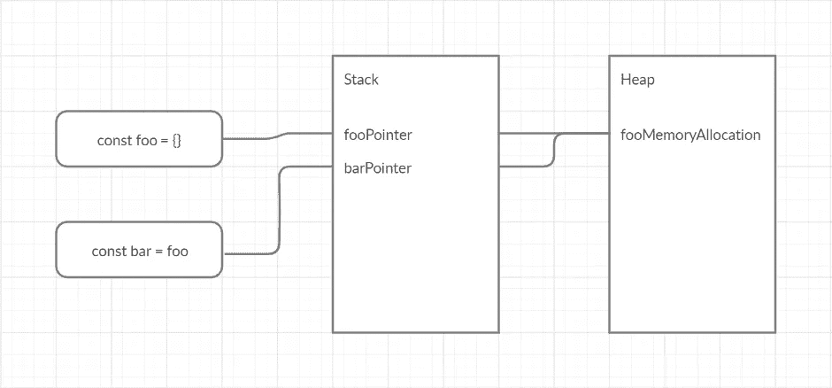

# 为什么是对象不变性？

> 原文：<https://levelup.gitconnected.com/why-is-object-immutability-important-d6882929e804>

为了理解不变性的重要性，我们应该首先看一看可变性的概念。我们应该理解它是什么，它意味着什么，它的含义是什么或者可能是什么。

在本帖中，我们将使用 JavaScript 来了解一些可变性的概念。尽管这些原则是语言不可知的。


# **穆塔……什么？**

可变性！本质上，可变性的概念描述了对象的状态在被声明后是否可以被修改。就这么简单。

考虑一下，我们有一个变量，当我们声明它的时候，我们给它赋值。在我们代码的后面，我们遇到了一个场景，现在我们需要修改这个变量的值。如果我们现在继续并能够改变这个变量的值，改变它的状态，这个对象被认为是**可变的**。

```
// Original array
const foo = [ 1, 2, 3, 4, 5 ]// Mutating original array
foo.push(6) // [ 1, 2, 3, 4, 5, 6 ]// Original object
const bar = { becky: 'lemme' }// Mutating original object
bar.becky = true
```

说到数组，改变数组和它的值的状态几乎太容易了。为了防止这种情况发生，所以我们保持在一个不可变的状态，我们应该创建一个新的数组，这个数组是从原来的数组派生出来的，并在其中插入新的项。

同样，对于对象，应该从现有对象创建一个新对象，并向其添加所需的更改。

但是来了…

JavaScript 有原语类型的概念，即**字符串**和**数字**。这些被认为是开箱即用不可改变的。这里需要理解的棘手部分是，虽然字符串本身是不可变的，但变量赋值仍然是可变的。也就是说，如果我们创建一个变量，并给它赋值一个字符串，如果我们把这个变量重新赋值给一个新的字符串，从技术上来说，并不是改变了原来的字符串，而是改变了变量的赋值。这是一个重要的区别。

```
// Instantiate and declare variable
let foo = 'something'// Instantiate and declare variable to existing primitive type
let bar = foo// Reassign the value of initial variable
foo = 'else'// Log out the results
console.log(foo, bar)
> 'else', 'something'
```

原始类型是不可变地创建的——这意味着当`bar`被实例化时，尽管它被设置为`foo`，内存中的值是单独存储的。所有原始类型都会发生这种情况！这导致新的赋值不会泄漏到任何其他变量中，把它作为一个指针！

# 对大小尝试不变性

可变性的另一面是不变性。这是一旦变量被声明并且状态被设置，就不能再被修改的地方。相反，基于原始对象，*需要*创建一个新对象，其中包含任何更改。

让我们看看如何将一个项目不变地插入到一个数组中。

```
const foo = [ 1, 2, 3, 4, 5 ]// Immutable, not mutating original array (ES6 Spread)
const bar = [ ...foo, 6 ]
const arr = [ 6, ...foo ]
```

我们现在从原始数组创建`bar`和`arr`，并分别在末尾和开头包含我们想要的更改。我们使用 [spread 语法](https://developer.mozilla.org/en-US/docs/Web/JavaScript/Reference/Operators/Spread_syntax)将现有的数组项列出到新数组中。

如果我们有一个更复杂的数组，比如一个对象数组，我们如何在不破坏不变性的情况下修改每个对象呢？简单！我们可以使用`.map`，它是一个本地数组函数。

```
const foo = [{ a: 'b', c: 'd' }]// Immutable, not mutating original array
const bar = foo.map(item => ({
  ...item,
  a: 'something else'
}))
```

物件呢？我们如何在不改变原始对象的情况下更新独立对象的属性？同样，我们可以简单地使用 spread 语法。

```
const foo = { becky: 'lemme' }// Immutable, not mutating original object
const bar = { ...foo, smash: false }
```

`foo`的初始对象保持不变，处于我们发现它时的状态——我们已经创建了一个新对象，其中包含了我们希望看到的变化。酷！

然而，让我们暂时假设我们不能使用 ES6 标准。我们怎样才能达到永恒？

```
const foo = { becky: 'lemme' }// Immutable, not mutating original object
const bar = Object.assign({}, foo, { smash: false })
```

在上面的例子中，我们使用一种旧的方法给一个新的对象赋值。

注意:在嵌套对象的顶层使用扩展操作符并不能保证嵌套对象的不变性。正如我们在下面的例子中看到的。

```
const personA = {
  address: {
   city: 'Cape Town'
  }
}const personB = {
  ...personA
}const personC = {
  address: {
    ...personA.address,
  }
}personA.address.city = 'Durban' // This mutates both person A & Bconsole.log(personB.address.city) // 'Durban'
console.log(personC.address.city) // 'Cape Town'
```

为了确保嵌套对象保持不变，每个嵌套对象都需要按照上面的代码片段中的说明进行分布或分配。


# 你已经回答了怎么做，却没有回答为什么？

在大多数应用中，数据完整性和一致性通常是最重要的。我们不希望数据以奇怪的方式变异，结果错误地存储在我们的数据库中或返回给用户。我们希望以最佳的可预测性确保我们使用的数据与我们的预期保持一致。对于异步和多线程应用程序来说，这一点至关重要。

为了更好地理解上面的内容，让我们看看下面的图表。让我们假设`foo`包含一些关于我们系统用户的模糊的重要数据。如果我们有承诺 A 和承诺 B，它们在一个承诺中同时运行。所有和两个承诺都接受`foo`对象作为参数，如果其中一个承诺变异了`foo`，那么`foo`的新状态就会泄露到第二个承诺中。



上述问题的流程图。

如果它依赖于`foo`的原始状态，这可能会导致该承诺的执行复杂化。

如果两个承诺都改变了`foo`对象，上图的结果可能会有所不同，这取决于哪个承诺首先被解析。这就是所谓的竞争条件。当对象被传入时，它只是一个指向底层对象的指针，而不是一个新的对象。

简单的 GitHub Gist 在 JS 中说明了上述❤的问题

这可能会在调试代码甚至尝试实现新功能时带来一些麻烦。我建议保持不变！

# 所以我应该创建一个新对象？

简而言之，是的。然而，你应该**而不是**直接将新变量设置为旧变量。这也可能导致并发症，可能不会像我们预期的那样发展。

```
const foo = { a: 'b', c: 'd' }// This creates a pointer or shallow copy
const bar = foo// This creates a deep copy
const bar = { ...foo }
```

这是 JavaScript 中的一个基本区别，特别是在变量如何存储在内存中的时候。

更技术性的解释是，当创建对象`foo`时，该对象被存储在所谓的[堆](https://medium.com/javascript-in-plain-english/understanding-javascript-heap-stack-event-loops-and-callback-queue-6fdec3cfe32e)中，并且在[栈](https://medium.com/javascript-in-plain-english/understanding-javascript-heap-stack-event-loops-and-callback-queue-6fdec3cfe32e)上创建一个指向该内存分配的指针。当创建一个浅拷贝时，和上面的第一个声明一样，一个新的项被放在[栈](https://medium.com/javascript-in-plain-english/understanding-javascript-heap-stack-event-loops-and-callback-queue-6fdec3cfe32e)中，但是它指向[堆](https://medium.com/javascript-in-plain-english/understanding-javascript-heap-stack-event-loops-and-callback-queue-6fdec3cfe32e)中相同的内存分配。



上例中创建的对象的堆栈和堆分配的简单说明。

这意味着如果`foo`发生突变，那么`bar`也会反映这些突变。**意外后果**！

# **但是性能呢？**

好吧，当谈到性能时，你可能会认为这将是一个比简单地改变现有对象更乏味、更复杂的过程，你是对的。然而，它并不像你最初认为的那么糟糕。

JavaScript 使用结构化共享的概念，这意味着从第一个对象创建一个新的修改过的对象，实际上不会产生太多的开销。当您考虑到这一点，以及不变性带来的好处时，它开始看起来像一个严肃的选择。举几个好处…

*   线程安全(对于多线程语言)
*   更易于测试和使用
*   故障原子性
*   减轻时间耦合

最终，如果正确使用，不变性几乎肯定会提高应用程序和开发的整体性能，即使某些函数在孤立的情况下可能计算量更大。


# 我们到了吗？

总之，是否想利用不变性的概念取决于您。在我个人看来，我认为它解决了更多的问题和潜在的问题，至少从表面上看是这样的。我试图确保我的对象总是不可变的。

这里有一些参考资料，如果您希望了解更多或者开始在代码库中实现不变性，这些资料可能会激发您的兴趣。

[immutable . js](https://immutable-js.github.io/immutable-js/)
永恒性的好处

[MDN —数组](https://developer.mozilla.org/en-US/docs/Web/JavaScript/Reference/Global_Objects/Array)
[MDN —对象](https://developer.mozilla.org/en-US/docs/Web/JavaScript/Reference/Global_Objects/Object)

感谢你的阅读，我希望你喜欢并学到了一些东西。如果你碰巧有任何反馈、批评或贡献，请随意写在下面的评论区。

再见韦德森。