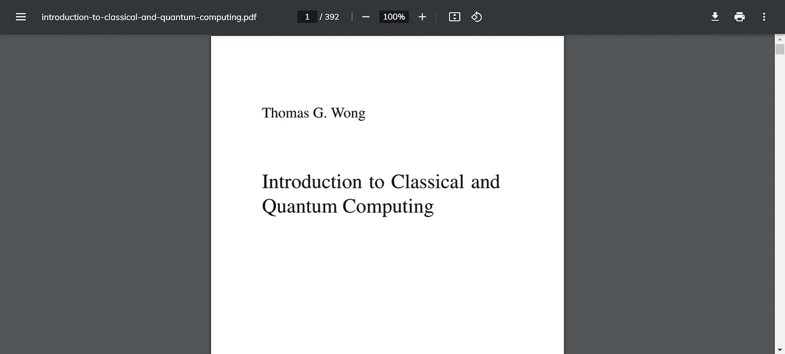

# Wong 教授的 QC 书为什么好？

> 原文：<https://levelup.gitconnected.com/why-is-prof-wongs-qc-book-good-f48ab2275c27>

[http://www.thomaswong.net/](http://www.thomaswong.net/)

# 还没有人解释它…

几天前，我在 Twitter 上看到 Thomas G. Wong 教授分享了他的新的免费电子书，名为《[经典和量子计算简介](http://www.thomaswong.net/)老实说，我的第一个想法是，“不会又是一本量子计算入门书吧！”但是，我看到人们在 Twitter 和 LinkedIn 上分享它，然后一个朋友在评论中给我加了标签。所以，好吧，我还不如下载下来略读一下。我不打算在一篇文章中回顾它，但我想我也可以准备在随机对话中评论它。

自从我下载了它，我看到了关于这本书如何好的新帖子。你不可能那么快地读完一本教科书，所以这些人肯定已经熟悉了内容。引人注目的是，这些评论都没有提到这本书为什么好。所以，这就是我写这篇文章的原因:这本书确实不错，原因如下。

## 好人

**简单明了的英语。这本书的大部分是用简单的英语写的。无论你的背景是物理、数学、计算机科学还是其他，大部分内容都应该是可以消化的。**

**插图。**该书包括表格、图像、逻辑门图、计算机代码、量子电路图、布洛赫球体、Quirk 截图、经典和量子逻辑门的并排比较以及 IBM 量子截图。我真的很喜欢并排门比较。

**练习题。**全程有练习，包括填空题。我最喜欢的是比较两条赛道:哪条更好？当然，答案都在最后提供了。

**互动性。**有上述练习的外部信息链接；只要点击它们就可以打开。不过，这是电子书的一个优势，那么这个怎么样:想象一下，你正在看一个电路图，你想重新制作它并进行实验；只要点击提供的链接，电路就会在 Quirk(一个在线量子计算模拟器)中为你打开。[最近开始做这个](/teleport-quantum-information-7ea4e499c76)，很喜欢这个功能。

**游戏。**用一个叫“量子位触地”的游戏来解释叠加。这个很原创，很清爽。后来，一个名为“纠缠”的棋盘游戏被引入来解释多量子位。我不能说这是我第一次看到这些基本概念的创造性转变，但我喜欢这样的概念，如果你在一个小组中学习，你可以停下来玩这些游戏，巩固这些课程。

**三角学。**当然，根据你选择的应用，你可以用很少的数学做量子计算。例如，线性代数不会出现在电路图或 Python 代码中。所以，你可以在完全不知道的情况下运行电路。另一方面，三角学可能是不可避免的。这是一个有价值的包含，即使它是用复数而不是旋转角度表示的。但是，不管怎样，它还在里面，而且很重要。

**OpenQASM。**您将被引导至 IBM Quantum。演练很好，当然包括电路示例，但也介绍了传输和自定义门。我不记得以前在书上见过这个。

**小品。**这只是最大的量子计算开发社区。没什么大不了的。您将被引导到 IBM Quantum Lab，在我看来，这是使用 Qiskit 的逻辑起点。

**算法。一些算法首先以其他人介绍它们的标准方式出现。通常我会把它归为“坏的”然而，这些算法中的一些随后被提供了补偿更新。[心灵运输](/teleport-quantum-information-7ea4e499c76)就是一个突出的例子。还有，问题- >经典类比- >量子算法的呈现太棒了。**

**接下来。如果你愿意，这本书是向阅读“迈克·艾克”量子计算圣经迈出的一步。比较他们，是的，这本书是一个温和得多的介绍。但是，我认为阅读一本书或完成一系列教程，并想知道从那里去哪里是很常见的。所以，我喜欢提出合乎逻辑的下一步。**

**免费。** [我的量子算法设计书](https://cb.run/mIVg)是免费的，但是我不确定我有没有免费看过一本量子计算入门书。外面有各种免费的课堂讲稿和其他资源，但这是一本合法的书。它的重量不到 400 页，被黄教授在他的课程中用作真实的教科书。

## 坏事

**标准。许多描述是标准的，可以在所有其他量子计算入门书籍中找到。幸运的是，有我在“好”下面提到的所有其他特征使这本书脱颖而出，但是仍然有许多标准材料。**

**方程式。这本书的一些部分通过方程式解释，而不是简单的英语。如果你是这个领域的新手，而且你的背景不是物理或数学，那么一页又一页的方程会成为学习的障碍。幸运的是，有一种黑色蛋白石。**

**线性代数。本书的某些部分，例如门操作，用线性代数来解释。我推荐“[黑蛋白石](https://cb.run/BujC)”可视化代替。**

**张量积。**我只把这个放在“坏的”下面，因为我更喜欢“[计算机科学家的量子计算](https://www.jdoqocy.com/click-100273893-13660345?url=https%3A%2F%2Fwww.ebooks.com%2Fcj.asp%3FIID%3D355406%26fc%3DUS&cjsku=355406)”的解释。

## 丑陋的

**黑匣子。当我读到这个术语时，我有点畏缩。如果解释神谕超出了任何特定教程或章节的范围，请直说。否则，读者最终会学会如何构建它们。**

## **我的名单**

很长一段时间以来，我一直推荐很少的量子计算入门书籍。而且我从来不会同时推荐所有的；我推荐一本，选择哪本取决于读者的背景。

物理学:[量子计算与量子信息](https://www.anrdoezrs.net/click-100273893-13599892?url=https%3A%2F%2Fwww.booksamillion.com%2Fp%2FQuantum-Computation-Information%2FMichael-A-Nielsen%2F9781107002173&cjsku=9781107002173)尼尔森&庄

数学:“[与量子位共舞](https://www.tkqlhce.com/click-100273893-13660345?url=https%3A%2F%2Fwww.ebooks.com%2Fcj.asp%3FIID%3D209970810%26fc%3DUS&cjsku=209970810)”作者:苏托

计算机科学:亚诺夫斯基&曼努奇的《计算机科学家的[量子计算》](https://www.jdoqocy.com/click-100273893-13660345?url=https%3A%2F%2Fwww.ebooks.com%2Fcj.asp%3FIID%3D355406%26fc%3DUS&cjsku=355406)

另外推荐一套教程:Q-Ctrl 的[黑欧泊](https://cb.run/BujC)

## 建议

那么，这本书在哪里合适呢？我们来分解一下利弊。

实际上，我先从坏处说起。有些解释是标准的，在任何地方都可以找到。此外，还有许多通过方程和矩阵的解释。我当然知道有人认为这种东西无法用其他方式解释，但它抵消了我首先列出的“简单英语”的优势。

就优点而言，它是免费的。当你可以免费下载这本书时，为什么要为任何有竞争力的书付费呢？另一本书必须绝对优秀，也许是我刚刚推荐的三本书中的一本，或者也许你有花不完的钱。但是，如果你对量子计算完全陌生，甚至不知道自己会有多感兴趣，你还不如免费开始，从那里开始。

此外，视觉效果和互动性也很棒。一本书怎么可能是互动的？我在数 Quirk 的超链接。出于介绍的目的，我将把“[黑色蛋白石](https://cb.run/BujC)”定性为更高。不过，对于中间目的，Quirk 是检查电路的优秀工具。

但是，现在，这本书最重要的一个特点是:这是一本关于量子计算的书，*实际上介绍了量子计算*。您将访问 IBM Quantum 网站，创建一个帐户，使用拖放编辑器，编写一些 OpenQASM，然后使用 Qiskit 运行一些电路。这本书超越了学习量子计算，实际上包括做量子计算。

出于这个原因，如果你是量子计算的新手，想知道你应该先读哪本书，我的答案是 Thomas G. Wong 教授的《[经典和量子计算简介](http://www.thomaswong.net/)》。免费下载。然后，理直气壮地免费玩真的 IBM 量子计算机。你还在等什么？