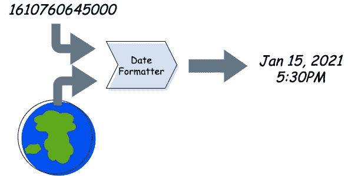
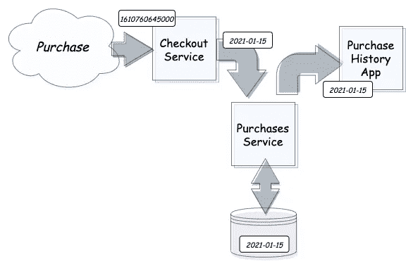
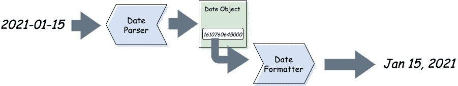
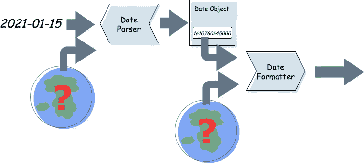
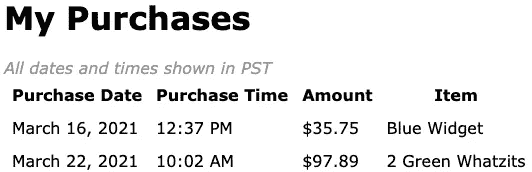

# 为什么用日期编程这么难？

> 原文：<https://levelup.gitconnected.com/why-is-programming-with-dates-so-hard-7477b4aeff4c>

## 如何看待日期和时间戳、时区和时差


努尔·尤尼斯在 [Unsplash](https://unsplash.com?utm_source=medium&utm_medium=referral) 上的照片

Phil Karlton 有一句名言:编程中最难的两件事是[缓存失效和命名事物](https://skeptics.stackexchange.com/questions/19836/has-phil-karlton-ever-said-there-are-only-two-hard-things-in-computer-science)。我会在清单上加上日期和时间。对于人类来说如此简单和直观的东西，日期&时间和时间戳&时区的交互对许多工程师来说被证明是非常棘手的。就在我们认为我们已经弄清楚了的时候，我们被细微差别和边缘情况弄得措手不及，面临着模棱两可的情况。

需要说明的是，我不是这方面的专家；很少有人是真的。见鬼，在写这篇文章的时候我学到了一些新东西！但是在我的职业生涯中，我学到了很多关于日期、时间和时区的工作原理。我继续看到工程师们犯着我曾经犯过的同样惊人的错误——那些源于缺乏基本理解的错误。

在我们开始之前，先简单介绍一下:

*   作为工程师，我们有时向用户显示日期+时间，有时只显示日期。为了简单起见，我将使用术语*日期-时间*来表示我们要么处理一个日期，要么处理一个日期+时间。这一点无论如何都适用。
*   我们还将在本文中讨论时间戳。术语*时间戳*可以被认为是一个概念——一个时刻的数字记录——以及一个具体的实现——即 [UNIX 时间](https://en.wikipedia.org/wiki/Unix_time)。当在本文中使用这个术语时，我们将使用两种定义；具体来说，就是使用 UNIX 时间记录某个时刻。

# 时区和时差

作为工程师，我们经常说“时区”，但实际上我们指的是“时差”。所以让我们比较和对比一下这两个概念。

[UTC](https://www.timeanddate.com/time/aboututc.html) 是这次讨论的核心，所以我们就从这里开始。UTC 代表*协调世界时*(奇怪的是，[不是*协调世界时*](https://www.timeanddate.com/time/utc-abbreviation.html) )与普遍看法相反，UTC 本身并不是一个时区。相反，它是一个全球标准，用于协调世界各地的时间。它实际上是全球计时的“归零地”。

世界不同地区的时间被描述为 UTC 加上或减去一定的偏移量。在撰写本文时，加利福尼亚比 UTC 晚 7 个小时，所以时差为-7 小时。如果现在是世界协调时下午 1:00，那么加利福尼亚就是早上 6:00。这个偏移量通常写成`*UTC-7:00*`。相比之下，雅典比 UTC 早 3 个小时，因此有一个`*UTC+3:00*`的时差。虽然大多数地区的偏移量都四舍五入到小时，但有些地区没有。例如，澳大利亚的北领地有一个`UTC+9:30`的偏移量。

需要明确的是: *UTC-7:00* 、 *UTC+3:00* 等*并不代表时区*。相反，它们代表特定地区时间在给定时刻的 UTC 偏移量*。*

另一方面，时区用于*导出*一个地区的 UTC 偏移量。但是这种偏移会随着时间而改变。为什么会变？最常见的原因是夏令时。例如，加州的春季和夏季有-7:00 的时差。但是当 11 月 7 日夏令时结束时，时差将会是-8:00。其他时区在不同的时间段遵守夏令时，而还有一些时区根本不遵守夏令时。

那么，我们可以把时区想象成一组用于确定特定地区的 UTC 偏移量的*规则*,从而确定当前的本地日期时间。

## 我们如何表示时差和时区？

通常在我们的代码中，我们需要指定一个偏移量或者一个时区(稍后我们将讨论何时以及为什么)。那么我们如何做到这一点呢？

我们已经讨论了如何表示一个偏移量:我们表示要从 UTC 加上或减去的小时数(有时是分钟数)。确切的格式可能会有所不同。作为一个例子，使用 ISO 8601 规范(也将在后面讨论)，我们可以使用下面的粗体文本:`2021–01–15T17:15:30***-7:00***`。

那么我们如何引用*时区*？许多工程师认为像太平洋夏令时(PDT)或太平洋标准时间(PST)这样的术语就是时区。但这是不正确的。更确切地说，这些名字*也*描述了偏移量——它们实际上是别名。PDT 总是*UTC-7，而 PST 总是*UTC-8。加利福尼亚州在夏令时实行 PDT，夏令时结束时实行 PST。如果我将“PDT”声明为我的首选时区，那么我会看到一年中大约有一半的时间是错误的。**

因此，在指定时区时，我们应该避免使用命名偏移量。相反，我们应该通过时区的 IANA 名字来识别时区(例如，对于我们这些在加州的人来说，是 [*美洲/洛杉矶*](https://en.wikipedia.org/wiki/America/Los_Angeles) )。

既然我们已经知道了时区和时差的区别，那么作为程序员，我们应该什么时候使用时区和时差呢？我提出一个简单的经验法则:

*   当 ***存储*** 和 ***传输*** 日期时间数据时，使用 ***偏移***
*   当 ***显示*** 日期时间信息时，使用 ***时区***

但是在我们进入为什么之前，让我们比较和对比另一对经常混淆的概念:日期(或日期时间)和时间戳。

# 日期时间和时间戳

曾几何时，我懂得了“数据”和“信息”的区别。乍一看，这两个术语是同义词。但它们实际上指的是两种不同的东西。*数据*为原始数据。它包含了交流所需的所有组件。但总的来说，它本身并不意味着被理解。

另一方面，信息是以人类可以理解的方式呈现数据。举例来说，我们可以把一个随着时间的推移和世界各地的温度读数组成的数据库想象成*数据*。当这些读数被用来生成显示全球变暖趋势的可视图表时——这就是*信息*。

这与日期时间和时间戳有什么关系？我们可以把时间戳想象成*数据*；它们携带着传达特定日期时间所需的信息，但不一定是供人们消费的。另一方面，日期和时间是*信息。它们是以一种容易理解的方式呈现时间戳。*

至此，让我们看看考虑日期时间、时间戳和时区的几种不同方式。

## 全世界都感觉到了震动


照片由 [NASA](https://unsplash.com/@nasa?utm_source=medium&utm_medium=referral) 在 [Unsplash](https://unsplash.com?utm_source=medium&utm_medium=referral) 拍摄

想象一下，整个地球都在震动——仅仅一次，震动的程度足以让人感觉到，而不会造成任何严重的损害或伤害。

世界各地的每个人都会在同一时刻感觉到震动。那个时刻就是我们的*时间戳*。作为程序员，我们通常将它表示为从 epoch*开始的毫秒(或秒，或纳秒)数。这个数字对地球上的每个人都是一样的。无论地震发生时一个人在哪里，他们都会在相同的时间感觉到。 **定义为世界协调时 1970 年 1 月 1 日 00:00:00*

但是人们不会用一个数字来表示日期和时间。相反，他们用日、月、小时、分钟等来表示。此外，如果我们问世界各地不同的人他们在什么时候感觉到震动，我们会得到不同的答案。

但如果每个人都在同一时刻感受到了，那是为什么呢？当然，这是因为不同的人生活在不同的时区(因此有不同的 UTC 时差)。因此，要生成一个我们可以向其他人表达的日期时间，我们需要两样东西:

*   一个*时间戳*，它告诉我们某件事情已经发生(或将发生)的时刻
*   一个*时区*，它提供了一个人的观点(因此，这个人在那个时刻的 UTC 时差)

当我们把两者结合起来，我们得到了一个对人们有意义的日期时间。

> ***注意:*** 时间戳和时区是两回事。说时间戳“包含”一个时区是不正确的(坦率地说，是不合逻辑的)。相反，时间戳捕获一个单一的、不变的时刻。 ***任何*** 时区都可以在以后应用到它上面——有点像过滤器——以产生人类可以理解的表示。

# 存储日期和时间数据

所以一般来说，我们只需要一个时间戳来记录特定的时刻。当需要以可读格式呈现那个时刻时，我们需要将它与一个*时区*结合起来。在这一点上，我们将通过日期格式化程序运行*和*,这样就会得到一个其他人能够理解的日期时间。



这意味着我们不应该格式化时间戳，直到我们将要显示它(例如，作为网站上的标签)。在此之前，我们应该将其作为时间戳保存。为什么？因为通过这样做，我们将保留所有需要的数据，以便在渲染时使用。

让我们想象一下，否则会发生什么。假设我们经营一个电子商务网站。当在线客户进行购买时，我们会记录购买细节，包括购买的时间。我们的目标用例之一是向用户显示他们过去购买的日期。

我们的 *Checkout* 服务捕获购买时刻作为时间戳(例如 Java 中的`System.currentTimeMillis()`，Python 中的`time.time()`，等等)。这个服务对我们的 *Purchases* 服务进行 ReST 调用，传递购买细节。当然，我们需要决定一种传递购买时刻的形式。因为我们的预期用例是显示购买日期，所以我们决定将时间戳转换成一个字符串，格式为`“YYYY-MM-DD”`。然后， *Purchases* 应用程序可以简单地将该值直接存储在其数据库中。当需要显示日期时，可以从数据库中读取该值，并直接显示在用户的购买历史页面上。



到目前为止，一切顺利。稍后，我们的 UX 团队告诉我们，日期的格式应该是 *Mon d，YYYY* 。我们如何做到这一点？那么，购买历史应用程序可以简单地解析存储的日期(例如*2021–01–15*)，然后重新格式化它(例如到*2021 年 1 月 15 日*)。这很有效。通常情况下。但是偶尔会出现错误的日期——总是差一天。

更糟糕的是，我们现在不仅需要显示购买发生的日期，还需要显示时间。显然，这不是我们能够做到的事情——至少，对于已经发生的收购来说不是。

这是怎么回事？问题是我们丢失了数据。

## 有损数据与无损数据

在数据压缩领域，我们可以将格式分为有损格式[*或无损格式*](https://www.tutorialspoint.com/difference-between-lossy-compression-and-lossless-compression)**。粗略地说，用无损格式压缩的数据可以恢复到其原始形式，而用有损格式压缩的数据则不能。**

**我们可以用这个来类比我们的购买日期问题。我们的时间戳代表了数据的原始形式。不幸的是，我们以有损格式存储了这些数据。**

**后一个问题——我们无法检索购买时间——应该是清楚的。我们只存储了购买的年、月、日，所以当然不能恢复购买的小时和分钟。前一个问题——我们偶尔会看到一天前的问题——可能不太清楚。毕竟，如果我们只显示年、月和日，那么我们只需要存储年、月和日…对吗？**

**嗯，不一定。我们还应该存储一个偏移量。**

**为了理解这一点，让我们看看正在发生的事情。当我们将我们的 *YYYY-MM-DD* 格式的日期转换为 *Mon 格式的日期时。d，YYYY* ，有一个中间步骤正在发生:**

1.  **我们使用日期解析器将日期字符串转换成日期时间对象或结构(取决于我们选择的语言)。**
2.  **在大多数情况下，这个对象/结构会将日期时间信息封装成时间戳。**
3.  **然后，我们使用日期格式化程序将该对象/结构——连同其封装的时间戳——转换成一个带有 *Mon 的新字符串。d，YYYY* 格式。**

****

**这里，我们简单地将日期字符串解析成时间戳，然后将时间戳格式化成不同的字符串。没问题…对吧？**

**第一个问题出现在步骤 1 和 2 之间。回想一下，时间戳代表单个时间点，而不管我们在地球上的哪个位置。但是我们要求解析器将显示日期——比如 2021 年 1 月 15 日——转换成时间戳。所以我们的解析器一定会问:“2021 年 1 月 15 日 ***用什么偏移*** ？”**

**不幸的是，我们无法回答这个问题，因为我们已经丢失了最初用来生成显示日期的偏移量。所以我们的解析器必须做一个假设。这种假设取决于解析器，但在大多数情况下，它将简单地从为执行它的服务器配置的时区中导出当前偏移量。因此，如果我们的服务器运行在*美国/洛杉矶*时区，它将假定一个-7:00 或-8:00 的偏移量(取决于夏令时)。**

**当格式化程序将时间戳格式化回一个 *Mon 时。d，YYYY* 日期，它也将不得不作出猜测。在这种情况下，它需要猜测要使用的时区。这就是第二个问题。因为格式化程序使用的时区可能不会生成解析器使用的偏移量。**

****

**实际上，我们遗漏了一些重要的信息——即，最初用于导出“2021–01–15”的偏移量，以及用于新格式化日期的特定时区。**

**不可否认，如果解析器和格式化程序都运行在同一个服务器上，这个问题很少会发生。很可能两者都使用服务器的时区。但是不能保证每一个的行为——例如，解析器或格式化程序可能缺省为零偏移量；即 UTC。或者格式化程序和解析程序可以在两台不同的机器上运行，每台机器都有自己的时区。如果我们在多区域微服务环境中运行，或者如果我们在用户浏览器中格式化日期，这种情况尤其可能发生。在一个时区代表 2021 年 1 月 15 日的时间戳可能很容易在另一个时区代表 2021 年 1 月 16 日的时间戳。**

**仅仅因为我们不显示时间并不能使我们免受时区问题的影响。**

> *****注:*** 有些读者可能会发现一个明显的矛盾。如上所述，不同语言/工具包中的日期对象倾向于充当时间戳的包装器。同样如前所述，时间戳本身不包含时区。那么，为什么许多语言/工具包中的日期对象允许我们指定时区呢？主要是，当我们调用像`getMinutes()`或`getDays()`这样的方法时，以及当我们要求对象执行日期操作时，例如增加或减少天数(稍后将详细介绍)，它会帮助对象。**

## **以无损格式存储日期时间数据**

**所以这让我们回到了原点。无论是将数据保存到存储中，在 Kafka 消息中发布它，还是在 RPC 请求/响应中传递它，直到我们准备好向其他人显示日期时间为止，我们都应该保持它的无损格式。**

**前面我说过，这意味着将它保存为数字时间戳，人们通常无法阅读。这是最直接的选择。然而，我们可以使用其他格式，只要这些格式存储足够的信息来恢复原始时刻。这意味着存储所有的日期和时间元素，以及原始偏移量。**

**这就是为什么团队有时会使用诸如 ISO 8601 标准中定义的格式。使用全精度形式为我们提供了所有必要的字段来重新创建原始时刻。例如，这个字符串:
`2021-01-15T20:45:30.875-5:00`
为我们提供了原始日期(*2021–01–15*)、时间( *8:45:30pm* 和 *875 毫秒*)和偏移量( *UTC 减 5 小时*)。利用这一点，解析器可以重新创建原始时间戳，然后根据不同的时区对时间戳进行格式化。**

# **格式化时应该使用哪个时区？**

**现在我们已经对显示日期时间时如何使用时间戳和时区有了一些了解，让我们来研究一个棘手的方面:在格式化时间戳进行显示时选择正确的时区。**

**基于我们所讨论的，我们以查看者的当前时区显示日期时间似乎是一个普遍的规则。虽然这看起来合乎逻辑(而且在大多数情况下，这是正确的方法)，但在某些情况下这可能会导致问题。**

**让我们举几个例子。**

## **安排在线会议**

**假设我们的应用程序涉及到建立人们之间的在线会议——有点像 Outlook 或 Google 日历的克隆版。一个人安排了一个会议，一个或多个其他人(假设居住在世界上的任何地方)也将参加。会议将在某一时刻举行。但是每个与会者都有他/她对这一时刻的具体解释，这取决于他们所在的时区。**

**所以在这种情况下，根据每个用户的当前时区显示会议日期时间确实是合适的。**

## **策划一个真实世界的活动**

**现在让我们来看一个我个人遇到的情况。我开发的应用程序允许用户为真实世界(相对于虚拟世界)的活动雇佣工人。例如，作为一个用户，我会定义一个特定的日期和时间，在这个日期和时间，我想雇人为我的活动工作。合格的工人会投标，我会选择我喜欢的工人。假设一切顺利，被选中的工人将在指定的日期和时间出现在我的位置。**

**我们最初的实现在很大程度上运行良好。但是当居住在一个地区的用户计划在另一个地区(特别是在另一个时区)举办活动时，我们遇到了问题。假设一个旧金山居民计划去纽约旅行。该居民在他们的纽约之旅中为特定的未来日期和时间(比如下午 6:00)创建了一个事件，并雇佣了一个员工。一切都很好，直到事情发生的那一天，那个工人迟到了三个小时。**

**发生了什么事？我们的旧金山用户创建了一个在特定时刻开始的事件。在旧金山，这个时刻代表下午 6 点，而在纽约，实际上是晚上 9 点。当然，用户想要指定事件在纽约 *的* *下午 6:00*开始*。但是因为他们在旧金山时输入了日期时间(更确切地说，当他们的计算机在美国/洛杉矶时区时)，所以产生了错误的时间戳。***

**我们如何处理这个问题？为了解决这个问题，我们决定完全放弃时区信息。由于事件被固定在一个特定的位置，时区变得无关紧要。不带时区或偏移的日期时间称为*本地日期*和*本地日期时间。*这是 Java 8 的 [LocalDateTime](https://docs.oracle.com/javase/8/docs/api/java/time/LocalDateTime.html) 着手解决的问题:对任何人以相同的方式表示日期时间，而不管时区。**

**所以我们转而将事件日期时间作为字符串存储在数据库中。另一种(也许更好)的方法是继续存储时间戳，但是总是用*事件*发生的时区来呈现日期时间，而不一定是用*用户的时区。***

## **一个更模糊的例子**

**让我们以之前的购买历史为例。回想一下，我们正在跟踪在线客户购物的日期时间，并将它们显示在购买历史页面中。**

**现在，让我们发挥我们的想象力，假设:1)客户*真的*关心看到他们下订单的日期和时间的准确描述，2)客户经常查看这个页面，甚至在旅行的时候。**

**如果我们使用客户的当前时区来显示他们的购买，会发生什么？如果他们从不改变位置，那么每次顾客查看他们的购买历史页面时，他们的购买日期和时间看起来都是一样的。但是如果他们旅行到不同的时区呢？突然，那些日期时间会改变。**

**我们如何处理这个问题？现在你说是星期四早上？”)但是，我们几乎肯定希望存储购买的时间戳，以便保留购买的确切时间。**

**一种选择可能是存储用户进行购买的时区以及购买日期时间。该购买的所有其他后续显示将在格式化日期时间时使用该时区。**

**还有其他选项，包括允许用户知道正在使用的时区或偏移量。这可能很简单，只需显示一个单独的标签，表明正在使用的时区/偏移量(当然，我们仍然希望选择一个对用户有意义的时区)。或者，我们可能允许客户指明他们的首选时区。**

****

**让用户知道用于显示日期和时间的时区的常用方法**

# **不要在家里尝试这个**

**尝试手工解析、操作或格式化日期时间可能很有诱惑力。在大多数情况下，这是一个坏主意。解析器和格式化器的存在不仅仅是为了让编码变得简单一点。他们还处理许多复杂和边缘的情况，这些情况是我们这些凡人没有足够的知识来正确处理的，或者在许多情况下，甚至没有意识到。**

## **剪掉末端**

**一种常见但不太明智的方法是采用 ISO 8601 日期时间字符串，通过简单地去掉时间部分，将其“格式化”为只显示日期；在这一点上，这个问题应该是显而易见的。该字符串表示发生在 UTC 时间凌晨 2:45 的时刻(尾随的`Z`本身表示 UTC 没有偏移)。同一时刻实际上代表太平洋标准时间前一天的下午 6:45。因此，要向旧金山的人显示日期，我们应该显示`2021–01–14`。**

**如果我们的简单方法显示给定用户所在时区的正确日期，这可能完全是运气使然。**

**相反，我们应该使用日期解析器。因为日期包含了所有的信息——包括原始的偏移量——所以它会以一个准确的时间戳结束。然后，我们应该使用一个日期格式化程序来输出正确的日期(如果我们愿意，这也可以让我们很容易地改变日期的格式)。**

## **做我们自己的日期时间数学**

**另一个常见的例子涉及日期操作。例如，我们可能需要获取一个日期时间，并找到恰好代表一周之后的日期时间。常见的方法可能是这样的:**

```
**final long MILLIS_IN_A_WEEK = 1000 * 60 * 60 * 24 * 7;
...
long originalMillis = parser.parse(originalDateTime);
long newMillis = originalMillis * MILLIS_IN_A_WEEK;
Date newDateTime = formatter.format(new Date(newMillis));**
```

**假设`originalDateTime`已经保留了所有必要的部分(包括时区)，并且`formatter`也配置了正确的时区，那么这种方法可能看起来不错。而且大部分时间都会有效。**

**但是请放心，我们有时会看到错误。因为计算日期和时间有细微差别。夏令时可能是这些细微差别中最常见的，也是最烦人的。如果我们的“增加一周”计算实际上跨越了夏令时事件，那么我们将需要额外增加一个小时或从`newMillis`减去一个小时来保持准确性。类似地，闰年和闰秒之类的东西也会对我们自己开发的日期操作代码造成微妙的破坏。**

**但是任何像样的日期时间库都能够为我们处理所有这些。**

# **直到下一次…**

**在我们的代码中处理日期和时间可能看起来很棘手并且容易出错。但是我们可以把它做好，只要我们理解基本原理。其中包括:**

*   **时区和时差是两回事；时区用于推导给定时刻的偏移量。**
*   **日期时间应该几乎总是以“无损”格式存储——理想情况下以时间戳的形式存储，如果不是，则以日期时间+偏移量的形式存储。**
*   **只有在显示时间戳的时候，才应该呈现时间戳以供人们使用。它们应该很少被存储，或者在网络请求中作为格式化的日期时间传递。**
*   **在为显示格式化时间戳时，我们应该仔细考虑应该使用哪个时区。**
*   **我们应该依靠久经考验的日期/时间库来为我们进行日期/时间操作。**

# **参考**

*   **[https://moment.github.io/luxon/#/zones](https://moment.github.io/luxon/#/zones)**
*   **[https://www . tutorialspoint . com/有损压缩和无损压缩的区别](https://www.tutorialspoint.com/difference-between-lossy-compression-and-lossless-compression)**
*   **【https://en.wikipedia.org/wiki/Unix_time **
*   **[https://www . quora . com/Do-UNIX-timestamps-change-cross-time-zones](https://www.quora.com/Do-UNIX-timestamps-change-across-time-zones)**
*   **[https://www . time and date . com/time/time-zones-interest . html](https://www.timeanddate.com/time/time-zones-interesting.html)**
*   **[https://www.timeanddate.com/time/aboututc.html](https://www.timeanddate.com/time/aboututc.html)**
*   **[https://Zeno do . org/record/1443533/files/2018-10-06-what-developers-should-know-about-time . PDF](https://zenodo.org/record/1443533/files/2018-10-06-what-developers-should-know-about-time.pdf)(PDF)**

**觉得这个故事有用？想多读点？只需[在这里订阅](https://dt-23597.medium.com/subscribe)就可以将我的最新故事直接发送到你的收件箱。**

**你也可以支持我和我的写作——并获得无限数量的故事——通过今天[成为媒体会员](https://dt-23597.medium.com/membership)。**