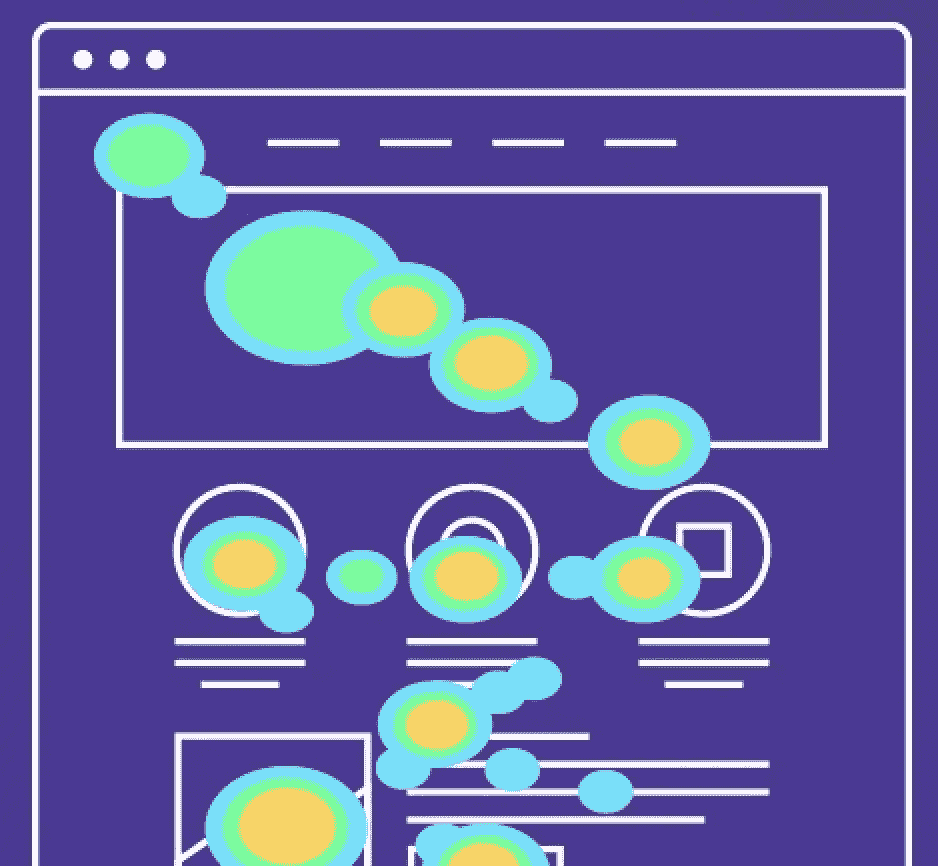

# 为什么你的数据没用？

> 原文：<https://levelup.gitconnected.com/why-is-your-data-useless-26eb8aa2148f>

*   01 简介
*   02 客户细分和客户行为
*   03 业务优化
*   04 最后的想法

# 01 简介

我在报纸或任何传统媒体上读到的一个非常常见的文章标题是**“数据是新的石油”**，但当我读到这些文章时，它们经常与现实脱节。这些文章充斥着诸如“大数据”、“机器学习”和“人工智能”等大词，但很少解释为什么数据对企业很重要，以及**数据在何时何地获得价值。**在这里，我想分享一些我在金融和汽车行业工作时的观察，告诉你(我正在和你的企业主们)为什么应该关心数据。你看，与金钱相比，**数据毫无价值……**

让我解释一下…我的意思是**数据是一种商业资产，它从使用中获得价值。许多公司对他们的 CRM、数据库和昂贵的服务器非常自豪，但他们缺乏专业人员和程序来利用他们的数据，而不仅仅是交易记录。我们需要明白的是，一家公司 99%的数据库实际上只是日常工作中使用的软件的副产品。**他们的主要目的不是被探索而是成为历史记录，方便人们的工作，这很棒！但是当用合适的眼睛和技术来观察数据时，它就像夜晚的灯笼一样工作。除了利用当前的数据，我还鼓励你变得以数据为导向，将数据生成作为新产品和服务设计流程的一部分。这些是利用你的数据并从中产生价值的一些方法。

# 02 客户细分和客户行为

由于公司和产品的多样性大大增加，客户在购买产品或服务时变得非常有教养和有判断力。因此，了解客户是任何公司的主要任务。**客户细分，就是寻找相似的客户群或客户群。**在哪些方面相似？起点应该是你的人口统计数据。你的顾客年龄有相似之处吗？还是原籍城市？性别分布如何？除了人口统计，你能根据客户的购买情况对他们进行分组吗？他们花了多少钱？他们是按什么顺序获得你的产品的？或者从他们如何了解你的生意？这个游戏的名字是找出客户分组的方法。这意味着**如果一个客户在一个集群中，他(在某些方面)与该集群中的人相似，但与来自其他集群的人非常不同**。一旦你找到了你的集群，了解了集群的基本特征，那么你就可以更早地对你的客户进行分类，并以正确的方式为他们提供正确的产品。你可以选择将广告活动的重点放在转换你缺乏的群体或加强更忠诚的群体，这现在是一个商业决定，但随着客户的聚集，你现在知道你的决定的影响。

有用的算法:XGboost 和 K-means。

在了解了“谁是我们的客户？”我们应该继续研究分析客户行为模式的**。**即**了解客户如何与我们的产品和服务互动**。这是设计体验和改善服务的核心步骤。教科书上的一个例子是超市，分析哪些商品是一起购买的。我们可以预期牛奶、面包和黄油通常会一起购买，但你可能会发现其他有趣的模式，如尿布和啤酒一起购买(真的，查一下)。**然后，这些情报可能会被打折或重新安排商店而利用**。另一个分析客户行为的例子是数字体验的**优化设计。这可以通过仔细观察用户如何浏览你的网站来实现。例如，用户平均点击多少次才能从主页到达他们想去的地方，然后修复你的网站，让他们可以更快地到达那里，这直接影响你的销售漏斗。**你可以通过数据放大镜观察你的客户来设计和优化你的体验****

有用的算法:Apriori，K-means，XGboost。

# 03 业务优化

如果说我们从亨利·福特身上学到了什么，那就是一个小小的改变可以极大地改善你的装配线。减少 1 分钟来制造一辆汽车不会改变太多，当你一天制造 1000 辆汽车时，那会增加得很快！使你的公司面向数据可以帮助你优化各种流程，无论你在哪个行业。物流、库存、配送、能耗、员工卫生间时间……(忘了最后一项)。有了数据，任何事情都可以优化。有了数据在手，有了数据科学家的眼光，你可以**创建模型来预测、预期和优化任何管道**，你将在月底看到结果的累加。

# 04 最后的想法

我们生活在一个美好的时代，技术可以以我们以前无法想象的方式改变我们的业务。一个证据是，每天都有一个新的创业公司从一个想法加上几行代码中诞生，然后让任何成熟的行业都为之颤抖。长期以来，我们一直在企业中使用数据来提高销售额和利润，但现在我们与数据交互的方式已经发生了变化，而且必须做出更大的改变！**我们需要将数据视为公司的资产**。对于我们设计的每一个产品或服务，我们都要问这样一个问题:**它能为我们产生什么数据？** **如果你的新产品或服务没有产生有用的数据，那么它还没有完成**，应该在发布前解决这个问题。改变你的思维模式，变得以数据为导向。