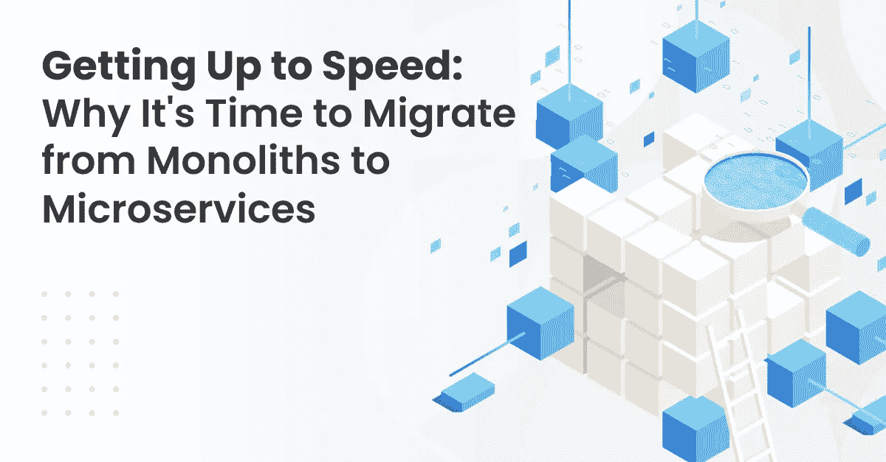
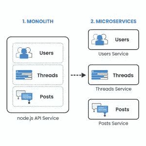

# 为什么是时候从整体迁移到微服务了

> 原文：<https://levelup.gitconnected.com/why-its-time-to-migrate-from-monoliths-to-microservices-b4510fe23a5e>

随着应用程序变得越来越复杂，开发人员和工程师正在寻找构建灵活且可伸缩的软件解决方案的方法。在这种情况下，60%的科技公司，包括像 Spotify 和亚马逊这样的巨头，已经转向微服务。

顺应这一趋势，任何具有前瞻性思维的科技公司都应该考虑从整体架构转向微服务。

但是在您开始[迁移过程](https://intexsoft.com/blog/software-migration-guide-why-when-how/)之前，您必须制定一个清晰、可行的策略来确保平稳过渡。在本文中，您将了解迁移到微服务的好处和挑战。

# 单片和微服务概述

整体架构是一种系统，其中所有操作、数据存储和请求处理都由通用代码库处理。

传统上，monoliths 包含客户端用户界面、服务器端应用程序和数据库。服务器端应用程序接收和处理请求，执行域逻辑，从数据库返回数据，并在用户界面上呈现给请求者(客户机)。

尽管 monolith 生态系统主要存在于[遗留应用](https://intexsoft.com/blog/legacy-software-modernization/)中，一些开发者仍然使用这种架构模型来开发简单的软件程序和概念验证应用。

相反，微服务是指包含多个负责特定操作的服务的软件架构。微服务架构也被称为[面向服务的架构(SOA)](https://www.ibm.com/cloud/learn/soa) 。

以下是[微服务架构](https://intexsoft.com/blog/container-orchestration-what-is-kubernetes/)的核心属性:

1.  **单一责任**。每个服务专门处理一个操作。
2.  **独立**。尽管与其他微服务协同工作，但每个服务都作为一个独立的实体运行。您可以单独部署、重用和更新它们中的每一个。
3.  **智能端点**。每个组成微服务都遵循独特的域逻辑，并通过 HTTP、AMQP 或 TCP 进行通信。
4.  [**领域驱动设计**](https://docs.microsoft.com/en-us/dotnet/architecture/microservices/microservice-ddd-cqrs-patterns/ddd-oriented-microservice) 。这种方法的核心是编程一个对领域的过程和规则有丰富理解的模型。
5.  **模块化**。微服务是模块化的，因为它们包含生态系统中可替换的组件或模块。因此，团队可以独立地扩展和更新不同的单元。
6.  **故障证明**。微服务的使用消除了系统中的单点故障。如果一个模块出现故障，其他微服务将保持正常工作。

# 迁移到微服务的原因

如果你的企业对迁移到微服务犹豫不决，你的犹豫是可以理解的。让我们讨论一下为什么过渡到 SOA 有意义的一些令人信服的原因。

# 提高可扩展性

单片很难扩展，因为对一个模块的更改需要整个应用程序的大规模重新部署。但是通过微服务，团队可以在不中断其他功能的情况下使系统更具可扩展性。

为了让他们的系统更具可扩展性，网飞从整体架构转变为 SOA。随着该公司的用户群继续扩大，开发人员预测，现有的开发生态系统将不再能够处理数据和内容的涌入。

为此，网飞的工程师开始将视频编码和用户注册等服务分离为独立的模块。

# 增加灵活性

单片系统的僵化和缺乏灵活性使得它很难适应现代平台和技术。相反，微服务给工程师更多的回旋空间来试验和集成新技术。

[EBay 采用 RESTful API](https://tech.ebayinc.com/engineering/how-creating-an-agile-code-base-helped-ebay-pivot-for-apple-silicon/)作为该公司努力放弃其过时的单一架构的一部分。通过这样做，该公司能够部署一个组件库来支持像[黑暗模式](https://tech.ebayinc.com/product/dark-mode-now-live-on-ebay-native-apps/)这样的功能。

# 提高生产力

当使用独石时，工程师只能在核心架构的范围内工作。但是有了微服务，多个团队可以同时在同一个应用上工作。因此，这确保了时间和资源的有效利用，全面提高了生产率。

# 缩短上市时间

尽管 monoliths 更容易构建，但它们只适用于简单的应用程序、概念验证软件(PoC)和最小可行产品(MVP)。

当处理复杂的应用程序时，比如拼车应用程序，monoliths 会限制工程师可以享受的自由范围，从而打乱时间表。

或者，使用 SOA 增加了额外的自由度，提高了流程的效率，从而缩短了上市时间。

# 增强安全性

单一架构中的错误使整个系统容易出现故障和可能的恶意软件攻击(DDOS、SQL 注入等)。).但是这些漏洞在使用微服务时就不那么关键了。

尽管 SOA 的多个模块引入了几个攻击点，但是一个单元的失败并不意味着整个生态系统的毁灭。

# 简化维护操作

对开发人员来说，调试一个复杂的整体是一项令人疲惫的任务，尤其是在使用旧代码库的时候。即使团队可以轻松地查明故障，他们仍然需要重新部署整个基础架构。

但是，您可以通过迁移到微服务来减少重新部署的工作量。您只需要修复和重新部署受影响的模块，而不是整个应用程序架构。

使用 SOA 的一个缺点是，您可能很难发现复杂的多层系统中的确切故障点。但是有了像 [Netsparker](https://www.netsparker.com/) 这样的现代监控工具，你可以立刻跟踪这些缺陷。

# 促进团队沟通和成长

当应用程序依赖于 monoliths 时，每个团队都必须专注于架构的特定方面，这导致了冗余、官僚瓶颈和延长的时间框架。

另一方面，微服务依赖 API 进行通信。为了达到这个目标，团队需要生成内部和外部都有效的函数。

当[亚马逊从单片服务器转向微服务](https://thenewstack.io/led-amazon-microservices-architecture/)时，该公司创建了自己的网络服务 API 来与世界其他地方交流。

# 大人物正在做这件事

是的，赶时髦并不总是软件开发的最佳商业方法。但是，正如我们提到的，像亚马逊这样的创新驱动者正在倡导微服务。这种来自科技巨头的支持使得采用面向服务架构的想法很有吸引力。

但是在从单片服务器转换到微服务之前，要根据具体情况权衡每种模式的利弊。

# 从整体服务迁移到微服务的挑战

来自 [O'Reilly](https://www.oreilly.com/radar/microservices-adoption-in-2020/) 的数据显示，大约 62%的公司在迁移到微服务后取得了一定程度的成功。

然而，像 Shopify 这样的公司仍然保持他们整体架构的模块化版本，因为这有助于他们最大限度地提高生产力。转换到 SOA 存在一些障碍，每个团队在迁移之前都必须考虑。

以下是将您的应用从单片服务器迁移到微服务的主要挑战。

# 使得系统更加复杂

向现有架构添加更多模块会使管理变得更加复杂。您现在不必关注单个代码库，而是必须担心多个代码库执行不同的操作。不仅如此，随着新的模块或微服务进入系统，文档将继续增加。

# 测试过程变得复杂

有了微服务，你现在不得不担心为多个分布式服务器调试代码，而不是只关注一个。这一障碍延长了代码审查工作，并延迟了部署前新变更的实现。

# 需要新的技能

当您添加新模块时，您需要找到能够使用底层编程语言的开发人员和工程师。您的 DevOps 团队将需要升级他们的技能或雇佣新的团队成员来填补技能缺口。

# 增加了开发成本

由于您现在需要添加更多的服务，扩展测试工作，并提高技能集，迁移的总成本将会增加。在某些情况下，就像 Spotify 展示的那样，坚持使用整块石头并进行必要的升级是更具成本效益的选择。

# 将单片服务器迁移到微服务的最佳策略

无论如何，迁移到微服务都不是万无一失的方法。[错误和准备不足](https://steven-lemon182.medium.com/why-our-team-cancelled-our-move-to-microservices-8fd87898d952)会破坏应用程序，导致项目被放弃和资源浪费。

因此，我们收集了最佳实践，以确保顺利迁移到微服务。

# 组建一个跨职能团队

大多数公司最常犯的错误是，他们在组建合适的团队之前就投入到迁移工作中。

与传统的整体架构不同，使用微服务需要由开发人员、QA 专家和工程师组成的跨职能团队的努力。

考虑创建一个完善的 DevOps 策略，以便在迁移到微服务时构建、测试和部署应用。如果您的团队成员缺乏执行迁移过程的技能，这是提升他们技能的最佳时机。

# 确定相关组件

有了合适的团队，您的工程师可以开始解构整体架构，特别注意连续交付管道和 API 管理系统。

此外，您的团队应该优先考虑那些可以在不影响依赖 monolith 运行的面向客户端的应用程序的情况下解耦的组件。像 [Sonargraph Explorer](https://www.hello2morrow.com/products/sonargraph/explorer) 这样的工具可以帮助你基于一个已建立的层次结构概述组件依赖关系。

# 去耦组件

在迁移过程中，永远不要一次解耦所有组件。最好的策略是在推进到那些嵌入到现有整体中的服务之前，先将边缘服务解耦。

从边缘案例开始可以让您的团队“尽早失败”,并在转移到关键任务组件之前充实所有的操作先决条件。

技术专家[马丁·福勒](https://martinfowler.com/articles/break-monolith-into-microservices.html)提出了经历频繁变化的解耦能力——比如零售管理系统中的客户个性化。

# 为您的远程用户界面使用 API

在迁移过程中，用户仍将与您的应用程序进行交互。为了确保他们可以访问软件，使用 API 来处理所有的数据访问情况。此外，统一的 API 应该是向后兼容的。

根据 Eric Evan 的[域驱动设计(DDD)](https://docs.microsoft.com/en-us/dotnet/architecture/microservices/microservice-ddd-cqrs-patterns/ddd-oriented-microservice) ，API 应该提供一个[反腐败层](https://docs.microsoft.com/en-us/azure/architecture/patterns/anti-corruption-layer)来翻译组成 monolith 和微服务应用的子系统之间的请求。

# 将整体迁移到宏观服务，然后迁移到微观服务

将一个整体架构分割成太多的微服务会创建一个极其复杂的分布式系统，这将是一个调试的噩梦。

为了避免这种不必要的繁重工作，首先将整体分成共享相同数据存储库的大块([宏服务](https://dzone.com/articles/from-soa-to-graphql-to-macroservices))，然后将它们分割成更小的独立单元(微服务)。

例如，如果您有一个食品订购应用程序的整体，一个宏服务可以处理“订单”，而组成的微服务可以管理分类、支付和运输等子任务。

您可以使用 [Richardson 成熟度模型](https://martinfowler.com/articles/richardsonMaturityModel.html)来分离基于 REST 的服务。

# 测试和部署

在每个阶段，都要进行测试来调试应用程序并找出架构中的逻辑缺陷。使用集成测试技术在迁移的数据和 monolith 中的剩余块之间建立关系。

您还可以测试访问控制，以确保用户没有查看旧数据库中的数据。之后，您可以部署新创建的微服务。

部署微服务的一个优秀方法是[演进架构模型](https://www.thoughtworks.com/books/building-evolutionary-architectures)。在这种方法下，您的团队可以在核心工程实践中引入增量开发。这种进化模型适合于不断变化的软件开发生态系统。

# 结论

对于今天的软件开发公司来说，从单片服务器迁移到微服务似乎是显而易见的。但是，在您将应用从 monoliths 迁移到微服务之前，请努力了解好处和可能的挑战。组建合适的团队来处理迁移过程，而不中断用户体验和内部运营。

最后，在部署之前，务必测试新微服务架构中的每个新组件和功能。