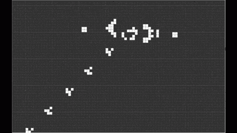
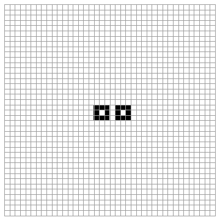
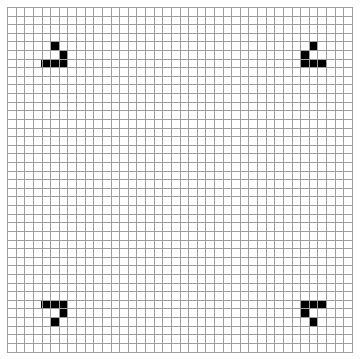
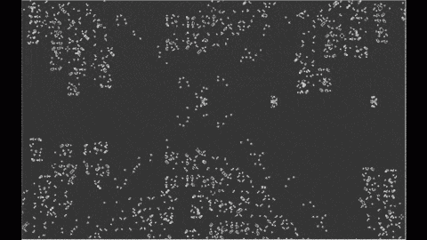

# 为什么约翰·康威的“生命的游戏”是程序员的避难所

> 原文：<https://levelup.gitconnected.com/why-john-conways-game-of-life-is-a-programmer-s-sanctuary-2167c6a05b6b>

为了学习 Angular 9，我最近决定使用该框架构建一个简单的生活游戏应用程序。[规则](https://en.wikipedia.org/wiki/Conway%27s_Game_of_Life)很简单:在一个无限的网格中，网格的每个细胞不是活的就是死的。如果一个活细胞有三个以上的邻居，它就会因过度拥挤而死亡。如果它有少于两个活着的邻居，它会因孤独而死亡(拥挤不足)。否则，它会一直存活到下一代。现在，如果一个细胞开始一代死亡，它可能在下一代变得有生命，如果它目前正好被三个邻居包围的话。就是这样。接下来的问题自然是:这个模拟是什么样子的？

好吧，给你:

滑翔机枪([https://giphy . com/gifs/computers-game-of-life-con ways-xwrhj 1 ecglju 8](https://giphy.com/gifs/computers-game-of-life-conways-XwRHJ1eCGLju8))

并且:

不确定这个的名字([https://giphy . com/gifs/programming-automata-cellular-ibg K6 rxvzvb0c](https://giphy.com/gifs/programming-automata-cellular-IBGk6rXvzVb0c))

最后:

谁知道机器人会可爱呢？([https://gi phy . com/gifs/programming-automata-cellular-z S8 lttm 8 pq 8 cs](https://giphy.com/gifs/programming-automata-cellular-Zs8lttm8PQ8Cs))

# 概念

生活的游戏对于书呆子和工程师来说都不是秘密(并不是说这些群体是相互排斥的)。自从一位名叫约翰·康威的数学家在 1970 年提出这个想法以来，它就一直存在，并产生了大量的问题和一个配置档案，每个都导致一个神秘的，但完全可预测的模式。但是这里不讨论模拟的含义和可能的意义。相反，我将努力捍卫它作为新手开发人员的教师的力量，以及作为有经验的工程师的奇迹的舒适性。

# 三种品质

(免责声明:这是推测性的，轶事性的，刻板印象。也许我发现自己在讨论康威的发明成为流行文化名人背后的原因，而不是它的先天品质与一些普通“程序员的性格”之间的真正关联。尽管如此，我们继续前进。)

我相信有三种品质可以取代模拟作为编程挑战的标志:美观、可确定性和难度。结合起来，这些特征形成了一个问题，这个问题解决起来既刺激又令人满意。

# 美学的

机器输出领域的异常现象。康威的生命游戏字面上是二元的，可以完全用两种颜色来表达。然而，这是惊人的。它的动画，无尽的，通常拟人化的网格可以在无限的可能配置中吞噬你几个小时。在科学神秘的背景下(我认为是肤浅的神秘，但仍然是-)，运行模拟的运动可以让他们的创造者在做出无限的东西后充满绝对的自豪。

# 确定性

现在出现了一个刻板印象:程序员喜欢可预测性。如果编码语言只有一半时间是可以理解的——如果字符串变成数字，数字随机变成字符串，如果编译器有时会向后而不是向前读取，如果某些天最大的最大整数是 5，或者等号不起作用，你会留下来吗？当一些贬低把你曾经优雅的代码行送进了深渊，或者当一个被遗忘的角色从你的生活中占据了三十分钟，这已经够令人沮丧的了。但至少这些是可以解释的。至少当你发现这些错误时，你可以理解它们为什么会发生，并为允许它们发生而给自己一记耳光。当一个画家把一杯咖啡洒在画布上时，它通常会被毁掉，但有时它会变得更好，这是机会变得美丽的一种方式。但是当我把咖啡洒在笔记本电脑上的时候，我就再也没有机会坐下来，平静地呼吸，然后说，‘你知道——这可能行得通。’。"

康威的生命游戏*是*可预测的——在数学上，视觉上(尽管很细致),与时间无关。它的规则是明确和简洁的，可以进行大量的测试。如果你做对了，不管你是怎么做的，你都可以证明你做的*是有效的*。

# 困难

另一个假设:程序员喜欢困难。一个难题是在数小时的写作后值得去解决的。在数小时思考可能的解决方案并向自己保证每一个都失败后，看看窗外，思考你的职业选择。但是很快，你会继续你停下来的地方，因为从前你学到了丰富的解决方案带来的满足感。

然而，这些都在一定程度上。有些问题令人厌烦，有些则乏善可陈，无论它们有多么具有挑战性，解决它们所需要的单调乏味可能都不值得获得成功的快感。事实上，如果你花了五年时间来解决一个问题，老天作证，这最好是值得的。

这就是*生活*的闪光之处。这不是微不足道的，但也不是不可救药的。它可以在一天内完成，并且不需要计算机科学前沿的工具(这就是为什么*生命*模拟在编程早期就已经存在)。问题只需要教员。如何渲染网格，如何确定其尺寸，如何跟踪对初始(空的)配置所做的更改，以及如何从一代运行到下一代？你是允许网格随着新的生命而扩展，还是提供一个固定的宇宙供用户操纵？用户界面是独特的还是简约的(或者两者都有)？你会允许改变规则吗？清单还在继续，但是*每个问题都是合适的大小*，这就是为什么它是一个理想的问题。

# 在整合中:

大量的代码是美丽的，大量的输出也是美丽的。生活就是两者都成立的一个例子。争论的美学部分只是相关的，因为这个问题从非常少的信息中创造了一个意想不到的画面，这可能对试图争辩计算机科学除了仅仅是艺术设计的工具之外还具有内在的艺术价值的人有吸引力。它仍然存在于确定性和确定性的结果(真相、可预测性等)的领域中，并且很难接近但又具有挑衅性。我鼓励每一个有兴趣的人加入到这场火中，把他们自己的滑翔机、宇宙飞船或小狗机器人送到他们电脑屏幕的边缘，送到未知的地方。当你想变得有创造力但没有创造力，当你想建造既僵硬又松散的东西时，你大脑中活动的那部分会发痒。如果你是一个初学程序员，你可以这样做，你可以从中学习——如果你是一个专家，你可以这样做，并欣赏它。无论哪种方式，在制作这个程序的过程中都有一些东西，这就是为什么如此多的人增加了它的概念，也是为什么如此多的人将继续这样做。

感谢阅读！如果你想不为所动，我的 Github 可以在这里[找到](https://github.com/ryansmane)，也请随意分享其他你认为站在(有用的)编程陈词滥调大厅里*生活*旁边的流行程序。

奖金模式(有可怕的削减):

飞船工厂([https://giphy . com/gifs/computers-game-of-life-con ways-txlpbxfu 7 e 2 pu](https://giphy.com/gifs/computers-game-of-life-conways-tXlpbXfu7e2Pu))