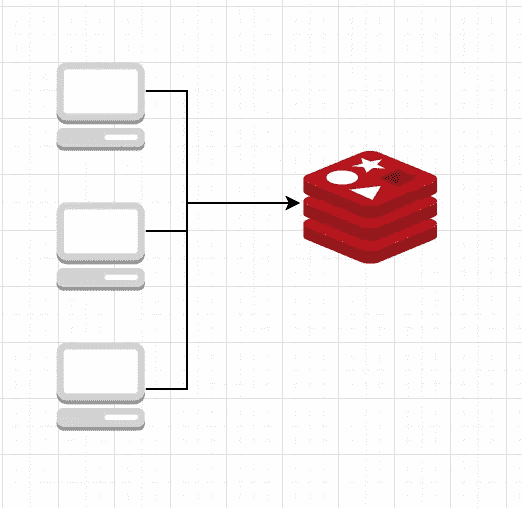

# 当您可以记忆时，为什么只缓存(有到期和一致性)

> 原文：<https://levelup.gitconnected.com/why-just-cache-when-you-can-memoize-with-expiration-and-guaranteed-consistency-97dbb504deda>


谷歌图片，WP 火箭

**记忆化是一种特殊类型的缓存，用作软件优化技术。**

缓存是一种常用的软件优化技术，在所有形式的软件开发中都有使用，无论是 web 还是移动，甚至是桌面。缓存存储操作的结果以备后用。例如，如果您将来通过存储以下资源再次访问这个博客，您的 web 浏览器很可能会使用缓存来更快地加载它。js，。css 和图像。

所以，当我谈到记忆化时，我指的是在执行软件的机器的内存中记忆或缓存复杂操作的输出。记忆化在“备忘录”中找到了它的词根，意思是“被记住”

缓存是一个强大的工具，但与内存化不同，它通常是运行在网络调用访问的其他服务器上的另一个进程。缓存系统总是很快，但是网络调用增加了总响应时间的瓶颈。在一个封闭的 vpc 设置中，添加多个通过同一网络同时进行呼叫的进程，缓存需要随着组件的变化而扩展。内存化在这方面有优势，因为数据被缓存在机器的内存中，从而避免了网络延迟。



更喜欢使用缓存的最强大的方面是:

1. **ttl** (生存时间)—缓存数据在预先指定的时间间隔后自动过期

2.当从不同的进程读取数据时，数据总是相同的——在当今云优先的架构中，多个应用服务器或后台进程是一种常态。

这使得缓存是新鲜的(由于 ttl 而经常失效和刷新),并且是一致的(因为它是真实的单一来源)。然而，记忆化就不一样了，你很少会发现记忆化、多进程一致性和过期一起使用。

然而，在这篇博客中，你将看到如何以及何时一起运用这些简单而强大的技术，来优化你自己的程序，使它们在某些情况下运行得更快。

> 介绍 [**memoize_until**](https://github.com/ritikesh/memoize_until) 。一种强大而简单的内存化技术，关注多进程环境中所有缓存系统的动态特性和一致性，并将其引入内存化领域。

`MemoizeUntil`记忆(记住)值，直到预定的时间度量开始——这可以是分钟、小时、天甚至一周。到期时，存储会自动清除以前的数据，以避免内存膨胀，并通过请求源来刷新数据。由于流程会在预定义的时间指标开始时自动提取数据，因此可以保证流程之间的一致性。

首先，简单地说，通过 npm 安装软件包:

```
npm install memoize_until
```

然后需要这个模块，用你的用例初始化它，并在需要的地方使用它。

```
const MemoizeUntil = require('memoize_until').MemoizeUntilMemoizeUntil.init({ 
    day: ['custom1', 'custom2']
})MemoizeUntil.fetch('min', 'default', () => { 
    return 'SomeComplexOperation'; 
})
```

举个简单的例子，假设您的生产就绪型应用程序有一个面向公众的 API，您想要实现一个 FUP(公平使用策略)并因此设置适当的速率限制。但是你几乎可以预见到你的一些客户会时不时地抱怨并希望提高 API 限制。这要求您的 API 限制是动态的。

传统上，开发人员会将其作为配置保存在配置数据库中，并在每次请求时加载一次。但随着时间的推移，这种配置已经转移到保留在 Redis 等缓存存储中，这些存储传统上非常快，但网络延迟仍然存在。为了避免对每个 web 请求进行缓存调用，您可能希望在本地记住 API 限制，并对每个请求都使用它，而且还要经常检查缓存存储是否已经更新。这似乎是使用`memoize_until`的完美用例。缓存的数据需要刷新，但不是立即刷新。示例用法可在以下要点中找到:

[**自述文件**](https://github.com/ritikesh/memoize_until#memoizeuntil) 涵盖了额外的文档，比如如何扩展`memoize_until`以实现真正的动态行为——动态键和值——等等。

**注意:** `memoize_until`不是缓存存储的替代品，它只是一种优化技术，通过保证一致性的记忆化来减少对缓存存储或数据库的网络调用。因为一切都存储在内存中，所以还需要考虑远程服务器上的内存限制——尽管由于有了云，这不再像过去那样是个大问题。

[](https://levelup.gitconnected.com)[](https://gitconnected.com/learn) [## 了解如何编码-查找编码教程| gitconnected

### 使用我们完整的编码资源列表学习任何编程语言或框架。我们分享、汇总和排名…

gitconnected.com](https://gitconnected.com/learn)