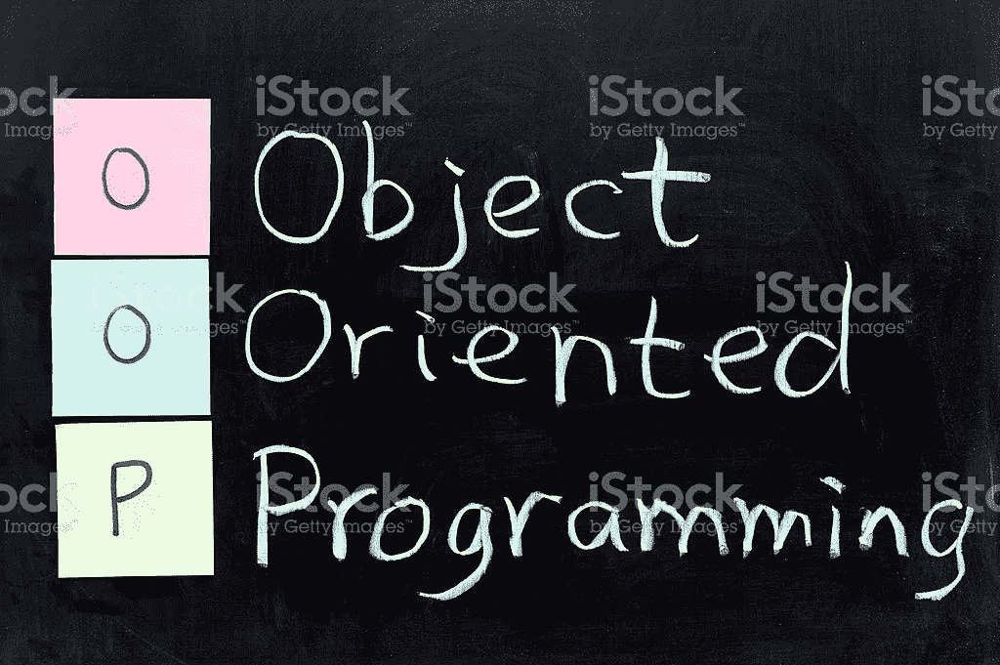
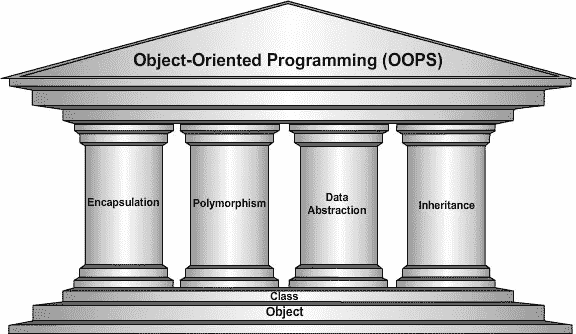

# 为什么要学习 Python 中的面向对象编程？

> 原文：<https://levelup.gitconnected.com/why-learn-objects-oriented-programming-in-python-794cdccc4caa>

我学习面向对象编程的经历完全改变了我的编码风格。

来自 [**pixabay**](https://www.istockphoto.com/photo/oop-object-oriented-programming-gm147480805-20195218?utm_source=pixabay&utm_medium=affiliate&utm_campaign=SRP_image_sponsored&referrer_url=https%3A%2F%2Fpixabay.com%2Fimages%2Fsearch%2Fobject%2520oriented%2520programming%2F&utm_term=object+oriented+programming) 的面向对象编程图片

O 面向对象是指直接面向**对象**。准确地说，它意味着在功能上直接面向建模对象，这是用于复杂系统建模的最佳技术之一。

**面向对象的 Python，**Python 编程的核心是一种专注于使用**对象**和**类**来设计和构建应用程序的编程方式。面向对象编程(OOP)的主要支柱是继承、多态、数据抽象和封装。

> 注意:Python 默认不支持数据抽象类或方法。我们必须使用一个叫做 ABC(抽象基类)的模块来实现抽象类。

来自 [wattpad](https://www.wattpad.com/272916053-funny-jokes-4-pillars-of-object-oriented) 的面向对象编程的 4 个支柱的图片

## **为什么选择 Python 中的面向对象编程？**

Python 采用面向对象的方法设计，具有以下优势:

*   提供清晰的程序结构和干净的代码
*   简化现有代码的维护和修改
*   因为类是可共享的，所以代码可以重用
*   因为类是可共享的，所以代码可以重用，还有许多其他类似的优点。

**一个物体有两个特征:**

*   属性
*   行为

**举例:**汽车是可以成为对象的，其特征如下:

*   颜色、尺寸、重量=属性
*   启动发动机、加速、停止=行为

## 面向对象程序设计的主要原则如下

**类** →类定义以`class`关键字开始，后跟类名和冒号。缩进到类定义下面的任何代码都被认为是类体的一部分。我们使用`class`关键字来定义一个空类 car。从类中，我们构造实例。实例是从特定类创建的特定对象。

对象→ 对象(实例)是一个类的实例化。注意，当你实例化一个类时，你得到一个对象。你可以实例化一个对象，类似于像函数一样调用一个类

**方法**→方法是在类体内定义的函数。它们用于定义对象的行为。

`__init__`是 python 类中的一个**保留方法**。在面向对象的术语中，它被称为构造函数。当从类创建对象时，调用此方法，它允许类初始化类的属性。

*   注意，在上面的代码中，我们使用关键字`self`来表示我们当前正在处理的对象。`self`应该是 Python 类中任何方法的第一个参数

**现在，让我们看看如何实际使用上面的类来创建一个对象**

## 让我们来看看 OOP 概念的四个支柱的用法

## **1。继承**

面向对象编程的主要优点之一是可重用。继承是实现这一点的机制之一。继承允许程序员先创建一个通用类或基类，然后再扩展到一个更特殊的类。它允许程序员编写更好的代码。

## 输出

## 2.**多态性**

多态性是一种为多种形式使用公共接口的能力。当这些类包含具有不同实现但名称相同的方法时，它们就是多态的。

在这种情况下，我们可以使用这些多态类的对象，而不用考虑这些类之间的差异。它允许我们有一个界面来以许多不同的方式执行类似的任务。

## 输出:

## 3.**封装**

在 Python 中使用 OOP，我们可以限制对方法和变量的访问。这可以防止数据被直接修改，即所谓的封装。在 Python 中，我们使用下划线作为前缀来表示私有属性。

通过使用单`_`或双`__`

在上面的代码中，要改变电脑价格的值，你只能通过使用**`set`函数或使用**下划线来实现。****

## **输出**

## **4.**数据抽象****

**如果一个类包含一个或多个抽象方法，那么这个类就称为抽象类。抽象方法是一种被声明为**但不包含实现的方法。****

**简单地说，我们将抽象方法定义为当我们没有细节需要添加或者值未知时的东西。在这种情况下，我们使用`pass`函数。当我们现在没有任何参数时，我们主要使用抽象，我们只有像`pass`这样的声明可以使用，它们被称为抽象方法。一旦你创建了一个抽象类，你就从它创建了一个对象。**

## **上述代码的解释**

1.  **Python 默认不支持数据抽象类或方法。我们必须使用一个叫做 ABC(抽象基类)的模块来实现抽象类。**
2.  **它们通过使用`@abstractmethod`来定义**
3.  **一旦你创建了一个抽象类，你就从它创建了一个对象。**

## ****为什么要使用抽象基类？****

**通过定义一个抽象基类，你可以为一组子类定义一个通用的应用程序接口(API ),主要是当你在一个大的团队中工作或者有一个大的代码库时，你很难或者不可能记住所有的类。**

## ****结论****

**在本教程中，您学习了 Python 中的面向对象编程(OOP ),以及面向对象编程在日常生活中的重要性。**

****资源****

1.  **[教程-要点](https://www.tutorialspoint.com/object_oriented_python/object_oriented_python_tutorial.pdf#:~:text=Object-Oriented%20Python%20The%20heart%20of%20Python%20programming%20is,also%20enables%20in%20writing%20bigger%20and%20complex%20programs.)**
2.  **[https://www.programiz.com/python-programming/polymorphism](https://www.programiz.com/python-programming/polymorphism)**
3.  **https://cs50.harvard.edu/web/2020/notes/2/。**