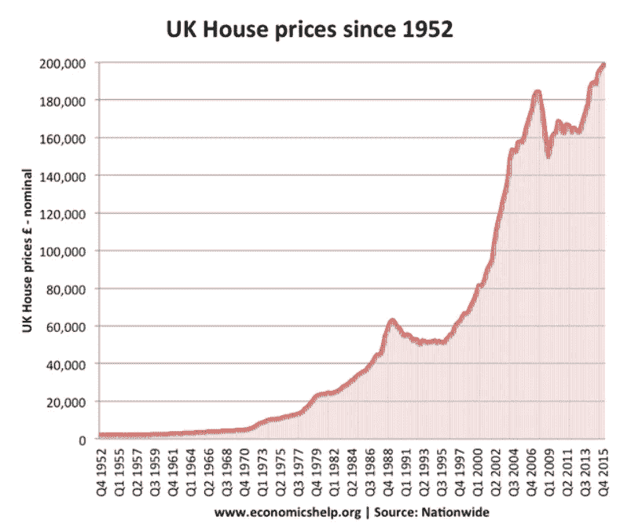
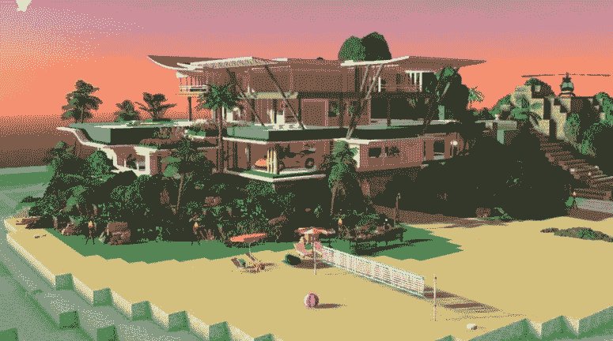

# 马克·库班:在元宇宙购买房地产是有史以来最愚蠢的事情

> 原文：<https://levelup.gitconnected.com/why-mark-cubans-probably-right-buying-real-estate-in-the-metaverse-is-the-dumbest-shit-ever-746c6d732896>

为什么他可能是对的…

[图片来源——美国消费者新闻与商业频道 Christopher Willard 摄影| Getty Images](https://www.cnbc.com/2022/08/10/mark-cuban-buying-real-estate-in-the-metaverse-is-dumbest-idea-ever.html)

让我们换个说法。他说的是

> “根据传统的房地产模型，这是有史以来最愚蠢的狗屎”。

他没有拐弯抹角。

我通常对这些亿万富翁在公众面前所说的话持保留态度。

但这位达拉斯小牛队(Dallas Mavericks)的老板和连续投资者在互联网泡沫破裂前将公司卖给了雅虎，他的观点非常好。

想想吧。

在现实世界中，你买房子主要是因为你需要一个遮风挡雨的地方，而仅仅在你当地的公园里搭一个帐篷是不被社会接受的。

买房子的另一个实际原因是你不能创造更多的土地。我们生活的土地并不是无限的，这创造了一个难以置信的投资机会，尤其是在英国，我们像沙丁鱼一样拥挤。

对有形财产的需求总是存在的，这就是为什么在过去的 70 年里价格只朝一个方向发展。

[信用—全国](https://www.smarterproperty.net/post/house-prices-uk)

在元宇宙登陆完全是另一回事。人们没有看到这一点，包括知名投资公司。

或者可能是我没有用正确的镜头观看元宇宙土地。

共和境界*T5 是元宇宙和 NFT 创新和投资的领导者。*

他们以创纪录的 430 万美元购买了广受欢迎的元宇宙房地产平台 Sandbox 的土地，该平台占据了元宇宙土地销售的 62%。

**据美国消费者新闻与商业频道**

Republic Realm 正在开发元宇宙的 100 个岛屿，称为幻想群岛，以及它们的别墅和相关的船只和水上摩托市场。

听起来很疯狂。

第一天卖出了 90 个岛屿，每个 15k 美元；有些现在挂牌出售，售价超过 10 万美元

更疯狂。

为了清楚起见，我们仍然在讨论元宇宙的数字土地。

[元宇宙土地购买示例—为无形资产支付了 25 以太坊(ETH ),将近 110，000 美元。](https://www.domain.com.au/news/supermodel-drops-110000-on-digital-island-in-the-metaverse-1119732/)

目前，在 Web3 的一大堆其他事物中，价值是难以置信的投机。

与传统的土地所有权不同，数字空间是无限的。像沙盒这样的公司，在任何时候，都可以创造更多的土地。

他们做到了。

那么，当公司人为制造了稀缺性，可以制造更多土地，而竞争对手可以随时用更多土地挑战他们时，投资者的价值主张是什么？

说实话，我也不是 100%确定，但是很多人会亏很多钱。

我认为这与土地和吸引人们来到这些社区的因素关系不大。

马克·库班强调了他所认为的价值主张，从而对他最初对数字土地的看法提出了警告。

> 他认为元宇宙的土地或地理位置不是驱动因素。
> 
> **然而，土地本身会给人们社区提供门禁，而不是我们如何通过地址或位置来评估物理土地。**

他强调，公司应该在出售土地之前建立社区。

创建社区后，价值主张就变成了访问。
事先不建社区，只卖土地…

> **“史上最蠢的狗屎”**

我决定熬夜听马克·古巴人挑战元宇宙，因为他是宇迦实验室的战略投资者。他们因发布了可能是最受欢迎的 NFT 项目而闻名。

无聊猿游艇俱乐部。

除了购买 CryptoPunks 和 Meebits，宇迦实验室还发布了一个名为 OtherDeed 的基于元宇宙土地所有权的项目。

去想想。

这使得达拉斯小牛队老板的标题令人惊讶和耳目一新，他说的话没有不可告人的动机或自我厌恶。

他给出了他诚实的、深思熟虑的观点。

我经过深思熟虑的诚实观点是，这是一个硬件游戏。

脸书(Meta)的虚拟现实设备 Oculus 遥遥领先于任何人，该公司的平台每月有 36 亿活跃用户。

我的猜测是，与他们的脸书模式类似，他们的用户可能会免费获得土地，由企业付费向平台上的用户宣传体验、实体/数字产品或服务。

时间会证明一切。

> ***以上都不是理财建议。我不是一个合格的财务顾问，尽管我尽了最大努力，我也无法预测未来。***
> 
> ***NFT 空间有风险。***
> 
> ***专家说，目前 99%的项目都在走向 0。***

# 分级编码

感谢您成为我们社区的一员！在你离开之前:

*   👏为故事鼓掌，跟着作者走👉
*   📰查看[升级编码出版物](https://levelup.gitconnected.com/?utm_source=pub&utm_medium=post)中的更多内容
*   🔔关注我们:[推特](https://twitter.com/gitconnected) | [LinkedIn](https://www.linkedin.com/company/gitconnected) | [时事通讯](https://newsletter.levelup.dev)

🚀👉 [**加入升级人才集体，找到一份神奇的工作**](https://jobs.levelup.dev/talent/welcome?referral=true)