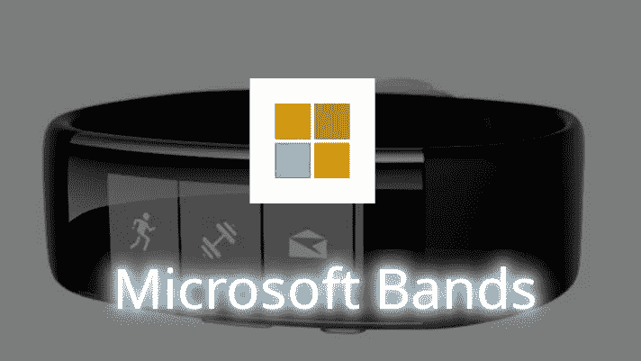
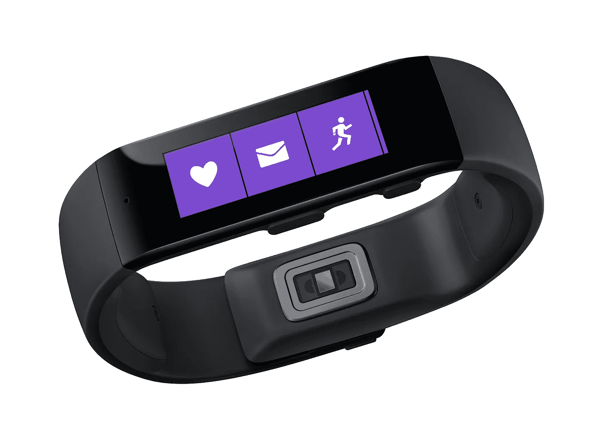
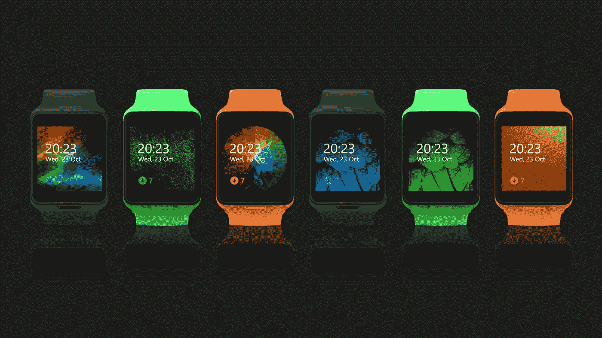
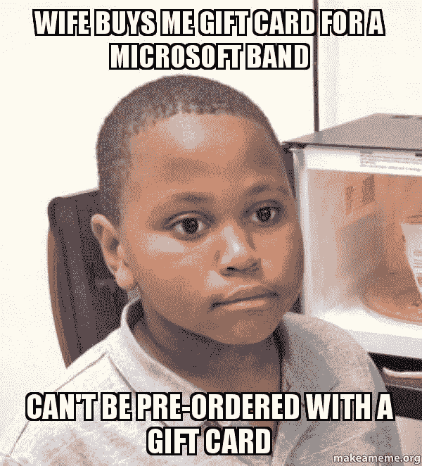
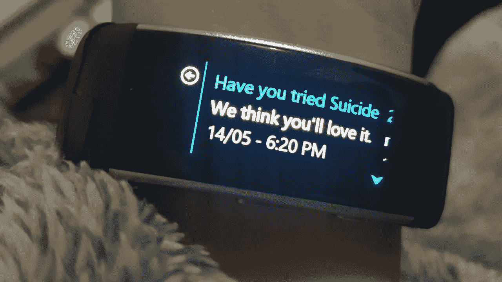
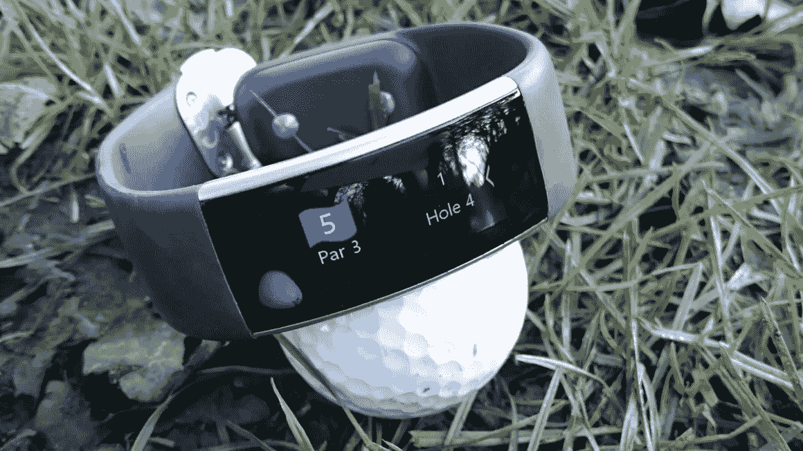
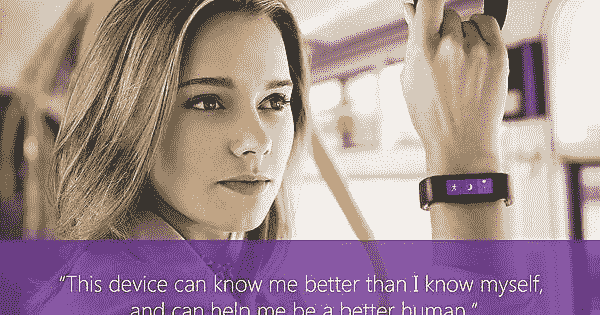
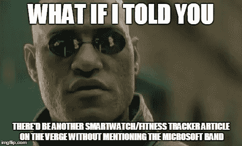

# 为什么微软实际上在手表上失败了？

> 原文：<https://levelup.gitconnected.com/why-microsoft-actually-failed-in-watches-5a5913adde2b>

## 这对微软来说是一个巨大的机会，但他们错过了这个市场…

> 简而言之，让我们学习如何不使可穿戴

这不是开玩笑。当微软宣布他们将推出自己的手表产品线时，每个人的反应都很积极，准备亲自尝试一下。微软在他们将要做的手表上也有很好的声誉(当时)。这应该暗示了一个事实，微软绝对不是不走运的。它得到了它的机会……嗯……它只是没有被认真对待。也正因为如此，微软在手表方面还是以信任度较低著称。

我决定研究一下他们到底做错了什么。哦，男孩，我今天为你得到了一些分数…让我们在你睡觉前开始吧。

# 他们是怎么开始的？

这是他们的第一个产品，是“一个可以普遍佩戴的东西”，我说的是手表。虽然早在 2012 年就看到了该产品正在计划中的迹象，但直到 2014 年才正式向任何人宣布。

2014 年 10 月，微软发布了第一个模型预览，并宣布了他们的计划。它的特色和其他乐队一样好。心率监测器、陀螺仪(不管是什么意思)、GPS、麦克风等等。它拥有它需要的一切，然而…它失败了。

它甚至宣布了“Band Store ”,这是一个微软 bands 的应用程序商店，出于某种原因，官方仍然可以下载。对微软来说，这肯定是一条容易的路，对吗？然而……购买者的数量并不多(至少与它的实际竞争对手相比，比如吃了一半的水果和彩虹色的 G)。这当然是一个巨大的损失。当我说损失时，我的意思是它甚至比苹果手表的一半都要少，而实际上它应该是相反的。但这并没有结束。

2015 年，微软用一个宏大的计划公布了它的新产品。我会在这里链接这个程序，但你不必观看就能得到它(不是从微软官方)。这相当令人生厌，而且……只能说是非技术性的。这是一个女人，她似乎记住了她的剧本，不带任何感情地说出来，就像我的朋友 Siri 一样。我认为这是公司的一大成功，我稍后会谈到这一点。

也有一个微软乐队发布 3，但它几乎没有售出，并有很多仇恨堆积。

在这一点上，人们知道它是如何进行的。来自 YouTubers 的真实而诚实的评论、对乐队本身的批评和文章，以及微软过去的错误(对 Windows 8 的仇恨，因为乐队对软件遵循相同的步骤)，所有这些结合起来，创造了一个巨大的雪球效应，从而最终宣布了微软乐队的停产。

最近有一些泄露的关于微软重新继续这一产品的讨论(虽然我不知道这有多少是真的)，但如果这种情况发生，我会向你所说的任何慈善机构捐赠 500 美元。我这么说是因为我几乎可以肯定，微软在这一点上已经结束了手表市场。

## 不过，它也有一些积极的方面

微软乐队可以说是第一个提供下载第三方定制训练的乐队。此外，微软健康软件相当独特，有一个很好的用户界面。

# 那么…哪里出了问题？？？

嗯，一切

## 不舒服的设计

尽管微软不同意这一点，但据报道，作为一款可穿戴设备，它的设计结构非常糟糕。

有报道称表带脱落，主表壳太重，因此很难保持在手腕顶部并向另一个方向旋转。此外，微软所说的“平滑圆曲线”并不是所有手腕的最佳 cyrbature 半径，这使得它不适合较大的书写。

## 高尔夫！？

> 我们致力于为日常运动员提供技术驱动的见解，无论你从事什么运动，包括高尔夫——微软

因此，微软这次在第二版中实现了一个非常独特的功能。微软高尔夫……当然它帮助每一个运动员，不管你玩什么运动，对吗？

当你打高尔夫球时，它提供击球检测(没有双关语的意思)，当你靠近发球台时，它检测(我甚至不知道那是什么)。

我发现的问题是，即使这对高尔夫球员有帮助，对其他人来说也没用。我的意思是…我明白，你需要有独特的东西来卖它，但在这一点上，卖点应该足够有用，以实际销售它。简而言之，它有人们不想要的特征。

## 演讲…

就我个人而言，如果我正在购买一个新发布的产品，我可能会看一下发布视频(如果有的话)。在这种情况下，我认为事情就是这样。

这个公告太专业了，令人厌烦，这是可以理解的。他们添加的小双关语是为了搞笑，但是你可能会注意到没有人笑它，因为它一点也不好笑。不要误会我的意思，这些观点都提出来了，但我不认为这是一个好的第一印象。至少可以说，新产品的公告是…苍白无力的。我的意思是…至少和苹果的声明相比，苹果的声明同样无聊，但是有一些信息和能量，至少这是我的观点。

## 功能

这是最大的一块。没有什么让微软乐队脱颖而出，并驱使人们购买它。苹果、三星和其他手表已经在市场上，微软决定什么都不做，试图赢得可穿戴技术市场，当然，这并没有奏效。不…我不认为“高尔夫”功能是独一无二的，因为它对几乎所有不打高尔夫的人来说几乎没有用武之地。

简而言之，没有什么比苹果或其他竞争对手更能让人们购买它了。此外，他们真的没有目标受众。虽然他们在软件部分专注于体育，但设计和市场都面向普通观众(不像苹果专注于 iPhone 用户的一个非常小众的群体)。

## 还有更多…

正如你所猜测的，还有更多的错误，导致了最终的衰落和产品的停产。UI 采用了 Windows 8 的设计，相比你知道的 7 或者 XP 已经被很多人讨厌了。

据报道，当涉及到关于你身体的数据时，设备不是最准确的，气压计只是说了关于环境的非常有限的数据。当然，与 MacOS 和 Apple watch 不同，微软 band 和 Windows 有一个糟糕的生态系统和集成，并且没有像与其他微软产品那样连接起来，以提供一种“优质生态系统的感觉”。

我会在 YouTube 和 Medium 上制作更多关于这个的视频/文章。也就是说，希望你们喜欢读这篇文章，并且…我会在下一篇文章中与你们见面。

**你真棒:)**

> 法丁吉克