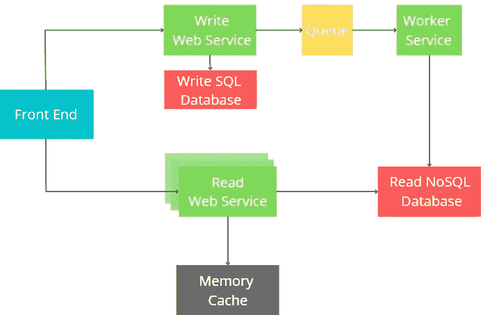

# 为什么缺失非功能性需求会是一场灾难？

> 原文：<https://levelup.gitconnected.com/why-missing-non-functional-requirements-can-be-a-disaster-b0b8028acca1>

## 架构师、领导和开发人员应该真正关心的事情。

[廷杰伤害律师事务所](https://unsplash.com/@tingeyinjurylawfirm?utm_source=medium&utm_medium=referral)在 [Unsplash](https://unsplash.com?utm_source=medium&utm_medium=referral) 上的照片

今天，我们将讨论功能性需求和非功能性需求之间的重要区别，以及为什么从架构师到开发人员，每个技术人员都应该关注非功能性需求。

# 功能需求与非功能需求

大概每一个复杂的软件产品都是实现**功能**和**非功能**(有时也称为**跨功能**或**非行为**需求)的结果。

为了弄清楚功能性需求和非功能性需求的区别，让我们假设我们是要从头开始设计和实现 Instagram 的开发人员。下面是一些高级功能需求的样子:

*   用户可以上传照片。
*   用户可以关注其他用户。
*   用户可以向其他用户发送私人消息。
*   用户可以看到包含其他用户照片的新闻源。

下面是一些可能的非功能性需求:

*   新闻提要的生成平均需要 500 毫秒，在最坏的情况下，不会超过 1 秒。
*   用户上传的照片绝不能丢失(系统的可靠性)。
*   系统的可用性为 99.99%。

从 Instagram 示例中可以看出，功能性需求描述了**系统应该做什么**，而非功能性需求定义了**系统应该如何表现**。

功能性需求和非功能性需求之间的其他重要区别是:

*   如果只实现了功能需求，系统就可以工作。通常一些简单的产品或者 PoC 不关心非功能性需求。没有功能需求就不能实现非功能需求。
*   与非功能性需求不同，功能性需求很容易达成一致。比如很容易约定 Instagram 用户可以上传照片(功能性需求)，但是如何快速约定可用性百分比(非功能性):99.99%？，为什么不是 99.95%呢？
*   功能需求被记录为系统的*用例*，非功能需求被记录为*质量属性*。
*   业务分析师负责功能需求的引出和文档化。软件架构师(以及部分领导和每个开发人员)负责非功能性需求的引出和文档化。
*   从技术角度来看，最重要的区别是非功能性需求会影响架构，而功能性需求不会。

# 功能需求和架构

让我们记住可能最简单的应用程序架构，它是一个 **3 层架构:**

事实是，最简单的 3 层架构可以实现任意数量的非常复杂的功能需求*(insta gram 的所有功能需求都可以使用 3-* 层*架构实现)。一个数据库实例可能有数百个表，一个代码库可能包含数十万行代码。当然，随着新功能的引入，这种整体系统的可维护性可能会降低。*

*然而，如果三层架构结构合理，并且代码质量保持在一个良好的水平，它将成功地实现功能需求。实现新特性基本上需要创建新的数据库表、扩展域模型、编写新的业务规则和一些其他辅助代码。*

> *主要结论是**当只涉及到功能需求的实现时，软件架构和系统设计并不重要。***

*简单吧？*

# *非功能性需求和架构*

*当涉及到实现非功能性需求时，架构可能非常重要。如果不对系统架构或设计进行重大更改，一些非功能性需求就无法实现。*

*如前所述，3 层架构可以成功实现客户提供的所有功能需求。假设三层系统已经实现并投入生产:*

**

*但是现在有了一个新的非功能性需求，这是以前没有考虑到的:*对于 5000 个并发用户，所有 GET 端点平均需要 500ms，最坏情况下不超过 1s。**

*在这种情况下，开发人员当然可以通过优化数据库查询、实现内存缓存、减少托管堆分配和其他优化来实现目标。然而，最有可能的是，在大型整体系统中，这些简单的步骤不会有所帮助。*

*实现如此强大的非功能性需求可能需要重新设计系统(这对于生产系统来说可能是一场噩梦)，例如在架构级别实现 CQRS 模式，这还将包括扩展读取服务、拥有单独的缓存实例和其他复杂的东西:*

**

***如果在需求收集和设计阶段完全忽略了一些非功能性需求，如性能、可用性、可靠性**，软件系统 **可能需要重新架构。此外，即使所有的非功能性需求已经被尽早捕获，关注数字也是非常重要的。例如，**实现一个具有 99.9%可用性和 99.95%可用性的系统可能需要两种不同的架构**。此外，以 99.95%为目标将招致云提供商更高的账单。***

*   *系统真的需要 99.95%的可用性吗？这个数字背后的逻辑是什么？为什么 99.9%还不够？*
*   *每个 GET 端点真的必须在 500ms 后响应吗？这个数字背后的逻辑是什么？也许只有一个 GET 端点应该在 500ms 后返回数据？*
*   *…*

*及时地问这些问题和更多的问题可以为你的团队节省很多精力，为你的客户节省很多钱。*

# *为什么开发人员应该关心非功能性需求？*

*非功能性需求也是技术领导者和开发人员所关注的，而不仅仅是架构师。*

*当开发人员得到一个要处理的故事时，非功能性需求可能根本不会被提及。*

*例如，故事可能是关于用一些新的业务逻辑和新的数据库表实现新的 API 端点。如果一个非功能性的需求，比如最大 API 响应时间 300 毫秒，在故事中没有提到，也没有人事先澄清过，开发者可以使用低效的算法，低效的数据库模式，没有缓存等等。只为满足功能需求，尽快把故事传递给 QA。*

*稍后，当 QA 工程师或客户看到实际的响应时间时，将有返工的风险。因此，开发人员或技术负责人只能提一个问题，*“这个 API 的平均/最大响应时间应该是多少？”*提前可以帮助避免双重工作。*

# *关键要点*

*   *功能需求可以通过简单的架构来实现。新的功能需求不会影响系统架构。*
*   *非功能性需求会对系统架构产生重大影响。作为架构师，要确保在设计和实现系统之前，尽可能早地捕获重要的非功能性需求。*
*   *非功能性需求会对单个 web 服务或微服务、算法、数据结构的设计产生重大影响……作为技术领导者或开发人员，在继续实施之前，澄清非功能性需求，如性能、可伸缩性、吞吐量、互操作性或故事，以避免未来可能的返工。*

*感谢阅读。如果你喜欢你所读到的，看看下面这个故事:*

* [## 面向技术领导者和资深人士的 50 个软件工程最佳实践

### 最佳工程师的最佳实践。

levelup.gitconnected.com](/50-software-engineering-best-practices-for-technical-leaders-and-seniors-cfcdf6a17e44) 

还有，考虑成为[中等会员](https://esashamathews.medium.com/membership)。* 

# *分级编码*

*感谢您成为我们社区的一员！在你离开之前:*

*   *👏为故事鼓掌，跟着作者走👉*
*   *📰更多内容请查看[升级编码刊物](https://levelup.gitconnected.com/?utm_source=pub&utm_medium=post)*
*   *🔔关注我们:[推特](https://twitter.com/gitconnected) | [LinkedIn](https://www.linkedin.com/company/gitconnected) | [时事通讯](https://newsletter.levelup.dev)*

*🚀👉 [**加入升级人才集体，找到一份神奇的工作**](https://jobs.levelup.dev/talent/welcome?referral=true)*