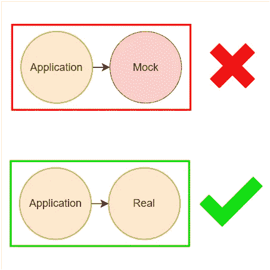
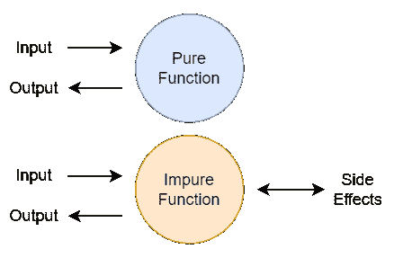
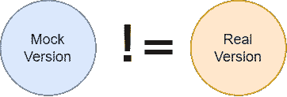
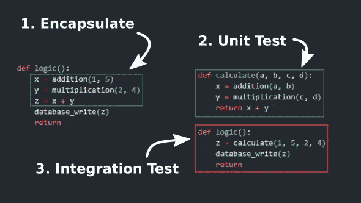
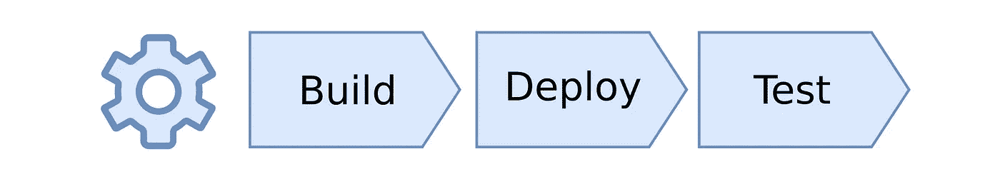

# 为什么嘲笑被认为有害

> 原文：<https://levelup.gitconnected.com/why-mocks-are-considered-harmful-b4e8fe60478d>

软件开发过程中的自动化测试涉及到许多不同的技术，其中一个不应该使用的是 mocking。嘲笑往好里说是分散注意力，往坏里说是提供虚假的自信。

被认为有害的模仿

# **什么是嘲讽？**

软件开发人员通常使用 mocks 来模拟对其他服务的网络调用或数据库访问的代码行为。这使得单元测试可以同时运行:

*   快速，因为他们不需要依赖额外的服务。
*   稳定，因为它们避免了可用性问题。

这意味着模拟通常用于有**副作用的代码，**是依赖或修改其参数之外的东西的代码。这使我们可以将函数分类为:

*   **纯粹:**没有任何副作用的功能。
*   **不纯:**包含一个或多个副作用的函数。

纯函数与不纯函数

# 模仿的问题

**模拟并不等同于它们所取代的集成。** 如果你模仿一个数据库客户端，那么你还没有测试与真实客户端的集成。这意味着您的代码可以与 mock 一起工作，但您仍然需要进行集成测试，以确保它在没有 mock 的情况下也能工作。

**特性奇偶校验不可行。如果你做了一个快速模仿，那么它不会返回有用的数据。你花在改进模拟上的时间越多，数据就越有用。然而，它永远不可能是真实的表现。**

不使用的模仿是浪费时间和精力。如果你模仿了一个数据库客户端并且没有使用它，那么模仿它是没有意义的。如果某些代码需要有效的配置来初始化，但没有使用它，就会发生这种情况。

模拟不等同于

# 我们如何取代模仿？

模拟是用来提供速度和稳定性的，但我们可以用其他方式来管理它。

**重构你的代码！我们可以通过分离纯函数和不纯函数来取代对模拟的需求。纯函数可以在没有模拟的情况下进行单元测试，而不纯函数只能进行集成测试。**

代码重构示例

**提高你的自动化水平！通过自动化软件打包、部署和测试，我们可以更快地关注集成测试，而不是依赖单元测试。这也使得连续交付成为可能，并且减少了“它在我的机器上工作”的影响，这在现代软件开发中是有益的。**

自动化构建、部署和测试

# 摘要

嘲笑是一个短期的解决方案，也是一个长期的问题。如果你想更快地交付软件，那么你应该花更少的时间在模拟上，花更多的时间在重构和自动化上。

如果你想看更多这样的内容，请跟我来。

让我知道你在推特**上的想法**ben@torvo.com.au