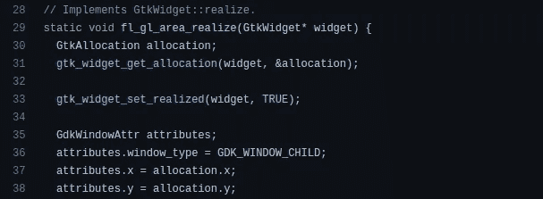
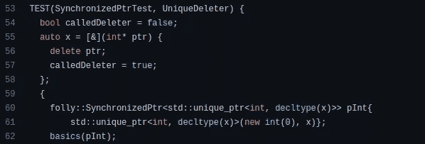
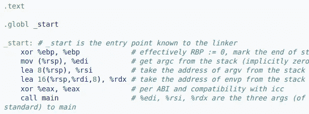

# 为什么现代替代语言从未取代 C/C++

> 原文：<https://levelup.gitconnected.com/why-modern-alternative-languages-never-replace-c-c-cbf0afc5f1dc>

## 成百上千的 C/C++替代品将会出现，但是 C/C++将会永远伴随着我们！

[克雷格·加纳](https://unsplash.com/@craiggarner?utm_source=unsplash&utm_medium=referral&utm_content=creditCopyText)在 [Unsplash](https://unsplash.com/collections/89063260/coding?utm_source=unsplash&utm_medium=referral&utm_content=creditCopyText) 上的照片，由 Canva 编辑

每个 CPU 都有一种叫做 ISA(指令集体系结构)汇编的电路语言。ISA 汇编是一种硬件语言，由基本数据操作、数学计算和结构化编程的操作组成(即`jmp`)。但是，为每个计算需求编写汇编代码无疑是耗时的，因此过去的程序员发明了对人类友好的语言和编译器。

计算机科学家先驱 Dennis Ritchie 为 Unix 操作系统开发需求实现了 C 编程语言。在这个时期，整个计算机技术领域正在初始化其基础，因此几乎所有的程序员都使用 C 来构建早期的计算程序，如编译器、操作系统、数据库软件和网络程序。后来 C++扩展了 C，通过保持 C 的性能因素，诞生了更多开发者特性的新编程语言。

在 20 年代，程序员实现了 C/C++的替代品，如 Go、D、Rust 和 Carbon，它们具有 C/C++从未提供的各种特性。由于以下原因，这些语言仍然作为 C/C++的替代品而不是替代物进行竞争:

# C 和 C++是基础语言

如果我们找到今天拯救我们生命的每一个计算机程序的诞生，我们最终会找到 C 或 C++。想想你现在在做什么。你可能会在谷歌 Chrome 上读到这个故事 Chromium 开源浏览器(Blink rendering engine，V8 和浏览器应用)是用 C++编写的。假设你在 GNU/Linux 上运行 Chrome——Linux 内核是用 C 写的，最流行的关系数据库管理系统 MySQL 是用 C/C++写的。所有流行的操作系统都为内核函数提供了核心 C 或 C++ API。

即使存在稳定的 C/C++替代方案，许多程序员仍然更喜欢用 C 或 C++进行系统编程。在大多数情况下，程序员选择 C++是因为它是与操作系统级 API 交流的最佳语言。比如 Google 用 C++写的[颤振引擎](https://github.com/flutter/engine):

颤振引擎使用 C/C++为使用 GTK 库函数，由作者截图

几十年来，计算领域的大多数核心组件都使用 C/C++作为实现语言，C/C++语言在很长一段时间内都在维护语言语法的标准。培养 C/C++的替代者就像在所有的建筑工程完成后更换房子的地基一样。

# C 和 C++完全控制我们写的东西

在编写源代码时，C/C++提供了如你所愿处理程序资源的自由。例如，C/C++允许您直接分配/释放物理内存来存储数据元素。C/C++提供了一种处理本机操作系统级线程的方法，而不是像 Go 那样管理单独的并发运行时。C/C++不提供自动内存管理(垃圾收集)功能，所以程序员应该小心有效地防止内存泄漏。查看 Meta 的 Folly 库源代码如何实现手动内存管理策略:

Meta 的 [Folly 库](https://github.com/facebook/folly/blob/b72a70a35ada45ac286eb60028c0ecf5f6725665/folly/test/SynchronizedPtrTest.cpp#L53)使用手动内存管理特性，作者截图

自动内存管理和对内存处理的限制无疑是使语言更加现代、高效和抽象的好方法——但是这些特性会增加语言运行时的性能开销，减少程序员的自由。

C 和 C++不限制内存访问，提供手动内存管理操作，通过让程序员随心所欲地控制程序，给了程序员自由。当你用 C/C++写程序时，你的源代码会有效地执行你的指令——除此之外别无其他。

# C 和 C++确实快速高效

一个特定程序的效率取决于两个主要因素:程序员使用的算法的[时间复杂度](/5-things-to-know-before-you-write-optimized-code-3ca424110db1)和二进制程序的效率。我们无疑可以控制算法的复杂性，因为我们可以通过更新源代码来改变它们。另一方面，编译器产生二进制文件，所以我们没有简单的方法从这方面提高效率。

但是，我们可以选择一个编译器来生成快速有效的二进制文件。GNU C 编译器生成特定于平台的二进制文件，而不嵌入专用的运行时环境。C 编程执行模型使用在 [crt0](https://en.wikipedia.org/wiki/Crt0) 汇编指令段中定义的最小启动代码。查看 Linux 上的以下示例 crt0 部分:

C 中 main 函数之前执行的启动代码，作者截图

C++无疑是一种复杂的语言，但它不像 Python 和 Golang 那样提供更高的抽象。此外，它还为您提供了一种使用首选标准语言版本(即 C++14)进行编译的方法——因此您可以只使用 C++的最少功能，因为现代 C++具有复杂的 C++开发功能。C++已经有三十多年的历史了，从早期的计算时代就开始优化它的性能。

# C 和 C++是对学术友好的语言

程序员通常在职业生涯的不同阶段开始编程。一些程序员在他们上学的年龄用他们的第一台计算机设备学习编程。然而，大多数程序员在大学学习期间提高了他们的编程技能。幸运的是，几乎所有的大学都是通过给学生一个机会来学习计算机程序如何与硬件组件一起工作，从而开始教授 C 语言编程。我写了下面这篇文章来进一步解释计算机程序如何与硬件连接:

 [## 写优化代码前要知道的 5 件事

### 这些事实有助于你用优化的代码打动硬件和程序员。

levelup.gitconnected.com](/5-things-to-know-before-you-write-optimized-code-3ca424110db1) 

后来，大多数大学用 C++教授数据结构和算法基础，而不使用 C++的复杂部分。大学生通常在学习算法相关课程后进入竞争性编程领域。大多数有竞争力的程序员更喜欢 C++，因为它速度快，内置的数据结构可用，语法简单。

Rust 无疑是一种具有内存安全、性能和内置特性的好语言，但 rust 的语法对于第一次编写代码的开发人员来说并不友好。对于工业目的来说，Go 是一种很好的语言，在这种情况下，您的团队需要类似 C 的最小效率代码和类似 Python 的开发环境。但是，对于学术用途来说，Go 的抽象性太弱，与传统的伪代码不匹配，所以学术教师永远不会用 Go 来代替 C/C++。

下面的故事解释了为什么每个程序员都应该用 C 开始编程:

 [## 为什么每个开发人员都应该从 C 开始编程

### 你可以用任何语言开始编程——但是用 C 开始有更多的好处！

shalithasuranga.medium.com](https://shalithasuranga.medium.com/why-every-developer-should-start-programming-with-c-39b3a87392bf) 

# 现代的替代方案仍然需要 C，并且它们关注不同的目标

如前所述，所有 POSIX 操作系统和非 POSIX 操作系统(即 Windows)都提供了一个 C 库来处理内核操作，所以从 C/C++调用内核特性很容易，因为我们不需要编写特定于语言的绑定或第三方包装。一些操作系统甚至预先包含了 GNU C/C++编译器和调试器来激励 C/C++开发。如果我们使用 Rust 和 Go，我们需要特定于语言的第三方绑定来与操作系统 API 通信。现代替代语言仍然提供调用 C 代码的方法。比如 Go 为你提供了 [Cgo](https://go.dev/blog/cgo) 特性来调用 C 代码。

几乎所有的 C/C++替代品都努力用与 C++非常不同的语言语法来提供 C++所缺少的特性。如果一个程序员在寻找 C/C++的替代品，他们通常会期望一个平稳且耗时较少的迁移过程。此外，他们不期望学习一门新语言来为他们不喜欢的 C/C++特性找到解决方案。

程序员为低级编程用例设计和改进了 C，而且没有专门针对 C 目标的现代语言。C++使 C 语言更具未来感，从低级编程阶段提升了。Rust、Go、D 和 Carbon 是 C/C++的替代品——不是替代品，这些替代品都有自己的未来目标。

下面的故事解释了为什么每个程序员在职业生涯中都需要学习 C++语言:

 [## 为什么每个程序员都应该在职业生涯中学习 C++

### 掌握 C++不是一件容易的事情，但是一旦你做到了——你将会得到无价的好处

levelup.gitconnected.com](/why-every-programmer-should-learn-c-during-their-careers-959e1bc2ea68) 

# 结论

过去的程序员在 C/C++进化时期书写了我们的计算机历史。他们用 C 和 C++构建了操作系统内核、编程语言、数据库系统、移动操作系统和网络软件。多亏了 C/C++，今天几乎所有的现代 web 服务都可以工作。例如，最流行的 web 服务器软件，如 Apache HTTP 和 Nginx，使用 C/C++作为实现语言。过去的程序员几乎用 C/C++编写了所有流行的内部 web 浏览器和网络软件组件。Web 开发人员喜欢为 web 服务选择 Java 和 Node.js，但是 Java 和 Node.js 都是因为 C/C++才出现的。

一些程序员认为 Rust、 [Go](https://betterprogramming.pub/6-go-use-cases-which-are-good-to-know-a57ab99440ce) 、D 和 Carbon 等流行语言是 C/C++的替代品。与此同时，一些程序员考虑使用这些语言作为 C/C++的替代品，在未来可能会取代 C/C++。这些现代语言是为特定的目的和需求而设计的，并不是要取代 C/C++。

微软创造了 TypeScript，但我们仍然使用 JavaScript。Jetbrains 创造了 Kotlin，但我们仍然使用 Java。成百上千的 C/C++替代品出现了，但是程序员仍然会使用 C/C++，因为重写面向 C/C++的计算机历史是不现实的。这并不意味着 C 和 C++是最好的语言——替代语言可能在某些方面比 C/C++表现得更好(例如，复杂性、内存安全等)。)—但是他们不能进入 C/C++的领域，因为过去的程序员用 C 和 C++写了整个现代计算机历史。

感谢阅读。

# 分级编码

感谢您成为我们社区的一员！在你离开之前:

*   👏为故事鼓掌，跟着作者走👉
*   📰更多内容请查看[升级编码刊物](https://levelup.gitconnected.com/?utm_source=pub&utm_medium=post)
*   🔔关注我们:[Twitter](https://twitter.com/gitconnected)|[LinkedIn](https://www.linkedin.com/company/gitconnected)|[时事通讯](https://newsletter.levelup.dev)

🚀👉 [**加入升级达人集体，找到一份惊艳的工作**](https://jobs.levelup.dev/talent/welcome?referral=true)