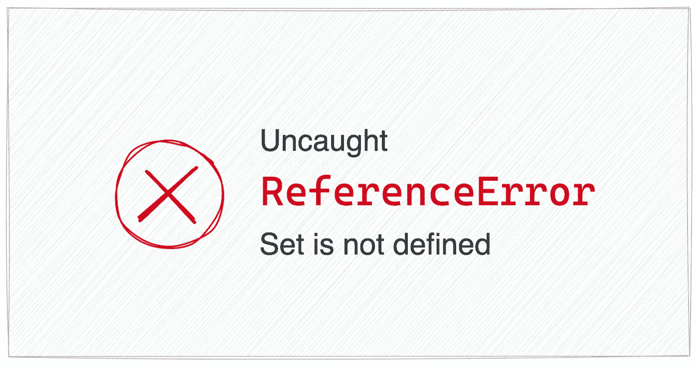
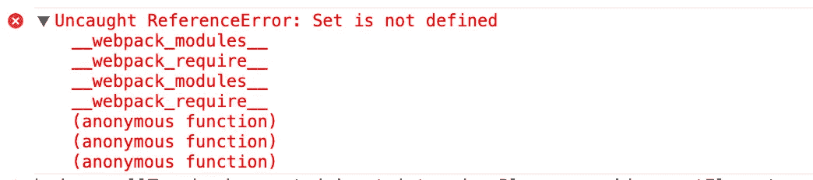
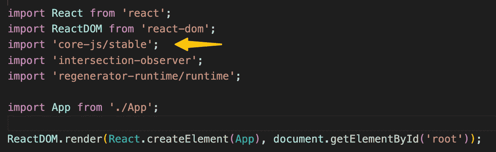
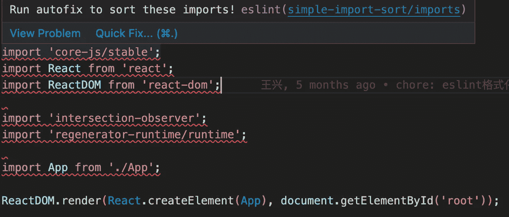
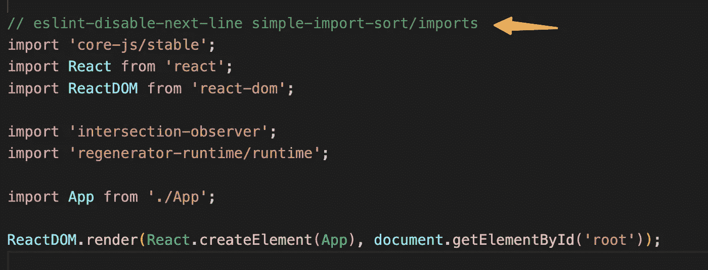

# 为什么我的 React 项目因引用错误而崩溃

> 原文：<https://levelup.gitconnected.com/why-my-react-project-crashed-with-referenceerror-198c3edfb737>

## 使用 babel 但仍有引用错误:未定义集合



# 介绍

那是一个悲伤的夜晚，刚刚下班，有人报告说我开发的项目会在一些旧的 Android 手机上崩溃。通过`[adb](https://developer.android.com/studio/command-line/adb)`远程调试，我发现了页面崩溃的原因:



不支持的集合崩溃

这让我很困惑，我在我的项目中使用了 babel，并且在入口文件中手动导入了 [core-js](https://www.npmjs.com/package/core-js) 。



我的 React 项目的入口文件

# 未定义集合的原因

生产环境的代码是压缩的，不容易调试问题，我修改了 [Webpack](https://webpack.js.org/configuration/optimization/#optimizationminimize) 的配置，关闭了代码最小化。然后在测试环境中部署代码。

经过调试，我发现在`react-dom`中使用了`Set`，但是`Set`还没有多填充。这个有点超出我的理解，`Set`是一个构造函数，应该被吊起来，不应该是未定义的。

想了一会，还是想不明白，只能看`[core-js](https://github.com/zloirock/core-js)` polyfill `Set`怎么填。


聚合填充的步骤

在`core-js`的源代码中，我们可以发现它使用`Object.defineProperty`添加全局变量，所以**多填充变量没有被提升**。并且`react-dom`在`core-js`之前执行，polyfill 还没有初始化，所以 JavaScript 会抛出错误。

# 解决方案

我们知道代码执行顺序导致了这个异常，我们只需要调整导入的顺序。在我的项目中，我使用[eslint-plugin-simple-import-sort—NPM(npmjs.com)](https://www.npmjs.com/package/eslint-plugin-simple-import-sort)，如果先导入`core-js`，会出现错误:



我们可以通过保存而不格式化文件来忽略错误，或者只禁用此行的规则(单击快速修复可以自动添加):



另一种方法是修改 Webpack 配置，我们可以在导入`core-js`的地方创建一个新的 polyfill 文件，然后添加到[条目](https://webpack.js.org/concepts/#entry):

```
{
    entry: ['./polyfill.js', './index.js'],
    output: {filename: 'bundle.js'}
}
```

# 结论

当我们需要聚合填充代码时，需要注意 npm 模块的顺序。否则，尽管我们使用了`core-js`，页面仍然会因为不支持 ES6 语法而崩溃。

感谢阅读，希望你写的代码没有这样的错误

# 分级编码

感谢您成为我们社区的一员！在你离开之前:

*   👏为故事鼓掌，跟着作者走👉
*   📰查看更多内容请参见[升级编码刊物](https://levelup.gitconnected.com/?utm_source=pub&utm_medium=post)
*   🔔关注我们:[Twitter](https://twitter.com/gitconnected)|[LinkedIn](https://www.linkedin.com/company/gitconnected)|[时事通讯](https://newsletter.levelup.dev)

🚀👉 [**加入升级人才集体，找到一份神奇的工作**](https://jobs.levelup.dev/talent/welcome?referral=true)