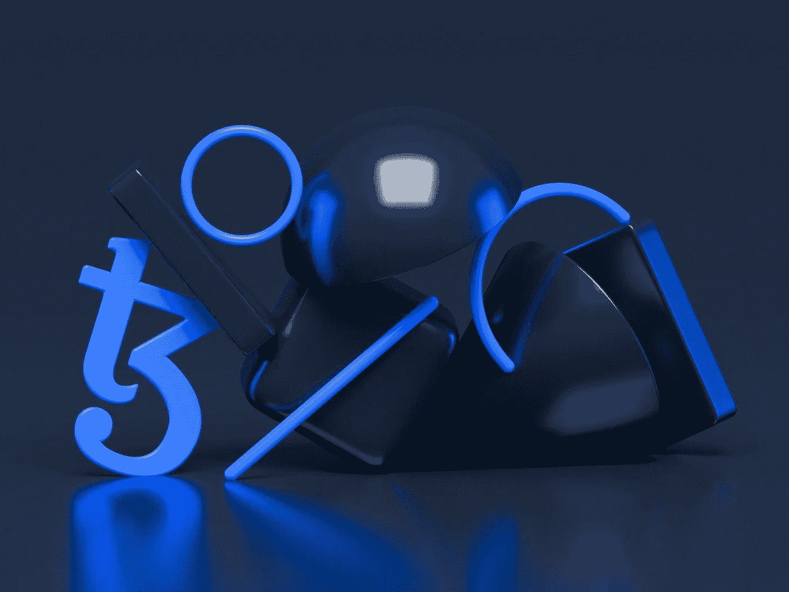
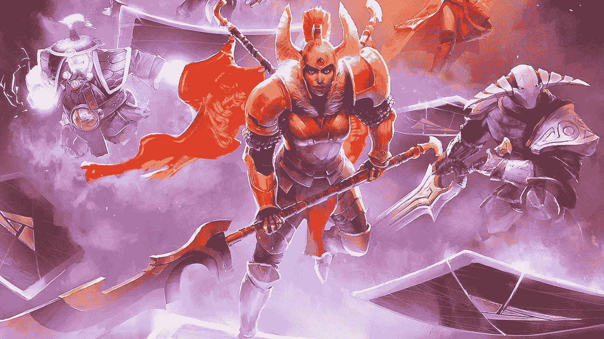
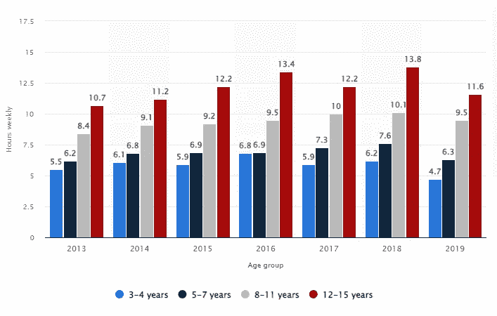

# 为什么 NFT 进入游戏领域以及他们的未来

> 原文：<https://levelup.gitconnected.com/why-nfts-are-moving-into-the-gaming-arena-and-their-future-79baa4ef71cf>

与比特币等传统加密货币不同，NFT 扰乱游戏的潜力最近被讨论了很多。[NFT 正在](/nfts-explained-what-they-are-how-they-work-and-their-future-8808937d92b3)开始进入游戏开发领域，社区和游戏开发者向他们伸出援手，以便参与其中并进行创新。

NFT 是表示特定资产的令牌。它们可以是任何东西，从游戏中的物品到通行证。然而，使用 NFT 的游戏有一些共同点:游戏中的物品通常是可交易的，可以用任何其他可交易的商品或加密货币进行买卖，如[比特币](/back-to-the-bull-market-how-high-can-bitcoin-go-in-2021-after-smashing-all-time-high-c701c55d8da2)。

(图片来源: [PCGamesN](https://www.pcgamesn.com/artifact/nft-games-future-artifact) )

游戏行业严重依赖微交易，许多游戏很早就采用了这种商业模式。游戏内购买(IAP )在游戏社区中变得流行起来，游戏玩家在这些 IAP 上花费了大量的金钱。游戏中的物品通常可以互相交易，并且有一个围绕特定物品建立的市场。

NFTs 不拥有任何作品。相反，它们是一种资产，可以随时交易，供所有者使用。最近，许多新游戏都采用了这种模式，Steam 上的一些顶级游戏已经实现了[NFT 作为游戏内资产](https://zipmex.com/learn/nfts-in-gaming-industry/#:~:text=Day%20in%20and%20day%20out,authentication%20created%20by%20blockchain%20technology.)。最近，Valve 与发行商完美世界娱乐公司(Perfect World Entertainment)合作，推出了第一款区块链官方游戏:DOTA，名称为 DOTA 2。为了玩这个游戏，你需要从 Steam 社区市场获得 DOTA 2 的化妆品皮肤，这需要花费一定数量的密码或“Steam 币”。

这些皮肤变得非常受欢迎，许多人试图收集它们，因为它们可以在 [Steam 社区市场](https://steamcommunity.com/market/)上出售，以换取其加密货币等价物。已经售出的最贵的皮肤售价高达 11 万美元。

将 NFT 作为游戏内资产的游戏越来越受欢迎，因为它们能够将特定资产的所有权交给玩家自己。Valve 的 DOTA 2 游戏是一个很好的例子，因为如果你是一个伟大的玩家，并且在游戏中有少量皮肤，你可以出售这些皮肤来换取比特币或 Steam 的货币。这给了该特定物品的所有者一个附加的货币价值，他们可以使用或交易以获得自己的利益。

NFTs 在游戏行业越来越受欢迎的另一个原因是加密货币和区块链技术允许游戏玩家在玩游戏的同时赚钱。随着[游戏中的微交易](https://www.intelligenteconomist.com/microtransactions/#:~:text=Microtransactions%20are%20in%2Dgame%20purchases,%2499%20(possibly%20even%20more).)在游戏玩家中变得越来越受欢迎，许多新公司和初创公司，如 Game Machine，正在获得行业内的兴趣，因为他们试图为这个即将到来的游戏行业创造新的收入来源。

游戏机是一个区块链平台，允许游戏玩家通过使用加密货币的[在玩游戏的同时赚钱。这种游戏中的货币可以在现实世界中使用，他们可以参与联盟营销或购买商品&服务，如礼品卡。](/3-essential-ways-to-keeping-your-crypto-safe-throughout-the-bull-market-9e938313df50)

这个创新的想法是希望通过让玩家在玩游戏的同时赚钱来为他们提供一种新的游戏体验。通过在智能设备如[手机](https://www.smartphonechecker.co.uk/phones)和[平板电脑](https://uk.pcmag.com/tablets/10395/the-best-tablets)上参与游戏内挑战，这些游戏的玩家可以获得游戏机本地货币 GMC 代币的奖励。

(图片来自 [Statista](https://www.statista.com/statistics/274434/time-spent-gaming-weekly-among-children-in-the-uk-by-age/) 展示了 2013-2019 年英国人每周花在游戏上的时间)

这场新的游戏革命给开发者和游戏玩家带来了巨大的好处。大多数游戏开发商都在寻找新的方法来从他们的游戏中获得收入，Game Machine 有望成为游戏中第一个真正实现 NFTs 的产品。这一革命性概念背后的想法是，加密货币是一种全球货币，每个人都可以使用，而不仅仅是世界上的游戏玩家。

这个区块链平台的全球性意味着世界上任何地方的玩家都可以在玩游戏的同时参与并赚钱。此外，游戏机可以让各种游戏的开发者能够创建他们自己独特的基于加密货币的游戏提供奖励，然后可以在现实世界的商品上花费，这将在这一创新的新概念中为货币化和奖励系统创造无限的可能性。

一边玩游戏一边赚钱的能力将会在游戏社区大受欢迎。随着游戏行业内大量微交易的发生，能够提供一种独特的货币奖励系统，然后可以用于其他商品和服务的想法将吸引每个人的注意力和兴趣。

总的来说，[游戏产业](https://medium.com/gitconnected/video-game-stocks-battle-it-out-to-become-the-stars-of-the-metaverse-fa7ee342d824)是被区块链技术改变的最大产业之一，而 [NFTs](/how-to-create-an-interactive-nft-4aeeed979138) 只是这一创新概念如何被应用的一个例子。游戏是一个重要的行业，90%的游戏玩家每天至少花一个小时玩他们最喜欢的游戏。创造革命性的新游戏赚钱方式将是游戏社区非常流行的概念。