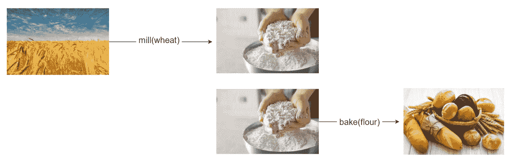
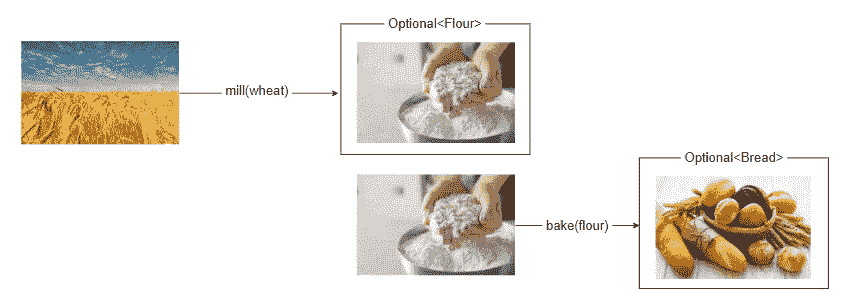
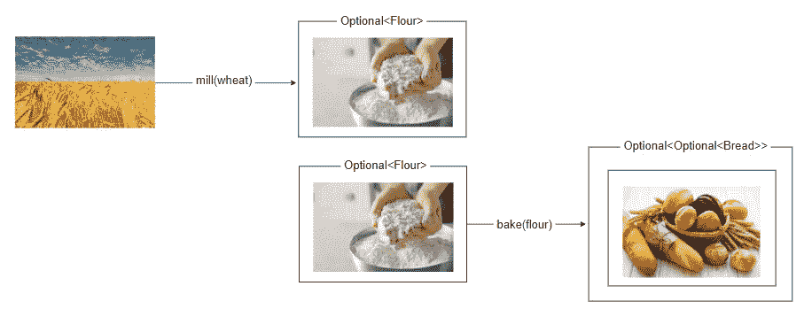

# 为什么 Optional <>是一个单子，为什么 f()我应该关心？

> 原文：<https://levelup.gitconnected.com/why-optional-is-a-monad-and-why-the-f-should-i-care-dc5ba9b3d9e1>

## 请按预期方式使用可选的<>！


请按预期方式使用可选的<>！—照片由[扎克里·卡道夫](https://unsplash.com/@zacharykadolph?utm_source=medium&utm_medium=referral)在 [Unsplash](https://unsplash.com?utm_source=medium&utm_medium=referral) 拍摄

## 1.概观

首先，让我们看看对可选的*和*(以及一般的*单子*)的需求来自哪里。为此，我们先打个比方，想想做面包的过程。

*   首先，我们将通过碾磨小麦来制造面粉；
*   之后，我们会用上一步的面粉做面包；



我们可以使用函数用编程或数学术语来表达这一点:

```
flour = mill( wheat )
bread = bake( flour )
```

或者，我们可以像这样简单地组合这两个函数:

```
bread = bake( mill(wheat) )
```

## 2.角落里的箱子

不幸的是，处理的每一步都可能由于各种原因而失败。像这样编写函数时，错误处理可能会很麻烦。

例如，也许*小麦*并不总能成功加工成*面粉*，而*面粉*也不总能正确烘焙。

根据我们使用的编程语言和上下文，这可能会产生不同的效果——例如，可能会抛出异常，可能会返回 null..等等。

让我们假设，在我们的例子中，如果其中一个流程出了问题， *null* 被返回。

```
flour = mill( wheat )
if( flour != null ) {
   bread = bake( flour )
   if( bread != null ) {
     // .... do something()
   }
}
```

此时，由于空检查，我们不能再组合这些方法。

## 3.介绍单子

为了解决这个问题，我们可以将前面函数的结果包装到一个对象中，如果数据存在，该对象将继续处理，如果数据丢失，该对象将不做任何事情。这个包装器对象将是一个“ ***单子*** ”。

例如，我们可以想到一个*列表。*如果里面有元素，就按照下一步处理。另一方面，如果列表为空，则什么都不会发生。一个*列表*是单子。

不过，在这里使用一个*列表*并没有多大意义，因为我们希望一次只传递一个对象。

因此，我们可以构造自己的 monad 对象或使用现有的对象之一。有许多*单子*定义在具有函数特性的编程语言中。根据语言的不同，我们需要的单子可能被称为类似于*的东西，可能是< >* ，*或者是< >* ，或者是*可选的< >* 。


*可选单子的表现* — Java8 (2014)，彩色—照片由[艾米丽·莫特](https://unsplash.com/es/@emilymorter?utm_source=medium&utm_medium=referral)在 [Unsplash](https://unsplash.com?utm_source=medium&utm_medium=referral) 上拍摄

## 4.*贴图* () 和平面贴图()

让我们将我们的函数返回类型包装到*可选的< >* 中，并尝试返回函数组合:



我们现在将有一个新的问题:要组合或链接函数，每个函数都必须接收前一个函数的结果作为参数。

因此， *bake()* 函数必须接收一个*可选<面粉>* 而不是原料类型*面粉。*



但是，因为*烘焙*函数将结果包装成一个*可选< >* ，第二步的结果将被包装两次，第三步的结果将被包装三次..诸如此类。

解决这个问题的方法是 ***flatMap()*** 函数。**flat map()*的目的是在从一种类型转换到另一种类型时保持结构平整。*

*换句话说，我们可以在*单子*上使用以下约定:*

*   ***压平** : 单子<单子<单子【A】单子> > **→** 单子< A >*
*   ***贴图:**单子<A>→单子< B >*
*   ***平面图:**单子< A > **→** 单子<单子< B > > **→** 单子< B >*

## *5.函数式编程与面向对象编程*

> *组合函数与链接方法*

*我们现在已经将每一步的返回类型包装到一个单子中，这允许我们总是将结果传递给下一步。*

*但是应该怎么做呢？对此，我们有两种可能的解决方案。*

***5.1*。***f . p .方式(排版功能)*

*首先，我们可以让函数接收并返回单子:*

```
*public Optional<Flour> mill(Optional<Wheat> wheat) {
   // ...
}

public Optional<Bread> bake(Optional<Flour> flour) {
   // ...
}*
```

*这将允许我们以函数式编程风格来组合函数:*

```
*Optional<Bread> fpBread = bake( mill( harvest() ) );*
```

**

*O.O.P .开发人员如何看待函数式程序员——照片由 [Devin Avery](https://unsplash.com/@devintavery?utm_source=medium&utm_medium=referral) 在 [Unsplash](https://unsplash.com?utm_source=medium&utm_medium=referral) 上拍摄*

***5.2*。***o . o . p .方式(链接方式)*

*Java 是一种 O.O.P .语言，*可选的*对象本身公开了*映射*和*平面映射*方法*。*这意味着不需要将一个*可选的*对象作为参数传递——事实上，这被认为是一种代码味道和反模式*(下一节将详细介绍)*。*

*因此，我们应该使用原始类型作为方法参数:*

```
*public Optional<Flour> mill(Wheat wheat) {
   // ...
}

public Optional<Bread> bake(Flour flour) {
   // ...
}*
```

*并且链方法调用而不是组合函数，使用*可选*的 *map()* 和 *flatMap()* :*

```
*Optional<Bread> oopBread = harvest()
      .flatMap(wheat -> mill(wheat))
      .flatMap(flour -> bake(flour));*
```

**

*F.P .开发人员如何看待面向对象编程——图片由[弗拉德·萨尔古](https://unsplash.com/@vladsargu?utm_source=medium&utm_medium=referral)在 [Unsplash](https://unsplash.com?utm_source=medium&utm_medium=referral) 上拍摄*

## *6.结论——哪种面包更好？*

*当 F.P .特性被添加到像 Java 这样的 O.O.P .语言中时，它们中的一些没有按照预期的方式使用，这导致了代码味道和反模式。*

*以 Java 为例，一些开发人员和团队完全反对使用*可选的< >* 单子。比如这篇叫做 [*的热门文章，没有什么比可选的*](https://homes.cs.washington.edu/~mernst/advice/nothing-is-better-than-optional.html) *更好的了。**

*但是，如果我们阅读这篇文章并检查代码片段，我们可以看到大多数问题都是由于以一种意想不到的方式使用了可选的。*

*在我看来， *Optional* 应该作为 F.P. monad 使用，而不是作为空检查的 Java 实用类。因此，我觉得将它和空值检查进行比较有点不太合适。*

*我相信*可选的< >* 特性是对语言的一个很好的补充，但是它需要训练和对*单子*概念的一些理解。*

**

*Stop fighting and use the best of both worlds :)— Photo by [卡晨](https://unsplash.com/@awmleer?utm_source=medium&utm_medium=referral) on [Unsplash](https://unsplash.com?utm_source=medium&utm_medium=referral)*

*这篇文章的灵感来自于塞萨尔·创·洛扎伊在德沃克斯的演讲。我强烈推荐你查看一下，以获得更深入的解释:*

# *谢谢大家！*

*感谢你阅读这篇文章，请让我知道你的想法！欢迎任何反馈。*

*如果你想阅读更多关于干净的代码、设计、单元测试、函数式编程以及许多其他内容，请务必查看我的其他文章。*

*如果你喜欢我的内容，可以考虑[关注或者订阅](https://medium.com/@emanueltrandafir)邮件列表。*

*最后，如果你考虑成为一名中等会员并支持我的博客，这里是我的[推荐人](https://medium.com/@emanueltrandafir/membership)。*

*编码快乐！*