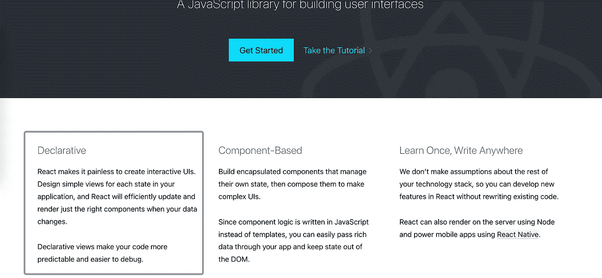
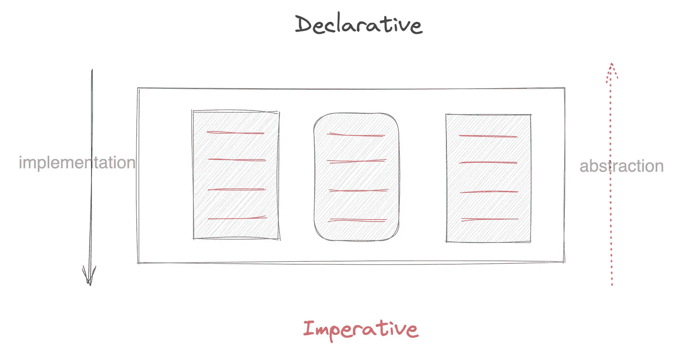

# 为什么 React 是声明性的

> 原文：<https://levelup.gitconnected.com/why-react-is-declarative-a300d1e930b7>

## 声明式和命令式的区别是什么


## 前言

每次打开 [React](https://reactjs.org/) 网站，都能看到 React 的介绍:



我们可以了解到，React 是**声明性的**，而**声明性的**可以使我们的代码更可预测，更易于调试。我喜欢使用 React，并且几乎在我所有的项目中都使用它。但令我困惑的是，什么是陈述性的，你和我有同样的问题吗？

当我们谈到陈述性时，也会提到命令式。声明式和命令式是两种编程范例，它们总是会被相互比较。在这篇文章中，我将介绍这两种编程范例。

## 陈述性和命令性的概念

我们可以从[维基百科](https://en.wikipedia.org/wiki/Declarative_programming)中学习陈述性的概念:

> 声明式编程是一种编程范式——一种构建计算机程序的结构和元素的风格——它表达计算的逻辑，而不描述其控制流。

**声明式编程关注的是*程序应该完成什么*而不是指定程序应该如何实现结果的所有细节。与这个术语相反，**命令式编程关注于描述一个程序如何一步一步地运行**，而不是对其预期结果的高级描述。**

“陈述性 vs 命令性”变成了“什么 vs 如何”，我们可以用一个例子来演示这个术语。当我们想创建一个新的 react 项目时，使用命令式的方式会是这样的:

1.  创建一个空目录；
2.  使用 npm 初始化项目；
3.  使用 npm 或纱线安装 react，react-DOM；
4.  使用 npm 或 yarn 安装构建/编译工具，如 webpack、babel
5.  创建 webpack 配置文件；

通过使用命令式方法，它们可以帮助我们理解所有的细节，但是如果我们需要频繁地重复这些步骤来创建项目，这可能会很烦人。

如果我们使用声明式的方式，这将非常简单，只需要一个步骤:

1.  npx 创建-反应-应用我的应用

通过使用声明式，我们不需要知道步骤，只需要关心我们想做什么。

## 陈述性和命令性的关系

众所周知，所有的高级语言都会被编译成 CPU 的指令，所以在某种程度上，声明式编程是命令式编程之上的一层抽象。

当我们谈论声明式编程或命令式编程时，我们需要定义一个特定的场景，因为声明式操作在某些情况下可能是命令式的。在上面的例子中，我们的场景是创建一个 react 项目。如果我们想要批量创建项目，我们可以像下面的代码这样做:

```
#!/bin/sha=0

while [ $a -lt 10 ] # create 10 projects
do
   npx create-react-app my-app$a
   a=`expr $a + 1`
done
```

虽然我们仍然使用`create-react-app`来创建 react app，但这看起来像是命令式编程。陈述性和命令性之间的关系可能是这样的:



命令式代码可以像声明式代码一样组合成函数或库，由开发人员用来实际编写软件。命令部分成为软件的实现细节。声明部分也可以被抽象，在这种情况下，它将是一个命令部分。

声明性和命令性之间的关系可以帮助我们理解 React 为什么是声明性的，因为 React 提供了一种非常简单的方法来创建交互式 UI，而不是使用原生 JavaScript 来维护 dom，React 使我们只需要关心数据，UI 会在数据改变时自动更新。

## 最后

在本文中，我们了解了声明式编程和命令式编程之间的区别。在我们的项目中，推荐使用声明式编程，因为代码更具可读性和可理解性。

谢谢你读到这里，希望这篇文章能帮到你。

## 参考

1.  [c# —编程中声明式和命令式范式的区别？—堆栈溢出](https://stackoverflow.com/questions/1784664/what-is-the-difference-between-declarative-and-imperative-paradigm-in-programmin)
2.  [编程范例—维基百科](https://en.wikipedia.org/wiki/Programming_paradigm)
3.  [声明式编程—维基百科](https://en.wikipedia.org/wiki/Declarative_programming)
4.  [命令式编程—维基百科](https://en.wikipedia.org/wiki/Imperative_programming)