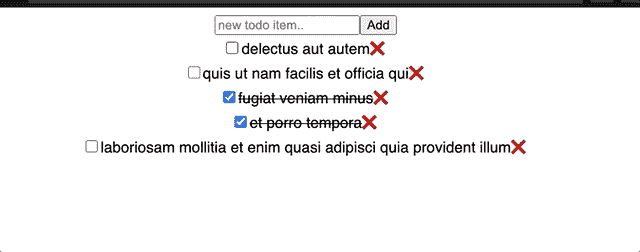

# React.js 被高估了，用 Svelte 代替

> 原文：<https://levelup.gitconnected.com/why-react-js-is-overrated-31b2c6a4e138>


米歇尔·玛特隆在 [Unsplash](https://unsplash.com?utm_source=medium&utm_medium=referral) 上的照片

我写 React.js 已经快 3 年了。React.js 是一个很好的库。它拥有 JavaScript 世界中最好的生态系统之一。但是，我感觉 React.js 在某种程度上被高估了。我每天都在 React.js 中写很多样板代码，所以我能理解一个开发者的痛苦。这可能是我个人的看法。但是像 [**苗条**](https://svelte.dev/) 这样的框架，相比 React.js 要好得多

我以前试过苗条的身材。当它在 2016 年发布时，我第一次不喜欢它。其中一个主要原因是，当时生态系统和成熟度缺失。最近，几个月前，当我开始做一个小型的 POC 时，我开始探索 React.js 之外的一些框架。说实话，我喜欢新版本的苗条。它比**更成熟**，更少**误删**(打字稿)，并且**开发速度非常快**。我们将在后面更详细地讨论苗条的所有方面。

## 基础应用的构建——前端 Hello World

要理解一个框架，你要做的第一件事就是构建一个 **Hello World App** 。就像 Hello World CLI 应用程序一样， **ToDo 应用程序**是一个 Hello World 前端应用程序。

一个 **ToDo** 应用程序包含 **CRUD** 操作。CRUD 操作可以在内存中或通过网络调用来执行。在本文中，我们将尝试使用网络调用创建一个 ToDo 应用程序。



演示待办事项应用程序

## 模拟服务器

模仿服务器是一门艺术。如果你能自己写一个模仿服务器，你就能成为一名艺术家。然而，有一些像我一样懒惰的艺术家，他们喜欢用静止的颜色来画画。因此，对于这个演示，我们将使用[jsonplaceholder.typicode.com](https://jsonplaceholder.typicode.com/todos/1)。这个网站提供了一个免费的模拟环境来执行 CRUD 操作。

**原料药:**

```
### 
# Get All Todos
GET [https://jsonplaceholder.typicode.com/todos/](https://jsonplaceholder.typicode.com/todos/)####
# Create an new Todo
POST [https://jsonplaceholder.typicode.com/todos/](https://jsonplaceholder.typicode.com/todos/){
    "title": "Write a blog on Svelte",
    "completed": false
}####
# Get todo with id 1GET [https://jsonplaceholder.typicode.com/todos/1](https://jsonplaceholder.typicode.com/todos/1)####
# Update todo with id 1PUT [https://jsonplaceholder.typicode.com/todos/1](https://jsonplaceholder.typicode.com/todos/1){
    "completed": true
}####
# Delete todo with id 200DELETE [https://jsonplaceholder.typicode.com/todos/1](https://jsonplaceholder.typicode.com/todos/1)
content-type: application/json
```

## 编写 React.js 代码

现在，既然我们已经模拟了服务器，让我们构建我们的第一个应用程序。我不打算解释 React.js 的详细步骤，我希望你已经熟悉它了。下面是 React.js 中 ToDo 应用程序的工作代码。

## **使用 React.js 创建一个 Todo 应用**

**1。ToDo 服务类:** ToDo 服务是一个可重用的类，包含通过 HTTP API 调用的 CRUD 操作。

**2。使用 style.css:** 在 React.js 中，可以用多种方式对 DOM 元素进行样式化。您可以使用 CSS 文件来设置 DOM 的样式。 [Webpack loader](https://webpack.js.org/loaders/) 将 CSS 和其他文件捆绑在一起。

```
.checked {
  text-decoration: line-through;
}
```

**3。创建应用组件:**Todo 应用的基本逻辑写在 **App.js** 中。

您可以使用 **useState** 在组件级别创建一个状态。 **useState** 创建一个状态，并在整个组件生命周期中维护其数据。接下来，使用 **useEffect** 钩子可以获取组件数量的数据。方法 **addToList** ， **removeFromList** ， **onUpdate** 主要用于进行 API 调用。这里 **onChangeItem** ， **onChecked** 用于处理事件，绑定数据的状态。其余的代码是模板或 DOM 元素。

**Codesandbox:**

## 用苗条的身材写待办事项应用程序

如你所见，编写一个简单的 ToDo 应用程序也需要 80-90 行代码。让我们尝试使用 Svelte 构建相同的应用程序。

**1。ToDo 服务类:**由于服务 API 调用没有变化，我们可以重用 **todo.service.js** 。

**2。使用苗条样式:**苗条样式支持 **<样式>** 标签的模板。我们可以使用相同的 **App.svelte** 文件来编写样式。

```
<style>
.checked {
  text-decoration: line-through;
}.App {
  font-family: sans-serif;
  text-align: center;
}
</style>
```

**3。HTML 模板**:就像普通的 HTML 文件一样，你可以在同一个 **App.svelte** 文件中编写一个 HTML 模板。我们将在后面详细讨论代码。

**4。业务逻辑(控制器):** Svelte 遵循与 HTML 文件相同的语法。这样你就可以在同一个瘦文件中的 **<脚本>** 标签中编写逻辑

## 代码剖析

1.  **更少的冗长和易于学习:**你将看到的第一个主要变化是，你可以不用额外的 *setter* 和 *getter* 来编写代码。同时，苗条的编译器不会创建任何肮脏的观察者。Svelte 采取了不同的机制。当斯维尔特编译代码时。它为所有数据更新添加了一个 **$$invalidate** 函数。这将使状态无效并重新呈现组件。这使得细长的代码**不那么冗长**和**易于学习**。你可以在这里阅读更多。
2.  **数据绑定:** Svelte 使用*绑定属性(指令)*支持数据绑定。每当你绑定一个像 **'bind:value '，**这样的属性时，编译器会创建一个 setter 来更新 DOM 中的值。就像 value 一样，你可以绑定其他属性，比如**类**、 **onClick** 等。这大大减少了代码的大小。
3.  **HTML 模板**:也支持 HTML 标签内的模板。语法非常类似于 [mustache.js](https://mustache.github.io/) 。Svelte 编译代码并转换成普通的 JS。

## 更多示例

1.  **将组件绑定在一起:**你可能会说，在上面的例子中，我们只是减少了绑定代码。我们再举一个例子。假设我们有两个范围组件，其值取决于两个数字输入。

```
<script>
 let a = 1;
 let b = 2;
</script><label>
 <input type=number **bind:value={a}** min=0 max=10>
 <input type=range **bind:value={a}** min=0 max=10>
</label><label>
 <input type=number **bind:value={b}** min=0 max=10>
 <input type=range **bind:value={b}** min=0 max=10>
</label>
<p>{a} + {b} = {a + b}</p>
<style>
 label { display: flex }
 input, p { margin: 6px }
</style>
```

在上面的代码中，指令“**bind:value”**将负责同步值**“a”**和**“b”**。

2.**组绑定**:再举个例子，一个很常见的用例就是绑定一组输入。通常，您必须创建一个数组并通过索引进行更新。这似乎是一项容易的任务。然而，太多的样板代码。Svelte 优雅地处理这个问题。只要看看下面给出的例子。

```
<script>
 let flavours = ['Mint choc chip'];
 let menu = ['Cookies and cream', 'Mint choc chip', 'Raspberry ripple'];
 const join = (flavours) => (flavours.length ? flavours.join(', ') : 'Please select items');
</script><h2>Flavours</h2>
{#each menu as flavour}
 <label>
  <input type="checkbox" **bind:group={flavours}** name="flavours" value={flavour} />
  {flavour}
 </label>
{/each}
<p>
 You ordered {join(flavours)}
</p>
```

> **结论**
> 
> 即使现在，我们有高配置的设备。但是一个设备有它自己的局限性。我们无法完全在内存上优化性能。Svelte 采取了不同的方法。它编译代码并生成高度优化的代码。这样做，大大减少和减少了代码。作为开发人员，您不需要担心反应性。苗条也照顾结合和反应性。Svelte 严格遵循 HTML、CSS 和 JS 的经典 web 开发模型。Svelte 还支持插件来执行复杂的编译时修改。最后，Svelte 离 React.js 还很远，不过，相信很快就会赶上 React.js。

注意:你可以从下面给定的 codesandbox 下载整个代码

**参考文献:**

1.  【https://svelte.dev/ 
2.  [苗条 _ 入门](https://developer.mozilla.org/en-US/docs/Learn/Tools_and_testing/Client-side_JavaScript_frameworks/Svelte_getting_started)