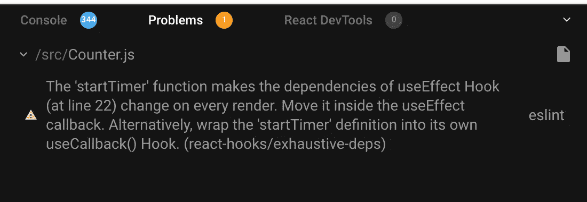

# 为什么将类组件重构为钩子并不总是简单明了的

> 原文：<https://levelup.gitconnected.com/why-refactoring-class-components-to-hooks-is-not-always-straightforward-e5775ebceef5>

## 通过转换使用类组件的应用程序来学习它


杰斯·贝利在 [Unsplash](https://unsplash.com?utm_source=medium&utm_medium=referral) 上拍摄的照片

在本文中，我们将探讨为什么从类组件到 React Hooks 的重构并不简单，以及如何有效地转换它。

如果你是 React 钩子的新手，可以在这里查看我以前的文章[来了解钩子的介绍。](/an-introduction-to-react-hooks-50281fd961fe)

## 我们开始吧

看看下面使用类组件的演示

演示:【https://codesandbox.io/s/using-class-component-rp4eu 

这里，我们有一个从指定值开始倒计时的倒计时器。此外，我们有一个下拉菜单，允许我们用不同的值重新启动计时器。

在`Counter.js`组件文件中，我们添加了一个`startTimer`函数，当组件被挂载时，以及当下拉列表值改变时，我们都会调用这个函数。

```
startTimer = () => {
  this.interval = setInterval(() => {
    if (this.state.counter > 0) {
      this.setState(prevState => {
        return { counter: prevState.counter - 1 };
      });
    } else {
      clearInterval(this.interval);
    }
  }, 1000);
};
```

让我们将代码从`Counter.js`文件转换成使用`Hooks`。

在`Counter`组件中，使用从`counter`属性中取值的`useState`声明状态

```
const [counter, setCounter] = useState(props.counter);
```

并在`counter`值变化时添加`useEffect`钩子启动定时器。

```
useEffect(() => {
  const interval = setInterval(() => {
    if (counter > 0) {
      setCounter(prev => prev - 1);
    } else {
      clearInterval(interval);
    }
  }, 1000);
}, [counter]);
```

演示:[https://codesandbox.io/s/initialchange-vmtwm](https://codesandbox.io/s/initialchange-vmtwm)

如您所见，`counter`启动，但当它达到零值时不会停止。此外，它不能正确倒计时。

这是因为每隔 1000 毫秒(1 秒)就会调用`useEffect`中的`setInterval`函数，所以我们需要在它开始向下计数下一个间隔之前清除前一个间隔。

```
useEffect(() => {
  const interval = setInterval(() => {
    if (counter > 0) {
      setCounter(prev => prev - 1);
    } else {
      clearInterval(interval);
    }
  }, 1000); return () => clearInterval(interval);
}, [counter]);
```

正如你可能知道的，从`useEffect`返回一个函数将在组件被安装时执行，也是在再次运行该效果之前执行，因此`useEffect`中的以下代码将在再次调用`useEffect`之前清除间隔。

```
return () => clearInterval(interval);
```

演示:[https://codesandbox.io/s/clear-interval-ebc2h](https://codesandbox.io/s/clear-interval-ebc2h)

正如你所看到的,`counter`正确地倒计时，当它到达零时也停止。

现在，让我们添加代码，以便在更改下拉列表值时重新启动计时器。

为了做到这一点，我们将把`setInterval`功能分离到一个函数中，这样我们就可以在组件加载和下拉列表值改变时调用它。

```
const startTimer = () => {
  const interval = setInterval(() => {
    if (counter > 0) {
      setCounter(prev => prev - 1);
    } else {
      clearInterval(interval);
    }
  }, 1000); return () => clearInterval(interval);
};useEffect(() => {
  startTimer();
}, [startTimer]);
```

演示:[https://codesandbox.io/s/timer-function-h8v52](https://codesandbox.io/s/timer-function-h8v52)

正如您在上面的演示中所看到的，在将代码移动到一个函数中之后，它没有像预期的那样工作，并且我们在控制台中得到一个警告



在每次渲染警告时使用效果挂钩变化

正如你所看到的，我们已经按照警告的建议将`startTimer`函数包装在`useCallback`钩子中，但是`counter`在达到零值时仍然没有停止。

这是因为我们已经将`counter`指定为`useCallback`的依赖项，所以每次`counter`改变时都会创建`setInterval`函数。此外，当下拉列表值改变时，`counter`不会重新启动。

```
const startTimer = useCallback(() => {
  const interval = setInterval(() => {
    if (counter > 0) {
      setCounter(prev => prev - 1);
    } else {
      clearInterval(interval);
    }
  }, 1000); return () => clearInterval(interval);
}, [counter]);useEffect(() => {
  startTimer();
}, [startTimer]);
```

演示:[https://codesandbox.io/s/usecallback-hook-y4m70](https://codesandbox.io/s/usecallback-hook-y4m70)

如您所见，计数器在达到零值时并未停止，因为我们已经将计数器指定为`useCallback`的依赖项，每次计数器改变时都会创建`setInterval`函数。

此外，当下拉列表值发生变化时，计数器不会重新启动。所以问题在于计数器变量，因为在它改变之后，`useCallback`钩子被再次调用。

所以为了解决这个问题，我们需要一种方法来避免在`useEffect`或`useCallback`钩子中使用外部变量(在我们的例子中是`counter`)。通过避免使用外部变量，我们可以最小化依赖的数量，并且效果不会运行多次。一种方法是使用 updater 函数语法来设置状态。

```
const startTimer = () => {
  setInterval(() => {
   console.log("inside startTimer");
   setCounter(prev => {
      if (prev > 0) {
        return prev - 1;
      } else {
        return prev;
      }
    });
  }, 1000);
};useEffect(() => {
  setCounter(props.counter);
  startTimer();
}, [props.counter]);
```

演示:[https://codesandbox.io/s/using-updater-function-w90sk](https://codesandbox.io/s/using-updater-function-w90sk)

正如你所看到的，当下拉列表的值改变时，`counter`正确地递减并且重新开始。

这里，我们使用 updater 函数语法来获取`counter`值的前一个状态，还将 if 条件移到了`setCounter`函数中，这样我们在返回一个新状态时，将总是获得更新后的值。

你会注意到的一件事是，`setInterval`函数仍然被调用，即使`counter`达到零，正如在控制台中可以看到的，所以我们需要清除间隔。

为此，我们需要使用`useRef`钩子，这样我们就可以在`startTimer`函数之外访问`interval`定时器值

```
const counterRef = useRef();useEffect(() => {
  if (counter === 0) {
    clearInterval(counterRef.current);
  }
}, [counter]);useEffect(() => {
  clearInterval(counterRef.current);
  setCounter(props.counter);
  startTimer();
}, [props.counter]);const startTimer = () => {
  counterRef.current = setInterval(() => {
    setCounter(prev => {
      if (prev > 0) {
        return prev - 1;
      } else {
        return prev;
      }
    });
  }, 1000);
};
```

演示:[https://codesandbox.io/s/final-working-countdown-z27wu](https://codesandbox.io/s/final-working-countdown-z27wu)

这里，我们将`setInterval`函数返回的值保存在`counterRef.current`的`startTimer`函数中。

因此，在这种情况下，使用 ref 将保留其值，即使在多次重新呈现组件之后。

我们在第一个和第二个`useEffect`钩子中使用 ref 值来清除间隔。

```
clearInterval(counterRef.current);
```

因此，现在代码工作正常，并且与我们的类组件演示相同。

今天到此为止。我希望你学到了新东西。

**别忘了订阅我的每周时事通讯，里面有惊人的技巧、诀窍和文章，直接在这里的收件箱** [**订阅。**](https://yogeshchavan.dev/)