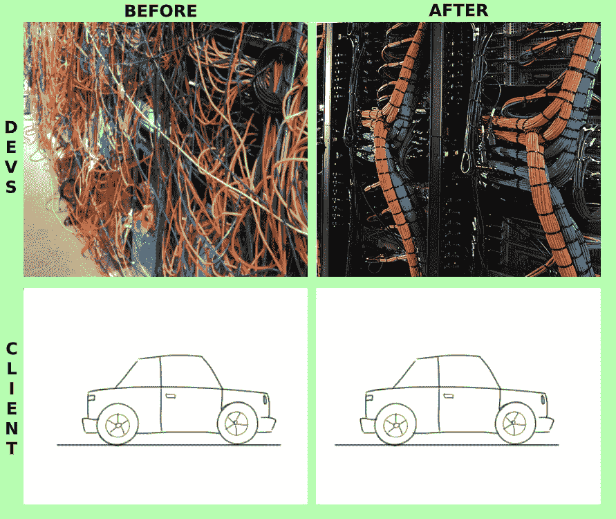
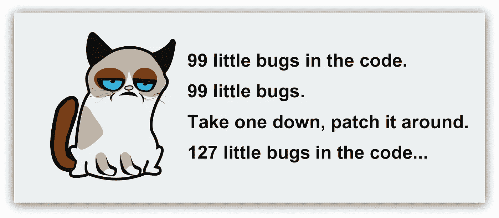

# 为什么从头开始重写应用程序几乎总是一个坏主意

> 原文：<https://levelup.gitconnected.com/why-rewriting-applications-from-scratch-is-almost-always-a-bad-idea-5402d1715006>

有很多很好的理由重写遗留应用程序，但是大多数时候，成本超过了收益。在这篇文章中，我权衡了从头重写应用程序的利弊，并试图阐明为什么它总是一个坏主意。

包括我自己在内的许多开发人员只能忍受遗留应用程序这么长时间，然后就想杀死它，烧掉它，从头开始重新构建它。代码很难理解，数百行长的方法，未使用的变量，不同层次的条件约束条件；太可怕了，桑迪的斜视测试会让你头晕。

# 为什么重写如此诱人

## 你可以使用最新最闪亮的工具。

当你看到仅仅通过使用一个新的最佳实践、框架或包就可以在许多方面改进的地方时，你很难不希望重写。当今天你可以获得各种久经考验和战斗证明的工具时，你为什么要回到过去，努力用铲子、锤子和其他中世纪的工具做伟大的工作呢？

## 你知道所有的事实

“我们可以访问当前的应用程序，我们可以看到以前的开发人员是如何出错的，客户自己有更多的经验，知道什么可行，什么不可行，以及他们实际需要什么。重写应用程序将是小菜一碟！”

## 更容易编写测试

大多数需要重写的遗留应用程序没有测试。现在添加它们很难。不仅有无数的依赖项和执行路径要遵循，通常你甚至不知道要测试什么！你被留下来扮演侦探，小心地遵循每一种方法，试图猜测它应该做什么。当您从头开始时，您可以测试自己的代码，这要容易一百万倍。

# 为什么重写是个坏主意

## 重写是昂贵的

应用程序不会自己重写。你必须投入大量的时间，才能让它达到和以前差不多的效果，也许还会更好一点。

有人可能会提出这样一个很好的论点:“如果不重写，你将会损失相同甚至更多的时间和金钱，因为没有能力以同样快的速度发布特性。”

这是真的。将遗留代码库整合在一起，修复 bug，同时发布新特性，这可不是在公园里散步。你不能像以前那样推出一个又一个功能。但至少这不是不可能的；这是第二点:

## 你不能推出新功能

当你重写的时候，你几个月都不能发布新的东西。根据业务的性质，响应用户和发布新功能可能至关重要。到重写结束时，你的客户可能已经不在经营了。

## 不，你并没有掌握所有的事实

经过年复一年的变化，没有人确切知道应用程序在每种情况下的反应，甚至你的客户也不知道。去吧，问他们。他们可能对该应用程序的工作原理和功能有一个大致的了解，但仍有许多未知之处只能通过查看当前的代码库来发现。毫无准备地进行全面重写，你会在客户沟通和死胡同上浪费大量时间。

## 你冒着损害与客户关系的风险

假设你让你的客户接受重写的所有费用。你向他们保证，最后，这一切都是值得的。这个应用程序将会更快，没有错误，设计更好，更容易扩展。

如果说我们对软件开发有一点了解的话，那就是在某个时候，某个地方会出问题:服务器、数据库、错误配置的服务、一些无意的更新。无论你做了多少计划，总会有地方出错。这就像是自然法则。

重写后开发人员和客户会看到什么

当这种情况发生时，你的客户会开始质疑他重写的决定。尽管新的应用程序性能提升了 10 倍，但他们并不知道这一点。他们不关心你是否使用了最新最好的工具、最佳实践、框架和软件包。他们只知道他们同意花大量的金钱和宝贵的时间在一些看起来和功能完全一样的东西上。你经历的每一次挫折都会损害你和客户之间的关系。

# 什么时候你应该考虑重写

除了应用程序小而简单，您可以在几个月内从头开始重写的情况之外，还有两种情况下完全重写应用程序可能是一个好主意:

## 当发布新功能不是首要任务时

当业务稳定时，大部分工作都围绕着客户支持和一些小问题。如果没有时间压力，并且您出于性能原因想要进行重写，并且可能是为了跟上最新的技术。重写会把你放在一个很好的位置，以防你需要换挡，改变方向去做别的事情。

## 当尝试不同的方法时

生意很好，客户也很满意，当前的应用程序经过了很好的测试和制作，但它已经有点旧了，您想尝试一种新的方法来吸引新客户。

Basecamp 就是最好的例子。每隔几年，他们就彻底重写并推出他们产品的新版本。新客户开始使用全新的方法，而老客户可以选择升级或继续使用当前版本。大家都很开心。

不得不在遗留代码基础上工作很糟糕。当客户要求你添加一个新功能时，你感到害怕。你会觉得在代码库的某个不起眼的角落里，如果不破坏其他东西，你就什么也碰不到。你看到的唯一合理的解决方案是放弃并重写整个应用程序——任何让疯狂停止的事情。见鬼，有时候你会觉得你愿意在业余时间做这件事。

但可悲的是，重写很少是一个好主意。有太多的未知因素，你必须暂停推出新功能，你可能会破坏与客户的关系，而且投入的时间和金钱可能永远也赚不回来。

另一方面，重构可能足以拯救你。请继续关注，因为我计划在以后的文章中写这方面的内容。甚至可能[使用这个链接来订阅我的时事通讯](http://eepurl.com/gMtlV1):)