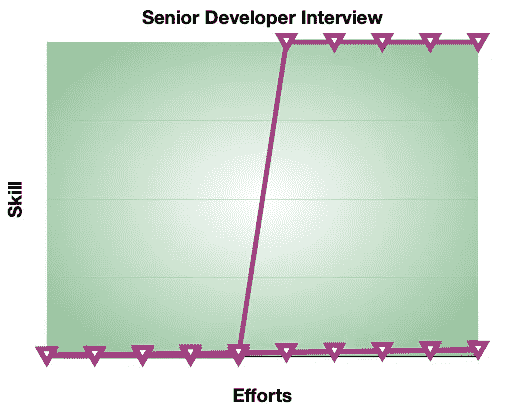

# 为什么高级开发人员面试比实际工作容易

> 原文：<https://levelup.gitconnected.com/why-senior-developer-interviews-are-easier-than-actual-job-c9aec5eeea09>

在 [Unsplash](https://unsplash.com?utm_source=medium&utm_medium=referral) 上由 [Michal Czyz](https://unsplash.com/@digitalmike?utm_source=medium&utm_medium=referral) 拍摄的照片

高级开发人员在工作中经常遇到困难。

让我详细说明一下:如果你比较他们在面试中承受的痛苦，与他们每天经历的相比，**要轻得多。**

我所说的困难，并不是说他们必须花很多时间在办公室里。当我还是一名初级开发人员时，我就去过那里，做过那件事。这并不难。是的，很无聊。但不难。

为什么？

作为初级开发人员，您可以享受许多例外。让我们来看看我几乎每天都有幸发表的一些言论。

> 它没有像昨天那样工作
> 
> 它在我的本地机器上工作。明天我来分析一下。
> 
> 我没意识到 X 是这样工作的。
> 
> 不管怎样，我们还是交付了——这个问题只是我们需要修复的一个 bug。

如果一个高级开发人员说出这些话中的任何一个，他肯定会受到一些质疑。接下来总是要与 CTO 或客户经理会面。

老板想偷偷看看他错误雇佣的老家伙的想法:

> 听着，我知道你很有经验。但是我们来看看这里有没有价值。
> 
> 我更感兴趣的是知道你在展示你的分析/评估/设计时在想什么，而不是听听为什么它昨晚不起作用。

当高级程序员从炎热的小屋出来时，那些初级程序员会想要一些解释:

> 昨天，我们被告知专注于特性 x。现在，我们正在分析 bug Y。我们没有专注。

另一种变化:

> 我们最初的估计是考虑到 A 不是强制性的。现在，它是。

(尽管很明显你觉得没有必要向他们提及此事)

这就是高级开发人员的生活。这不公平。他们知道这一点。

# 初级开发人员面试要困难得多:

> 资深开发者面试是个谜。初级开发人员面试很惊险。

似乎是为了补偿他们的痛苦，一些神的干预让高级开发人员的面试变得更容易了。

前提是你知道面试的规则。

资深开发者面试是个谜。初级开发人员面试很惊险。

## 这意味着:

初级开发人员面试中的认知负荷不仅更高，而且是连续的。

有几个已知的盒子适合一个问题(排序/搜索/散列)。有时候，为了让事情变得不可预测，会安排一系列的盒子。你算出盒子的总数，然后对它们进行分类，最后，执行这个策略。

是的，最后的执行部分说起来容易做起来难。只有实践才能带给你想要的结果。算法面试的认知负荷很大。说到白板，你可以立刻疯狂起来。知名公司(包括 FAAMG)甚至让高级开发人员经历这种疯狂。

认知负荷不仅跨越面试时间，也跨越准备时间。一个初级开发人员在 FAAMG+面试准备期间所经历的纯粹的精神压力是巨大的。

结果有时并不证明努力是正确的，除非你决定一辈子追求算法。这就是为什么[我经常建议开发者](https://betterprogramming.pub/developers-stop-that-stressful-interview-preparation-dd387d5b16fc)不要盲目地追逐 famg+。

初级开发者面试很难。

但不是不可预测的——比如高级开发人员面试。

# 高级开发人员面试与初级开发人员面试:

让我们抛开冗长的比较，看一下这两个图表:

我们正在为面试策划**努力** vs **技能增益**。

如果你正在准备初级开发人员面试，你的图表是一条指数曲线:

初级开发人员面试努力与技能增长

这是什么意思？

这意味着，最初，你的净技能增益是非常微小的。你很难对 O(n2)中的数组进行排序。

然后，通过 LeetCode、HackerRank 和 Codechef 等工具实现的激烈游戏化，你坚持下来了。这很难。然而，在这段时间里，你对自己更加不确定(*我会放弃吗？*)，而不是面试问题(*他们会问什么？*)。

现在，对比一下 will 高级开发人员面试图中的努力和技能收获:

高级开发人员面试努力与技能提升

> 一个叫**的公司/文化合体**

在这里，你失败了，直到你获得一些关键的回答信息(类似于密码)。突然，当你拥有它的时候，你不用练习就能赢。为什么？因为公司正在衡量你是否掌握了公司内部的知识。

那是关于什么的知识？是一个叫**公司/文化契合的野兽。我称它为野兽，因为它相对的不可预测性可以打倒任何有经验的开发者。更重要的是，在幕后，它可能会以种族主义、性别歧视、年龄歧视或仇外心理的形式强烈鼓励歧视性的招聘行为。**

虽然你可以用一个特定的密钥来解开**公司/文化契合度**，但是这个密钥不像 1000 个算法问题，不能在网上获得。

正如我在关于高级开发人员采访的最新电子书中所描述的，它隐藏在你的内心。

人们总是可以通过算法测试来衡量技术适合度。面试官和候选人都可以找到普遍接受的解决方案。但是行为测试却不是这样。它们依赖于心理学——一个只有在相关公司/团队/地方有经验的程序员才能掌握的领域。这是行为测试最糟糕的地方。

我体验过，在成功通过两轮技术测试后，我花了 31.4 万美元得到了一份工作。

然而，它们的好处是它们的认知负荷很小。一旦你知道了*的关键*，并养成了一定的心态，知道如何用它来打败被称为“文化契合”的面试怪兽，你就可以在没有明显认知负荷的情况下走过面试的地狱。

与初级开发人员面试相反，在整个高级开发人员面试周期中，你对面试官更加不确定(*他们会问什么？*)。你不确定你的坚持，因为你的准备是持续的——你不需要从外部来源做任何事情。

让我们用数学术语进行比较:

*   你需要解决 X 个技术问题才能确保通过初级开发人员算法测试和技术面试
*   你需要解决 **Y 技术/行为问题**以确保通过你的高级开发人员面试(我说它们是技术-行为问题，因为技术面试官团队经常这样设计它们)
*   Y = X / K

然后根据我最保守的估计， **K = 10** 。可能会更多，但不会更少。

# 结论:

随着公司开始意识到白板面试/高度复杂的算法测试中涉及的压力因素，高级开发人员面试可能很快成为进入软件常春藤联盟公司的最佳地点，包括 famg+。

唯一的过滤器将是取决于许多心理因素的行为访谈。然而，在这里，受欢迎的公司会确保:

*   神秘因素很高(第二张图中陡峭的垂直线出现在大多数候选人之后)
*   心理学专业的学生不会破坏面试，也就是说，回答行为问题的技术深度也很重要。人云亦云*我是团队里最积极&随和的家伙*那种*回答*。**

你可能听说过在大型科技公司回答任何行为问题的明星方法(当我决定参加亚马逊架构师面试时，我开始知道它[)。](/the-day-i-decided-to-apply-for-amazon-architect-role-12fd76ceb62d)

但是它不仅仅是一颗星星。他们想窥探你的内心，就像高级开发人员在职业生涯中每天面对的不满的老板一样。

不像你的老板，他们没有足够的时间。

如果你想练习高级开发人员面试问题(共有 **40+个明星和非明星问题，**个有技术答案和深度分析的问题)，请随意看看我最新的电子书(下面的链接对 Medium 的前 100 名读者提供 **50%的折扣**):

[高级开发人员面试综合方法](https://tipsnguts.gumroad.com/l/crrzat/zp1vks8)

免费样本章节:[我的高级开发人员面试综合指南](https://tipsnguts.medium.com/my-comprehensive-guide-to-senior-developer-interviews-91458a3c0ff5)