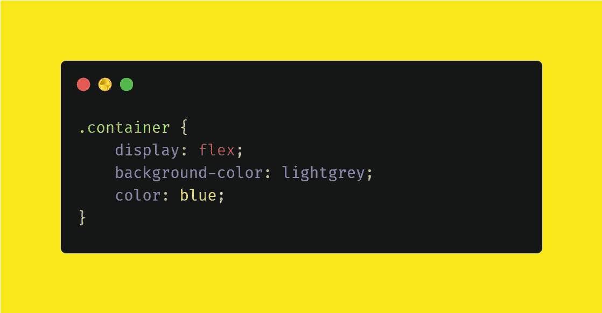
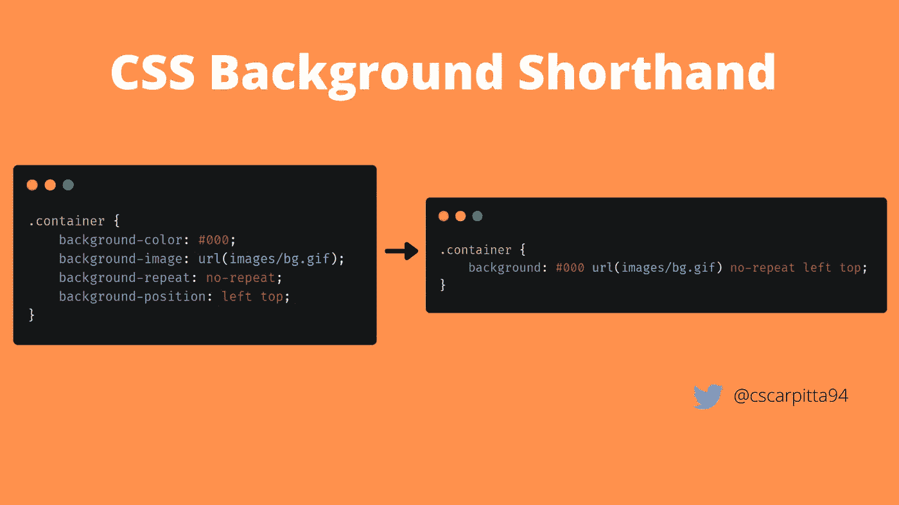
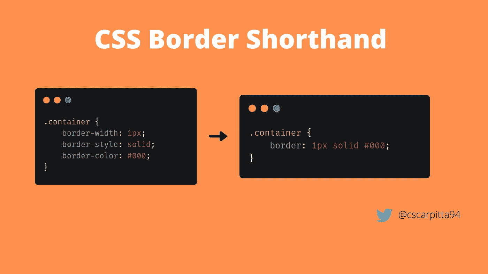
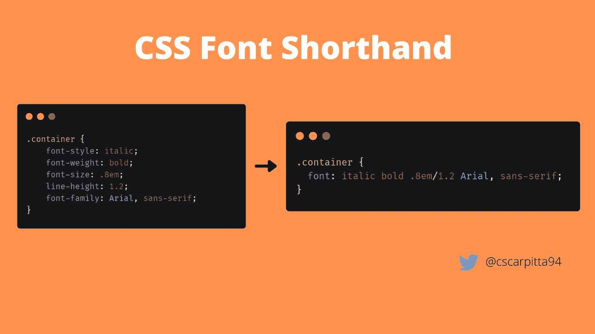
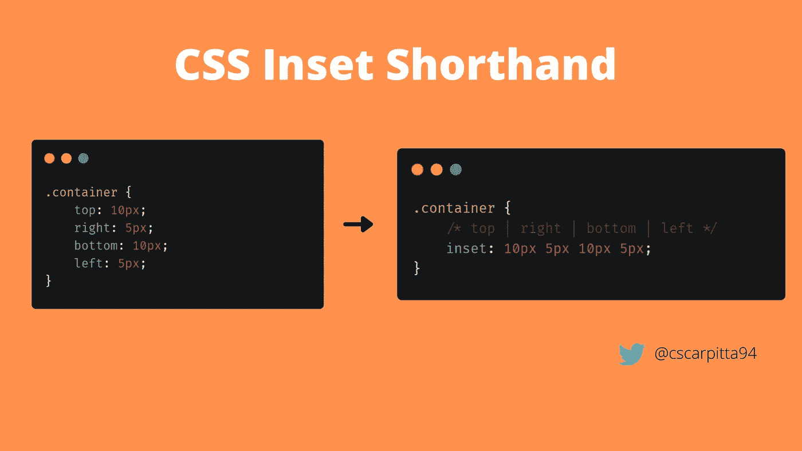
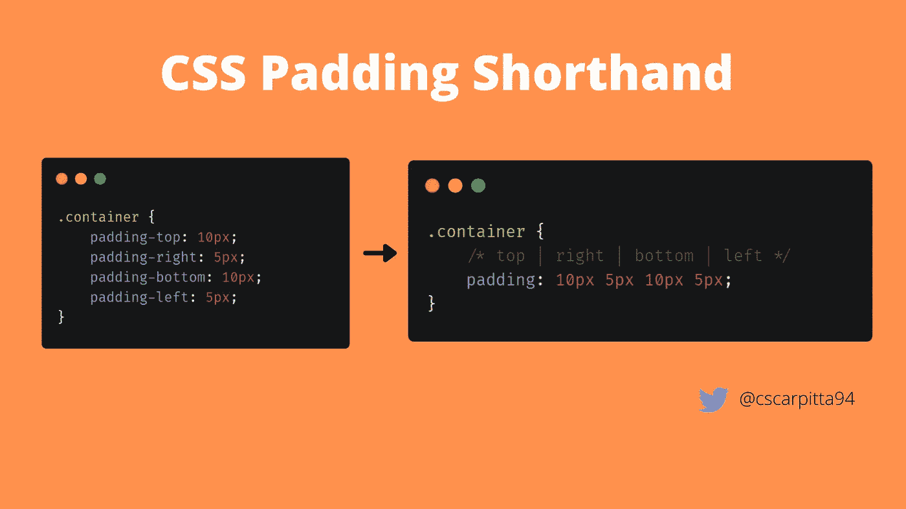
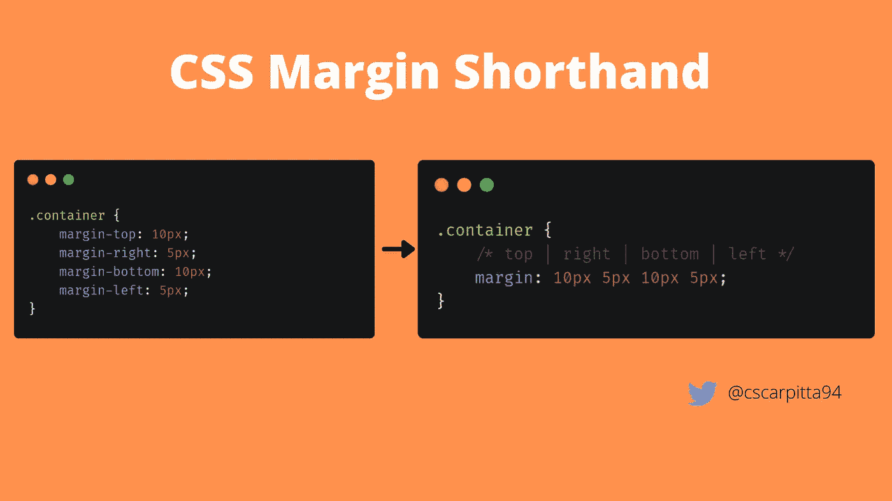

# 6 CSS 速记属性来改善你的网络应用

> 原文：<https://levelup.gitconnected.com/why-should-i-care-shorthand-properties-9666ce9b1dee>

# 为什么我应该关心速记属性？🎈

CSS 是一种用来描述网页外观的语言。使用 CSS 我们可以设置 HTML 页面中每个元素的位置、颜色、字体和布局。🌈



在这篇博文中，我将分享一些改善 CSS 代码和 web 应用程序性能的技巧。🚥

🔥 🌞 🌴 🍄 🔥

有几种方法可以优化 CSS 文件。在编写 CSS 代码时，您应该关心的一件事是尽量减少行数。💥

关心代码行数有几个原因:惊骇::
👉提高代码可读性
👉提高您网页的加载速度
👉提高在搜索引擎中的排名(如谷歌搜索、必应等)，因为排名取决于应用程序的加载速度和优化水平

🔥 🔥 🔥 🔥 🔥

减少代码行数的一个有趣技巧如下:

> ***尽可能使用 CSS 速记属性***

在这篇博文中，我将向你展示什么是速记属性，以及如何使用它们来优化你的 CSS 代码。

感兴趣吗？请继续阅读！！！😊 💻

# 什么是速记属性？

**速记属性**让你同时设置多个其他 CSS 属性的值。

CSS 支持许多速记属性。在这篇博文中，我们将看到最常用的。✈️

# CSS 背景速记

**背景属性**让你在一行 CSS 中设置一个 HTML 元素(如`div`)的不同背景属性。

**背景**是:
*背景-颜色
*背景-图像
*背景-位置
*背景-大小
*背景-重复
*背景-原点
*背景-剪辑
*背景-附件

因此，我们可以使用单个属性，而不是为 HTML 元素定义背景颜色、背景图像、背景位置、背景大小、背景重复、背景原点、背景剪辑、背景附件。😍

Hmmm 迷茫？？？😱 😕

一张图胜过千言万语:



这就是诀窍。多亏了“背景”速记属性，我们将 8 行 CSS 代码压缩成了一行。

现在让我们想象一个复杂的 web 应用程序，有几十个 CSS 文件，每个文件有几千行。😱

毫无疑问，这将为您的 web 应用程序带来更小的文件、更干净的代码和更快的加载速度。😄

# CSS 边框速记

我想展示的第二个速记属性叫做 **Border** 。边框速记用于设置 HTML 元素的边框。

它是:
*边框宽度
*边框样式
*边框颜色的简写

这里有一个例子:



一举三得。没那么糟！！！😏 🔥

# CSS 字体速记

**字体**速记用于设置以下字体属性:

*字体样式
*字体变体
*字体粗细
*字体大小/行高
*字体系列



# CSS 插入速记

**插入**属性与 HTML 元素的定位有关。它是:
*上
*右
*下
*左的简写



简单高效！😊 🌺

# CSS 填充速记

**填充**是在元素周围添加空间的一种方式。更准确地说，它允许您在元素和它的边框之间添加空间。

要完全设置一个 HTML 元素的填充，我们需要设置四个值:
* padding-top
* padding-right
* padding-bottom
* padding-left

这些值的含义非常直观:
* **padding-top** 是元素与其边框之间的空间
* **padding-right** 是元素与其右边框之间的空间
* **padding-bottom** 是元素与其下边框之间的空间
* **padding-left** 是元素与其左边框之间的空间

所有这些属性都可以在一个声明中指定，使用**填充**简写。🌻

语法很简单:

```
padding: <padding-top> <padding-right> <padding-bottom> <padding-left>
```

这里有一个例子:



# CSS 边距速记

**边距**属性类似于填充。边距是元素周围的空间，在它的边框之外。

要指定边距，您需要提供四个不同的值:
* **margin-top** 是该元素的上边框与其他元素之间的间距
* **margin-right** 是该元素的右边框与其他元素之间的间距
* **margin-bottom** 是该元素的下边框与其他元素之间的间距
* **margin-left** 是该元素的左边框之间的间距

语法很简单:rose::

```
margin: <margin-top> <margin-right> <margin-bottom> <margin-left>
```

这里有一个例子:



# 结论

我们已经走到了尽头。🌼我想提一下以下建议:

> ***尽可能使用 CSS 速记属性***

因为它们有助于减少 CSS 代码的行数并提高可读性。

减小 CSS 文件的大小也会提高我们网页的加载速度，因为 CSS 文件比 T51 小。这也将**提高我们在搜索引擎中的排名，**因为搜索引擎算法倾向于奖励优化的网页。🌈 🚀

🔥 🔥 🔥 🔥 🔥

我希望我说服了你去关心 CSS 代码的行。😜

如果你喜欢这篇文章，可以考虑在 Twitter ( [@cscarpitta94](http://twitter.com/cscarpitta94) )、hash node(【https://hashnode.com/@cscarpitta】)、medium ( [Carmine Scarpitta](https://medium.com/u/8390e150eda8?source=post_page-----9666ce9b1dee--------------------------------) )和 dev([https://dev.to/cscarpitta](https://dev.to/cscarpitta))上关注我😍

👋 🔥