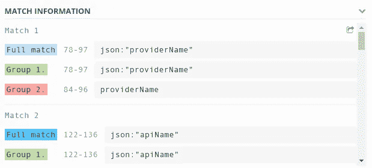

# 为什么要学习 Regex

> 原文：<https://levelup.gitconnected.com/why-should-you-learn-regex-66586ba259e0>


正则表达式，也称为 Regex，在许多文本处理场景中都很有用。Regex 使用符号定义搜索模式，并允许您在字符串中查找匹配项。其应用范围从软件工程到数据科学等等。

流行的编程语言如 Go、Java、C#、Python 和 JavaScript 都非常支持 Regex。大多数文本编辑器还允许您在代码中使用 Regex 在*中查找和替换*匹配。

# 正则表达式对我来说很陌生

直到最近我还觉得 Regex 非常复杂。我害怕它。语法看起来很令人沮丧，我想我永远也学不会它。这发生在我们每个人身上。


幸运的是，我当时找到了很好的在线资源，并开始真正钻研它。结果非常显著，现在我每天都在用它。它是提高我工作效率的一个很好的工具。

不要害怕。即使它看起来很陌生，你最终也会习惯它，并且你会通过今天应用它来学习更多，就像我现在要向你展示的场景。

# 问题是

实习结束后，我遇到了一种情况，我不得不编写一些 Go 代码，其中包含许多字段的结构

> **不要担心，这一节**之后我就不在 GO 里讲了。

样本文件:

```
usecasestype APIDefinition struct {
   ID struct {
      ProviderName string `json:"providerName"`
      APIName      string `json:"apiName"`
      Version      string `json:"version"`
   } `json:"id"`
   UUID            string   `json:"uuid"`
   Type            string   `json:"type"`
   Context         string   `json:"context"`
   ContextTemplate string   `json:"contextTemplate"`
   Tags            []string `json:"tags"`
   Documents       []string `json:"documents"`
   LastUpdated     string   `json:"lastUpdated"`
   AvailableTiers  []struct {
      Name               string `json:"name"`
      DisplayName        string `json:"displayName"`
      Description        string `json:"description"`
...
```

为了完成我的任务，我必须将上面的转换添加到类似下面的内容中。

```
type APIDefinition struct {
   ID struct {
      ProviderName string `json:"providerName" yaml:"providerName" yaml:"providerName"`
      APIName      string `json:"apiName" yaml:"apiName"`
      Version      string `json:"version" yaml:"version"`
   } `json:"id" yaml:"id"`
   UUID            string   `json:"uuid" yaml:"uuid"`
   Type            string   `json:"type" yaml:"type"`
   Context         string   `json:"context" yaml:"context"`
   ContextTemplate string   `json:"contextTemplate" yaml:"contextTemplate"`
   Tags            []string `json:"tags" yaml:"tags"`
```

是的，我必须在 JSON 之后添加 **yaml:"someField"** 。

> 这有什么大不了的？

是的，我们也可以复制一个 JSON 标签，然后将它粘贴在名称改为 yaml 的地方。

但是当有多个字段时，这个任务就相当**无聊**并且**容易出错**。

# Regex 呼叫救援

由于这是一个繁琐的任务，我决定用我的 Regex 知识来拯救我。我需要找到每个带`json`前缀的字段，并用 yaml 粘贴它们。

所以我打开我的 IDE，输入如下内容

```
(json:\”(\w+)\”)
```

这是一个暴躁的正则表达式语句。

它的作用如下。

*   `( )`将捕获括号内的任何内容，我们可以使用$1、$2 等来引用这些捕获组。
*   `json:`将在文本中查找“json:”这是一个区分大小写的精确匹配
*   `\"`会在文本中寻找一个`"`(`\`是 regex 中的转义字符)
*   `\w+`将查找任何单词字符



regex101.com 匹配信息

如您所见，我们需要的所有信息都已捕获。

现在是魔法的时候了。

我们需要做的是在`json:“whatEverTheString”`旁边添加`yaml:“whatEverTheString”` 。

要做到这一点，我们只需使用一个替代命令来代替 regex，如下所示。

```
$1 yaml:"$2"
```

`$1`指上图中的 *1* 组。`$2`是*组 2* 。

在这里，我们做了一个完整的匹配替换，我们将需要替换原始匹配加上我们想要的。

所以上面的命令将替换

```
json:"whatever"
```

随着

```
json:"whatever" yaml:"whatever"
```

这正是我们想要的。

维奥拉。

# 应该如何学习 regex？

如果您对此感到惊讶，并且希望在编辑文本时更有效率，您可能会问自己应该在哪里学习 regex？

你可以找到很多在线资源和书籍。最重要的是，你需要练习。用在现实生活中，省去了自己一堆打字、鼠标移动等工作。

我会放一些我在旅途中发现非常有用的资源。

*   [https://regexr.com/](https://regexr.com/)
*   [https://regexone.com/](https://regexone.com/)
*   [https://regex101.com/](https://regex101.com/)

# 结论

Regex 是你的朋友。在日常生活中，您可能经历过更复杂的任务，包括文本转换。这可能需要很多时间，也会产生一些错误，因为我们是人，我们讨厌无聊的事情。

用正则表达式来拯救你。把它当工具用。它不仅仅是用来写代码的，而且是一个可以节省你很多时间的通用工具。

如果我手动执行上面的任务，我可能要做几分钟。我得复制粘贴一大堆。如果它大一点，我会花几个小时来做。Regex 在进行更改时也会导致更少的错误。

我不久前学习了 Regex，它仍然在我的血液中流动，因为我倾向于一有机会就使用它。花几秒钟编写正则表达式将节省大量时间。

学习正则表达式可以被认为是一生的投资。它有无穷无尽的用例。如果你觉得有用，现在就开始学吧。

> 学习它，节省你的时间。


愿 regex 与你同在。