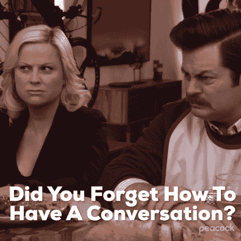

# 为什么科技招聘人员喜欢打电话

> 原文：<https://levelup.gitconnected.com/why-software-recruiters-want-to-talk-on-the-phone-42e977d2f093>

## 如何避免成为另一个“这可能是一封电子邮件”的陈词滥调

NoWah Bartscher 在 [Unsplash](https://unsplash.com/s/photos/phone-calls?utm_source=unsplash&utm_medium=referral&utm_content=creditCopyText) 上拍摄的照片

我目前正在写一些关于如何不招聘软件工程师的帖子。围绕这个主题，我想我应该写一篇关于如何回复一封含糊不清的电子邮件，让你“这周赶紧打个电话？”变成更有成果的、明确的(有记录的)谈话。这将使你在谈判你的职位时处于更有利的位置，并决定这个机会是否值得你花时间去追求。

在我深入解释为什么软件工程师招聘人员喜欢电话之前，让我们[考虑一下电话对销售的重要性。](https://www.quora.com/Why-do-sales-people-insist-on-phone-calls-instead-of-selling-me-via-email)

对于销售来说，电话很重要，因为它可以快速有效地展示产品或服务。这比电子邮件更直接(也更难拒绝)。在几分钟内*他们*会发现你是否有资格销售他们的产品，而*你*会发现他们的产品或服务是否吸引你*。*

但是还有一个原因。

电话交谈比电子邮件承载更多的情感。销售人员可以让你兴奋，给产品注入活力和能量。这是一种技巧，也是一个不可否认的销售艺术的例子。

这也让销售人员有更多的机会抛出行话，而你只能尽力去听和吸收。

当他们最终问你是否感兴趣时，你的第一个想法是，*我想？*

你不能确切地*回顾电话交谈来了解细节。不要担心，他们会给你发跟进材料，如果你有任何进一步的问题，你可以随时打电话或发电子邮件给他们。*

似乎是个合理的提议。

但是，如果正在展示的产品/服务是一个工作机会，而你是软件工程就业市场的新手，渴望被雇用，该怎么办呢？销售人员/客户之间的关系就不那么平衡了。

## 一直在招聘

打电话有它的好处，在最初寻找线索时会很迅速。然而，似乎大多数软件招聘人员采取了不同的方法。

通常，他们通过电子邮件或其他信息服务(以我的经验来看，几乎完全是 LinkedIn 或电子邮件)联系，工作描述相当模糊，工资和福利甚至更模糊(如果真的包括在内的话)。如果你想进一步讨论这个角色，他们会让你安排一次通话。

起初似乎无关痛痒，他们也不应该给你发公司白皮书和福利包幻灯片(这是可以想象的)。但是，当一个人刚进入这个行业，渴望(实际上需要)工作时，利用他们缺乏经验/工作安全感，以更低的薪水获得更多的候选人，这是一种不必要的伤害。

这有可能会浪费求职者的时间——他们花在申请工作和追逐其他模糊/戏弄的机会上的时间。他们的时间和兴趣可以——也应该——受到重视和尊重。

在我们变得过于愤世嫉俗之前，这里有几个我认为招聘者想要抓住电话的真正原因。

## 1.效率

电话*比电子邮件*要快，有时事情可以通过电话更快更容易地解释清楚。回想一下电话在销售中的重要性。

## 2.情感联系

电话交谈虽然不像面对面交谈那样情绪化，但肯定比电子邮件更有风度。在一次积极的谈话中，你可以听到对方的声音，感受他们的行为和反应。这是人类之间更自然的互动形式。

与销售人员类似，招聘人员可以通过一个电话来激发和活跃角色，而不是一堆要点。

## 3.你的故事

这也是他们获得更多“你的故事”的机会。他们看过你的 LinkedIn，但不一定知道你的日常生活，你喜欢什么堆栈，你在空闲时间喜欢做什么，等等。这是他们从你的声音中了解你的机会，而不是让你写一篇个人文章。

现在，我们来看看不那么真实的原因。

## 4.推动对话

对于招聘人员来说，*更容易在电话中推动对话*，并要求*你*为自己*定价*。虽然这是你在申请工作时应该有的想法，但要钱通常是尴尬的，更不用说当你担心这会影响你获得工作的机会时——尤其是如果你是这个行业的新人。

稍后会详细介绍。

## 5.利用积极对话的压力

这些压力有多种形式，比如积极倾听、谈话节奏，以及为了避免沉默而不断说话的压力。这些压力在电话中比在电子邮件中更有利于招聘人员。

在电子邮件中，你可以慢慢来。扫描清晰、明确的信息行。不需要意味深长的停顿、口吃或积极的倾听。可以拉出具体的句子，突出重点，可以直接引用语句。

在打电话时，你必须要求他们重复或澄清当时的事情，同时也要努力保留对话的其余部分。

在条件允许的情况下，人们更倾向于视觉而非听觉。你可以消耗和保留比你正在听的更多的信息。如果你真的忘记了什么，可以回邮件，这也很有帮助。

这就引出了第六个原因。

## 6.后代(或缺乏后代)

他们会先给你发邮件，因为陌生来电对他们来说不舒服，而且更具侵犯性/令人不快。如果你先通过电子邮件接近某人，你就不太可能被他们吼。

但是请记住，典型的软件招聘人员发送冷漠邮件的目的不仅仅是出于礼貌。它的本意是引起你的注意，让你意犹未尽， [***并让你在电话里***](https://hospitalitysearch.co.uk/what-s-the-point-of-speaking-to-a-recruiter-on-the-phone/#:~:text=A%20telephone%20interview%20would%20often,applying%20to%20work%20for%20them.) 。如果这个角色不合适，至少他们有你的电话号码，可以联系到未来的角色。

但是为什么不从一开始就写一封简明扼要的电子邮件，包括薪水和福利呢？潜在的候选人不会对此感兴趣吗？我不认为一个软件工程师会因为一个合理的薪水和福利而放弃一个职位。即使薪水不理想，这也为他们打开了要求加薪的大门，让对话继续下去。

哦，等等，那么雇主不会以更低的价格雇用你😢。

除了省钱(我的意思是，这是最终的原因)，我敢打赌留下一封含糊不清的邮件的原因之一是*后人。他们在邮件里放的信息越少，你能参考的信息就越少。*

假设在电子邮件中，他们提到薪水在 13 万美元到 15 万美元之间，但在电话中，他们说他们可以“给你”12 万美元，你可以提醒他们最初的提议包含不同的薪水。如果他们在邮件中没有提到薪水，你就没有比较的起点。

除非你对电话进行了录音，否则就不会有后代——也没有可供日后参考的书面记录。也许你会做笔记——但这些笔记在正在进行的谈判中是不被接受的，因为一句快速的“也许你误解了我说的话”会立即引起怀疑，并将其视为你对他们的话。

这些只是我认为很明显的几个原因，但是如果你还有更多，请让我知道评论！

既然我们对*为什么*有了更好的理解，那我们就来谈谈*如何*。

## 如何避免“快速呼叫”陷阱

谈到软件工程，我有丰富的经验。作为一名软件工程师，我有超过 4 年的职业经验——也是许多招聘邮件的收件人。我学到的教训和经历的成长让我对自己作为工程师的能力充满信心——这也让我在与招聘人员和招聘经理打交道时充满信心。

我希望当我第一次开始时，我有他的信息和信心——希望它能在你的旅程中帮助你！

## 把球留在你的场地上

为了让球在你的球场上，你首先需要把对话保留在你的电子邮件中。在打电话之前，确保你掌握了尽可能多的信息。你可以通过简单地发一封电子邮件来询问他们轻易忽略的信息。在这封跟进邮件中，为了方便起见，你也应该省略掉你的空闲时间。

做好抵抗的准备。

我目前正在写一篇博文，在这篇博文中，我分解了一封冷漠的电子邮件，我花了 ***五封电子邮件*** 来回给*最后*让他们给我一个工资范围——这个范围最终太低了，这样我就不用打电话浪费时间了。这里有一个你如何跟进的例子。

> 嗨 xyz，
> 
> 谢谢你伸出援手。这个职位听起来很有趣，但是在我们打电话之前，我想了解更多关于这个职位的薪水和福利的信息？
> 
> 希望尽快收到你的来信！
> 
> 最好的，马特

我也不羞于承认，我过去也有过一个更，咳咳，浓缩的[不那么有耐心的]版本。见下文。

> 嗨 xyz，
> 
> 我希望你一切都好。我可以问一下薪水是多少吗？
> 
> 最好的，马特

如果这份工作确实让你感兴趣，而且你也在积极寻找，我建议你选择类似于前者的工作。我们的目标是表现得礼貌而自信。你很有礼貌，但你的时间很宝贵。清晰是有回报的。他们不清楚的时间越长，完成交易的时间就越长——如果他们真的成功了的话。

当我说做好抵抗的准备时，我不是想吓唬你。

我这么说是为了让你做好最坏的准备，同时抱最好的希望。有相当多的例子表明，我在第一次询问后不久就获得了更多想要的信息。其他时候，我会问“你现在挣多少?”？你要多少钱？”这就引出了我的下一条建议。

## 如何回答薪资问题

他们想要你打电话的另一个原因是他们可以问你这个问题，而不会有任何他们问这个问题的记录。这也给你压力，让你快速回答，而不是反复思考和计算一个可靠的答案。

通过电子邮件，如果他们问你想要什么，你有时间。如果你喜欢，你可以做更多的研究，起草一份回应，校对，仔细检查你的数据，然后为你想要的东西提出一个清晰简洁的论点。

就我个人而言，我已经学会在没有*至少*工资范围的情况下**而不是**回答这个问题。因此，如果你通过电子邮件或电话收到这个问题，这里有一些(逐字)我已经回答的方法，并成功地了解了更多关于工资的信息，无论是精确的范围还是具体的数字。

*   在我回答这个问题之前，我更想知道公司的预算是多少。
*   虽然我理解你为什么会问我这个问题，但我也明白，在知道公司能够提供什么之前回答这个问题对我来说并不合适。

现在，他们可能会接着说“他们非常灵活”或“他们非常愿意在任何范围内寻找候选人”，甚至“对于像你这样背景的候选人，我相信他们可以满足你的要求。”

哇哦。别让我脸红。

以下是一些我认为成功的回答。

*   你认为他们愿意提供一个有 X 年经验的工程师吗？
*   如果我能更具体地知道公司对这个职位的分配情况，我会给你一个更确切的数字。

希望这将最终说服他们提供更多实质性的信息——如果他们还没有的话。从我个人的经验来看，我只是不得不多督促几次。在第一次直接询价后，他们通常至少会提供一系列产品。

## 摘要

我认为招聘人员喜欢打电话的原因和大多数销售人员一样:快速、简洁，让他们在了解你的故事的同时，也能为一个角色注入活力和能量。

在推动对话、利用对话压力方面，这也给了他们更多的优势，他们不需要担心后代。他们也更容易用薪水问题困住你——问你想要什么，却不清楚公司愿意支付多少。

通过电子邮件，你可以从容不迫地做出回应。在电话里，你有更大的压力去快速回应。这给了你更少的时间来清晰地回应，没有结巴，第二次猜测和尴尬的开口要钱。

你如何更好地管理对话？

1.  通过电子邮件保持对话，直到你有足够的信息。
2.  跟进一些关于薪水和福利的直接问题。
3.  做好抵抗的准备，不要觉得打电话有压力——让他们觉得有压力来提供更多信息。

如果你发现自己面临薪水的问题，回答说你想知道更多关于公司能支付多少。如果有必要，让他们知道你意识到在不知道他们号码的情况下给他们一个号码并不符合你的最佳利益。

你是一个感觉不同的招聘人员还是工程师？不要害怕让我在评论中听到它！

[***升级您的免费 Medium 会员资格***](https://matt-croak.medium.com/membership) *并接收来自各种出版物上数千名作家的无限量、无广告的故事。这是一个附属链接，你的会员资格的一部分帮助我为我创造的内容获得奖励。*

*您还可以通过电子邮件* *订阅，每当我发布新内容时，您都会收到通知！*

*谢谢！*

# 参考

 [## 为什么销售人员坚持打电话而不是通过邮件向我推销？

### 回答(第 1 题，共 3 题):因为销售邮件唯一的作用就是警告潜在客户。对于高…

www.quora.com](https://www.quora.com/Why-do-sales-people-insist-on-phone-calls-instead-of-selling-me-via-email)  [## 和招聘人员打电话有什么意义？

### 找工作本身就是一份全职工作，通常不可能涵盖你需要涵盖的所有领域…

hospitalitysearch.co.uk](https://hospitalitysearch.co.uk/what-s-the-point-of-speaking-to-a-recruiter-on-the-phone/#:~:text=A%20telephone%20interview%20would%20often,applying%20to%20work%20for%20them)  [## 已经宣布薪资历史问题不合法的州和地方的列表

### 生效日期:2019 年 7 月 28 日受影响的雇主:所有雇主雇主不得寻求薪酬历史记录。然而，他们可能…

www.hrdive.com](https://www.hrdive.com/news/salary-history-ban-states-list/516662/)