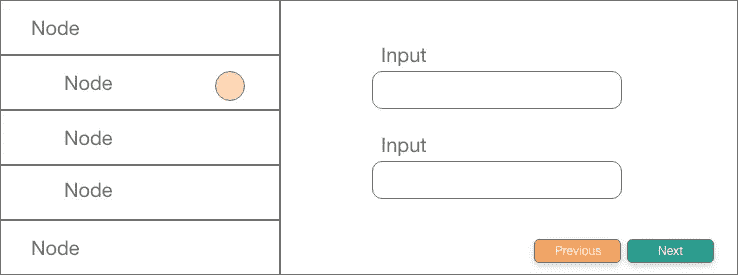

# 为什么解决算法问题会让你成为更好的软件工程师

> 原文：<https://levelup.gitconnected.com/why-solving-algorithmic-problems-make-you-a-better-software-engineer-bc543cb034e>

## 我从 LeetCoding 中学到的 6 件事


在 [Unsplash](https://unsplash.com/s/photos/code?utm_source=unsplash&utm_medium=referral&utm_content=creditCopyText) 上由 [Hitesh Choudhary](https://unsplash.com/@hiteshchoudhary?utm_source=unsplash&utm_medium=referral&utm_content=creditCopyText) 拍摄的照片

我花了无数的时间学习数据结构和算法。我在 LeetCode 上解决了 500 个问题。我参加了持续数小时的编码竞赛。我看了无数的 YouTube 视频来提高我的技能。


我不止一次地问自己这个问题:“自学这些东西真的有意义吗？还是我在浪费时间？”。简短的回答是:“是的”。但是你可能直到后来才注意到它。

如今，大型科技公司(和其他公司)喜欢问算法问题，以检验你是否适合这家公司。2020 年夏天，我采访了克里提欧、脸书、亚马逊和扎兰多。所有公司都提出了 LeetCoode 式的问题。我只收到了扎兰多的邀请。我最终接受了另一家公司的邀请。

在学习期间，你会感到沮丧。你会问自己这段时间是否花得值。过度学习期过后，你会问自己同样的问题。特别是，如果你没有编写深度优先搜索算法来得到这份工作。

2020 年 10 月开始从事专业软件工程师工作。这篇文章强调了解决算法问题对我工作的帮助。喝杯☕，我们开始吧。

# 你终生学习的东西

## 你将用心学习一门编程语言

在做算法问题之前，我主要编写 Python 代码。一旦我能够理解列表，我会说:“是的！！看我的 Python 技术！”。

我不知道。

在用 Python 做了 500 个问题之后，你会知道比列表理解更多的东西。defaultdict，Counter，deque，heapq，functions，自定义排序函数…还有很多。

你将会学到独一无二的编程语言的语法和技巧。

你选择哪种语言并不重要。Python 是一般的[推荐](https://medium.com/swlh/the-best-programming-language-for-tech-interviews-e5c77d3946ad)，因为它简单。

熟记一门编程语言比多门语言好一点点。归根结底，编程语言非常相似。

当我开始使用 Java 时，我应用了我在 Python 中学到的技巧。最后，我在谷歌上搜索:“Java 中的 Python 特有的东西]”，堆栈溢出会帮我解决这个问题。

要谷歌这样的短语，你需要知道它们的存在。要知道它们的存在，你需要解决算法问题。要解决算法问题，你需要从其他人的解决方案中学习。

## 您将在生产代码中使用特定的算法

最重要的算法是深度优先搜索和广度优先搜索。

我在产品代码中使用了这两种算法。在一个用例中，我必须在 HTTP 请求之前和之后比较同一个 JSON 对象的两个实例。目标是找到在请求之后改变的对象的所有属性。


在后端计算后，对象的许多属性发生了变化。在前端，我们需要显示所有改变的属性。

解决方案很简单:对 JSON 对象的所有属性进行并行 DFS。例如:

```
human: {
  name: "Lorenz"
  height: 1.80
  interests: ["Sports", "Coding", "Crypto", "Sustainability"]
  otherFacts: {
    // A nested object with other facts.
  }
}
```

JSON 对象的每个属性要么是一个值，要么是另一个对象。如果它是一个值，将其内容与另一个 JSON 对象进行比较。如果它是一个(嵌套的)对象，递归地对它执行 DFS。

在另一个用例中，我们有这个分开的用户界面。左边是一个树形数据结构，右边是某种角形。



来自我们 UI 的简化模拟。左边有一棵树。右侧有一个角形，取决于树中所选的节点。

根据用户在树中选择的节点，必须显示右边的某个角度形式。我再次在生产代码中使用了 DFS、BFS、前序遍历和树序列化。

## 你会在思考和说话的同时变得更好

为了提高你的面试技巧，你需要做模拟练习。你可以很容易地在 [Discord](https://www.reddit.com/r/cscareerquestions/comments/a7y8qg/cs_career_hackers_discord_server/) 上找到人。一开始，和一个陌生人面试会感觉很尴尬。我和来自纽约的同一个人进行了 15-20 次模拟。他在柏林找了一份工作，我们偶尔会见面讨论技术和密码相关的东西。

同时思考和说话是一项很有价值的技能。在工作中，我遇到了很多问题，我们通过电话一起解决了。这里的关键是你必须清楚地表达你的想法。

你做的模拟越多，你在编码时就能更好地表达你的想法。对我来说，这是最难的部分，还有改进的空间。

所以，走出你的舒适区。思想开放。在网上和陌生人聊天。谁知道呢..也许你们甚至会发展出友谊。

## 你将提高你解决一般问题的技能

解决算法问题改变了你大脑的工作方式。它会把一个大问题分解成更小的子问题。在某种程度上，你将能够解决一个子问题，这有助于解决另一个子问题。最后你能够解决整个问题。

通过做算法问题，你训练你的大脑有效地发现子问题。我不仅在工作中使用这种技巧，在私人生活中也是如此。“好，我有问题 X，解决 X 的第一步是做 Y，Y 是不是太大了？我能把它分成更小的 Y 吗？”

作为一名软件工程师，你写代码是没有报酬的。你用代码解决问题是有报酬的。

## 你将快速推进你的职业生涯

我最近在公司进行了第一次绩效评估，团队领导说:“Lorenz，你是入职期间最快的人之一，你从第一天起就准备好独立工作了！”。

太好了！我所做的就是把问题 X 分解成子问题，然后解决它们。

我现在的工作才 8 个月。我已经注意到自学算法和数据结构的积极效果。

你还记得之前的树景吗？对于我们的客户来说，这实际上是 Q1 和 Q2 最重要的项目。我 100%确定，如果没有 LeetCode 的知识，我会失败的很惨。

## 你会学到真正重要的东西

如今，几乎每家公司都要处理大量数据。因此，了解算法运行时间的复杂性比以往任何时候都更加重要。阿卜杜勒·巴里的视频绝对是这个话题的金矿。特别是，如果你想了解递归函数的时间复杂度。

当您编写生产代码时，时间复杂性总是需要考虑的。最后，您是有一个运行时间为 O(n)的嵌套 for 循环，还是有一个字典和一个循环，这都很重要。

学习算法的另一个很好的来源是[祝铭震·费塞特](https://www.youtube.com/user/purpongie)。他用非常直观的方式解释算法。

# 最后的话

tech 的面试过程有点诡异。也许你和我一样。想知道学算法和数据结构是否有意义。

我可以向你保证这不是浪费你的时间。终身学习是软件工程师生活中最重要的方面之一。