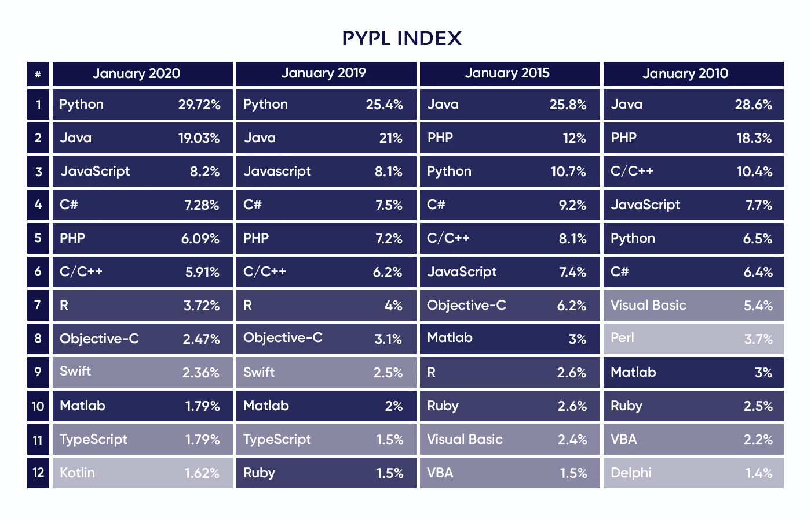

# 为什么有些开发商永远不会改进

> 原文：<https://levelup.gitconnected.com/why-some-developers-will-never-improve-d7f095df9604>

## 以及永远不要成为其中一员的建议

来自 [Unsplash](https://unsplash.com/photos/roCfgvkBLVY) 的 Adrian Swancar

在快速发展的软件开发领域，不改进就等于落后。技术变化很快，那些跟上的人会得到丰厚的回报，而那些跟不上的人很快就会过时。在本文中，我将概述开发人员落后的最常见方式以及如何避免它们。

由[瓦迪姆·博日科](https://unsplash.com/@bozhstudio)从 [Unsplash](https://unsplash.com/photos/lbO1iCnbTW0)

## 他们(实际上)不接受反馈

毫无疑问，建设性的反馈是推动开发人员在职业生涯中前进并提升他们技能的主要催化剂。无论是以拉式请求反馈、经理反馈、团队反馈的形式，它都可能是一个好的开发人员和一个伟大的开发人员之间的区别。如果开发人员不能有效地接受反馈，他们的技能和潜力就会受到限制。

**你可能会想**“*我很擅长接受反馈，我不会针对个人，而且我总是对给我反馈的人很友好*”。虽然这是一件很好的事情，但是你不应该这样接受反馈。反馈应该重新定义你如何编码和工程，至少在一些小的方面。这不是你为了安抚批评你的人而仅仅在一两个拉动式请求中加入的东西。

**以下是你应该如何接受反馈:**

*   首先，如果你对此有疑问，**问**。如果你不同意反馈或者不理解，请询问。你将无法保留你并不真正理解的信息，或者更糟的是，你实际上并不相信它。不要轻易相信你的代码。
*   记笔记。写下这些信息，保留你的学习日志或技术日志。这将允许你回顾你的笔记，并在前进中做出更好的技术决策。
*   **将建议追溯应用到您的代码**。如果你收到的反馈让你产生了共鸣，那就继续修改你之前写的代码。如果你是在某段代码上获得的，那就超越它，把它应用到其他代码上。熟能生巧，你离开代码库的时候会比开始的时候更好。
*   呼应给别人听。这个很简单。教学是最好的学习方式。通过教别人，你会对你学到的东西有更深的理解，甚至可能学到更多。

来自 [Unsplash](https://unsplash.com/photos/NTur2_QKpg0) 的[泰勒·弗洛](https://unsplash.com/@taypaigey)

## 他们不问问题

软件是一个奇怪的领域。许多最有用的知识并不包含在大学讲座、书籍或编程教程中。这些知识实际上储存在聪明而有经验的开发人员的头脑中，他们从来不写书，他们中的大多数写的是糟糕的文档。

所以，那些太害羞或太骄傲而不敢向他人提问的开发人员将永远站在好奇的开发人员后面，因为他们有无限的问题储备。一个人会随着行业标准的发展而学习，而另一个人可能会在未来几年学习。

底线是:如果你不知道，就去问。不要担心“*如果我打扰了这个开发者*怎么办？”或者"*我问了会不会显得很傻？因为当那一天到来的时候，你会看起来更加愚蠢，而你需要这些信息却没有。*

## 他们回避困难的问题

用软件很容易陷入窠臼。你可以继续做你觉得舒服的事情，永远不要挑战自己去解决一个真正复杂的问题。我见过开发人员不断地选择简单的任务，却从来不敢去处理困难的任务。困难的问题是你学会解决最多的问题；你推动自己以不同的方式思考，探索解决这些问题的技术。如果你一直解决同一个简单的问题，那么我保证你会落后于开发人员。

如果你是一个全栈开发人员，经常只接前端任务，猜猜会发生什么？几年后，你将只是一个前端开发人员。如果你是一个后端开发人员，只从事小而简单的任务，那么你很快就会忘记如何进行集成或实现复杂的功能。*你失去了你不用的东西*。

## 他们从来不做自己的项目

我绝不是说开发人员应该把工作时间之外的每一分钟都花在兼职项目上，而是每个开发人员都应该尝试创建自己的项目。主要原因是没有更好的方法来全面理解系统。在大多数软件工作中，开发人员专门从事一两个领域的开发，这限制了开发人员的机会。从头开始做一个项目可以填补知识的空白，教会你系统设计、产品管理、集成、认证、开发运维等。

从事副业的另一个重要原因是将知识付诸实践。从教程和老师那里学习是一回事，但是在你自己的项目中实现你的学习是完全不同的。当你从教程中学习时，总会有“正确”的答案，有人会指导你。当你独自工作时，你必须通过研究和批判性思考找到适合你的情况的最佳解决方案，这巩固了你内心深处的更好理解。

## 他们从不改变角色或公司

当你改变角色或公司时，会发生一些事情:

*   你会接触到新的队友，他们会教你新的东西
*   你从事新的任务，迫使你以不同的方式思考
*   你用不同的技术工作，给你更多的能力，帮助你为将来的机会积累你的简历

我认为这些转换是学习和提高的巨大动力，可以提升你的编程能力。我将此归因于通过入职快速学习新的技术体系，以及面临一系列新的挑战，这些挑战推动了你的大脑和编程能力。

## 他们从不转换编程语言

这可能会惹恼很多程序员，尤其是那些坚持认为他们的编程语言是最好的编程语言的人。事实是，学习和练习不同的语言有很多价值。一门编程语言说到底是一个*工具*，你应该为工作选择最好的工具，没有什么是最好的工具期。拥有更多工具的开发人员适应性更强。

你可能喜欢 C++而讨厌 Javascript，但是归根结底 Javascript 更适合前端开发。试图用 C++编写前端代码就像试图用扳手打字一样，尽管它在其他环境中非常有用，但它并不是这项工作的合适工具。类似地，如果你必须编写一个高度优化和高性能的应用程序，你通常应该避免使用 python，尽管它不是一种*坏的*编程语言，只是它不适合这项工作。

行业标准和要求经常变化。下图比较了不同时期最流行的编程语言。学习不同的编程语言会让你随着行业的变化而变化，并且总是受欢迎的。

我希望你喜欢阅读。如果你有，我会很感激你的关注！我经常写这样的文章。

# 分级编码

感谢您成为我们社区的一员！在你离开之前:

*   👏为故事鼓掌，跟着作者走👉
*   📰查看[升级编码出版物](https://levelup.gitconnected.com/?utm_source=pub&utm_medium=post)中的更多内容
*   🔔关注我们:[Twitter](https://twitter.com/gitconnected)|[LinkedIn](https://www.linkedin.com/company/gitconnected)|[时事通讯](https://newsletter.levelup.dev)

🚀👉 [**加入升级达人集体，找到一份惊艳的工作**](https://jobs.levelup.dev/talent/welcome?referral=true)