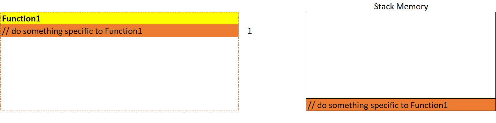
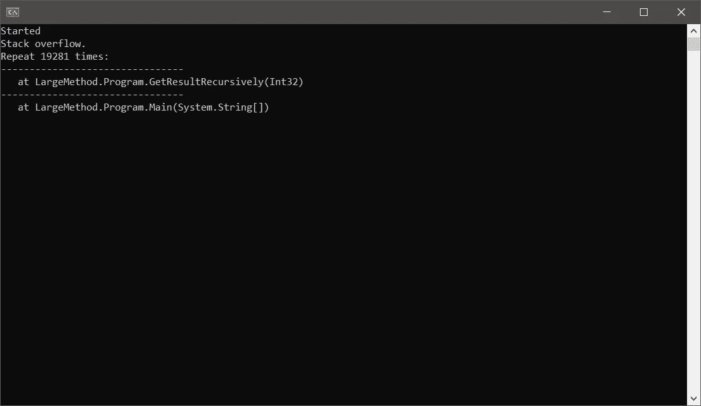
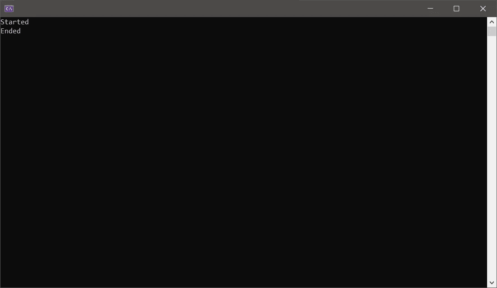

# 为什么要把大方法分成小方法呢？！

> 原文：<https://levelup.gitconnected.com/why-split-large-methods-into-smaller-ones-7b71f26f8745>

## 回归基础

## 学习何时将大方法分解成小方法，让不可能变成可能。


**简介**。照片由[约书亚·布朗](https://unsplash.com/@joshbrown?utm_source=unsplash&utm_medium=referral&utm_content=creditCopyText)在 [Unsplash](https://unsplash.com/?utm_source=unsplash&utm_medium=referral&utm_content=creditCopyText) 上拍摄，由 [**艾哈迈德·塔雷克**](https://medium.com/@eng_ahmed.tarek) 调整

# 介绍

作为一名软件开发人员，您总是听到有人告诉您不应该使用笨重的方法。换句话说，您应该避免在一个方法中有太多的逻辑或太多的代码行。

我现在能听到你说:

> 是的，同样 bla bla bla，饶了我吧。我不是业余爱好者。

冷静下来，我的朋友，我不会重复你总是听到的同样的事情。

我不会告诉你，如果你的方法庞大臃肿，逻辑过多，这将是一个很好的迹象，表明它做得太多，或者，可能是整个类做得太多。在这种情况下，你将违反 OLID 原则的单一责任原则。

我知道你已经知道了。然而，我要给你看一些你可能会忽略的有趣的东西。

在本文的下一节中，我将向您展示将大方法拆分成小方法会带来巨大的不同。实际上，它可以把不可能变成可能。

[](https://medium.com/subscribe/@eng_ahmed.tarek) [## 🔥订阅艾哈迈德的时事通讯🔥

### 订阅艾哈迈德的时事通讯📰直接获得最佳实践、教程、提示、技巧和许多其他很酷的东西…

medium.com](https://medium.com/subscribe/@eng_ahmed.tarek) 

**当一个方法被调用时会发生什么**。照片由 [Patrick Fore](https://unsplash.com/@patrickian4?utm_source=unsplash&utm_medium=referral&utm_content=creditCopyText) 在 [Unsplash](https://unsplash.com/?utm_source=unsplash&utm_medium=referral&utm_content=creditCopyText) 上拍摄，由[T21【Ahmed Tarek 调整](https://medium.com/@eng_ahmed.tarek)

# 当一个方法被调用时会发生什么

您很可能知道，对于每个方法调用，都会在**堆栈**内存中创建和分配一个堆栈框架。

N 注:如果你不太了解**栈**内存，也许你可以查看文章 [**中的内存管理。网**](/memory-management-in-net-740b03d01e24?sk=045076d6617410f78a56b2220172d2d5) 。这会帮助你理解。

假设我们有下面这段简单的代码。

假设注释实际上代表了一些要执行的代码，当我们开始调用`Function1`时，这就是将要发生的事情。



**嵌套函数调用**。图片由 [**艾哈迈德·塔里克**](https://medium.com/@eng_ahmed.tarek) 拍摄

如您所见，在每个函数开始时，都会创建一个堆栈帧，直到函数完全执行后，这个堆栈帧才会被释放。当一个子函数被调用时，一个子框架被创建等等，…

这里值得一提的是，当连续和嵌套的堆栈帧被创建并分配到堆栈内存中时，所分配的内存继续增加，直到一些帧被释放。

因此，除非你有一个无限堆栈内存，否则你可能会遇到内存不足的异常，或者让我们称之为内存不足；**堆栈溢出**异常。

你不相信我？让我展示给你看。


**大法**。照片由[玛利亚·特内娃](https://unsplash.com/@miteneva?utm_source=unsplash&utm_medium=referral&utm_content=creditCopyText)在 [Unsplash](https://unsplash.com/?utm_source=unsplash&utm_medium=referral&utm_content=creditCopyText) 上拍摄，由[艾哈迈德·塔雷克调整](https://medium.com/@eng_ahmed.tarek)

# 大型方法

在这个代码示例中，我们将通过使用**递归**来模拟一个**堆栈溢出**异常。

N 注:如果你不太了解**递归**，也许你可以查看文章 [**中的递归诅咒。NET C#**](/curse-of-recursion-in-net-c-b017271ddbe6?sk=e1a1f74d42d80a82d433d5be37bc15ac) 。这会帮助你理解。

我们在这里可以注意到:

1.  我们正在调用一个递归方法，它将生成 20，000 个方法调用。
2.  这种逻辑并不奇特，我们现在不应该太在意它。这只是为了演示。

现在，运行这段代码会产生以下结果:



**堆栈溢出异常**。图片由 [**艾哈迈德·塔里克**](https://medium.com/@eng_ahmed.tarek) 提供

发生这种情况是因为对于每一个 **20，000 个**方法调用，当前一个堆栈帧还没有被清除时，一个新的堆栈帧被分配到堆栈存储器中。最终，我们用完了堆栈内存。

好吧，现在你可能会问:

> 那么，如果我的业务逻辑实际上要求我执行 **20，000 次**呼叫，我该怎么办？我应该放弃吗？

咻，我还担心你永远不会问。我基于这个问题构建了整篇文章😁

我来回答你的问题；不，你不能把它扔掉，但是你应该稍微弯曲一下，让它工作起来。

继续下一部分，我会给你看一些有趣的东西…


**小方法**。照片由[沃尔坎·奥尔梅斯](https://unsplash.com/@volkanolmez?utm_source=unsplash&utm_medium=referral&utm_content=creditCopyText)在 [Unsplash](https://unsplash.com/?utm_source=unsplash&utm_medium=referral&utm_content=creditCopyText) 拍摄，由[T21 艾哈迈德·塔雷克](https://medium.com/@eng_ahmed.tarek)调整

# 小方法

我们将对之前的代码应用一个**如此简单/琐碎的改变**。它简单/琐碎到你可能不相信会有任何不同的程度。

说够了，让我们看看代码。

我们在这里可以注意到:

1.  我们修改了`GetResultRecursively`方法以获得一个额外的参数，即下边界迭代次数。
2.  这样我们就可以调用`GetResultRecursively`方法，决定从哪里开始计数，从哪里结束计数。
3.  然后我们将对`GetResultRecursively`方法的一次调用分成两次调用。现在，不再有一个巨大的 **20，000 次**迭代的调用，而是两个调用，每个调用只有 **10，000 次**迭代。
4.  第一次调用从**20000**开始，到**10000**结束。
5.  而第二次调用从**10000**开始，到 **0** 结束。
6.  这样，我们仍然覆盖了整个 **20，000** 系列。

我现在能听到你说:

> 你是哑巴吗？它仍然会产生同样的问题。最后，我们将在`Main`方法中进行 **20，000 次**迭代。

你确定吗？让我们运行新代码看看。



**避免堆栈溢出异常**。图片由[T3【艾哈迈德】塔里克 ](https://medium.com/@eng_ahmed.tarek)

哦，成功了！！！这怎么可能呢？！！

是的，我的朋友，这是可能的。事情是这样的，当我们将 **20，000 次**迭代分成 2 次调用时，堆栈内存中分配的堆栈帧只为 **10，000 次**调用累积，然后清除释放一些堆栈内存，然后执行下一个 **10，000 次**调用，到那时就有足够的堆栈内存了。

因此，按照这种模式，你实际上可以做更多的 **10，000 次**呼叫，就像这样:

它仍然可以工作。是魔法吗？不，只是关于方法调用如何工作的基本知识。


**总结**。照片由[亚伦负担](https://unsplash.com/@aaronburden?utm_source=unsplash&utm_medium=referral&utm_content=creditCopyText)在 [Unsplash](https://unsplash.com/?utm_source=unsplash&utm_medium=referral&utm_content=creditCopyText) 上拍摄，由[T21【Ahmed Tarek】调整 ](https://medium.com/@eng_ahmed.tarek)

# 摘要

好了，现在我知道你可能会有一点困惑，所以让我为你总结一下。

将一个方法调用的逻辑分成两个连续的方法调用会返回相同的逻辑输出，但会对堆栈内存产生不同的影响。

所以，我给你的建议，如果你真的需要单个方法有太多的逻辑，那就尽量把这个逻辑拆分成多个方法。这将有助于堆栈内存在方法调用之间喘息，并最终避免遇到**堆栈溢出**异常。您可能遇到的唯一挑战是如何从这些多次调用中重建最终结果。

然而，为了简洁起见，您仍然应该首先考虑为什么您的方法或类应该处理那么多的逻辑。这是出问题的迹象。


**最后的想法**。照片由[肯尼·埃利亚松](https://unsplash.com/@neonbrand?utm_source=unsplash&utm_medium=referral&utm_content=creditCopyText)在 [Unsplash](https://unsplash.com/?utm_source=unsplash&utm_medium=referral&utm_content=creditCopyText) 上拍摄，由[艾哈迈德·塔雷克调整](https://medium.com/@eng_ahmed.tarek)

# 最后的想法

在本文中，我们证明了将大方法拆分成小方法不仅仅是美化代码的设计规则。它实际上可以把不可能变成可能。

最后，我希望你喜欢读这篇文章，就像我喜欢写它一样。


# 希望这些内容对你有用。如果您想支持:

如果您还不是**中型**会员，您可以使用 [**我的推荐链接**](https://medium.com/@eng_ahmed.tarek/membership) ，这样我就可以从**中型**中获得您的一部分费用，您无需支付任何额外费用。订阅
[**我的简讯**](https://medium.com/subscribe/@eng_ahmed.tarek) 将最佳实践、教程、提示、技巧和许多其他很酷的东西直接发送到您的收件箱。


# 其他资源

这些是你可能会发现有用的其他资源。

[](/template-method-design-pattern-in-net-c-73d0be82571e) [## 中模板方法设计模式的分析。NET C#

### 中学习模板方法设计模式。NET C#并探索不同的可能性。

levelup.gitconnected.com](/template-method-design-pattern-in-net-c-73d0be82571e) [](/passing-parameters-to-a-net-c-method-388badb7c095) [## 将参数传递给. NET C#方法

### 向. NET C#方法传递参数的不同方式。

levelup.gitconnected.com](/passing-parameters-to-a-net-c-method-388badb7c095) [](/protecting-public-methods-from-illogical-calls-in-net-c-91fcbb8bee33) [## 保护公共方法免受不合逻辑的调用。NET C#

### 包含代码示例和解释的完整指南。

levelup.gitconnected.com](/protecting-public-methods-from-illogical-calls-in-net-c-91fcbb8bee33) [](/design-best-practices-in-net-c-8e37b7c3500a) [## 在中设计最佳实践。NET C#

### 一些需要遵循的设计最佳实践。NET C#

levelup.gitconnected.com](/design-best-practices-in-net-c-8e37b7c3500a) 

# 分级编码

```
Thanks for being a part of our community! More content in the [Level Up Coding publication](https://levelup.gitconnected.com/).
Follow: [Twitter](https://twitter.com/gitconnected), [LinkedIn](https://www.linkedin.com/company/gitconnected), [Newsletter](https://newsletter.levelup.dev/)Level Up is transforming tech recruiting👉[**Join our talent collective**](https://jobs.levelup.dev/talent/welcome?referral=true)
```