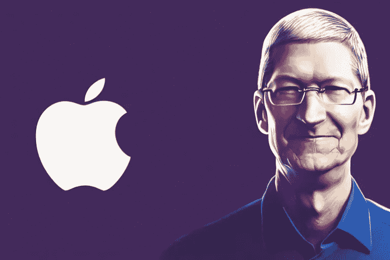

# 为什么史蒂夫·乔布斯让蒂姆·库克成为苹果公司的首席执行官

> 原文：<https://levelup.gitconnected.com/why-steve-jobs-made-tim-cook-the-ceo-of-apple-4816718ff9e0>

## 对于以事业为导向的人来说，这是一篇极好的信息文章

作者 Midjoirney AI

im Cook 于 2011 年加入苹果，自那以后，该公司打破了之前的所有记录，将其市值从 3480 亿美元增加到 1.9 万亿美元。苹果仍然是世界上最大的公司，继续主导智能手机行业。

> 史蒂夫·乔布斯曾称蒂姆·库克为“不做产品的人”。

尽管如此，他还是选择了库克，因为他的运营技能和对苹果供应和制造链的掌握，主要是在中国。

据波诺称，史蒂夫·乔布斯选择蒂姆·库克领导苹果的原因之一是他渴望“尝试不同的东西”，并愿意在出现任何问题时承担责任。

> “可能天生保守，他渴望尝试新的东西来解决问题，”博诺写道。"出问题时，他准备承担责任。"

在乔布斯宣布辞去首席执行官一职后，苹果董事长阿特·莱文森(Art Levinson)表示，“蒂姆有资格担任我们的新首席执行官，董事会对他的能力充满信心。蒂姆在苹果公司的 13 年里表现出色，他的工作一直显示出他的技巧和谨慎。

2011 年，史蒂夫·乔布斯因胰腺癌去世。乔布斯 56 岁的突然去世对库克来说是一个关键时刻。硅谷预计苹果将会崩溃。因为苹果已经建立了每年生产更新型号的模式，忠实用户关心他们最喜欢的产品创新的前景。

在此之前，与罗纳德·韦恩和史蒂夫·沃兹尼亚克一起，史蒂夫·乔布斯是苹果公司的联合创始人。但是，史蒂夫·乔布斯是苹果主要产品开发背后的驱动力，包括 Macintosh、iPhone、iPad 和 iPod。

尽管是联合创始人，乔布斯还是在 1985 年被迫离开苹果，因为董事会认为他对公司的发展没有做出重大贡献。然而，一旦乔布斯离开公司，事情就开始出问题了。在接下来的 12 年里，苹果换了三任首席执行官，他们都不具备为公司带来盈利的必要领导技能。

1997 年，史蒂夫·乔布斯重返公司，接任首席执行官。在那段时间里，乔布斯为公司提供了一系列尖端产品，其中之一就是 iMac。在将领导权交给蒂姆·库克(Tim Cook)之前，乔布斯的创造力和专注于创造少数伟大产品而不是大量普通产品的选择，最终使苹果免于破产。

乔布斯和库克的关系很友好。库克的供应链专业知识帮助 iPhone 公司实现了如今闻名遐迩的高毛利率。

> 根据布伦特·施伦德和里克·特泽利的书《成为史蒂夫·乔布斯:一个鲁莽的暴发户成为一个有远见的领导者的革命》，库克说，在他认识乔布斯的 13 年里，乔布斯只对他吼了“四五次”。

当库克发现乔布斯和他拥有罕见的血型时，他向乔布斯提供了部分肝脏。

> “我还没说完话，他就立刻阻止了我，”库克说，并补充说乔布斯说，“我永远不会那样做；我绝不会让你这么做的。”

在为苹果工作之前，蒂姆·库克在 IBM 和其他电脑公司工作了 12 年。他相信乔布斯是一个有创造力的天才，并认为他可能会极大地影响苹果公司，将这个苦苦挣扎的企业变成一个科技巨头。

库克做出了几项重大贡献，帮助苹果达到了目前的状态。库克成为全球运营高级副总裁后做的第一件事就是关闭麦金塔生产，并与制造商签署新合同，以减轻内部供应链的压力。

直到 2007 年，库克一直是苹果的高级副总裁，在此期间，他做出了几个对公司未来产生重大影响的重要选择。2005 年，他预计闪存将成为现代技术的关键组成部分。他在 it 投资方面的远见卓识在早期获得了回报，开发出了 iPod、iPad 和 iPhone 等重要设备。他塑造了公司的声誉，在保持低制造成本的同时，允许更高的商品市场定价。

> 2007 年，他被提升为运营主管；2009 年，他被任命为首席执行官。

根据 MacNews 的一篇报道，库克当时压力很大，有很多职责，因为很明显史蒂夫·乔布斯将是一个难以效仿的行为。然而，库克在担任首席执行官的第一年就取得了成功，为他赢得了《时代》杂志“100 位最具影响力人物”名单中的一席之地。

自 2011 年库克接管公司以来，苹果公司的股价飙升了 1000%以上，公司市值增加了 2 万亿美元以上。

据报道，这位苹果首席执行官至少有两条雄心勃勃的新产品线:传闻已久的电动汽车和 VR/AR 耳机。

# 分级编码

感谢您成为我们社区的一员！在你离开之前:

*   👏为故事鼓掌，跟着作者走👉
*   📰查看[级编码出版物](https://levelup.gitconnected.com/?utm_source=pub&utm_medium=post)中的更多内容
*   🔔关注我们:[推特](https://twitter.com/gitconnected) | [LinkedIn](https://www.linkedin.com/company/gitconnected) | [时事通讯](https://newsletter.levelup.dev)

🚀👉 [**加入升级人才集体，找到一份惊艳的工作**](https://jobs.levelup.dev/talent/welcome?referral=true)