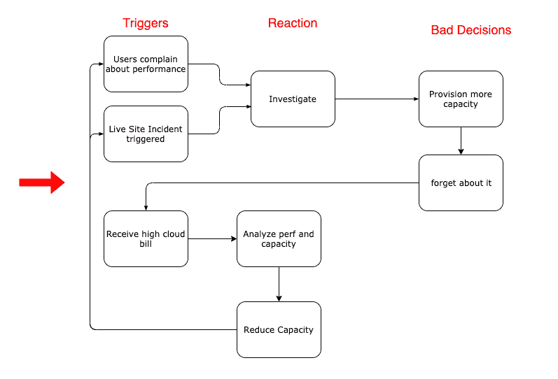
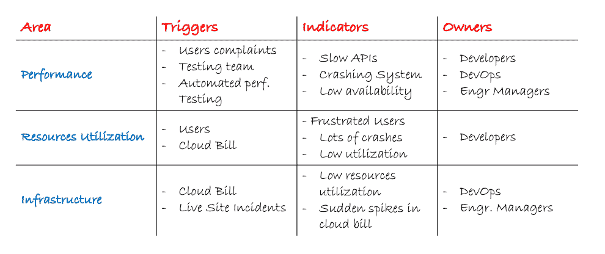

# 为什么采用 Kubernetes 的团队会在容量管理上争论不休？

> 原文：<https://levelup.gitconnected.com/why-teams-adopting-kubernetes-fight-over-capacity-management-81dda4419d4c>

*本文原载于*[https://www . magalix . com/blog/why-teams-adopting-kubernetes-fight-over-capacity-management](https://www.magalix.com/blog/why-teams-adopting-kubernetes-fight-over-capacity-management)

Kubernetes 容量管理是交付云原生应用的团队的核心能力。适当的容量管理可实现出色的客户体验、团队更快的创新，并最大化您的云基础架构的投资回报。然而，容量管理对许多团队来说是一个挑战，原因有三:

*   容量管理受到许多移动部分的影响，例如用户工作负载、应用程序体系结构和底层云基础架构，
*   您需要多个团队成员的参与来平衡性能、资源和运行云原生应用程序的成本，
*   很难对有效的 Kubernetes 和应用程序容量管理有一个共同的了解。

# 相互冲突的要求

开发人员、开发人员和工程经理是直接影响容量管理有效性的三个主要角色。让他们就有效的容量管理达成一致是一项挑战。每个角色都有自己完成工作的动机。团队成员的需求可能会发生冲突。例如，开发人员被鼓励快速发布特性。他们没有时间去分析和研究所需的资源或者提高代码的效率。让我们更深入地挖掘每个角色的动机。

## 开发商

开发人员发布特性并修复错误。在我看到其他人采用 Kubernetes 的经历中，我们看到开发人员受到以下因素的激励:

*   我希望我们容器的 CI/CD 管道快速可靠，例如:
*   几分钟后，我的代码就部署在我们的 Kubernetes 集群中了。
*   如果我的部署失败，系统仍然可以在以前的版本上运行。
*   我可以得到一份关于我的部署失败原因的详细而有意义的报告。
*   我们的 Kubernetes 集群具有足够的弹性，可以从任何短暂故障或资源问题中恢复。例如
*   我不必过于频繁地调整[资源请求和限制](https://kubernetes.io/docs/concepts/configuration/manage-compute-resources-container/)。
*   我不需要进行 CPU 和内存资源预算练习。
*   虚拟机故障是意料之中的，我希望我们的群集在警报响起之前快速恢复。
*   我们的可观察性管道(Prometheus + Grafana)为我提供了诊断问题的所有指标。例如:
*   我可以将用户体验与我的容器或微服务的性能联系起来。
*   我可以看到基础设施层面发生了什么。
*   我一直在改进云原生应用或服务的交付。例如

## DevOps

开发人员或基础设施工程师是确保产品交付其 SLA 的核心。他们正处于不断发展的基础架构、应用架构和业务需求的风暴中。开发人员通常受以下需求的驱动:

*   我希望我的 Kubernetes 集群[稳定安全](https://www.cncf.io/blog/2019/01/14/9-kubernetes-security-best-practices-everyone-must-follow/)。动作太快可能会破坏我们的基础设施或打开安全漏洞。控制这些对我们基础设施的稳定性至关重要:
*   网络策略和终端对互联网的暴露
*   完整的审计日志
*   部署版本
*   监控和可观察性管道
*   集群和容器日志
*   开发人员对 pod、容器和卷的访问
*   集群机密和配置
*   一些工作节点甚至主节点将在某一点发生故障。我应该有我需要的所有冗余来避免大的中断。
*   我希望开发人员独立部署他们的 pod 和容器。
*   我想确保我们的基础设施得到合理利用，同时不影响用户体验。
*   具有可预测的性能。我充分利用了它，并且我知道它会跟上用户工作负载的变化。

## 工程经理

工程经理使团队能够快速创新，尽可能有效地满足业务目标。他们的动机通常是这些需求:

*   我希望采用 Kubernetes 来使我的团队变得敏捷。运输功能和快速处理任何问题对我们的产品或服务至关重要。
*   我们可以衡量和提高团队的效率以及我们的应用和基础设施的最高投资回报率。
*   我希望我的团队将大部分时间用于核心业务需求/领域的创新。
*   我希望消除基础架构维护/增长和应用程序开发之间的任何摩擦。

## 其他利益相关者？

在许多情况下，业务所有者和产品经理也会影响重大业务事件的容量管理和规划。例如，营销活动可能会带来不寻常的流量。相应的业务负责人应该警告开发人员和开发人员预期的流量。这里的挑战是当有一个用户或流量的粗略估计。很难将其映射到特定的系统需求。许多团队最终为了安全起见而过度配置。

# 争用何时形成？

**陷入能力管理不佳的恶性循环。**当团队大部分时间变得被动时，他们会很快陷入糟糕的能力管理的恶性循环。应对糟糕的性能、现场事故(LSIs)或每月的云账单会让您的团队一直处于救火模式。你必须在某个时候切断这个循环。确保您的团队拥有正确的 KPI 和优先级，以主动处理容量管理的各个方面。

**对产能管理缺乏共识**。每个成员都从自己的角度看待世界。例如，开发人员关注微服务，而忽略或不太了解其基础设施的限制。此外，专注于一组指标而不考虑对系统其余部分的影响是一种危险的做法。我们已经看到，当开发人员希望提高 CPU 利用率时，他们会关闭应用程序。他们通常忽略了这些变化对应用程序的性能和使用模式的影响。

# 能力管理不佳的触发因素和指标

那么，您如何知道您的团队管理 Kubernetes 集群容量的方式是否有改进的空间呢？我在下面的表格中把它分成了任何团队都应该关注的三个方面。要正确评估您团队的效率，请回答以下问题:

*   您的团队获得这些触发的频率如何？
*   你的团队花了多少时间来应对这些触发因素？
*   你有几个团队成员总是按照这些触发条件行动，还是在整个团队中分布？

# 可以更协作吗？

我们了解到 Kubernetes 内部的容量管理是一项协作工作。Kubernetes 提供了基础设施的良好抽象。然而，你的团队仍然有很多互动点。团队仍然需要在容量分配、应用程序性能调优方面进行协作，当然，还需要节省云基础架构的成本。你可以在这里更多地了解这个话题[。](https://www.magalix.com/blog/which-one-should-you-prioritize-kubernetes-performance-cluster-utilization-or-cost-optimization)

如果您是开发人员，您需要:

*   声明 Kubernetes 集群中适当点的所有权
*   拥有您的应用和微服务的可观察性
*   确保您的应用或微服务需要的资源

如果您是 DevOps 工程师，您需要:

*   在你和团队其他成员之间建立一个清晰的互动工作流程。
*   掌握基础设施的可观察性，并确定 pod 如何利用可用容量。
*   了解您的公共云提供商的不同计费选项，以尽可能降低基础架构成本。

如果您是工程经理，您需要:

*   确保您的软件工程师和 DevOps 工程师执行了上述步骤:)
*   当您觉得您的容量管理偏离正轨时，请留意可能出现的争用。
*   建立清晰的 KPI 来跟踪容量的运行状况。你会在这篇文章中找到一些提示。

在 [Magalix](https://www.magalix.com/) ，我们可以在您的 Kubernetes 采纳之旅中为您提供帮助。您可以在[的一个仪表盘](https://www.magalix.com/product)中看到您的容器的性能、Kubernetes 集群利用率以及详细的成本分析。[立即免费连接您的 Kubernetes 集群](https://console.magalix.com/auth/#/register)，获得对您的 Kubernetes 集群的深入分析。您还可以在自动驾驶模式下运行集群，以根据预期的工作负载主动调整容量。

*原载于 2019 年 5 月 15 日*[*https://www.magalix.com*](https://www.magalix.com/blog/why-teams-adopting-kubernetes-fight-over-capacity-management)*。*