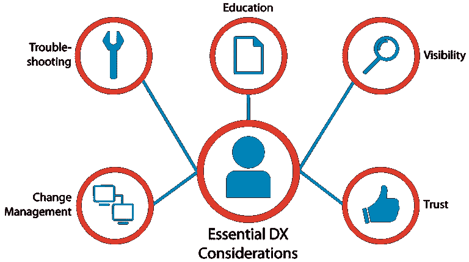
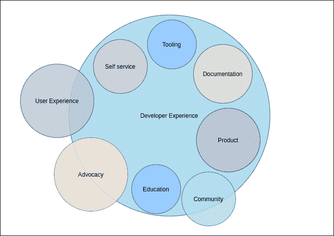

# 为什么团队应该关心开发人员的体验

> 原文：<https://levelup.gitconnected.com/why-teams-should-care-about-developer-experience-6604e70c9c6a>

[照片](https://unsplash.com/photos/QckxruozjRg)由[安妮·斯普拉特](https://unsplash.com/@anniespratt?utm_source=unsplash&utm_medium=referral&utm_content=creditCopyText)在 Unsplash 上拍摄

当谈到开发人员体验时，它完全是关于开发人员在一个组织内从事任何类型的产品时的感受；基于组织文化和协调，他们的体验可能是正面的，也可能是负面的。

有时代码和逻辑很简单，需要开发人员更少的努力。然而，当代码和逻辑难以实现时，它们经常需要开发人员的帮助。如果缺乏协调，这会导致开发人员感到沮丧，使他们认为他们的整体体验是负面的。开发人员的满意度始终是开发一个好产品的关键因素，因为从长远来看，它决定了成功和优秀软件的创建。

如今，组织通常努力确保他们的开发人员满意，或者确保他们的开发人员开心。

# 什么是开发者体验？

[**来源**](https://apiacademy.co/2015/04/api-design-102-the-developer-experience/)

[开发人员体验](https://www.getport.io/blog/developer-experience)是开发人员的感受和他们与团队其他成员的互动的结合，这使他们能够构建出满足业务需求的强大产品。对于他们来说，仅仅为产品设计布局和 CSS 已经不够了；对于他们来说，也有必要包括他们在创造产品时经历的事情。

在某些基本方面，开发人员体验和用户体验是相似的，因为开发人员是产品的第一个用户，他可以解释遵循了什么产品标准，他们是如何开发的，等等。当一家公司雇佣一名开发人员时，他们会根据代码片段或在线编码测试来评估他们的能力。然而，当公司在入职后将工作分配给开发人员，并且没有关于代码的文档，例如哪个代码片段负责哪个功能，开发人员理解它们变得极其困难。

如果开发人员没有收到任何关于如何处理这些片段的指导，这将对他或她在项目中的表现和生产力产生不利影响，这可能导致延迟或项目不具成本效益。

# 为什么我们需要团队中有开发经验的专业人员

开发人员体验可以等同于在开发过程中交付给开发人员的积极体验。它还提高了他们的生产力，并且在某些情况下有可能为组织带来成本效益。

[**来源**](https://dev.to/adyen/what-is-developer-experience-and-why-should-we-care-1k9i)

# 提高生产力

一旦开发人员体验被正确地实现，开发人员将能够快速地与他们的同事表达他们的意见，并从他们的经理或主管那里得到反馈。那些在发展领域工作的人非常清楚，他们能够以个人或群体的形式找到解决问题的办法。联系他们对他来说很简单，因为他已经在协调会议和团队午餐上认识了他们。结果，他们将很快收到输出。鉴于这种方法比以前更有效，它几乎肯定会有助于提高生产率。

# 代码质量的提高

在开发人员的经验中，我们经常有一个短的反馈回路给用户或开发人员，这保证了开发人员在提交代码后的短时间内会收到对他们代码的反馈。开发人员一收到输入，就会尽快解决任何错误，他们会尽一切努力确保同样的错误不会再次发生。它还有一个额外的好处，就是对组织来说成本效益高。因为它包含了许多不同开发人员的建议或批评，这种方法有助于提高代码质量。

# 如何实施

有各种方法可以用来提供奇妙的开发人员体验。我们将更详细地介绍其中的一些。

# 适当的文件

[文档](https://en.wikipedia.org/wiki/Documentation)是应该为每一项新技术或片段保留的东西，它给出了与主题、代码片段或公司内部信息流相关的基本信息。一般来说，如果一个人离开一个组织，这在初创企业中经常发生，新员工将无法处理这种情况，因为他们缺乏足够的信息。他们对这种做法感到不快和沮丧。为了确保开发人员拥有积极的开发体验，在公司内部持续更新每个主题的文档是至关重要的。

确保文档正确的一种方法是实现开发人员门户。一个内部开发门户可以包含许多关于过去流程的信息和许多自助服务方法，使数据请求和过去的历史对开发人员来说更容易访问。好的 DX 是通过减少开发人员不必要的认知负荷来定义的，这可以给它很大的帮助。

# 团队文化和协调

在工作场所，团队是协作实现共同目标的人的集合，在获得曝光率和在过程中变得更具成本效益方面，该目标对组织是有效的。例如，安全团队负责企业的整体安全，在发生紧急情况时，员工可能需要一周七天、一天 24 小时待命。因此，需要团队协作。在组织内建立积极的环境有助于建立有效的团队合作，让员工作为一个整体运作，同时也在他们之间创造一种归属感。

# 结论

开发人员体验对产品成长极其重要，拥有良好开发人员体验的产品更有可能被员工推荐给他们的同事、同行和朋友。因此，经理和工程师更关心如何改善开发人员的体验。

Developer experience 在创造愉快的工作氛围和提高产品线的生产率方面非常成功。因此，组织一直在努力改进他们的开发人员体验。