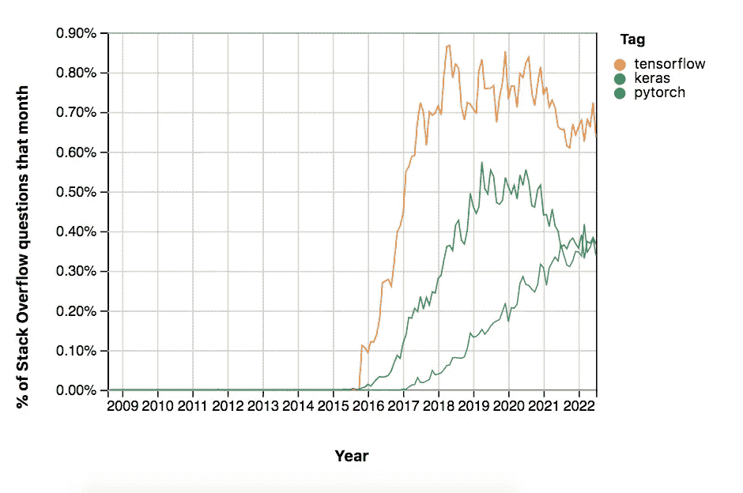

# 为什么 Python 的张量流正在慢慢消亡

> 原文：<https://levelup.gitconnected.com/why-tensorflow-for-python-is-dying-a-slow-death-ba4dafcb37e6>

## PyTorch 更容易使用，也更受许多开发者的喜爱

PyTorch 正在碾压 TensorFlow 的市场份额。

  R 全球战争一直是科技的基石。无论是辩论不同操作系统、云提供商或深度学习框架的利弊，几杯啤酒下肚，事实就被抛到一边，人们开始为他们的技术而战，就像这是他们的圣杯一样。

想想那些没完没了的关于 IDEs 的讨论。有些人更喜欢 VisualStudio，有些人使用 IntelliJ，还有一些人使用像 Vim 这样简单的老编辑器。关于你最喜欢的文本编辑器会如何评价你的个性，有一场[永无止境的辩论](https://towardsdatascience.com/what-your-favorite-text-editor-reveals-about-your-personality-f3d4f71f88c2)，当然这是半讽刺性的。

类似的战争似乎正在 PyTorch 和 TensorFlow 附近爆发。两个阵营都有大量的支持者。两个阵营都有很好的理由来说明为什么他们最喜欢的深度学习框架[可能是最好的](https://realpython.com/pytorch-vs-tensorflow/)。

也就是说，数据说明了一个相当简单的事实。TensorFlow 是目前最广泛的深度学习框架。它每个月在 StackOverflow 上收到的问题几乎是 PyTorch 的两倍。

另一方面，TensorFlow 从 2018 年左右开始就没有增长。PyTorch 一直在稳步增长，直到这篇文章发表的那天。

为了完整起见，我在下图中也包括了 Keras。它和 TensorFlow 差不多同时发布。但是，正如人们所看到的那样，它在最近几年已经衰落了。对此的简短解释是，对于大多数深度学习实践者的需求来说，Keras 有点[简单，太慢](https://www.simplilearn.com/keras-vs-tensorflow-vs-pytorch-article)。

PyTorch 仍在增长，而 TensorFlow 的增长已经停滞。图表来自[堆栈溢出趋势](https://insights.stackoverflow.com/trends?tags=pytorch%2Ctensorflow%2Ckeras)。

TensorFlow 的 StackOverflow 流量可能不会快速下降，但仍在下降。有理由相信，这种下降在未来几年将变得更加明显，尤其是在 Python 世界。

# PyTorch 感觉更像 pythonic

由谷歌开发的 TensorFlow 可能是 2015 年底深度学习派对上展示的首批框架之一。然而，第一个版本使用起来相当麻烦——任何软件的许多第一个版本都是如此。

这就是为什么 Meta 开始开发 PyTorch 作为一种手段，提供与 TensorFlow 几乎相同的功能，但更容易使用。

TensorFlow 背后的人很快注意到了这一点，并在 TensorFlow 2.0 中采用了 PyTorch 的许多最受欢迎的功能。

一个很好的经验法则是，你可以做 PyTorch 在 TensorFlow 中做的任何事情。你只需要花两倍的精力来写代码。即使在今天，它也不是那么直观，感觉很不自然。

另一方面，如果你喜欢使用 Python，PyTorch 感觉使用起来非常自然。

# PyTorch 有更多可用的型号

许多公司和学术机构不具备构建大型模型所需的强大计算能力。然而，就机器学习而言，规模才是王道；模型越大，其性能越令人印象深刻。

有了 [HuggingFace](https://huggingface.co) ，工程师可以使用大型的、经过训练和调整的模型，只需几行代码就可以将它们整合到他们的管道中。然而，令人吃惊的是，这些模型中有 85%只能与 PyTorch 一起使用[。只有大约 8%的拥抱脸模型是 TensorFlow 独有的。其余部分对两个框架都可用。](https://www.assemblyai.com/blog/pytorch-vs-tensorflow-in-2022/)

这意味着，如果你打算使用大型模型，你最好远离 TensorFlow，或者投入大量计算资源来训练你自己的模型。

# PyTorch 更适合学生和研究

PyTorch 以更受学术界赞赏而闻名。这不是没有道理的；[四分之三的研究论文](http://horace.io/pytorch-vs-tensorflow/)使用 PyTorch。即使在那些开始使用 TensorFlow 的研究人员中——请记住，他们更早到达深度学习的聚会——大多数人现在已经迁移到 PyTorch。

这些趋势非常惊人，尽管谷歌在人工智能研究领域占据了相当大的份额，并且主要使用 TensorFlow，但这些趋势仍然存在。

更令人吃惊的是，研究影响教学，因此决定了学生能学到什么。使用 PyTorch 发表大部分论文的教授更倾向于在讲座中使用它。他们不仅在讲授和回答关于 PyTorch 的问题时更加自如；他们也可能对它的成功有更强的信念。

因此，大学生对 PyTorch 的了解可能比对 TensorFlow 的了解多得多。而且，鉴于今天的大学生是明天的工人，你可能能够看到这一趋势的走向…

# PyTorch 的生态系统发展得更快

归根结底，软件框架只有在成为生态系统中的参与者时才有意义。PyTorch 和 TensorFlow 都有相当发达的生态系统，包括除 HuggingFace 之外的训练模型库、数据管理系统、故障预防机制等等。

值得一提的是，截至目前，TensorFlow 拥有一个比 PyTorch 稍微发达一点的生态系统。然而，请记住 PyTorch 是后来才出现的，并且在过去几年中有了相当多的用户增长。因此，可以预期 PyTorch 的生态系统在适当的时候可能会超过 TensorFlow 的生态系统。

# TensorFlow 拥有更好的部署基础设施

尽管 TensorFlow 可能很难编写，但它比 PyTorch 更容易部署。像 TensorFlow Serving 和 TensorFlow Lite 这样的工具使部署到云、服务器、移动和物联网设备的工作瞬间完成。

另一方面，PyTorch 发布部署工具的速度之慢是出了名的。也就是说，最近它已经非常迅速地缩小了与 TensorFlow 的差距。

现在还很难预测，但 PyTorch 很有可能在未来几年赶上甚至超过 TensorFlow 的部署基础设施。

TensorFlow 代码可能会保留一段时间，因为部署后转换框架的成本很高。然而，很有可能更新的深度学习应用程序将越来越多地使用 PyTorch 编写和部署。

# TensorFlow 不完全是关于 Python 的

张量流没有死。只是没有以前那么受欢迎了。

这其中的核心原因是很多用 Python 做机器学习的人都在转用 PyTorch。

但是 Python 并不是机器学习的唯一语言。这是机器学习的终极目标，这也是 TensorFlow 的开发者将其支持集中在 Python 上的唯一原因。

如今，[人们可以将](https://www.tensorflow.org/api_docs) TensorFlow 与 JavaScript、Java 和 C++一起使用。社区也开始开发对其他语言的支持，比如 Julia、Rust、Scala 和 Haskell 等等。

另一方面，PyTorch 非常以 Python 为中心——这就是为什么它感觉如此 Python 化。[有一个 C++ API](https://pytorch.org/cppdocs/) ，但是没有 TensorFlow 提供的对其他语言支持的一半。

很有可能 PyTorch 会在 Python 中超越 TensorFlow *。另一方面，TensorFlow 凭借其令人印象深刻的生态系统、部署功能和对其他语言的支持，仍将是深度学习的重要参与者。*

你的下一个项目是选择 TensorFlow 还是 PyTorch，主要取决于你对 Python 的热爱程度。

*成为* [*中等会员*](https://arijoury.medium.com/membership) *即可完全访问我的内容。*