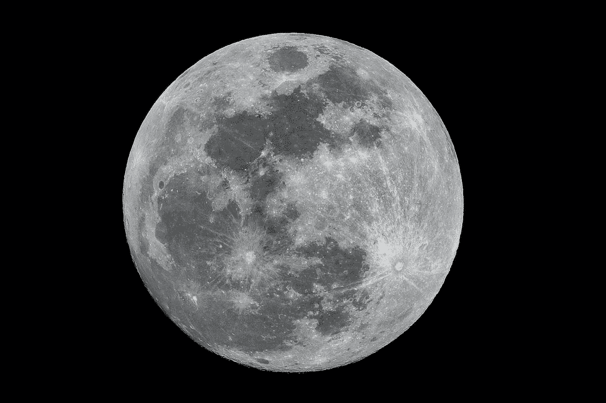
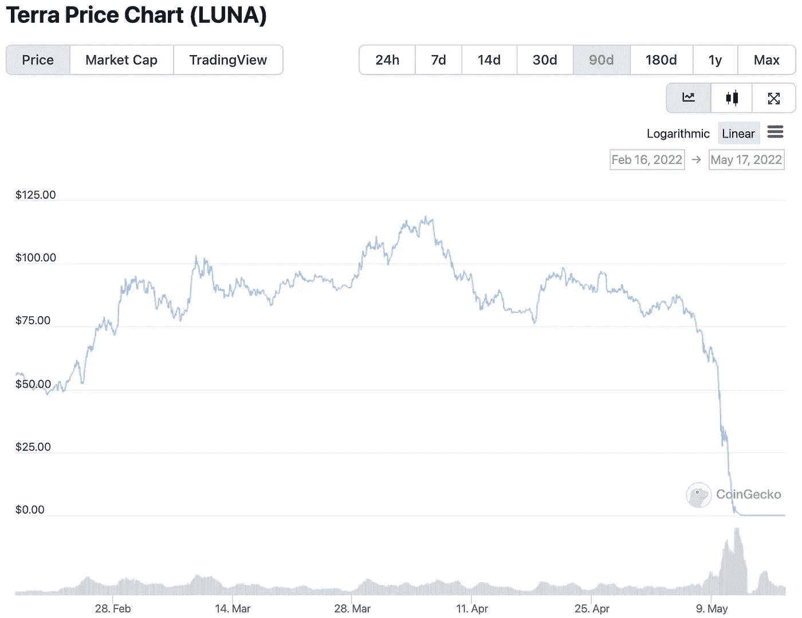

# 为什么 Luna 崩溃是加密货币市场最不需要的消息

> 原文：<https://levelup.gitconnected.com/why-the-luna-crash-is-the-last-piece-of-news-that-the-cryptocurrency-market-needed-18c8f21a75e9>

在可能成为今年最大的[加密货币](/reading-cryptocurrency-markets-is-it-possible-to-understand-trends-within-crypto-2f06b995e387)新闻事件中， [Luna](https://www.cointelligence.com/content/terra-stablecoin-review/) 及其稳定的兄弟货币 TerraUSD 的惊人崩溃，几乎在几天内就从加密市场上抹去了其全部价值。一种更受欢迎的货币出人意料地消失，在已经受到投资者抛售影响的投资领域引发了广泛的担忧。

现在，由于投资者担心进一步崩溃，注意力转向了其他硬币，如[、比特币](/bitcoins-disastrous-few-months-show-that-sustainability-is-the-world-s-most-sought-after-asset-f43e0ba24e40)和以太坊，以及市场领导者将如何应对席卷整个行业的最新一波负面情绪。

如上图所示，在 4 月至 5 月期间，Luna 从约 119 美元/美元的历史高点跌至 0.01 美元/美元，跌幅之大甚至连业内最大的机构都没有预料到。

在世界上最大的加密货币交易所币安的情况下，该公司在 2018 年向 Luna 投资了约 300 万美元，以换取 1500 万枚代币。这意味着就在一个月前，币安的代币总价值为 16 亿美元。今天，同样的代币价值约 2811 美元。

尽管损失如此巨大，币安 CEO 赵昌鹏声称，作为一个原则问题，他希望在 Luna 事故中损失的散户交易者在他的公司之前得到补偿。

“为了在保护用户方面以身作则，将放手让 Terra 项目团队首先赔偿零售[原文]用户，最后赔偿,(如果有的话)，[赵在周一的一条推文中解释道](https://fortune.com/2022/05/16/binance-luna-terrausd-ust-stablecoin-retail-investors-crypto-crash/)。

能否报销完全是另一回事。最近，露娜基金会守卫承认[它有 313 BTC 储备](https://fortune.com/2022/05/16/terrausd-stablecoin-crash-luna-foundation-guard-bitcoin-reserves/)，低于最初的 80，394，基金会的优先事项是优先退还 TerraUSD 的持有者，最小的持有者首先得到补偿。

虽然[加密货币的前景](https://en.freedom24.com/ideas/11841-cryptocurrency-for-portfolio-diversification)极其不稳定，但像 Luna 这样的主要资产以这种方式在几天内消失是罕见的。这一领域充斥着许多小盘股“地毯拉”，开发商只需在退出其在资产中的大量股权之前创造硬币投入市场，以压低价格——但这些股票通常更容易被发现，Luna 也没有因违规操作而崩盘。

一些投资者，比如人气很高的 YouTuber，KSI，宣布了 Luna 的重大损失。在 KSI 的案例中，他购买的价值 280 万美元的 Luna 在崩盘后跌至仅价值 1000 美元的[。](https://newsnero.com/youtuber-star-ksi-loses-2-8m-in-a-day-in-crypto-crash-after-luna-dropped-99-in-hours/)

现在，随着对加密货币的情绪受到进一步挑战，更广泛的行业出现了新的担忧。

# 对更广泛的加密货币行业的担忧

Luna 的崩盘规模如此之大，以至于有人将其与 2008 年雷曼兄弟(Lehman Brothers)投资银行的倒闭相提并论，后者导致美国当局不得不纾困一系列国内金融机构，以提振美国经济。

投资者的恐慌已经蔓延到比特币，目前比特币在 30 天内浮动超过 25%，交易价格约为 30，000 美元，比 2021 年 11 月公布的历史高点低 50%以上。

Luna 缺点的影响已经蔓延到股票市场，比特币基地股票在 5 月 4 日星期三到 5 月 11 日星期三之间暴跌了 58.72%。尽管 BTC 和瑞士联邦理工学院(ETH)等硬币经常受到缓和环境的考验，并卷土重来，但最近的下跌是在投资者普遍抛售和俄罗斯入侵乌克兰后市场进一步紧张的背景下发生的。因此，要理解复苏会有多简单要困难得多。

自由金融欧洲公司投资咨询主管 Maxim Manturov 认为，在 2021 年有利的市场环境之后，[加密货币市场](/encouraging-crypto-functionality-why-the-recent-cryptocurrency-crash-may-improve-the-ecosystems-e5260adcf05d)可能会遭遇重大调整。

“如果我们将 2021 年夏天的情况与当前的情况进行比较，当时比特币因通胀预期而增长，在某种程度上是黄金的临时数字替代品，有一个重要的区别值得强调；3 月 15 日，美联储开始了加息和结束 QE 的进程，”曼图罗夫指出。“这是过去两年所有比特币和加密货币增长的根本原因。随着利率的提高，加密货币等资产类别的吸引力可能会下降。”

虽然 Luna 崩溃的全部后果还有待观察，但在该行业最近的挫折之后，可能会有一些重大的监管分歧。事实上，美国财政部长珍妮特·耶伦(Janet Yellen)已经在 Luna 惨败后强调了适当监管的必要性，并在[向参议院](https://english.elpais.com/economy-and-business/2022-05-12/luna-crypto-crash-wipes-out-savings-of-thousands-of-investors-sparking-fears-for-sector.html)发表演讲时表示，她认为“这只是说明这是一种快速增长的产品，风险也在快速增长”。

当然，值得[记住的是，加密货币](/reading-cryptocurrency-markets-is-it-possible-to-understand-trends-within-crypto-2f06b995e387)的前景已经从更加不利的事件中引人注目地反弹，数字金融的未来仍然一片光明。然而，Luna 的影响可能会在项目透明度方面产生分歧。最近几周发生的事件应该对整个行业——从投资者到开发商——起到警示作用。