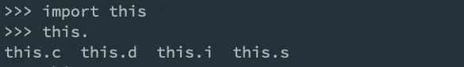

# 为什么不应该把 Python 的禅看得太重

> 原文：<https://levelup.gitconnected.com/why-the-zen-of-python-shouldnt-be-taken-too-seriously-1b8268c9eee3>

## 键入`import this`返回 Tim Peters 的 Python 之禅，但这只是皮毛。

对于任何不熟悉的人来说，在 Python 程序中评估`import this`将打印出 Python 的禅— *来吧，试试看！*你将会发现由 [Tim Peters](https://en.wikipedia.org/wiki/Tim_Peters_(software_engineer)) 编写的用 Python 写计算机程序的 19 个“指导原则”的集合。

虽然这确实是一套在面临困难决策时可以拿出来的奇妙原则(这里有[关于解释 Python 之禅的奇妙文章](https://medium.com/better-programming/contemplating-the-zen-of-python-186722b833e5))，但本文主要关注 Python 之禅中其他有趣的复活节彩蛋。

## 证明文件

在浏览`this`模块时，首先激起我兴趣的是文档。

> 以下文档是从 Python
> 源文件自动生成的。它可能不完整、不正确或包含被认为是实现细节的特性，并且在 Python
> 实现之间可能有所不同。如有疑问，请参考上述
> 位置的模块参考。

您可以使用`help(this)`亲自查看它们。

正如您所看到的，为这个模块提供的文档开始变得或多或少的无用，并以简单的混乱结束。只看数据标题，试着解读一下`c`、`d`、`i`、`s`的意思。

在这一点上，你的猜测和我的一样好。

## 看看引擎盖下面

像其他任何时候一样，我对一个模块是如何工作的很好奇，我一头扎进了源代码。我发现，`this`的实现本身也有点像复活节彩蛋！

接下来，我用`inspect`看了一下源代码:

运行上面的代码片段给我们提供了`this`的[源代码](https://github.com/python/cpython/blob/master/Lib/this.py):

## 什么？

显然写这个的人没听说过`Readability counts`。

我们现在可以看到`s`包含了某种字符串，但是用的是一种我不太熟悉的语言——让我们回到这个话题。`d`变量用一个空字典初始化，然后用于将 Unicode 字符相互映射。最后，`c`和`i`被用作双循环中的计数器变量。`c`循环通过两个数字，65 和 97；乍一看似乎完全没有意义，而`i`的范围高达`26`。

老实说，当我第一次看到这段代码时，我完全迷失了。

虽然这一开始并不明显，但通过一点谷歌的魔力，我发现我们在这个循环中创建的是一个 [ROT-13 映射](https://en.wikipedia.org/wiki/ROT13)解密。基本上，每个字符`s`需要移动 13 个字母才能产生 Python 的禅。数字 65、97 和 26 用于对 ASCII 字母进行编码(大写字母为 65 → 65+26，小写字母为 97 → 97 + 26)。

## 一塌糊涂

当模块的创建者都不能遵循指导方针时，怎么会有人认真对待 Python 的禅呢？

像 Python 语言的许多方面一样，这都是在幽默中完成的。`this`模块打破了之前在 Python Zen 中列出的所有准则。

这突出了我喜欢 Python 内核的原因之一——我们都是成年人。

感谢阅读！👋