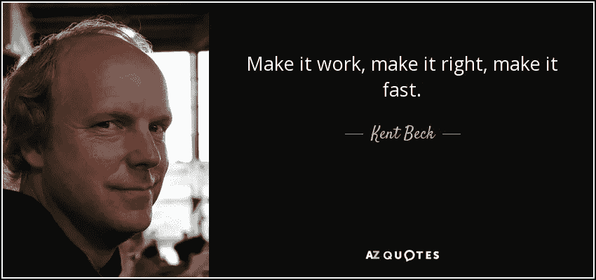
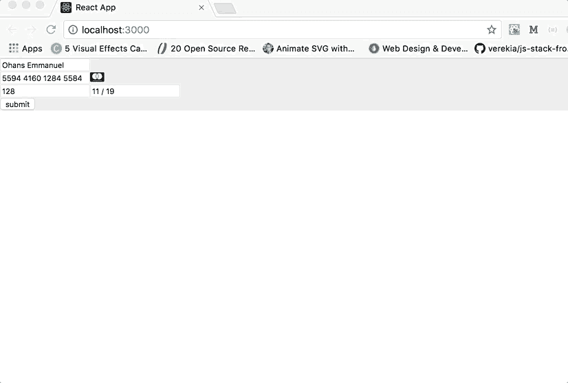

# 为什么这个建议会迅速毁掉你的前端职业生涯

> 原文：<https://levelup.gitconnected.com/why-this-advice-is-ruining-your-front-end-career-quickly-a3f0f08d23f7>

为什么每个人对这个编码建议都可能是错误的

## 你被解雇了！

> “如果你注定要成为一名清洁工，那就出去像米开朗基罗画的那样清扫街道。像亨德尔和贝多芬那样扫街作曲。像莎士比亚写诗一样扫大街。把街道打扫得如此之好，以至于天上地下的所有主人都不得不停下来说，这里住着一位伟大的清洁工，他把他的工作打扫得很好。”
> 
> ——小马丁·路德·金

# 作为一名前端工程师，你的职业是什么？

如果你不喜欢发人深省的文章，你会讨厌这个！如果你对诚实的分歧持怀疑态度，你可能会更讨厌这样。

> 坦诚的分歧是进步的好迹象。
> 
> —甘地

不管你在工作中的头衔是什么——前端设计师、网页开发员、前端工程师——有一点你不能否认:你的工作主要是处理公司面向消费者的产品。

产品是为用户造的，不是为树造的。公司是为用户服务而存在的，没有用户，企业的生命可能就没有了。

事实上，这是让你作为前端工程师的工作变得微妙的原因。非常精致。你不会一觉醒来，决定推出一款在用户面前完全损害公司形象的产品。

# 为什么这是个坏建议。

让它工作，让它正确，让它快。

如果你没有在岩石下开发过软件，那么你应该知道这句话。

我是敏捷实践的忠实信徒——这是加快产品发布速度的一个坚如磐石的建议。它工作了。

然而，在前端开发的背景下，这可能会导致你过早死亡😎。

现在看看下面的最小化应用程序。它的唯一目的是接受用户的卡输入，并将这些输入发送回服务器，这样用户就可以成功地进行购买。

有用！

让它工作？

它验证不正确的卡条目，并识别卡的类型——Visa、Master Card 或 Verve。用户收到视觉反馈并记录成功收集的数据。

那又怎样？你把这个运送到生产部门吗？

如果你不理解我的漫无边际的话，那句话里没有说让它漂亮，让它有用，或者让它用户友好。

没有任何东西直接与用户对话。

你可能会说“让它正确”就是这个意思。我不同意。这还不够明确。

# 这个建议是谁提出的？

肯特·贝克是一位了不起的美国软件工程师。他以开发极限编程和测试驱动开发而闻名。这句话被正确地认为是他说的。

虽然肯特的建议纯粹是坚如磐石，但伤害来自前端设计师的拙劣解释。

如果一个前端开发人员将一些非常丑陋的产品投入生产，解雇他。不假思索。

如果他说出“我只是让它工作了”这样的话，那我就更有理由解雇他了。

简单。

你不会去设计或制造丑陋的产品，因为你“让它工作了”

> “……这是不是有点像为你的晚年积蓄性爱？”
> 
> —沃伦·巴菲特

构建好的可用软件是你的工作。同样，你的工作也是让它们对用户来说更容易。退一步说，产品应该看起来不错。

现在考虑上面的简单演示支付应用程序。把这些交给一个有才华的工程师，他会让它工作，并为用户提供一个好的设计和体验。

把它变漂亮？

同样的应用，同样的功能，只是看起来更好用。

我听到许多前端开发人员说出“我只是让它工作了”这样的话，并以此为借口来发布可用性差的面向消费者的产品。多么悲伤。

这让我怀疑他们的工作有多出色。你热爱你的工作吗？

> “工作快乐的秘密包含在一个词里——卓越。知道如何做好一件事，就是享受它。”
> 
> ——赛珍珠

对于一个前端工程师来说，*做好，做对，做快，*是不完整的。也容易被误解。

## 我的建议:**让它工作，让它正确，让它漂亮，让它快。**

## 结论

虽然我不反对这句话本身，但我发现它对于每个用例来说都是不完整的。它不应该被前端开发人员用作发布不可用产品的借口。