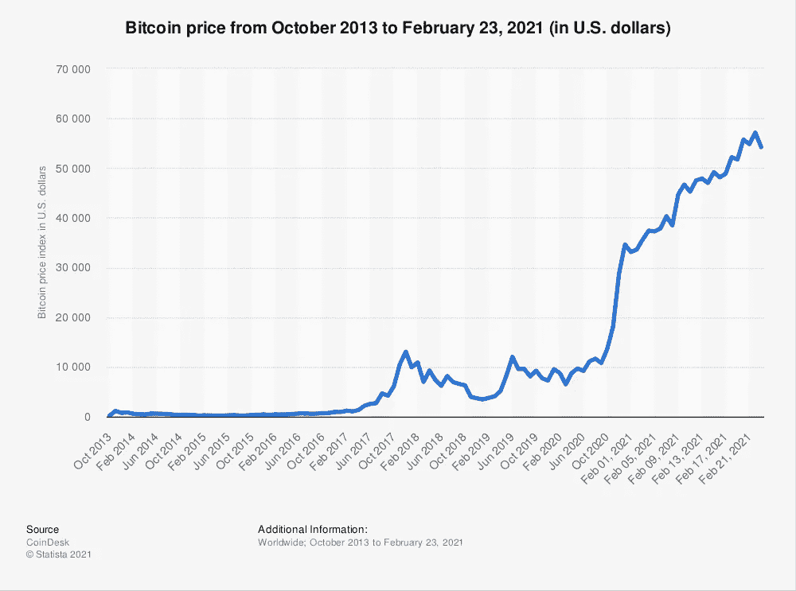

# 为什么现在仍然是购买比特币的好时机(如果你相信的话)

> 原文：<https://levelup.gitconnected.com/why-this-is-still-a-good-time-to-buy-bitcoin-if-you-believe-in-it-df9c2b77805d>

## 以及为什么您应该在此之前了解更多信息

Joshua Hoehne 在 [Unsplash](https://unsplash.com/s/photos/investment?utm_source=unsplash&utm_medium=referral&utm_content=creditCopyText) 上拍摄的照片

我们在生活中都有遗憾。

我不应该放弃 2015 格拉斯顿伯里音乐节的门票——我错过了观看我最喜欢的乐队喷火战机乐队在我最喜欢的音乐节上演出的机会。

我不应该租一辆新的奥迪 Q7。三年来，这就像有第二笔抵押贷款要还，是套在我脖子上的沉重负担。在汽车回到经销商手里之前，新鲜感早就消失了。

我本应该更快地从 PC 转换到 Mac——我本可以在等待老旧笔记本电脑启动的时间里节省几个小时。

我应该早点投资比特币。如果不是在一开始，那么肯定是在我第一次对它感兴趣的时候(如果没记错的话，是 2017 年)。我打消了这个念头，因为我确信这太复杂了，不值得投资。

今年，我终于坐上了比特币巴士——我担心自己在 23000 美元的牛市顶部买入了比特币，从那以后，我一直在往比特币里投入少量资金。我现在持有的数量仍然少得可怜，但如果我在本周早些时候的最高点卖出，我会获得名义上 61%的利润，这让我很兴奋。

# 上升的是…

上周末，Twitter(比特币酷孩子经常去的地方)上充满了乐观和兴奋的帖子。[“激光眼”迷因](https://www.forbes.com/sites/joewalsh/2021/02/19/heres-why-2-members-of-congress-have-laser-beam-eyes-on-twitter/?sh=752d4d3a293b)为许多侧面图增色不少——至少对多头和信徒来说是这样。

在怀疑论者一方，气氛是沉默和阴沉的。

随着价格突破 53000 美元，随着这一里程碑式的事件(比特币市值达到 1 万亿美元),这个泡沫真的很容易破裂吗？

即使不是这样，当价格处于历史新高时，现在投资还有什么意义呢？谁想高买低卖？

高调的看涨者热衷于强调，现在仍然是介入的好时机。卡梅伦·温克沃斯对历史上过去的创新做了一些有益的比较:

[卡梅伦·温克尔沃斯发推文](https://twitter.com/cameron/status/1364021251824619524?s=20)

还有这个…

[卡梅伦·温克沃斯的另一条推文](https://twitter.com/cameron/status/1363609465661046785?s=20)

最后，这个…

[卡梅伦·温克尔沃斯再发一条推文](https://twitter.com/cameron/status/1363111356145295365?s=20)

他的观点很明确——如果你认为比特币与第一架飞机、第一辆汽车和一些最大的科技巨头一样，也在改变模式，那么接受教育和持有股份从来都不是一个坏时机。比特币的生命仍处于早期。

那些一开始就冒险尝试新创新的人，将理所当然地享受到来自创新的吹嘘和沾沾自喜的满足感(当创新成功时)。

那些多年后跟进的人(比如我)不可避免地会错过早期的收获。他们可能害怕聚会迟到，但这真的足以说服他们不要参与吗？

当然，这取决于个人。

我决心长期持有比特币，并稳步缓慢地增加我的持有量。我天生的浮躁受到了抑制，因为我没有可支配收入来投资比特币。也就是说，我仍然很谨慎。比那些在比特币几块钱甚至几千块钱的时候买入的人更晚开始投资，对我来说关联不大。

作为一个相信比特币的长期好处及其潜力的人，我真正喜欢的是价格健康下跌，这样我就可以以更低的溢价购买更多东西。

虽然市场在小范围内发挥了作用，但我认为我的梦想不会很快实现。

# 价格调整(不是泡沫破裂)

2 月 22 日，价格再次跌破 50，000 美元，之后略有回升。这标志着不可避免的价格调整(或崩盘，取决于你的观点)，这似乎早就该发生了。

即使是最强劲的牛市也不会永远沿着陡峭的上升轨迹持续下去。市场周期性地上下波动。这种行为表现在所有资产上，不仅仅是加密货币。最重要的是长期趋势(以年为单位，而不是以天或月为单位)。

这是公认的投资逻辑，坚定的比特币怀疑论者故意曲解或认为在这里不适用。他们指出，比特币的波动性(本质上是一种短期特征)是比特币特有的弱点，这削弱了它作为长期资产的可行性。

他们忽略了一点，即比特币也是由长期趋势来判断的。用投资大师、著名比特币怀疑论者沃伦·巴菲特的话说:

> “如果你不愿意在十年内持有一支股票，那就别想在十分钟内持有它。”

他的逻辑同样适用于比特币。比特币因成为寻求快速赚钱的日内交易者的饲料而闻名，但还有更多人致力于购买并长期持有(或因比特币创造者的笑话而被称为[霍德林](https://en.wikipedia.org/wiki/Hodl))。

比特币价格的长期趋势似乎很明显:

来源:[coindesk.com](https://www.coindesk.com/price/bitcoin)通过[统计局](https://www.statista.com/statistics/326707/bitcoin-price-index/)

这并不意味着它的价值不会在未来大幅下跌——最重要的是长期趋势。像 MicroStrategy 和现在的特斯拉这样的机构投资者已经越来越相信它是一种安全的长期价值储存手段。

像[摩根大通](https://www.cnbc.com/2021/01/05/jpmorgan-bitcoin-price-could-rise-to-146k-as-it-competes-with-gold.html)、[高盛](https://www.coindesk.com/goldman-sachs-to-enter-crypto-market-soon-with-custody-play-source)、[万事达卡](https://www.mastercard.com/news/perspectives/2021/why-mastercard-is-bringing-crypto-onto-our-network/)、 [BNY 梅隆](https://www.wsj.com/articles/bitcoin-to-come-to-america-s-oldest-bank-bny-mellon-11613044810)和其他许多金融机构都加入了老派机构的行列，他们跳上了比特币的巴士，或者至少对它的长期存在抱有兴趣。

在我看来，面对金融机构“成年人”的这种言论，即使是最顽固的怀疑论者也必须努力保持愤怒。

# 你学得越多，挣得越多

自从今年早些时候接触比特币以来，我一直在尽我所能接受这方面的教育。尽可能多的学习似乎是明智的，不仅仅是学习技术细节，还要理解那些喜欢它的人和讨厌它的人提出的观点和论点。引用另一个自助餐主义:

> "你能做的最重要的投资是对自己的投资。"

在没有更多可支配现金来投资比特币的情况下，我认为花在学习这方面的时间是值得的。总结我到目前为止的学习，特别是关于[犯罪](/cryptocurrency-is-not-just-a-tool-for-criminality-6996c949c42)和[环境](/is-bitcoin-an-environmental-disaster-waiting-to-happen-d770e4bea5e9) FUDs，以及[比特币采矿](/bitcoin-mining-vs-gold-mining-vs-money-printing-9bbf6152e533)帮助我巩固了这些学习。

为了进一步支持我的策略，我刚刚听了蒂姆·费里斯和不可思议的凯瑟琳·焕最近的一次谈话，并且非常享受。焕是我最喜欢的人之一，她在很多话题上有很多有趣的观点可以分享——她听起来也是一个非常好的人。

在她之前担任美国联邦检察官期间，她参与了摧毁丝绸之路的行动，这是一个黑暗的网站，本质上是比特币故事的一部分。她对比特币世界的了解和洞察力令人羡慕。

她对听众的临别请求是鼓励他们花时间了解更多关于比特币、加密货币和区块链技术的知识。它呼应了我自己的观点，在涉猎了这些主题并遭遇了该领域存在的[两极分化观点](https://medium.datadriveninvestor.com/bitcoin-is-it-mandatory-to-be-a-lover-or-a-hater-78b6a7307dad)的力量之后——看起来我们都应该好好自学一下比特币，不管我们是否选择投资比特币。

# 最终想法

到目前为止，我写的大多数关于比特币的故事都有一个共同的主题——集体启蒙的需要。

*   相信值得投资？— *了解更多信息*。
*   相信它对环境有害吗？— *了解更多信息*。
*   相信它是犯罪的工具？— *了解更多信息*。
*   相信它不是真正的货币？—你明白了。

对于我们想要证明、反驳或者仅仅是容忍的任何想法，获得安慰和理解的唯一方法是学习更多。有了更多的知识和洞察力，我们至少可以做出明智的决定。

另一种选择？求助于主流媒体，在社交媒体上咆哮，并受其左右。

那些反对比特币的人会觉得现在投资不是个好主意，因为这意味着在泡沫破裂前以高价买入。他们可能会指出，最近的价值下跌是未来更大跌幅的迹象。

那些支持比特币的人会相信，这只是大事件的开始，未来的收益是有保证的，就像价格下跌不可避免一样。

作为一名长期投资者，我对未来几个月甚至几年将会发生什么很大程度上是矛盾的。我会继续每个月买一点，让平均成本平滑短期波动的影响。我会暗暗希望有几个下跌，这样我就可以增加我的持有量，而不必总是溢价买入，并希望长期趋势继续下去。如果一切都化为乌有(我不相信会这样)，那么我会愿意承认我错了，无论如何也不会把农场押在这上面。

如果有回报的话，也许几年后我可以再买一辆奥迪，或者甚至付钱给大卫·格鲁在我 80 岁生日派对上表演，如果那时我们都还活着的话！

注意:*本文仅供参考。不应将其视为财务或法律建议。在做任何重大财务决定之前，先咨询财务专家。*

## [如果你喜欢这篇文章，我希望你加入我的电子邮件列表。](http://bit.ly/TobyHazlewoodList)