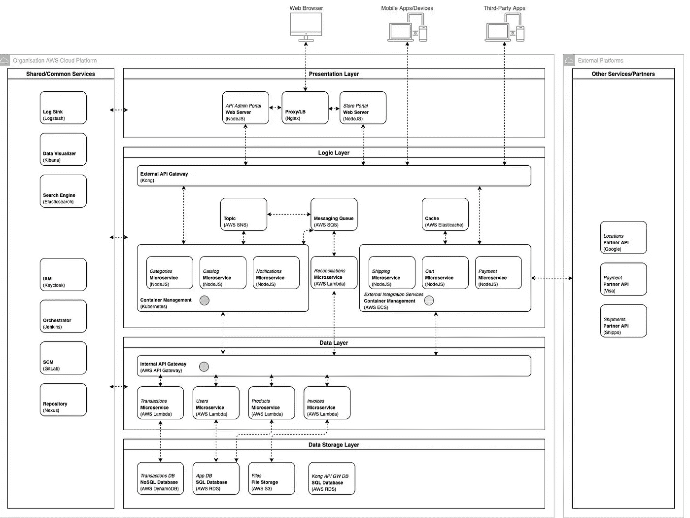
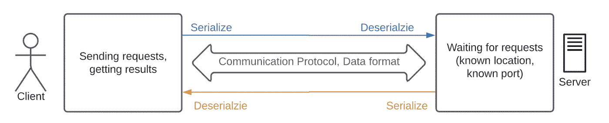
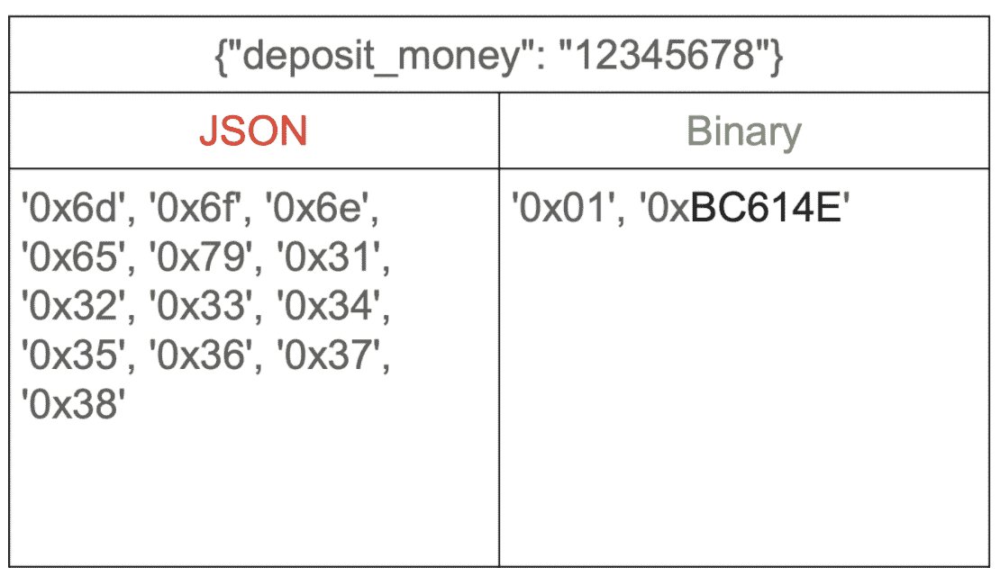
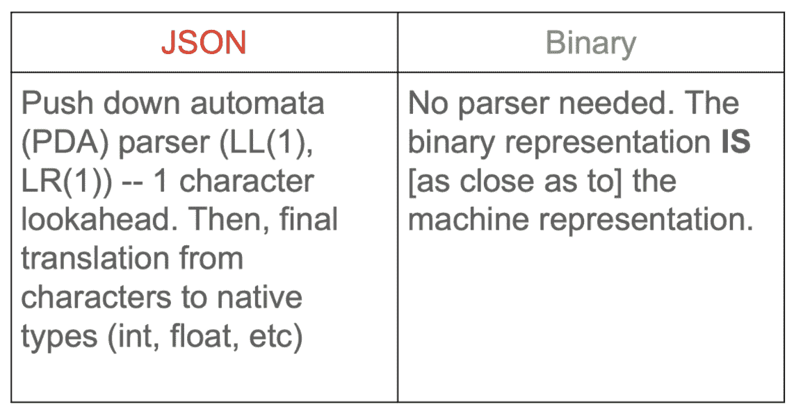

# 为什么对远程过程调用使用 gRPC 和 Thrift

> 原文：<https://levelup.gitconnected.com/why-use-grpc-and-thrift-for-remote-procedure-calls-a4627a9abe6>

克里斯·克雷默在 [Unsplash](https://unsplash.com?utm_source=medium&utm_medium=referral) 上的照片

通常，每当有人想要开始为他们的网站构建一个 HTTP API 时，他们几乎完全使用 REST 作为首选的架构风格。与 RPC 和 GraphQL 等替代方法相比，他们更喜欢 REST。

REST 适用于大多数情况，尤其是当您构建一个没有复杂的应用程序内通信的整体应用程序时。当您构建一个由许多定期相互通信的后端服务组成的应用程序时，问题就来了。这种架构的一个例子可以是这样的。

图片由 Jimmy Soh 在[https://medium . com/the-internal-startup/how-to-draw-used-technical-architecture-diagrams-2d 20 c 9f da 90d](https://medium.com/the-internal-startup/how-to-draw-useful-technical-architecture-diagrams-2d20c9fda90d)上提供

# 当建筑变得复杂时

快速、灵活、易于扩展和简单的架构非常重要。但是您拥有的服务、端点和业务逻辑越多，架构就可能变得越复杂。有许多设计问题。

首先，每个端点都需要 Swagger 文档和契约测试。API 端点越多，需要实现的文档和测试就越多。例如，支持面向最终用户的公共 API 和面向内部调用的简化 API 需要编写两次 API。这可能是可以管理的，如果不是因为其他因素会增加开发人员的复杂性的话。

如果从其他几个服务调用底层服务，每个服务使用不同的语言，我们需要为每种语言重写 API SDK、数据模型和其他服务的代码。这种重写不仅包括代码本身，还包括单元测试、文档、持续集成工具和其他方面。因此，多语言支持需要非常高的准确性和开发团队的关注。

不仅额外的语言会增加复杂性，同一种语言的不同版本也会增加复杂性。向后兼容性问题需要密切关注，尤其是当有许多依赖项时。此外，一种语言的库中的更改可能会在另一种语言的库中丢失。因此，即使一个额外的依赖项也会增加复杂性。

照片由 [Matthieu Joannon](https://unsplash.com/@matt_j?utm_source=medium&utm_medium=referral) 在 [Unsplash](https://unsplash.com?utm_source=medium&utm_medium=referral) 拍摄

由于所有这些问题，进行更改需要大量的工程师时间，并且有引入错误的风险。同时，网络的开销必须是可管理的。如果一行中的几个服务为每个 API 调用编码和解码 JSON 数据，那么高负载网络很容易过载。

# 寻找解决方案

虽然 GraphQL 是一个很好的解决方案，但它仍然不是直接微服务通信的最佳解决方案。使用一个 GraphQL 模式作为 API 网关，每次微服务契约输入和输出发生变化时，API 网关端的模式都需要改变。如果每个微服务有多个 GraphQL 模式，GraphQL 的目的就落空了。GraphQL 是整个应用程序数据的模式，允许在一次往返中获得数据。

对于我们的例子，我们将考虑 RPC 方法。为了理解为什么 RPC 方法优于前面的解决方案，让我们看一下这个简单的分布式体系结构图。

图片作者:Oleksandr Piekhota

这里，请注意一些事情。首先，在发出请求之前，客户端需要序列化数据。服务器需要在收到数据后以及发送响应时对数据进行反序列化。

对于客户端和服务器之间的交互，使用正确的通信协议和数据格式非常重要。理想情况下，数据应该是紧凑的，快速编码和解码，并且它们的协议应该是优化的。

## 数据紧密度

图片作者:Oleksandr Piekhota

与 JSON 格式相比，二进制格式显然更加紧凑。

## 数据编码/解码时间

图片作者:Oleksandr Piekhota

二进制格式显然也比 JSON 格式快。

## 那么为什么不直接使用二进制格式呢？

原始二进制格式实际上是否更容易使用是有争议的。为了便于使用二进制格式，我们需要为数据创建二进制规范，实现编码和解码功能，开发良好的调试工具，并编写良好的文档。

即使我们提高了 API 通信的性能，我们仍然需要解决多语言微服务通信的问题。这就是 RPC 的用武之地。一个可能的解决方案是以某种语言无关的方式描述我们的数据模型，这样我们就可以为每种语言生成相同的模型。这需要使用一个 **IDL** ，或者接口定义语言。IDL 中的数据模型代码可以用作 RPC 调用的输入。

这意味着我们还需要一个多语言的 RPC 框架来支持我们的数据结构。对于栈中的每种语言，都有开发 IDL 库和 RPC 框架的替代方法。

# gRPC 和节俭派上用场了

是的，使用 IDL 可以解决微服务的通信问题。使用 IDL，您可以创建一个模型，然后使用代码生成工具，您可以生成可以包含在您的业务逻辑中的目标语言模型。这解决了跨不同语言重用相同模型的问题。

一个好的 IDL 还具有足够的可读性，可以用作文档，消除了对 Swagger 和 API 规范的需求。使用 RPC 框架，我们解决了为几种语言复制客户端请求库的问题。我们还简化了我们的 API，因为 RPC 比 REST API 简单得多。使用 RPC 框架，不需要编写自己的 REST 客户端。

亚历山大·辛恩在 [Unsplash](https://unsplash.com?utm_source=medium&utm_medium=referral) 上的照片

gRPC 和 Apache Thrift 是两个最流行的 RPC 解决方案，它们都基于 IDLs。它们有助于解决管理复杂微服务网络的问题。

*本文是与*[*airSlate*](https://www.airslate.com/?utm_source=Medium&utm_medium=Articles&utm_campaign=airslate_homepage&utm_id=grpc_and_thrift)*的软件工程师 Oleksandr Piekhota 共同撰写的，作为对 air slate 技术讨论的一部分。*