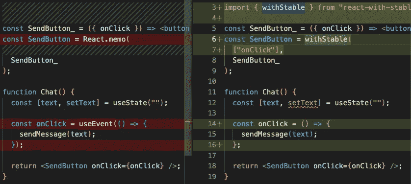

# 为什么 useEvent 不够好(这里有一个更好的解决方案)

> 原文：<https://levelup.gitconnected.com/why-useevent-is-bad-and-here-is-a-better-solution-c61ee507a82e>

> 我作为软件工程师在脸书工作，创建了拥有大约 4000 颗星星的 repo。

这篇文章将使你相信 [useEvent RFC](https://github.com/reactjs/rfcs/pull/220) 并不是功能组件中回调问题的完美解决方案。我将解释`useEvent`的缺点和陷阱，并提供更好的解决方案。

# 使用事件 RFC

[这里是 RFC](https://github.com/reactjs/rfcs/blob/useevent/text/0000-useevent.md) 的链接。
强烈建议在阅读本文之前先阅读 RFC。

在 RFC 中，`useEvent`旨在解决两个问题:

1.  提供`**stable identity callbacks**`，这样得到事件回调道具的组件就不会重新渲染了。
2.  异步得到`**fresh values in callbacks**`***。解决在闭包中捕获过时值的问题。***

***然而，`useEvent`并没有很好地解决这两个问题。***

# ***稳定身份回调***

***`useEvent`可以提供稳定的身份回调。
[使用事件 RFC 的例子](https://github.com/reactjs/rfcs/blob/useevent/text/0000-useevent.md#basic-example):***

# ***更好的解决方案***

***试试这个包[反应稳定](https://github.com/oney/react-with-stable)***

***用`**withStable**` HOC 包装`SendButton`，并明确声明`**onClick**`为稳定道具。就是这样！这些都是你要添加的代码。
**无需包装事件回调**！！！！！！！！！！***

***记住，即使你使用了`useEvent`，你仍然必须使用`React.memo`来包装组件，以消除不必要的重新渲染。***

***我们来比较一下:***

******

***`useEvent`的缺点和`withStable`的优点是:***

## ***🔴 1.[`useEvent`]无法包装内联回调***

***在一个循环中呈现组件列表是很常见的。我们利用闭包的好处在回调中传递`item`。但是这里不可能使用`useEvent`，因为任何钩子都不能在**循环**和**条件**中使用。***

## ***✅ 1.[【T2]]适用于内嵌回调(例如循环)***

## ***🔴 2.[ `useEvent` ]每次都需要使用事件，并且容易忘记***

***像`useCallback`，为了优化，每次都要用`useEvent`包裹。这在 RFC 的[缺点](https://github.com/reactjs/rfcs/blob/useevent/text/0000-useevent.md#drawbacks)部分有所说明:***

> ***与普通的事件处理程序相比，用`useEvent`包装看起来更嘈杂。***

***事实上，useEvent 的计算和内存成本很便宜。它真正的成本是开发的成本(即 [DX](https://medium.com/swlh/what-is-dx-developer-experience-401a0e44a9d9) )，需要开发人员记忆和编写代码。***

## ***✅ 2.[ `withStable` ]一次包装，随处优化***

***比方说在`useEvent`发布之后，你有一个子组件要优化，有 10 个父组件在使用它，你必须重构来写`useEvent` 10 次！***

***相比之下，你只需要用`withStable`包装子组件一次，所有的父组件都会得到优化。***

***那就是我们所说的 [DX](https://medium.com/swlh/what-is-dx-developer-experience-401a0e44a9d9) 。***

## ***🔴 3.[`useEvent`]对条件值没有帮助***

***说`onOdd`和`onEven`是稳定的，但是条件`text.length % 2`变化频繁，所以`SendButton`无法得到导致重渲染的相同身份回调。这在 RFC 的[缺点](https://github.com/reactjs/rfcs/blob/useevent/text/0000-useevent.md#drawbacks)部分有所说明:***

> ***类似`onSomething={cond ? handler1 : handler2}`的“条件事件”案例***

***为了解决这个问题，我们必须定义一个由`useEvent`包装的新回调，这是令人不快的。***

## ***✅ 3.[ `withStable` ]也适用于条件值***

## ***🔴 4.图书馆用户的负担***

***库用户需要知道哪些回调属性是 useEvent-safe(只在事件处理程序中使用，不在渲染中使用)。
如果在渲染中使用了`useEvent` -wrapped `submit`，那么[会抛出](https://github.com/reactjs/rfcs/blob/useevent/text/0000-useevent.md#functions-called-during-render-still-use-usecallback)。***

## ***✅ 4.【`withStable`】库制作者做性能优化***

## ***简短的***

1.  ***`useEvent`不能用于循环和条件中的内联回调。***
2.  ***为什么不一次包装，随处优化？***
3.  ***让组件维护者优化，组件用户免费获得。***

## ***奖金***

***`withStable`也将有助于忽略依赖列表中的稳定回调。[该问题](https://github.com/reactjs/rfcs/blob/useevent/text/0000-useevent.md#linter-plugin)在 RFC 中有说明:***

> ***从父组件传递的`useEvent`函数必须被声明为依赖项。***

***linter 通过检查`withStable(["onClick"]`就能搞清楚哪些道具是稳定的，所以`handle*`或者`on*`的命名约定就没必要了。
linter 还可以检查一个稳定的道具是否被传递给了一个子组件的非稳定道具。***

# ***在回调中获取新值***

***`useEvent` RFC 还想解决闭包中的[过时值问题，例如:](https://github.com/reactjs/rfcs/blob/useevent/text/0000-useevent.md#useeffect-shouldnt-re-fire-when-event-handlers-change)***

***需要注意的一点是，回调中的值只有在调用不同步时才可能过时，比如在`await`之后或者回调被异步调用*。****

***`useEvent`获取新值的模式有一些陷阱和缺点:***

## ***1.需要在效果之外定义新的回调***

## ***2.无法访问效果内部的值***

***以这个丹的微博为例***

***假设我们定义了一个新的变量`count`，并希望在每一个节拍中增加它。***

***这意味着如果我们想使用`useEvent`，我们需要放弃 JavaScript 闭包的好处！`useEvent`迫使我们跳出当前闭包，进入由`useEvent`包装的组件级回调。***

## ***3.总是不能得到新的值***

***这是一个非常严重的陷阱。在 await 或异步回调之后，很容易意识不到一些值不再新鲜。
这在 RFC 的[缺点](https://github.com/reactjs/rfcs/blob/useevent/text/0000-useevent.md#drawbacks)部分有所说明:***

> ***你不会得到真正“活”的绑定。***

***定义一个新的回调`onChecked`对我来说看起来更糟。***

***我个人不喜欢上面的代码。它失去了使用 async/await 语法的意义。***

# ***更好的解决方案***

***试试这个包[效果更好](https://github.com/oney/react-better-effect)***

***将`{theme}`注入到`react-better-effect`的`useEffect`，然后通过效果中的`$.theme`得到主题。***

***优点:***

## ***1.不需要在效果之外定义新的回调***

## ***2.可以通过停留在当前闭包中来访问值***

## ***3.总是异步获取新值***

***永远不要担心价值观过时。***

## ***简短的***

***在我看来，使用`useEvent`来确保新值有点**反模式**会导致太多问题。***

# ***摘要***

***`useEvent`可以解决 React 中回调的部分问题，但仍有一些问题没有解决，会导致陷阱。我可以想象`useEvent`会导致很多不必要的重构，比如将`useEvent`的事件处理闭包和效果闭包移到组件级。它使代码更加丑陋，但仍然不能修复回调的所有问题。***

***`withStable` HOC 真的可以解决“[应该到处用](https://github.com/reactjs/rfcs/blob/useevent/text/0000-useevent.md#drawbacks) `[useCallback](https://github.com/reactjs/rfcs/blob/useevent/text/0000-useevent.md#drawbacks)` [吗？](https://github.com/reactjs/rfcs/blob/useevent/text/0000-useevent.md#drawbacks)“困惑。以我最粗略的估计，React 应用中 90%的回调都是事件回调。如果使用`withStable`，我们可以减少 90%的`useEvent`甚至`useCallback`的使用。***

***即使当 [React Forget](https://www.youtube.com/watch?v=lGEMwh32soc) 退出并自动包装回调，但**仍然无法区分**回调是渲染回调还是事件回调。这意味着开发人员必须**显式地注释**一个关于渲染或事件的回调。***

***我个人推荐 React 核心应该包括来自 [react-with-stable](https://github.com/oney/react-with-stable) 的`withStable` HOC(合并到`React.memo`)和来自 [react-better-effect](https://github.com/oney/react-better-effect) 的更好的`useEffect`。它们更优雅、更有力地解决了回调问题。***

***— — — — — — — — — — — — — — — — — — — — — — — — —***

# ***附录***

***[react-with-stable](https://github.com/oney/react-with-stable) 和 [react-better-effect](https://github.com/oney/react-better-effect) 的核心思想是:
让回调**用户/消费者/使用站点**决定他们想要如何使用回调。***

***这个想法在 RFC : `Wrapping events at the usage site`中也有[的介绍，但是`useEvent`只能为`useEffect`做，不能在传递回调道具给组件的时候做。](https://github.com/reactjs/rfcs/blob/useevent/text/0000-useevent.md#wrapping-events-at-the-usage-site)***

***举个例子，***

***对于`useSyncTitle`，`format`应根据效果而定。
对于`useShowRating`，`format`应该不在效果之内。
对于`Movie`，`format`应该不是稳定回调。
为`Like`，`format`可以稳定回调。***

***使用[稳效](https://github.com/oney/react-with-stable)和[稳效](https://github.com/oney/react-better-effect):***

# ***总是包装回调***

***我支持总是用`useCallback`包装一个回调，不管它是事件处理程序还是渲染或特效的派生回调。***

***`useCallback`是`useMemo`的快捷方式。[文档](https://reactjs.org/docs/hooks-reference.html#usememo)描述`useMemo`为:***

> ***这种优化有助于避免每次渲染时进行昂贵的计算。***

***但是`useMemo`不仅仅是为了避免计算昂贵的值，也是为了记忆相同的**非原语**值(即 JavaScript `object`和`function`)以避免**不必要的重新渲染和效果重新触发**。***

***这是因为如果我们不为`object`或`function`设置`useMemo`或`useCallback`，即使新旧值实际上没有区别，在比较时也会被认为是不同的(即`Object.is`或`===`)。***

# ***归类回电***

***不要将回调分为`event handlers`或`non event handlers`。***

***将回调分为`reactive`或`unreactive`。***

## ***对于接受回调属性的组件:***

1.  ***如果回调在**渲染**中使用，组件希望它成为**反应**。***
2.  ***如果它在**事件处理程序**中被使用，组件希望它成为**无效**。***

## ***使用效果:***

1.  ***如果回调应该触发效果，应该是**反应式**。***
2.  ***如果没有，应该是**未反应**。(异步获取新值是另一个需要解决的问题)***