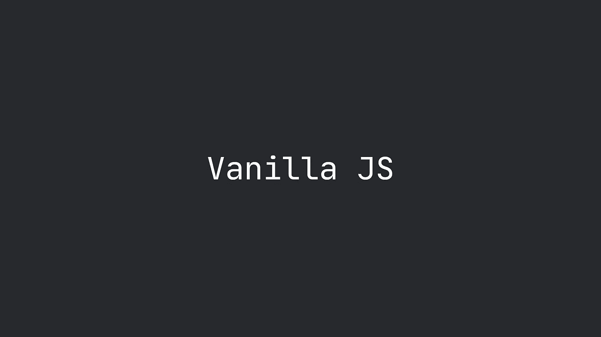

# 为什么是香草 JS？

> 原文：<https://levelup.gitconnected.com/why-vanilla-js-9555acf812bf>



我必须承认，当我开始用 JavaScript 编程时，我对这种语言了解不多。我错过了基础知识，尽管我知道 jQuery 只是一个库，但我太习惯于它了，以至于我几乎把它当作编程语言来引用。

我不知道这是否是一种共同的感觉，但至少有一点是真实的，否则，就没有必要给 JavaScript 本身取一个新名字。外面还有香草冰淇淋吗？还是什么*香草 Python* ？还是*香草 Java* ？

答案是否定的……除了 JavaScript。其实**香草 JS *就是* JavaScript** 。没有图书馆。没有框架。没什么。只是编程语言本身。

真正打开我思维的是我的第一次工作经历，我进入了一个新的世界，一切都变得更加清晰。我会解释为什么。

正如我在[我的第一篇文章](https://medium.com/@vanillacode/javascript-for-novice-front-enders-how-to-start-cab8cd6871c0)中提到的，我最近更接近一种“更纯粹”的方法。我很幸运，在选择如何做我的工作时有一定的自由度，所以尽管有所有的限制和准则，我有机会选择和摆脱不必要的依赖。差不多了。

只要有可能，我更喜欢使用 JavaScript 的本机特性，而不是——也许——更好但可避免的库功能。以下是候选名单:

*   当我可以使用`querySelectorAll('.whatever-selector')`的时候，没有必要使用`$('.whatever-selector')`，它很干净，而且它准确地说明了它的作用
*   同理，我能做`element.appendChild(child)`的时候也不需要`$element.append($child)`
*   当我可以简单地做`myArray.map(...)`时，我也不需要`_.map(myArray, ...)`

看起来好像我讨厌库和框架，但事实并非如此。我认为仅仅因为某样东西存在并且每个人都在使用它就使用它，这不是一个好的策略。尤其是如果那些相同的东西是语言本身所支持的，并且它们易于使用并且清楚地表达了它们的目的。

> **快速提示:**您想知道如何用普通的 JavaScript 编写东西吗？你可能会点头需要 jQuery 可能就是你要找的！…或者只需谷歌一下，在网上搜索一下！

了解您正在使用的工具是开发的一个非常重要的方面，它使您更加意识到您正在做什么以及每一行代码的含义。

所以，我给你的建议是保持好奇，犯错误，然后*阅读代码*。我的意思是，阅读别人的代码，试图理解它，甚至是回顾它，是学习新东西和塑造你的思维方式的好方法。

# 闪光的未必都是金子

虽然对 JavaScript 的深入了解只会对你有利，但现实生活中的问题与你可能寻求的乌托邦式的线性关系相去甚远。

浏览器并不总是实现所有最新的 ECMAScript 规范特性，即使它们中的一些早就决定放弃支持和更新，它们仍然被大量的人使用。

传统浏览器——想想 Internet Explorer——缺少许多功能，而这些功能是当今 JavaScript 编程的基础。这通常需要开发人员寻求替代解决方案:

*   **使用旧的语法和技术** : IE 不支持 ES6 类和字符串文字:

```
// This will not work on Internet Explorer
class Person {
  constructor(name, age) {
    this.name = name;
    this.age = age;
  } sayHi() {
    return `Hi, my name is ${this.name} and I am ${this.age}`;
  }
}// This will work
var Person = function(name, age) {
  this.name = name;
  this.age = age;
}Person.prototype.sayHi = function() {
  return 'Hi, my name is ' + this.name + ' and I am ' + this.age;
}
```

*   **添加 polyfill**，或者换句话说，使用覆盖或定义有用函数的脚本，这些函数部分或根本不受早期 ECMAScript 规范的支持，例如 array `includes`方法:

```
const luckyNumbers = [1, 2, 7, 9];// This will not work on Internet Explorer
function hasWon(number) {
  return luckyNumbers.includes(number);
}hasWon(9); // This will work
function hasWonIE(number) {
  return luckyNumbers.indexOf(number) >= 0;
}hasWonIE(3);
```

*   **通过名为 *transpilers* 的工具，将代码**转换到规范的早期版本，也就是将它转换到早期版本——通常是 ES5，这样更多的浏览器将能够执行它。transpilers 之王毫无疑问是巴别塔。

这是什么意思？嗯，除了剥夺我们使用更新更完整仪器的乐趣之外，这通常意味着代码缺乏清晰度。开发人员应该始终记住，无论他们写什么，最终都会被其他人审阅或阅读。保持代码的整洁将使将来的任何更改更容易应用。

如何看待 JavaScript 中大量使用库和框架？你是一个普通的 JS 支持者还是有不同的看法？请在下面的评论中告诉我:)