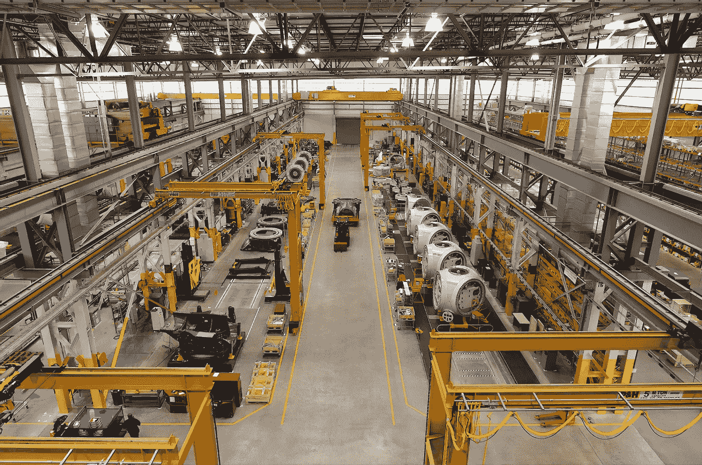

# 为什么我们需要对机器人征税！

> 原文：<https://levelup.gitconnected.com/why-we-need-to-tax-robots-a6d76e5f6729>

作为一个社会，我们从未为之前的工业革命做好准备，这可能是我们社会中不平等差距和贫困的原因。我们需要为第四次工业革命做准备。

来源:高清科技 via【Unsplash.com 

我们正在见证第四次工业革命的开始，通常被称为“机器人启示录”。与其妖魔化和恐惧技术革命，不如让我们为它做好计划和准备。

在全球范围内，越来越多的公司正在采用和利用机器人、人工智能和自动化来快速跟踪生产。

这对他们来说是理想的，因为机器人不会生病，不需要支付工资和奖励，最重要的是再见工会行动。

尽管如此，负面影响要可怕得多:

*   当自动化接管人们失去工作，失业的人无法缴纳所得税，影响政府的收支。
*   随着政府税收的减少和负担的增加，如何补贴社会补助金和国家？
*   失业的公民没有购买力，因此无法对经济做出贡献，这将导致社会陷入全球衰退和大萧条。

为了解决这个问题，有人提议征收机器人税，为此，应该明确界定和概述机器人的定义。

什么是机器人，它能被赋予法律人格吗，我们已经给公司赋予了法律人格。这使得公司能够签订合同，对自己的行为负责并纳税。这同样适用于机器人。

# 我们如何向机器人征税？

*   一种选择是在企业层面征税，如果一家公司依赖自动化和算法，就应该征税。这种征税方法应该与公司应该支付的工资相对应。
*   第二个选择有点超前，但正如我所说，我们需要做好准备。第二种选择包括对机器人本身征税。这是未来派的，因为机器人的行为还没有得到补偿。
*   另一个方法是对机器人征收增值税。增值税是在你购买食品或服务时征收的消费税。我们再次需要玩转定义，由医生或人类律师提供的医疗服务与由算法提供的服务。算法一样有效，如果不是更好，但他们是一样的。

最后，我们需要在国际层面(如联合国)协调这些法律，以避免“机器人避难所”。此外，双重征税的问题是一个紧迫的问题。如果我们向企业征税，难道我们不应该扣除与设计机器人、监督机器人和软件开发相关的费用吗？

# 额外资源

 [## 对机器人征税的理由——或者不征税

### 你的 Roomba 需要 W-2 吗？可能不会，但在讨论更严肃的话题时，这是一个有趣的想法…

mitsloan.mit.edu](https://mitsloan.mit.edu/ideas-made-to-matter/case-taxing-robots-or-not)