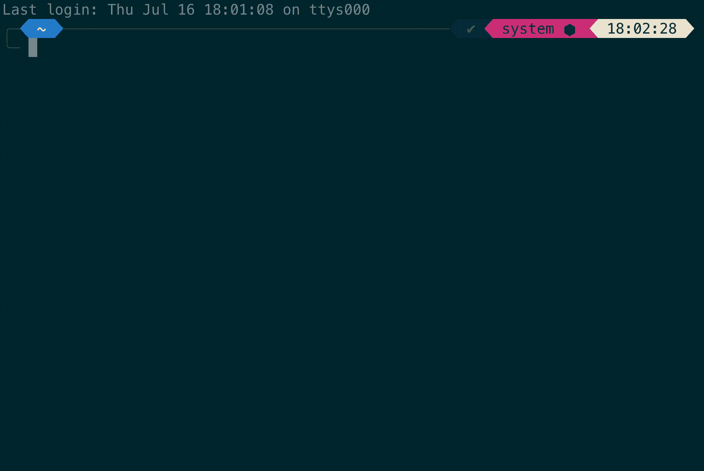

# 为什么我们应该建立自己的工具:托尔图加的故事

> 原文：<https://levelup.gitconnected.com/why-we-should-build-our-own-tools-the-story-of-tortuga-3b7d5c09f5dc>

## Git 助手的想法如何成为我公司的无价工具

由[弗拉德·乔姆帕洛夫](https://unsplash.com/@tchompalov?utm_source=unsplash&utm_medium=referral&utm_content=creditCopyText)在 [Unsplash](https://unsplash.com/s/photos/ants?utm_source=unsplash&utm_medium=referral&utm_content=creditCopyText) 拍摄的照片

我非常支持开发我们自己的工具。作为开发人员，我们执行许多大大小小的重复性任务。使用适当的工具可能会使这些任务变得更容易。

我们经常过于专注于解决更重要的问题。但是有时候，一个工具的价值并不一定是一个真正的问题。我们必须找到工作流程中的最佳点。

> 最好的投资是自己行业的工具

这是我为什么以及如何构建一个多库 Git CLI 助手工具 Tortuga 的故事，以及我在做这件事时学到了什么。

# 找到你的最佳点

在我的公司，我们每天都要处理大量的 Git 仓库。我们的主要产品由一个核心项目和多达 3 个特定于客户的子项目组成——每个子项目都在自己的存储库中。

目前，我的`code`文件夹中有 20 个存储库需要定期获取、推送和重新存储。我使用的大多数 Git 工具都专注于一次处理一个存储库。有时你会错过一些东西，你可能会在 rebase/merge 地狱中结束。

我们需要一个工具来更新我们所有的存储库，尽可能减少摩擦。在看到我的同事和我自己每天都在为这个琐碎的任务而奋斗之后，我决定让它自动化。

# 规划托尔图加

尽管它只是一个内部工具，我还是把它当作一个真正的项目。我本来可以事先不做太多计划就编写一个小的 shell 脚本，然后就完成了。但是，如果一个工具必须处理一定数量的复杂性和边缘情况，我们应该*做好*。

构建工具会消耗时间和精力，我们需要明智地使用它们。定义需求、用例、风险、长期维护等。，将极大地有助于实现最好的结果。

## 定义需求

思考我们的工具，这些是浮现在脑海中的基本要求:

*   获取、推送和重置多个存储库
*   并行，不是串行
*   易于分发
*   适用于所有开发机器(Linux、macOS 和 Windows)

似乎很简单。但是再深入一点，更软的需求和“拥有更好”的需求出现了:

*   优雅地处理未提交的更改
*   一次处理多个存储库(多线程)
*   显示变化/试运行
*   CI/CD 注意事项
*   开源发行版

## 使用案例

不要只考虑你会如何使用这个工具。询问您的同事该工具的用途对他们意味着什么，以及他们打算如何使用它。只有这样，作为工具的开发者，每一个可能的用例对我们来说都是可见的。并且我们可以从早期开始最小化工具的错误和误用。

在与我的同事交谈后，发现了一个额外的“用例”:“单目录”使用。如果我们在一个已经是 Git 存储库的目录中调用这个工具会怎么样？如果我们只是检查存储库的子文件夹，该工具不会做任何事情。但是为什么我们不能更新单个目录呢？该工具将多个 Git 命令压缩到一个调用中，因此在单个存储库中使用时也可以节省一些时间。

## 风险评估

我们的工具也应该尽可能安全。但是绝对安全是一个不可能的目标。

在我们的小 Git 工具中，安全性很简单。我们需要保存未提交的更改，方法是在获取后隐藏并重新应用它们。而不使用`git push --force`。即使出了问题，我们还是会去仓库。

## 长期支持

我们的工作在我们的作品首次发布后并没有结束。如果这个工具是好的和有帮助的，它可能会被使用很长一段时间，并成为某些工作流的必要组成部分。

如果由于操作系统更新而出现故障，该怎么办？如果开发人员已经不在公司了，并且由于缺少文档或者所使用的编程语言，没有人能够接手，该怎么办？

可维护性应该影响我们对最终选择的构建部分的考虑。这并不意味着我们必须使用我们一直使用的语言和框架。但是找到与你的开发伙伴的共同点将会有很长的路要走。

文档通常是事后才想到的。但是即使在小的或个人的项目中，它也能拯救我们。仅仅因为我们现在知道每一个细节的“为什么”和“如何”，并不意味着我们在 6 个月后就知道了。

它不必是一个拥有自己的 wiki 的完整项目文档。但是记录我们的设计决策，尤其是那些不明显的，是必不可少的。

# 使用什么语言

为托尔图加岛选择正确的语言并不容易。我编写的大多数 CLI 工具都是从一个简单的 shell 脚本开始的，并且很可能一直如此。但是其中一个要求是“并行”以提高性能。

在某种形式下，使用 shell 脚本可以实现多线程。但在我看来，这种复杂性不值得。尤其是在有其他选择的情况下。

你可能从我的其他文章中知道，Java 是我的*日常驱动程序*。它也是我公司使用最多的语言。似乎是天生的一对。

我们可以用 Java/GraalVM 等构建[单个本机可执行文件。甚至还有 Git](https://www.infoq.com/articles/java-native-cli-graalvm-picocli/) [的纯 Java 实现。但是如果我想到“CLI”，我通常不会想到 *Java* 。](https://www.eclipse.org/jgit/)

就像选择语言一样，我们必须考虑工具链的复杂性。因此，尽管 Java 和 GraalVM 令人印象深刻，但它们并没有入选。

最近，两种语言被越来越多地用于构建 CLI 工具: [*Go*](https://golang.org/) 和 [*Rust*](https://www.rust-lang.org/) 。

我还没有充分利用 *Go* 或 *Rust* 来做出明智的决定。两者都是很棒的语言，能够构建很棒的 CLI 工具。那么选哪个呢？

## 戈朗

Go 宣称自己简单、可靠、高效。在我看来，这是真的。有些人可能会说，这种简单性是以失去功能和固执己见为代价的。但这也是为什么 Go 如此成功，是一门如此伟大的语言的首要原因。这很容易理解，即使你没有记住。一个简单的跨平台工具链可以构建本机的、无依赖性的、单一的可执行文件。

它勾选了很多满足托尔图加岛要求所需的选项。但是我也想给铁锈一个机会。

## 锈

Rust 宣称自己是可靠和高效的。如果你知道*锈*，你就知道“简单”这个词的缺失是有原因的。这种语言是为绝对的可靠性、正确性和性能而设计的。这就是为什么学习曲线比 *Go* 更陡的原因。

它在正确性上很严谨，使用了一个“[借位检查器](https://doc.rust-lang.org/1.8.0/book/references-and-borrowing.html)”，保证内存安全。我们将在开始时与它“斗争”,甚至让我们的代码只是编译。

但是，除了简单的盒子之外，它也为托尔图加做了很多选择。

## 哪一个？

为了更好地理解我的选择的含义，我决定用两种语言构建一个小型原型。开始一个小项目并使用两种语言的工具让我意识到一些事情:Tortuga 不会是一个低风险的关键任务工具。

Rust 的正确性和有保证的内存安全所需要的额外的精神负担不值得去努力，至少对我来说是这样。这并不意味着我不相信 Rust 对于 CLI 工具来说不是一种优秀的语言，恰恰相反。

尽管我喜欢 *Rust 的*想法和概念，但为了降低入门和可维护性，我选择了 *Go* 。

# 实施 Tortuga

构建工具本身并不难，除了一件事:*实际上*使用 Git。

Tortuga 需要能够执行以下 Git 操作:

*   获取本地分支名称(`[rev-parse](https://git-scm.com/docs/git-rev-parse)`)
*   获取上游分行名称(`[rev-parse](https://git-scm.com/docs/git-rev-parse)`
*   计数提交(`[rev-list](https://git-scm.com/docs/git-rev-list)`)
*   抓取遥控器(`[fetch](https://git-scm.com/docs/git-fetch)`
*   获取当前状态(`[status](https://git-scm.com/docs/git-status)`)
*   重定基数(`[rebase](https://git-scm.com/docs/git-rebase)`)
*   按下遥控器(`[push](https://git-scm.com/docs/git-push)`)
*   保留未提交的更改(`[stash](https://git-scm.com/docs/git-stash)`)

最初，我计划使用一个基于 *Go* 的 Git 实现来避免任何依赖。但是我发现的库，比如`[go-git](https://github.com/src-d/go-git)`，并不支持所有需要的特性。

另一个选择是通过`[git2go](https://github.com/libgit2/git2go)`使用 C 库`[libgit2](https://libgit2.org/)`。但是在 *Go* 中使用 C 代码带来了我不想要的复杂性。包括实现凭证处理、Git 配置文件等。，全靠自己。

最后，我通过`os/exec`直接使用本地安装的 Git，并解析输出。

起初，我不太喜欢依赖启动一个进程和处理它的输出。但这是使用 Git 最简单的方式，它的行为就像用户直接使用 Git 一样。此外， [GitHub CLI](https://github.com/cli/cli/blob/master/git/git.go#L51) 也是以同样的方式构建的，所以不会有那么大的错误，不是吗？

## 开源

开发从托管在我们内部 BitBucket 服务器上的项目存储库开始。我本可以将最新版本放在我们的 NAS 上，并告诉我的同事在哪里可以找到它，然后就可以收工了。但是更新和错误修复呢？当我接近第一个可发布的版本时，我决定带着标签版本转移到 [GitHub](https://github.com/benweidig/tortuga) 。尽管我的公司是 Tortuga 的唯一用户(据我所知)，我强烈认为我们应该共享我们的工具。

转移到 GitHub 也允许使用 [Travis CI](https://travis-ci.org/) 。仅用 YAML 的 3 行代码，这个项目就免费获得了自动构建和测试。

现在，一个单独的`make release`将构建代码，运行测试，并为所有支持的平台创建一个新版本:Linux。deb-file)、macOS (.tar.gz 二进制)和 Windows(zip。exe-file)，适用于 32 位和 64 位。

macOS 用户也可以使用我的私有[家酿 tap](https://github.com/benweidig/homebrew-tap) 始终获得最新版本。总有一天，我需要为 Linux 版本创建一个 PPA…

开源这样一个内部使用的小工具似乎很愚蠢。但是，如果它与我们的具体项目没有太紧密的联系，或者没有透露任何秘密，为什么不呢？也许有人会以类似的方式使用它，或者可以为自己的工具使用一些代码。

# 结论

构建工具可能很有趣，有时也会令人沮丧。尤其是当我们决定使用新技术或未知语言的时候。这不是我写过的最好的代码。但是我学到了很多关于 Git、 *Go* 和在 GitHub 上发布东西的知识。

 [## 本威迪格/托尔图加

### CLI 工具，用于一次获取/推送/重置多个 git 存储库。

github.com](https://github.com/benweidig/tortuga)  [## benwei dig/家酿水龙头

### 我的私人自制水龙头。

github.com](https://github.com/benweidig/homebrew-tap/)