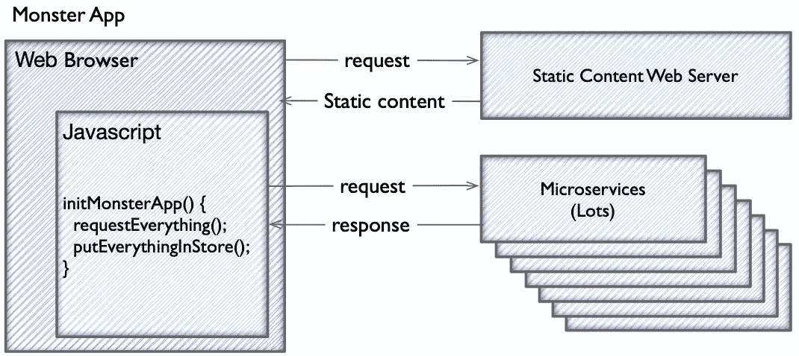
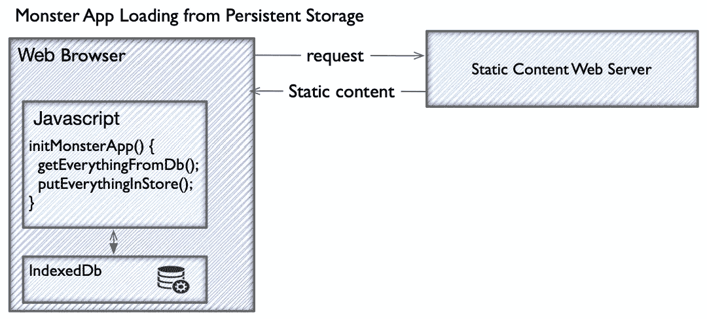
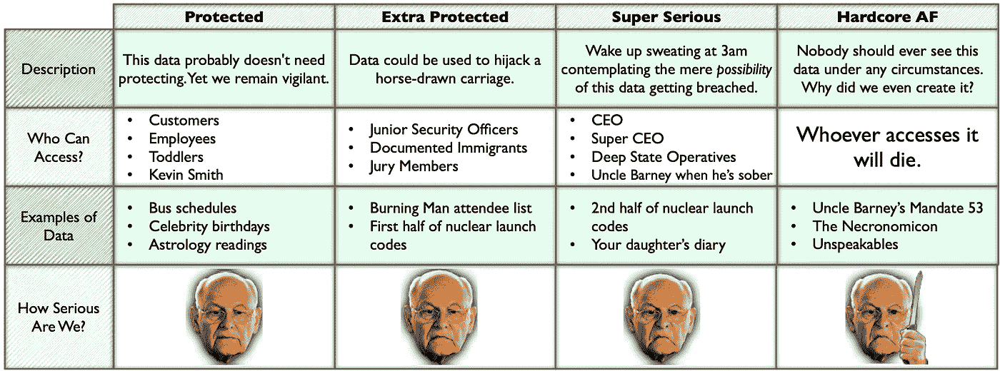
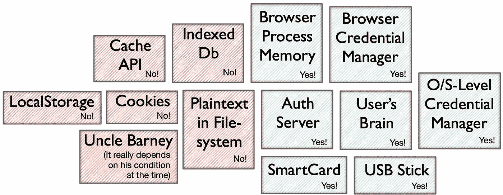
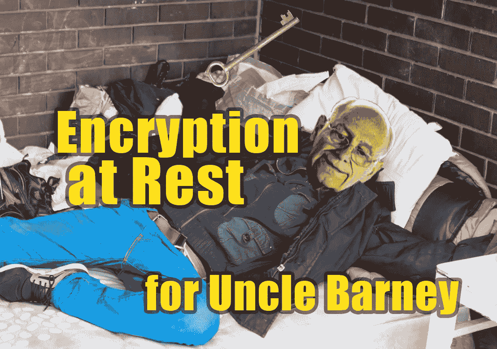

# 为什么 Web 应用程序需要静态加密？

> 原文：<https://levelup.gitconnected.com/why-would-a-web-app-need-encryption-at-rest-3efd10c145e1>

2016 年左右开始思考[线下先](https://offlinefirst.org/)技法。我的团队负责的这个 web 应用程序，像许多有用的应用程序一样，它一个功能一个功能地成长为一个邪恶的怪物。出于简单和 NDA 的原因，我将称这个东西为“怪物应用”。

**7/9/22 更新:**我发布了 [web-enc-at-rest NPM 包](https://www.npmjs.com/package/web-enc-at-rest)，它极大地简化了创建静态加密 web 应用程序。

没有一个工程师了解 Monster 应用程序的每一部分。但是我们喜欢认为，在我们所有人之间，我们有足够的知识来保持它运行良好。

啊，可爱的小崽崽。你永远不会成长为一只危险的老虎，对吗？

但是我们美丽的、不断成长的动物出现了问题。

在我们的设计中，当 Monster App 启动时，用户需要的几乎所有数据都是从服务中加载的。这些数据被放入内存存储(Redux)中。在商店被填充后，用户在应用程序中移动时对服务的调用大大减少了。

非常典型的温泉设计。除了预先加载所有数据。

这种“预先获取”的方法有一些优点:

*   可以优化服务请求以避免多余的呼叫，例如，避免每次到达网页屏幕时都呼叫服务。
*   通过将加载逻辑放在一个代码位置，可以更容易地跟踪每个服务请求所需的先决条件(例如，调用端点 A 以获得调用端点 B 所需的 ID)。
*   整个 web 应用程序的逻辑得到了简化，用户在使用该应用程序时无需进行服务请求和数据准备情况检查。

这个设计有这么多优点！怎么可能是正确的选择呢？

# 等待应用程序加载

我们的应用程序的加载屏幕几乎和这个一样好。

怪物应用程序的加载时间非常糟糕。用户有时会在登录后等待一分钟以上，才进入应用程序并使用它。我们对此感到很难过。我们为用户制作了一个非常漂亮的加载屏幕。

我敢肯定，在 Monster App 生命之初的某个时刻，加载时间并不可怕，比如两秒钟。但是随着新功能的增加，我们不断增加更多的服务请求。而预先获取的方法成了越来越糟糕的选择。

# 如果我们使用持久存储会怎么样？

一天下午，我想为美好的未来而奋斗。所以我花了几个小时测试一个想法。

我只需将整个内存存储区保存到浏览器的持久存储区(IndexedDb)中。当 web 应用程序加载时，它将从持久存储中加载，而不是进行服务调用。

只需从浏览器的持久存储中加载相同的数据，而不是从服务器中。

我使用的是“持久存储”的更一般的定义，这意味着在设备关机后可以保存和保留数据的地方。令人困惑的是，有一个 web API 使用同一个术语来表示更具体的东西。

完整的解决方案需要更加复杂，例如，如何智能地更新持久存储缓存中的陈旧数据？但最重要的是，我只想看看它有多快。

所以我黑进了这个变化，并测试出来…

现在，Monster App 从永久存储器中加载所有内容大约需要*一秒*。

我和这个孩子一样快乐。我甚至像奶牛一样快乐。

这比 Monster App 平均 60 秒的加载时间有了惊人的提高。我有一个真正的“10 倍”解决方案。看到那种速度让我感到兴奋。

# 离线第一锅开始沸腾

那一天，我围绕一个想法开始了与自己的精神对话:web 应用程序可以通过持久存储或其他方式在本地获得所有或大部分数据。你只需要在真正需要的时候呼叫服务。

后来，我发现其他工程师称这种方法为“离线先”。

有一场运动似乎在 2015 年左右加速，然后可能在 2019 年左右稍微平息。我不确定为什么。也许是 Covid 或一些主要倡导者的倦怠。但不管怎样，离线优先仍然是一个非常好的主意。

老实说，在我看来这不仅仅是个好主意。看起来是一个还没有完全流行起来的*明显的*想法。但是我不擅长预测未来，所以我不会把那个鼓敲得太重。

# 那么我们修复了怪物应用程序吗？

是的。不。算是吧。

重组、提升和离职时有发生。维护 Monster App 不再是我的工作。另一个团队最终基本上重写了 Monster App。他们将一些服务调用从初始负载中移出。初始加载速度变快了一点。也许这是一个“2 倍”的解决方案，而不是我可爱的“10 倍”的解决方案。

不满意的故事，嗯？

是啊，我也是这么想的。我不是说公司做错了。出于工程以外的复杂原因，这个项目不适合采用离线优先的方法。

# 我的线下第一梦的新障碍

另一个项目出现了——姑且称之为“闪亮项目”。闪亮计划是一个从零开始的努力，带有“为了子孙后代做好这件事”的感觉。哪个工程师不喜欢这样？

我提出了一个设计，允许应用程序数据存储在浏览器的持久存储中。一位被分配到 Shiny 项目的架构师做了一些研究，并带回了一个障碍，稍后我将对此进行解释。

在我们公司，或许也包括你们公司，我们有一项政策，将所有数据分类为敏感类别。根据数据的类别，在构建使用数据的软件时，您必须满足某些要求。

您可以自由采用此数据分类政策供自己使用。

上面的图表是我对一个实际上很有价值的想法的滑稽模仿。[数据分类](https://www.indeed.com/career-advice/career-development/data-classification-types)降低您组织的风险。它们还减少了安全部门在审查软件、数据和实践中的工作量。对我来说，数据分类似乎是任何创建软件的创业后企业的必要实践，尤其是 SAAS。

下面是我公司的数据分类政策如何影响我提议的离线优先架构:*如果要在用户的设备存储上持久存储，我们的应用程序使用的几乎所有数据都需要加密。*

我们可以在内存中保留未加密的数据。(唷！否则，应用程序将如何工作？)但是当我们将它保存到磁盘或任何持久存储时，我们必须对它进行加密。这种做法被称为“静态加密”。

你可能会对在浏览器上加密数据的想法摇头。我可以想象出不同的合理反驳。让我们看看攻击者可以获得这些数据的方式，以及我们可以有效地关闭哪些门。

# 浏览器中持久存储的攻击媒介

先说浏览器持久存储有未加密数据的情况。这些数据可能与 cookies、浏览器历史(例如 querystring 参数)、LocalStorage、IndexedDb 或一些类似的工具一起存储。

黑客可以对用户设备进行物理访问并能够登录到该设备上。或者，如果他们无法登录，他们可以拆除设备以访问硬盘/存储。此外，除了物理访问，更常见的攻击是从用户设备执行恶意软件，将设备数据发送给攻击者。

显然，攻击者可以在设备存储上找到未加密的数据。如果我们加密呢？

对于上述情况，很容易说加密无济于事。如果攻击者可以从设备执行代码或访问硬盘，他们不是可以访问所有内容吗？

不完全是。这取决于攻击者是否能找到用于解密数据的密钥。

# 解密密钥可以存储在哪里？

绿色盒子基本上是安全的。请继续阅读，寻找更微妙的解释。

攻击者不能轻易访问浏览器进程内部运行的内存，因为操作系统会防止跨进程内存访问。因此，除非浏览器进程以某种方式受到损害，否则将密钥保存在内存中是安全的。如果浏览器进程受到危害(例如，可执行文件被修补，使攻击者能够查看浏览器内存)，那么对于攻击者来说，将敏感数据存储在永久存储器中并不比简单地从浏览器内存中读取相同的数据更有机会。

所以把解密密钥存在内存中是安全的。或者在不安全的情况下，将暴露至少同样有希望的其他攻击媒介。

这意味着您可以让用户根据 web 应用程序中的提示输入密钥或密码。您可以使用内存中的密钥来解密来自持久性存储的静态数据。事实上，您可以使用哈希算法从用户对应用程序的正常登录凭证中生成解密密钥。

您还可以将解密密钥存储在服务器上，并从服务调用中检索它。调用该服务的一个自然的地方是用户登录。这种方法的优点是将密钥与用户的密码分离开来。因此，可以做诸如重置密码之类的事情，而不必担心失去对加密永久存储的访问。

剥这只猫的皮有很多方法。我不会详细介绍您可以安全地将用于访问加密数据的解密密钥存储在浏览器的永久存储器中的所有方法。但是如果你想要一个更彻底的分析，看看 Francisco Corella 的《在持久浏览器存储器中存储密钥》。这个标题有点用词不当，因为他探索了将键放在持久浏览器存储之外的位置。

只要解密密钥不为攻击者所用，与未加密相比，您将拥有一个具有加密持久存储的更安全的环境。安全级别相当于完全在线保存相同的数据。

# 那么我们在 Shiny 项目中使用了离线优先和静态加密吗？

号码

那时我们没有时间去探索它。哦好吧。

但是最近我有一个很好的休假来回到这个我最喜欢的问题上。我正和我的妻子在一个可爱的棕榈泉圆顶酒店度假。我基本上忽略了游泳池和阳光，因为对我来说做这个更有趣。

如果你喜欢，继续我在这篇文章之后写的文章:[和 Jeggers 夫人一起为你的 Web 应用程序添加静态加密](/adding-encryption-at-rest-to-your-web-app-with-mrs-jeggers-f50b037fbc54)。杰格斯太太到底是谁？您将了解到 web 应用程序静态加密解决方案的实际细节，以及可用的开源代码。

别担心。巴尼叔叔拿了你的钥匙。他在保护它的安全。

* * * [媒体学分](https://medium.com/@ErikH2000/where-my-media-comes-from-59761dc4be7) * * * [想要一份工作？](https://medium.com/@ErikH2000/yes-i-can-help-you-get-an-it-job-b0b51fee4c95) * * * [领英简介](https://www.linkedin.com/in/erikhermansen) * * *