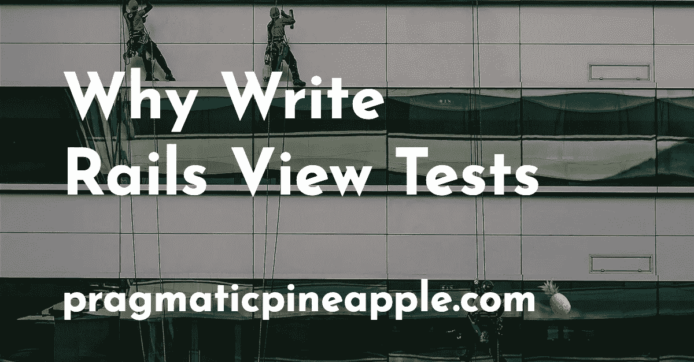

# 为什么要编写 Rails 视图测试

> 原文：<https://levelup.gitconnected.com/why-write-rails-view-tests-5a39b408702b>



*照片由* [*努诺席尔瓦*](https://unsplash.com/@nmsilva?utm_source=unsplash&utm_medium=referral&utm_content=creditCopyText)*[](https://unsplash.com/s/photos/window-cleaning?utm_source=unsplash&utm_medium=referral&utm_content=creditCopyText)*

**有许多方法可以测试 Ruby on Rails 应用程序，但是有一种方法不经常讨论。这就是测试 Rails 视图的方式。是的——有控制器、模型和其他类型的测试，但我们很少看到视图层测试。让我们给他们更多的关注，看看他们是怎么回事。**

**你可能会问——那么，你为什么不写集成测试并用它们测试视图层呢？我可以，但是运行集成测试可能会很慢，编写一个简单的视图“单元”测试可能会更简单。另外，RSpec 为编写视图规范提供了强大的支持。更有趣的是，我创建了一个示例项目来测试这些。让我们看看我发现了什么。**

# **新项目，这是谁**

**我创建了新的 Rails 6.1 项目，安装了 RSpec，并使用以下代码生成了图书模型:**

```
**bin/rails generate scaffold Book title:string description:text download_url:string status:string**
```

**看看我得到了什么:**

```
**...

    create      spec/views/books/edit.html.erb_spec.rb
    create      spec/views/books/index.html.erb_spec.rb
    create      spec/views/books/new.html.erb_spec.rb
    create      spec/views/books/show.html.erb_spec.rb

...**
```

**如果我们看一下其中一个规格，我们可以找到以下代码:**

```
**# spec/views/books/index.html.erb_spec.rb

require 'rails_helper'

RSpec.describe "books/index", type: :view do
  before(:each) do
    assign(:books, [
      Book.create!(
        title: "Title",
        description: "MyText",
        download_url: "Download Url",
        status: "Status"
      ),
      Book.create!(
        title: "Title",
        description: "MyText",
        download_url: "Download Url",
        status: "Status"
      )
    ])
  end

  it "renders a list of books" do
    render
    assert_select "tr>td", text: "Title".to_s, count: 2
    assert_select "tr>td", text: "MyText".to_s, count: 2
    assert_select "tr>td", text: "Download Url".to_s, count: 2
    assert_select "tr>td", text: "Status".to_s, count: 2
  end
end**
```

**有一个`type: view`表示特殊类型的规格。我们稍后会深入讨论这个问题。您可以区分出`assign`和`render`方法，这表明它们是内部定义的，而不是我们应该提供的。但是，在我做这个测试的时候，还有一件事一直困扰着我。**

**这里有趣的是，这个`assert_select`匹配器看起来有点“过时”或者好像不是来自 RSpec 世界。没有阶级`expect(...).to`的形成。这里发生的事情是，生成这些规格的模板有点脏。从 2010 年开始推回购时就没有变过。你可以在 GitHub 上找到带来`assert_select` [的提交。](https://github.com/rspec/rspec-rails/commit/800a56402ced481ae5b531e9a1d1a69bc8f66e90)**

**别担心，我没有看到很多项目使用视图规范，更不用说生成模型和依赖那些生成的视图规范了。我想这就是为什么没有人花时间重构或改进现有的模板。但是，由于这篇博客文章是关于关注 Rails 视图测试的，所以让我们试着这样做。**

# **春季大扫除**

**如果我们看一下 RSpec 中查看规范的[文档，我们可以看到几乎所有的文档都使用了以下内容:](https://relishapp.com/rspec/rspec-rails/docs/view-specs/view-spec)**

```
**expect(rendered).to match /something/**
```

**我们可以使用 RSpec 中的`match`和`include`。我们得到的是一个类似这样的测试:**

```
**# spec/views/books/index.html.erb_spec.rb

require 'rails_helper'

RSpec.describe "books/index", type: :view do
  before(:each) do
    assign(:books, [
      Book.create!(
        title: "Rails Testing",
        description: "How to test Ruby on Rails applications.",
        download_url: nil,
        status: "draft"
      ),
      Book.create!(
        title: "Rails Patterns",
        description: "A book about patterns and anti-patterns in Ruby on Rails.",
        download_url: "rails-patterns.com/download",
        status: "published"
      )
    ])
  end

  it "renders a list of books" do
    render

    expect(rendered).to match(/Rails Testing/)
    expect(rendered).to include("Rails Patterns")

    expect(rendered).to match(/How to test Ruby on Rails applications./)
    expect(rendered).to include("A book about patterns and anti-patterns in Ruby on Rails.")

    expect(rendered).to include("rails-patterns.com/download")

    expect(rendered).to include("published")
  end
end**
```

**之前的测试感觉更像是一个 RSpec 规范。但是，我们可以注意到，我们失去了检查实际内容是否在某个 HTML 标记中的能力。`assert_select`让我们在匹配预期结果时更加灵活。在[的文档](https://api.rubyonrails.org/v4.1/classes/ActionDispatch/Assertions/SelectorAssertions.html#method-i-assert_select)中你可以传递给`assert_select`更多的选项。我建议你选择你觉得能给你更多控制的选项。**

# **利用水豚**

**如果你安装了水豚，你可以像这样使用它的选择器:**

```
**require "rails_helper"

RSpec.describe "books/index", type: :view do
  before(:each) do
    assign(:books, [
      Book.create!(
        title: "Rails Testing",
        description: "How to test Ruby on Rails applications.",
        download_url: nil,
        status: "draft"
      ),
      Book.create!(
        title: "Rails Patterns",
        description: "A book about patterns and anti-patterns in Ruby on Rails.",
        download_url: "rails-patterns.com/download",
        status: "published"
      )
    ])
  end

  it "renders a list of books" do
    render

    expect(rendered).to have_selector("tr>td", text: "Rails Testing")
    expect(rendered).to have_selector("tr>td", text: "Rails Patterns")

    expect(rendered).to have_selector("tr>td", text: "How to test Ruby on Rails applications")
    expect(rendered).to have_selector("tr>td", text: "A book about patterns and anti-patterns in Ruby on Rails.")

    expect(rendered).to have_selector("tr>td", text: "rails-patterns.com/download")

    expect(rendered).to have_selector("tr>td", text: "published")
  end
end**
```

**现在，您得到了两个 RSpec `expect(...).to`，并且得到了断言文本在表行内部的粒度。你可以在这里的 repo 中找到所有的代码和例子[。但是你为什么要使用这些呢？下面来讨论一下。](https://github.com/nikolalsvk/rails-view-testing)**

# **为什么要查看规格**

**我们略读了您为什么要编写视图规范的几个原因。这个想法是为了测试你的观点或部分观点中的一些条件逻辑。编写一个覆盖视图中所有分支的集成测试运行起来会很慢，编写起来会很痛苦。视图规格在以下两者之间取得了巨大的平衡:**

*   **💸开发成本，**
*   **🏍执行速度，以及**
*   **🔀条件呈现覆盖率。**

**当然，如果您有装饰器和视图模型、表单对象以及所有其他可以将逻辑移出视图的东西，那么您可能根本不需要视图规范。但是，有时候，在现实世界中，并不是每个代码库都是完美设计的，你不得不不时地偷工减料。**

**不管是某个利益相关者盯着你。或者是复杂的遗留部分，不容易提取到您选择的设计中。无论原因是什么，您都可以选择让视图规范快速运行，并对逻辑进行测试。**

**当那一天到来的时候(或者已经到来了)，你可以回到这篇博文，按照你的喜好使用它。**

**如果你喜欢这篇文章，你可以在 Twitter 上分享。考虑订阅[时事通讯](https://pragmaticpineapple.com/newsletter)来获取像这样的新文章。**

**下次再见，干杯。**

***原载于 2021 年 3 月 30 日*[*【https://pragmaticpineapple.com】*](https://pragmaticpineapple.com/why-write-rails-view-tests/)*。***