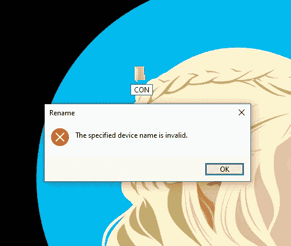

# 为什么在 Windows 中不能将文件命名为“CON ”?

> 原文：<https://levelup.gitconnected.com/why-you-cant-name-a-file-con-in-windows-2486d224824c>

## Windows 不允许您将文件夹命名为“CON”

## 试着在 windows 上命名一个文件夹图标，看看你会得到什么样的错误信息！

这不是一个阴谋论，但这是一个事实，你可以检查你是否有一台 Windows 电脑。背后的原因可能会让你大吃一惊！

这是你们每个人只需几步就可以尝试的事情。

*   转到桌面并创建一个新文件夹。
*   尝试将其重命名为“CON ”,看看会得到什么样的错误消息。

您得到的错误消息是这样的。

*   错误消息是“指定的设备名无效。”你可能会觉得这有点不寻常，也不暴露。

你不能把一个文件命名为 NUL，PRN，安多克斯。

以下是其他几个:
时钟$，NUL，COM1，COM2，COM3，COM4，COM5，COM6，COM7，COM8，COM9，LPT1，LPT2，LPT3，LPT4，LPT5，LPT6，LPT7，LPT8，LPT9。

# 为什么我不能用某些名称命名文件或文件夹？

不能将文件命名为 CON 或任何其他缩写的原因很简单。这件事可以追溯到 MS-DOS 时代，那时设备名是第一位的。

“CON”文件名是控制台设备，“AUX”是辅助设备，“PRN”是打印机设备，以此类推。

当时这些名字忽略了文件扩展名，所以如果你把某个东西命名为“CON ”,它就意味着控制台。直到现在，每个版本的 Windows 都遵循同样的逻辑。我还没有在 Windows 11 上测试过，但我相信同样的逻辑也会存在。

CON 是你电脑上的一个实际设备，但出于某种原因，它被当作一个文件。然而，这个原因一旦你明白了，就没那么奇怪了。

这些保留的关键字被 DOS 使用，如果你能用这些关键字创建一个文件，那么操作系统将会弄不清在哪里写数据。

例如，当你想打印一些东西时，使用 PRN 文件名，操作系统用你的打印数据在一个名为 PRN 的设备级上创建一个虚拟文件夹或文件。如果已经存在一个同名的文件或文件夹，系统将会混淆，设备将无法正常工作。

这就是为什么在 Windows 中不允许以某种方式命名文件和关键字。

# 结束语

好吧，我希望这篇文章教会了你一些有趣的东西，并且回答了你的问题。想象一下，如果这种事情发生了，而你不知道发生了什么，那该有多奇怪。至少你现在知道了！

如果你对这篇文章有任何问题或建议，请不要犹豫，在评论区回复。喜欢你读的东西吗？为什么不关注我的媒体简讯，这样你就不会错过我未来的任何文章了？很简单，点击[这里](https://kgabeci.medium.com/subscribe)输入你的电子邮件地址，然后点击订阅。

你喜欢阅读媒体上的文章吗？考虑成为会员，有很多功能，你将获得所有创作者的内容，每月只需 5 美元。使用[这个链接](https://kgabeci.medium.com/membership)，你也可以帮我赚取一小笔佣金，点击成为会员，输入你的信息。