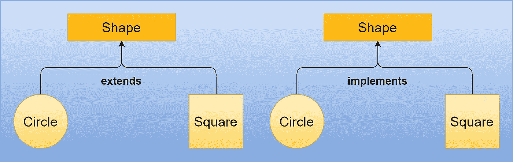

# 为什么你必须知道抽象？

> 原文：<https://levelup.gitconnected.com/why-you-must-know-abstraction-latest-6f11a85c50f0>

## 面向对象编程

## Oop 中你必须知道的一个基本概念。



抽象

通过这篇文章，我将讨论 ***抽象*** 的概念，以及我们如何在 java 编程中部分或完全实现它。我已经介绍了 OOPs 的其他重要支柱，它们是 ***继承*** 、 ***多态*** 、 ***封装*** 和 ***组合*** 。读完这篇文章后，你就可以在下次面试中回答这个问题了。

# 什么是抽象？

像继承、封装和多态一样，它是 OOP 的支柱之一。

抽象的基本英文意思是**处理想法而不是事件的品质**。你拿到了吗？我知道这很难理解。

让我用另一种方式来定义它—

## 基本上，它处理的是隐藏内部细节，向最终用户展示本质的东西。

抽象的一个真实例子是使用电路板。我们通过电路板用按钮来开关电器。我们知道董事会内部发生了很多事情。这里我们使用提供的功能，我们对电路板的实际工作不感兴趣。

现在让我们将这个例子与类和接口联系起来。电路板的表面是一个接口，电路板的实际实现是一个类。

接口显示了所提供的功能类型，实现这些接口的类包含了实际的业务逻辑。

# 如何实现抽象？

抽象可以通过两种不同的方式实现:

1.  使用抽象类
2.  使用接口

# 让我们用抽象类来理解抽象:

抽象类包含一个或多个抽象方法以及具体方法。

1.  请记住，一旦我们将一个类声明为抽象类，我们就不能实例化该类，这意味着我们不能创建抽象类的实例。
2.  要将一个类定义为抽象类，我们必须在类名中使用' ***abstract*** '关键字。

要使用一个抽象类，我们需要将它扩展到另一个类，并提供对该类声明的所有抽象方法的定义，否则新类也需要声明为抽象的。

> 通过抽象类，我们可以实现 0–100%的抽象，因为抽象类可能包含具体的方法。

## 抽象类的语法如下:

```
public abstract class Shape{
    //abstract methods.
}
```

```
public class Square extends Shape{
    //provide method definition to all abstract methods of Shape class.
}
```

> 注意一个**抽象类**可以有**实例变量、构造函数**和**具体方法**。
> 
> 扩展抽象类的具体类继承了这些变量和方法。

## 现在让我们通过一个例子来理解:

我们可以有一个**形状**类作为抽象类，我们将声明像**正方形**、**圆形**、**三角形**等类的常用方法。这些方法可以是 draw()、calArea()等。

Shape 作为一个抽象类:

作为抽象类的 Shape

Square 作为继承 Shape 类的具体类:

Square 作为继承 Shape 类的具体类

测试类别:

测试类

## 输出:

```
Area of square is : 30.25
```

# 让我们用接口来理解抽象:

接口是一组抽象方法、静态方法和静态常数。

1.  默认情况下，每个方法都是**公共的**和**抽象的。**
2.  它 ***不包含任何构造函数。***
3.  接口中声明的每个变量默认为 **public** 、 **static** 和 **final** 。
4.  类似于抽象类，我们不能创建接口的实例。

> 与抽象一起，接口有助于在 Java 中实现多重继承。

> 我们可以使用接口实现 100%的抽象。

该界面的语法如下:

```
public interface IShape{
   //methods declaration.
}
```

```
public class Circle implements IShape{
   //provide method definition to all methods of IShape interface.
}
```

现在让我们了解如何使用接口实现抽象:

类似于一个抽象类，我们可以有一个**形状**作为接口，我们将为类似**正方形**、**圆形**、**三角形**等类声明常用的方法。这些方法可以是 draw()、calArea()等。

作为界面的形状:

作为界面的形状

Circle 作为实现 Shape 类的具体类:

测试类别:

测试类

输出:

```
Area of circle is : 314.1592653589793
```

面试中最常被问到的最重要的问题是。

# 什么时候用接口代替抽象类？

当我们谈论抽象类*时，我们正在定义一个对象类型的特征，并指定* ***什么是对象*** *。*

当我们谈论一个接口时，我们定义了我们承诺提供的能力。我们在讨论建立一个关于 ***一个对象能做什么的契约。***

*本文到此为止。希望你喜欢这篇文章。*

# 类似内容可以关注[维克拉姆古普塔](https://medium.com/u/2c3b611409dc?source=post_page-----6f11a85c50f0--------------------------------)。

# 分级编码

感谢您成为我们社区的一员！在你离开之前:

*   👏为故事鼓掌，跟着作者走👉
*   📰查看[级编码出版物](https://levelup.gitconnected.com/?utm_source=pub&utm_medium=post)中的更多内容
*   🔔关注我们:[推特](https://twitter.com/gitconnected) | [LinkedIn](https://www.linkedin.com/company/gitconnected) | [时事通讯](https://newsletter.levelup.dev)

🚀👉 [**加入升级人才集体，找到一份惊艳的工作**](https://jobs.levelup.dev/talent/welcome?referral=true)