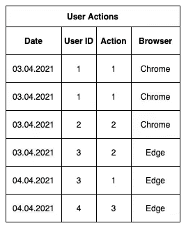
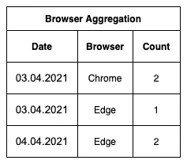
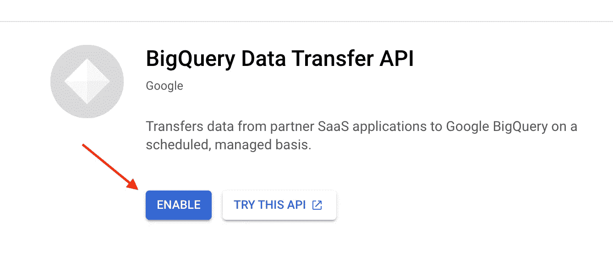
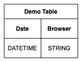
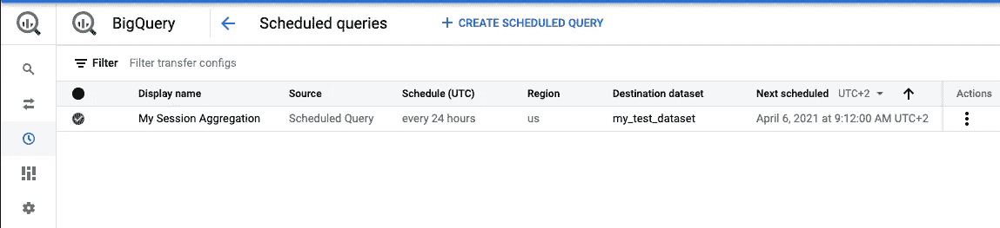
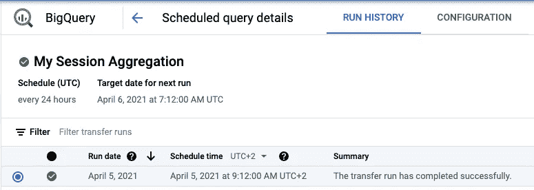
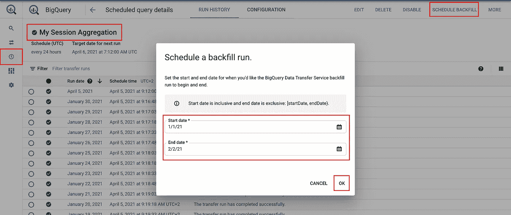
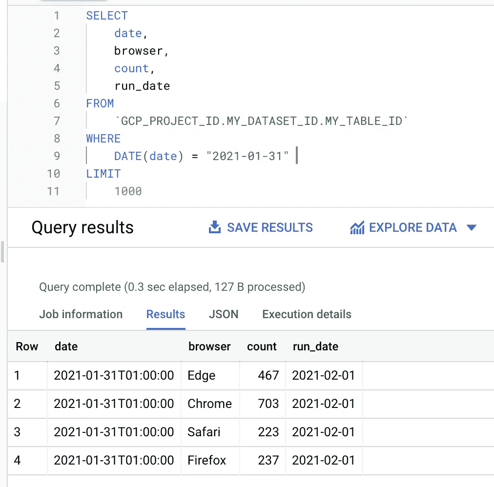

# 为什么需要聚合数据，以及 BigQuery 计划查询如何帮助您

> 原文：<https://levelup.gitconnected.com/why-you-need-to-aggregate-your-data-and-how-bigquery-scheduled-queries-can-help-you-22d13be1ed17>

在处理大数据时，聚合您正在收集的数据变得越来越重要。为什么会这样呢？

卡斯帕·卡米尔·鲁宾在 [Unsplash](https://www.unsplash.com/) 上的照片

在许多情况下，尤其是在使用 BigQuery 这样的大数据工具时，您需要收集每个数据点。通过这种方式，你可以在以后使用数据驱动的方法来进行商业决策，训练一些人工智能算法，或者以任何形式向你的客户提供数据，以便他们可以利用这些数据做一些事情。然而，在收集数据时，您可能甚至不知道用它来做什么。

那么，这与计划查询和数据聚合有什么关系呢？

当你用尽可能多的数据点收集每一个数据时，你的数据集会很快变大。这些快速增长的数据集的一些广泛来源是，例如，物联网设备数据、用户与您的应用程序/网站的交互或股票市场报价。

当您第一次收集这些数据时，很可能是大量元数据，您就有了原始数据。但是这些原始数据中有很多您将来可能不需要的不必要的信息，因此您不想将其存储多年。

作为一个例子，想象在你的网站上有一些动作跟踪。作为原始数据，您首先可以存储诸如实际操作、一些唯一的用户 ID、操作的确切时间、用户的浏览器等内容。

但最终，这只是原始数据，难以分析并从中获得任何价值。此外，存储如此多的数据会很快变得昂贵，因此您需要聚合这些数据并删除不再需要的旧原始数据。

除此之外，您不希望扫描可能有几 TB 或 PB 的整个数据集，以便从中获得细微的洞察力。

一个可能的目标是找出大多数用户使用的浏览器。有了这些信息，你就可以做出数据驱动的决定，增加这些特定浏览器的 QA 时间，或者放弃对某个特定浏览器的支持，因为只有 0.01%的用户在使用它。尽管如此，维护支持(Internet Explorer😒 ).

那么你会如何汇总上述数据呢？

让我们以下表为例:

在这个表中，你可以跟踪你的用户的行为(**当然，只有在得到同意的情况下！**)。如您所见，每个用户都有一个浏览器属性。这个简单的例子假设用户只有一个浏览器，并且没有使用几个具有相同用户 ID 的浏览器。用户 ID 可以是某个随机生成的 ID，不需要匹配某个真实的用户对象。

考虑到我们的上述目标，我们现在需要聚集这个表，为我们的业务决策提供所需的信息，并可能在之后丢弃旧的数据。这个例子的聚合逻辑非常简单。我们必须按照用户 ID 对数据进行分组——因此每个用户只有一行——然后计算浏览器的出现次数，并将这些值写入一个新表中。

为此，我们创建了下表:

有了汇总的数据，我们现在可以尝试从中得出一些业务决策。当然，这个例子的数据在统计上并不重要，因为基表中只有 6 个条目；想象一下至少有几万个条目😉。

**从汇总数据中创造洞察力和商业决策**

通过分析上述数据，我们发现了两点。首先，我们每天大约有 2-3 个用户。第二，我们的用户目前只使用 Chrome 或 Edge 作为浏览器。

第一个洞察可能有助于我们识别用户随时间的增长，因为我们可以检查每日活跃用户。但是我会在这里创建一个不同的聚合，不会误用这个表。

我们可以将第二个观点解释如下:

“我们只有 Chrome 和 Edge 用户，所以我们应该特别专注于支持这两种浏览器”。

这种认识可能会导致以下决策:

首先，使用额外的资源(QA + Dev + Testing)来确保应用程序在 Chrome 和 Edge 上运行良好。除此之外，考虑放弃对 Internet Explorer 的支持或将其标记为不推荐使用和不完全支持，因为客户似乎不会使用它。

**这也是为了降低成本**

除了从汇总数据中获得洞察力和业务决策(这一点非常重要)之外，另一个关键方面是降低成本。

以我们上面的例子为例，让我们提出以下问题:

> "如果我们只对浏览器的使用感兴趣，为什么我们要存储每个用户交互？"

当然，在现实世界的例子中，你将会有不止一个用例，但是现在让我们继续。

用户的日常用户交互可能很快每天产生几百万行。但是您感兴趣的数据是每个现有浏览器每天只有一行。这意味着您存储了 99.999%的您根本不感兴趣的数据。

当然，您不应该在完成汇总后直接删除原始数据，但至少您可以定义一个特定的时间，在此之后您将丢弃原始数据，这样成本就不会激增。

**保持您的数据最新**

除此之外，您希望您的聚合总是最新的，每天更新，这样您就可以及早发现趋势和变化的行为。但是我想我们都同意，你不希望为了每天运行一个查询而付钱给一些专门的人，因为这可以完全自动化。

这就是 BigQuery 的计划查询发挥作用的地方。

# BigQuery 的计划查询如何帮助聚合自动化

顾名思义，预定查询是可以根据某个时间点自动运行或重复运行的查询，例如每 24 小时运行一次。“每 24 小时”非常适合上面我们需要每日数据的用例。

但是你并不局限于每 24 小时。谷歌也允许它使用每小时，每周，每月，甚至自定义。例如，使用 custom，您可以插入类似于“*每星期三，1 月 5 日，6 月 13:15”的日程选项。*

使用“每 24 小时”，您可以自动运行一个查询，每天一次，总是在同一时间，从原始表中查询所有必要的数据，对其进行聚合，并将结果写入一个额外的表。

创建这种计划查询有四种不同的方法。

*   谷歌控制台(GUI)
*   *bq* 命令行工具
*   谷歌应用编程接口
*   不同客户端 SDK 之一(Node.js、Java、Python 等。)

由于其灵活性、可再现性和易用性，我更喜欢使用客户端 SDK 方法。在本文后面的动手编码部分，我们还将看到一些使用 Node.js 客户机 SDK 的例子。

预定查询是 Google 通过其“BigQuery 数据传输服务”提供的。当然，也可以构建自己的“时间表查询”。例如，您可以使用定义的 cron 作业运行 AppEngine 实例，该作业在每个触发器上运行正确的作业。或者，您可以创建一些[云调度器](https://cloud.google.com/scheduler)，它触发对您的服务之一的请求，例如，运行查询的[云函数](https://cloud.google.com/functions)。

这些自实现的缺点是，与简单地使用为这个用例显式实现的特性相比，您引入了更多的开销、复杂性和成本。

在我们最终开始动手编码之前，我们必须在 Google Cloud 控制台中启用“BigQuery 数据传输服务”。

# 动手编码

现在让我们着手编写一些代码😊并使用 Node.js 客户端 SDK 构建一个计划查询。对于以下部分，我希望您已经设置了 GCP 和 BigQuery，并拥有使用它们的必要权限。

在开始之前，确保您将在本例中使用的服务帐户有一个有效的 JSON 密钥文件。

您可以在此找到您的服务帐户[所需的权限。](https://cloud.google.com/bigquery/docs/scheduling-queries#required_permissions)

**准备数据**

为了验证我们预定的查询结果，我们应该创建一些我们的查询可以处理的测试数据。

您可以在下表中看到包含原始数据的演示表的结构。

我们在这里已经简化了很多，并假设该表中的每个条目都是一个单独的用户，因此在这种情况下我们不必对它们进行重复数据删除。我写了一个小脚本，为上面的表结构生成一个合适的 CSV 文件。这个脚本是为这个特定的演示案例定制的，尽管它会在 2021 年 1 月 1 日到 2021 年 1 月 31 日之间随机创建数据条目。您可以在下面的代码片段中看到该脚本。

运行脚本后，可以将数据导入 BigQuery。你可以使用谷歌云控制台或者我写的另一个 JavaScript 片段。因为我在以前的文章中已经详细地处理了 JavaScript，所以我不会在这里重复。请确保您相应地调整了字段。

 [## 使用 Node.js 在 BigQuery 中处理数据

### 本文将介绍 BigQuery 的实际用法，并展示如何使用 Node.js 读写数据。

javascript.plainenglish.io](https://javascript.plainenglish.io/working-with-data-in-bigquery-using-node-js-4738561f5329)  [## 使用分区优化 BigQuery 表:时间单位列分区表

### 尤其是在处理大数据时，当数据开始变得不稳定时，成本会迅速激增，性能会迅速下降

levelup.gitconnected.com](/optimizing-your-bigquery-tables-using-partitioning-time-unit-column-partitioned-tables-c93cfbf3828d)  [## 使用聚类优化 BigQuery 表

### 除了使用表分区来提高 BigQuery 的性能和成本，还有另一种技术可用…

levelup.gitconnected.com](/optimizing-your-bigquery-tables-using-clustering-4d2b4255b461) 

**创建预设查询**

既然我们的数据在 BigQuery 中可用，那么是时候创建我们的调度查询来聚合数据了。

当您想要使用调度查询时，“普通的”BigQuery NPM 包— `[@google-cloud/bigquery](https://www.npmjs.com/package/@google-cloud/bigquery)` —不提供此功能。但是我们可以为此安装和使用`[@google-cloud/bigquery-data-transfer](https://www.npmjs.com/package/@google-cloud/bigquery-data-transfer)` NPM 包，所以确保在运行下面的脚本之前安装它。

除了创建一个`DataTransferServiceClient`和定义一些常量，我们在上面的脚本中做了两件事。

1.  创建将在每个计划事件上运行的查询。
2.  创建一个传输配置来配置我们的预定查询。

我们的查询定义了我们希望将日期、浏览器、浏览器计数和预定查询的运行日期写入目标表。

`*@run_date*`是一个 BigQuery 内部`DATE`类型变量，包含 BigQuery 运行计划查询的日期。例如，我们可以在我们的`WHERE`条件中使用它，只获取前一天的条目，用于我们的日常聚合。

运行脚本后，我们可以验证 Google 在 Google Cloud 控制台中创建了预定的查询。

点击之后，我们可以看到 Google 已经运行了预定的查询或者当前正在运行。

**写处置**

上面脚本中的一个关键属性，你应该知道，就是[*write _ disposition*](https://cloud.google.com/bigquery/docs/reference/auditlogs/rest/Shared.Types/WriteDisposition)。即使有四个不同的枚举值，您也应该在配置中只使用其中的三个。

*   `*WRITE_EMPTY*` —作业将只写入空表。如果包含数据的表已经存在，BigQuery 将抛出“重复”错误。
*   【BigQuery 完成预定查询后，结果将覆盖当前位于目标表中的所有数据。
*   `*WRITE_APPEND*` — BigQuery 会将新数据追加到现有的表数据中。

在我们的例子中，我们使用`*WRITE_APPEND*`,因为我们决定使用一个日期分区表来存储这个用例的所有聚合数据。

当使用`*WRITE_TRUNCATE*`时，您应该始终确保您的目标表没有硬编码的值。否则，您将总是覆盖您以前的数据。相反，最好使用类似上面的`*@run_date*`或`@run_time`的运行时参数，并使用它们来动态创建您的目标表名。

使用上面的*destination _ table _ name _ template*参数，您可以提供类似于`my_scheduled_table_{run_date}`的值，这些值将在每天运行时以`my_scheduled_tableYYYYMMDD`的格式为每天创建一个新表。[在这里](https://cloud.google.com/bigquery/docs/scheduling-queries#templating_system)，你可以找到在预定查询中使用模板语法的完整参考。

在我看来,`*WRITE_EMPTY*`选项是一种比`*WRITE_TRUNCATE*`选项更“安全”的方法，因为您不必担心意外删除任何表。

当然，这两种方法——`*WRITE_TRUNCATE*`和`*WRITE_APPEND*`——各有利弊。

使用`*WRITE_TRUNCATE*`，如果出现问题或某些数据不正确，您可以快速重新运行预定的查询。它将简单地覆盖已经存在的表，并插入新的/正确的数据。这样做的缺点是，查询某个时间范围内的聚合会更加复杂，因为您必须查询/连接多个表，而不是一个表。

另一方面，`*WRITE_APPEND*`使得查询时间范围变得非常容易，因为所有数据都在一个地方。在这种情况下，您应该确保使用分区来获得出色的性能。当然，这里的缺点是重新运行查询会将更多的数据插入到表中，而不会考虑前一个数据。因此，在重新运行查询之前，您必须自己清除以前的/不正确的数据，这更容易出错，并且在维护方面会产生一些开销。但是希望这不会经常发生。

这里没有“一刀切”的方法，所以这取决于您的用例，哪个 *write_disposition* 对您更有意义。

**回填数据**

当您第一次开始填充原始数据表时，通常没有准备好所有需要的聚合。在您设置好一切之后，您的预定查询将会到达某个地方，因为您可能无法在第一个草稿中 100%确定您想要聚合什么数据。除此之外，业务决策可能会导致原始数据的新聚合。因此，现在您面临着创建新的计划查询的挑战，您必须在旧的数据集上运行这些查询。至少在你必须提供这些数据的时候也是如此。

但是不用担心。使用预定查询，Google 提供了一个“回填”功能。

简单来说:

您可以定义运行计划查询的日期范围，使用该特定日期的适当值作为其 *run_time* 和 *run_date* 参数。

您可以轻松触发回填。你只需要在谷歌控制台中选择你的预定查询，点击“预定回填”按钮，输入你想要查询运行的日期范围，然后点击“确定”。您可以看到下图中标记的重要部分。

在后台，您还可以看到我已经为许多运行日期触发了回填。你可以通过他们的计划时间来识别这一点，因为这是 2021 年 4 月 5 日，但他们的运行日期早在 2021 年 1 月。

此外，你必须特别注意你的日期范围的选择。正如 Google 在上面的图片中已经指出的，开始日期是包含的，但是结束日期不是。在我们的例子中，当我们想要回填整个一月时，我们必须选择 2 月 2 日作为结束日期。使用 2 月 2 日，谷歌将包括 2 月 1 日。将 2 月 1 日作为*运行日期*，我们的示例查询将生成 1 月 31 日的聚合。

一月份的回填完成后，我们现在可以验证我们的查询结果。在下图中，您可以看到我查询了由预定查询创建的表，并请求了 1 月 31 日的条目。正如所料，有四个不同浏览器和事件的条目。另外，您可以看到*的运行日期*是 2 月 1 日。

请注意，我将上面的表路径更改为一些任意值，因为您在这里的值将与我的不同。

**支持地区**

不支持在不同区域之间创建计划查询。因此，预定查询的目标表必须与被查询的数据位于同一区域。

此外，谷歌可能不支持所有地区。您可以在这里找到支持地区的完整列表[。](https://cloud.google.com/bigquery/docs/scheduling-queries#supported_regions)

# 最后的话

通过这篇文章，我想向你提供一个谷歌预定查询服务的大致概述，以及如何在几个步骤中使用它，并展示回填操作，在我看来这是非常好的。

## 你想联系吗？

如果你想联系我，请在 LinkedIn 上联系我。

另外，请随意查看我的书籍推荐📚。

 [## 我的书籍推荐

### 在接下来的章节中，你可以找到我对所有日常生活话题的书籍推荐，它们对我帮助很大。

mr-pascal.medium.com](https://mr-pascal.medium.com/my-book-recommendations-4b9f73bf961b)  [## 通过我的推荐链接加入 Medium—Pascal Zwikirsch

### 作为一个媒体会员，你的会员费的一部分会给你阅读的作家，你可以完全接触到每一个故事…

mr-pascal.medium.com](https://mr-pascal.medium.com/membership)