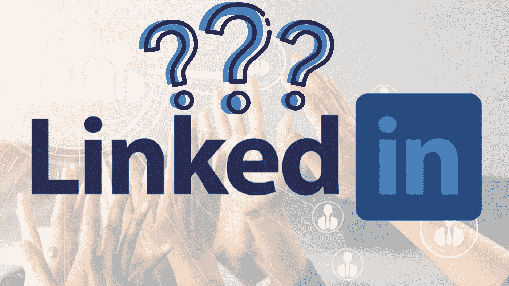

# 为什么你需要停止让 Linkedin 的“技能测试”浪费你的时间

> 原文：<https://levelup.gitconnected.com/why-you-need-to-stop-letting-linkedin-skill-tests-suck-your-time-d33d4a9efcc7>

## Linkedin 亲爱的，这是给你的一封公开信。

作者图片

在 2019 年，9 月 17 日，Linkedin 以压倒性的优势在其门户网站内推出了**“Linkedin 技能评估”**的整合。目标围绕技能验证和与其他人的显著不同。

他们的技能测试机制简洁明了。个人资料上的技能部分允许个人提及他们的技能。如果您选择参加技能评估，将会出现 15 个问题，每次一个。每道题给的时间是 90 秒。尝试后，结果会被隐藏，直到尝试最后一个问题时才会显示。及格标准是 70%或以上。然后，相应地将动作通道化为:

*   如果通过->可以在个人资料中获得*【验证技能】*徽章
*   如果没有通过->温习技能，3 个月后再尝试。

当时提出的意图足够令人信服。创建者将 Linkedin 设计成一个多才多艺的平台，而不仅仅是专业人士的社交媒体网络。评估的明显优势可以总结为以下四点:

1.  招聘人员简洁地浏览相关的用户资料，在节省时间的同时雇佣他们。
2.  为显示技能熟练程度的个人概况添加值。
3.  一种方便、直接的方法，供个人评估自己的知识和技能。
4.  协助 Linkedin 控制其网络内容清单的微观数据。这为 Linkedin 算法的智能推荐铺平了道路。在新的招聘广告中向雇主推荐候选人的技能。

# 大惊小怪从哪里开始？

有成千上万的人实际上在尝试评估。如果你不相信，看看下面的数字。

来源: [Linkedin](https://www.linkedin.com/feed/)

然而，问题不在于“有多少人愿意为这种评估付出宝贵的时间，而在于实现远远超出其价值的价值。

Linkedin 是一个自己的明星名字，它采用数据科学和机器学习本身来利用大量的自动化任务和智能工作。它被一致视为行业领导者，其在招聘和职业网络方面的作用从一开始就毋庸置疑，但最近却不是这样。

> 但是现在发生了什么变化？

简单来说。现在时代变了。

# LinkedIn 的可靠性

Linkedin 被普通人和大公司视为值得信赖的网站。然而，对于技能徽章如何影响就业率，并没有可衡量的标准。它们可能被用来给人力资源留下第一印象，但是在技术层面上，它不能证明一个人在技术上有多好。

# 问题质量

平台上的弱评估问题远离了该领域的症结。这些概念纯粹是理论上的，与行业知识没有任何相似之处。例如，我尝试了 MySQL 评估，但被问到的是不重要的术语，而不是构成我的 MySQL 不可分割的一部分的查询。

了解术语不会有任何进展，但是了解概念是如何工作的。此外，ML 主要是数学，其余是实现部分。【Linkedin 怎么能把主观知识剥离出来，并为此颁发徽章呢？

# **没有合理的时间限制**

所有问题的给定时间是一致的。MCQs 允许随机选择，并使它很容易在突发奇想时通过。例如，在 Python 评估中，语法题和要求逻辑推理的题有相同的时间限制，这对考生来说实际上是不公平的。

此外，一些基于场景的问题太长，以至于个人没有足够的时间来通读，最终只能猜测。总而言之，这变得更像是一个运气测试，而不是一项技能。

一些人还认为，在如此短的时间内评估知识的能力几乎是不可能的，也不会反映出它要寻找的东西。

# 缺失的权威

Linkedin 确保没有问题泄漏的检查。无论一个人尝试评估多少次，问题都是一样的，只是顺序略有变化。它允许大规模作弊，并使这些评估无效。

来源: [SeoTopToolz](https://seotoptoolz.com/2021/12/27/linkedin-python-assessment-test-answers-2022/?utm_source=rss&utm_medium=rss&utm_campaign=linkedin-python-assessment-test-answers-2022)

上图足以说明最后一点。没有规定问题和答案在网上的传播位置，因此导致个人的错误主张。

# 被 DS 社区 Up 吼，有理有据？

绝对是。主要技术影响者关于 LinkedIn 失去其标准并降低其门槛的说法是合理正确的。在这里度过的时间可以用来获得更好的学习机会。所有这些都屈服于 Linkedin 评估中合理的失望。

有一次，KenJee，一位杰出的数据和机器学习爱好者，自愿声称提供他的服务来改善这种体验，并提供了如下解决方案:

1.  合作或雇佣一个专门的团队来完成技能评估部分。就像谷歌的数据分析认证一样。
2.  Linkedin 可以完全删除技能评估，以避免成为个人资料错误印象的来源。
3.  将此部分替换为便于实时项目演示的空间。工作经验和项目可以更好地反映能力。

# Linkedin 确实需要提升它的评估游戏！

当 Linkedin 开始这样做时，是在对他们的市场进行了不确定的研究之后。Linkedin 的目标源于求职或招聘过程中对技能的需求超过了大学教育。

Linkedin 需要在他们的平台上停止这种卑鄙的功能，所以它停止给予和接受虚假的希望。迟早，Linkedin 会成为下一个从人们身上赚钱的 Meta 或 Instagram。

一旦评估结束，Linkedin 就会欢迎其注册课程和培训项目的登录页面。从而吸引人们投资 Linkedin 会员资格。

Linkedin 个人在雇用内部员工时绝不会考虑这些徽章，因为这些降级的质量评估毫无用处。它目前没有任何作用，但对其他有价值的认证产生了破坏性影响。我只是希望 Linkedin 能通过这种大众关注的合法氛围采取行动。

充满希望的女主人 80 岁..🤞

想继续关注我和其他优秀作家的作品吗？抓住加入的机会

 [## 通过我的推荐链接加入灵媒——火星女孩

### 作为一个媒体会员，你的会员费的一部分会给你阅读的作家，你可以完全接触到每一个故事…

medium.com](https://medium.com/@themarsgirl80/membership) 

# 更多来自作者:

 [## 今天就好好利用你的数据技能——利润惊人的自由职业方式

### 发现隐藏在您的数据技能中的财富

medium.com](https://medium.com/codex/how-to-freelance-my-data-skills-4c70d8ab4491)  [## Udacity 的 ML 奖学金该不该给 3 个月？

### 我诚实的评论——值得一试吗？

medium.com](https://medium.com/codex/should-you-give-3-months-for-udacitys-ml-scholarship-d6abade31161)  [## 尽快了解元宇宙的 5 件改变生活的事情

### 如何在元宇宙生存而不显得愚蠢？

medium.com](https://medium.com/age-of-awareness/5-life-transforming-things-in-metaverse-to-know-asap-3ba9fce5f20e)